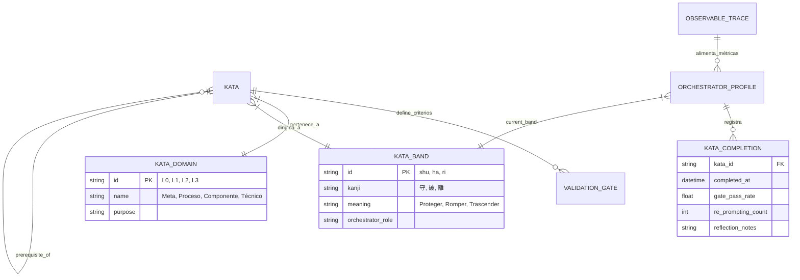

# RaiSE Kata Schema v2.1
## Extensión ShuHaRi para Práctica Deliberada

**Versión:** 2.1.0-DRAFT  
**Fecha:** 28 de Diciembre, 2025  
**Autor:** RaiSE Ontology Architect  
**Estado:** Propuesta para revisión  
**Dependencias:** 11-data-architecture-v2.md, 05-learning-philosophy-v2.md

---

## 1. Motivación

### 1.1 Problema Identificado

El schema actual de Kata (v2.0) define una única dimensión de clasificación:

```
level: enum [L0, L1, L2, L3]  // Dominio del conocimiento
```

Esta estructura captura **qué** enseña la Kata (meta/proceso/componente/técnico), pero no captura **a quién** está dirigida ni el nivel de práctica deliberada esperado del Orquestador.

### 1.2 Consecuencias del Modelo Actual

| Problema | Manifestación | Desperdicio Lean |
|----------|---------------|------------------|
| Desalineación Kata-Orquestador | Aprendiz usa kata experta → frustración | Muri (sobrecarga) |
| Sin progresión clara | Orquestador no sabe qué practicar next | Mura (irregularidad) |
| Heutagogía no operacionalizada | Principio §5 queda declarativo | Muda (potencial no realizado) |

### 1.3 Solución Propuesta

Introducir una segunda dimensión ortogonal basada en **ShuHaRi** (守破離), el modelo de maestría de las artes marciales japonesas:

```
domain: enum [L0, L1, L2, L3]     // Qué enseña (antes: level)
band: enum [shu, ha, ri]          // A quién está dirigida (NUEVO)
```

---

## 2. Fundamento Filosófico: ShuHaRi

### 2.1 Origen y Significado

| Fase | Kanji | Traducción | Significado Profundo |
|------|-------|------------|----------------------|
| **Shu** | 守 | Proteger/Obedecer | Conformidad con la forma; absorber fundamentos |
| **Ha** | 破 | Romper/Desprender | Cuestionar la forma; adaptar al contexto |
| **Ri** | 離 | Trascender/Separar | Crear sin forma; fluir naturalmente |

### 2.2 Alineación con RaiSE

| Elemento RaiSE | Conexión con ShuHaRi |
|----------------|----------------------|
| **Kata** (término) | Origen compartido en artes marciales japonesas |
| **Lean/TPS** | Toyota Production System es japonés; coherencia cultural |
| **Heutagogía** | ShuHaRi describe aprendizaje auto-determinado |
| **Kaizen** | Progresión Shu→Ha→Ri ES mejora continua del Orquestador |

### 2.3 Precedente en Software

Martin Fowler y Alistair Cockburn introdujeron ShuHaRi en Agile:

> "Shu-Ha-Ri is a way of thinking about how you learn a technique. The name comes from Japanese martial arts (particularly Aikido)."  
> — Martin Fowler, bliki

---

## 3. Ontología Extendida

### 3.1 Diagrama ER Actualizado



### 3.2 Entidad: Kata (v2.1)

**Definición:** Proceso estructurado que codifica un estándar o patrón, dirigido a un nivel específico de práctica deliberada del Orquestador.

**Atributos:**

| Campo | Tipo | Requerido | Descripción | Cambio |
|-------|------|-----------|-------------|--------|
| id | string | ✅ | Ej. `L1-ha-04` | MODIFICADO |
| domain | enum | ✅ | `L0`, `L1`, `L2`, `L3` | RENOMBRADO (antes: level) |
| band | enum | ✅ | `shu`, `ha`, `ri` | **NUEVO** |
| title | string | ✅ | Nombre descriptivo | — |
| purpose | string | ✅ | Para qué sirve | — |
| inputs | array | ✅ | Qué consume | — |
| outputs | array | ✅ | Qué produce | — |
| steps | array | ✅ | Pasos a seguir | — |
| validation_gate | string | ❌ | Gate que este kata valida | — |
| prerequisites | array | ❌ | Katas que deben completarse antes | **NUEVO** |
| outcomes | array | ❌ | Competencias que desarrolla | **NUEVO** |
| heutagogic_challenge | string | ❌ | Pregunta de consolidación | **NUEVO** |
| estimated_cycles | int | ❌ | Ciclos estimados para dominar | **NUEVO** |

### 3.3 Entidad: Kata Domain (v2.1)

**Definición:** Clasificación del ámbito de conocimiento que cubre la Kata.

| ID | Nombre | Propósito | Pregunta Guía |
|----|--------|-----------|---------------|
| `L0` | Meta | Filosofía y fundamentos | ¿Cuáles son los principios? |
| `L1` | Proceso | Metodología y flujos | ¿Cómo fluye el trabajo? |
| `L2` | Componente | Patrones y estructuras | ¿Qué patrones aplicar? |
| `L3` | Técnico | Especialización y recetas | ¿Cómo implementar esto? |

### 3.4 Entidad: Kata Band (v2.1) — **NUEVA**

**Definición:** Nivel de práctica deliberada al que está dirigida la Kata, basado en ShuHaRi.

| ID | Kanji | Nombre | Rol del Orquestador | Relación con IA | Verbo Clave |
|----|-------|--------|---------------------|-----------------|-------------|
| `shu` | 守 | Proteger | Receptor activo | IA como mentor | **Seguir** |
| `ha` | 破 | Romper | Cuestionador | IA como par | **Adaptar** |
| `ri` | 離 | Trascender | Creador autónomo | IA como herramienta | **Crear** |

**Comportamiento esperado por banda:**

| Banda | Cómo usa la Kata | Cómo interactúa con IA | Resultado esperado |
|-------|------------------|------------------------|-------------------|
| **Shu** | Sigue pasos exactamente | Pide explicaciones, acepta guía | Internaliza el patrón |
| **Ha** | Adapta pasos al contexto | Debate alternativas, valida críticamente | Contextualiza el patrón |
| **Ri** | Crea variantes o nuevas katas | Usa IA como acelerador de ideas | Extiende el framework |

### 3.5 Entidad: Orchestrator Profile (v2.1) — **NUEVA**

**Definición:** Perfil de madurez del Orquestador, derivado del Observable Workflow.

**Atributos:**

| Campo | Tipo | Descripción |
|-------|------|-------------|
| orchestrator_id | string | Identificador (puede ser anónimo) |
| current_band | enum | Banda inferida: `shu`, `ha`, `ri` |
| domain_proficiency | object | Banda por dominio: `{L0: "ha", L1: "shu", ...}` |
| metrics | object | Métricas agregadas del Observable Workflow |
| kata_completions | array | Historial de katas completadas |
| last_assessment | datetime | Última evaluación de banda |

**Métricas para inferencia de banda:**

| Métrica | Shu | Ha | Ri |
|---------|-----|----|----|
| Re-prompting rate | > 4 | 2-4 | < 2 |
| Escalation rate | > 20% | 10-20% | < 10% |
| Gate pass rate (1st) | < 70% | 70-85% | > 85% |
| Kata completions | < 10 | 10-30 | > 30 |
| Framework contributions | 0 | 0-2 | > 2 |

**Ubicación:** `.raise/orchestrator/profile.yaml` (local, privacy-first)

---

## 4. Nomenclatura de Archivos

### 4.1 Convención Actualizada

**Antes (v2.0):**
```
L{domain}-{sequence}-{slug}.md
```

**Después (v2.1):**
```
L{domain}-{band}-{sequence}-{slug}.md
```

### 4.2 Ejemplos

| Archivo v2.0 | Archivo v2.1 (Shu) | Archivo v2.1 (Ha) | Archivo v2.1 (Ri) |
|--------------|--------------------|--------------------|-------------------|
| `L1-04-plan.md` | `L1-shu-04-plan-basico.md` | `L1-ha-04-plan-adaptado.md` | `L1-ri-04-plan-diseño.md` |
| `L2-02-analisis.md` | `L2-shu-02-analisis-guiado.md` | `L2-ha-02-analisis-critico.md` | `L2-ri-02-analisis-frameworks.md` |

### 4.3 Estructura de Directorios

```
raise-config/
└── katas/
    ├── L0-meta/
    │   ├── shu/
    │   │   └── L0-shu-01-principios-lectura.md
    │   ├── ha/
    │   │   └── L0-ha-01-principios-debate.md
    │   └── ri/
    │       └── L0-ri-01-principios-extension.md
    ├── L1-proceso/
    │   ├── shu/
    │   ├── ha/
    │   └── ri/
    ├── L2-componente/
    │   ├── shu/
    │   ├── ha/
    │   └── ri/
    └── L3-tecnico/
        ├── shu/
        ├── ha/
        └── ri/
```

---

## 5. Schema de Archivo Kata

### 5.1 Frontmatter YAML

```yaml
---
# === IDENTIFICACIÓN ===
id: "L1-ha-04"
title: "Generación de Plan de Implementación (Adaptado)"
version: "1.0.0"

# === CLASIFICACIÓN ===
domain: L1          # L0=Meta, L1=Proceso, L2=Componente, L3=Técnico
band: ha            # shu=Seguir, ha=Adaptar, ri=Crear
validation_gate: gate-plan

# === HEUTAGOGÍA ===
purpose: >
  Adaptar el proceso de generación de planes al contexto específico
  del proyecto, cuestionando qué pasos son necesarios y cuáles no.

prerequisites:
  - L1-shu-04      # Debe dominar la versión Shu primero
  - L1-shu-01      # Fundamentos de flujo RaiSE

outcomes:
  - "Criterio para eliminar pasos innecesarios"
  - "Capacidad de adaptar templates al dominio"
  - "Juicio sobre granularidad de tareas"

heutagogic_challenge: >
  ¿Por qué elegiste omitir/modificar los pasos que cambiaste?
  ¿Qué aprendiste sobre tu proyecto que no sabías antes?

estimated_cycles: 5  # Repeticiones estimadas para dominar

# === METADATOS ===
inputs:
  - User Story con AC
  - Tech Design relevante
  - Guardrails de código aplicables

outputs:
  - Implementation Plan adaptado al contexto
  - Justificación de adaptaciones

tags:
  - planificación
  - context-engineering
  - adaptación
---
```

### 5.2 Estructura del Contenido

```markdown
# {title}

## Contexto de Banda: Ha (破)

> **Tu rol:** Cuestionador activo. No sigas ciegamente—adapta.
> **Relación con IA:** Par colaborativo. Debate alternativas.

## Prerrequisitos

Antes de esta kata, debes haber completado:
- [ ] `L1-shu-04`: Generación de Plan (versión guiada)
- [ ] `L1-shu-01`: Fundamentos del flujo RaiSE

## Propósito

{purpose}

## Pasos

### Paso 1: Evaluar el Template Base

**Acción:** Revisa el template estándar de Implementation Plan.

**Pregunta Ha:** ¿Todos estos campos son necesarios para ESTE proyecto?

**Adaptación permitida:** Elimina campos que no apliquen. Documenta por qué.

### Paso 2: Contextualizar al Dominio

**Acción:** Ajusta la granularidad de tareas según complejidad del dominio.

**Pregunta Ha:** ¿La granularidad estándar es apropiada o genera ruido?

**Adaptación permitida:** Fusionar tareas triviales. Desglosar tareas complejas.

### Paso 3: Validar con el Agente

**Acción:** Presenta tu plan adaptado al agente y pide crítica.

```
Prompt sugerido:
"He adaptado el plan estándar de la siguiente manera: [cambios].
¿Ves riesgos en estas adaptaciones? ¿Qué me estoy perdiendo?"
```

**Pregunta Ha:** ¿El agente identificó algo que no consideraste?

### Paso 4: Documentar Decisiones

**Acción:** Registra las adaptaciones y su justificación.

**Formato:**
| Cambio | Justificación | Riesgo Aceptado |
|--------|---------------|-----------------|
| ... | ... | ... |

## Validation Gate: Plan

- [ ] Plan cubre todos los AC de la User Story
- [ ] Pasos son atómicos y verificables
- [ ] Adaptaciones están documentadas y justificadas
- [ ] Dependencias identificadas

## Desafío Heutagógico

Al completar esta kata, reflexiona:

> {heutagogic_challenge}

Registra tu reflexión en `.raise/orchestrator/reflections/`.

## Progresión

**Siguiente kata recomendada:**
- Si dominaste adaptación → `L1-ri-04`: Diseño de nuevos templates de plan
- Si necesitas más práctica → Repite con otra User Story de diferente dominio

---

*Kata version: {version} | Band: {band} | Domain: {domain}*
```

---

## 6. Ejemplos Completos por Banda

### 6.1 Ejemplo Shu: L1-shu-04-plan-basico.md

```yaml
---
id: "L1-shu-04"
title: "Generación de Plan de Implementación (Guiado)"
domain: L1
band: shu
validation_gate: gate-plan
purpose: >
  Aprender a generar planes de implementación siguiendo
  el template estándar paso a paso, sin desviaciones.
prerequisites: []
outcomes:
  - "Familiaridad con estructura de Implementation Plan"
  - "Capacidad de seguir proceso sistemáticamente"
heutagogic_challenge: >
  ¿Puedes explicar para qué sirve cada sección del plan?
estimated_cycles: 3
---

# Generación de Plan de Implementación (Guiado)

## Contexto de Banda: Shu (守)

> **Tu rol:** Receptor activo. Sigue el proceso exactamente.
> **Relación con IA:** Mentor que explica. Pide aclaraciones.

## Propósito

Aprender la estructura y proceso estándar de generación de planes.

## Pasos

### Paso 1: Cargar Contexto

**Acción:** Proporciona al agente:
1. User Story completa con Acceptance Criteria
2. Tech Design relevante
3. Guardrails de código aplicables

**No adaptes:** Usa exactamente estos tres inputs.

### Paso 2: Solicitar Plan

**Acción:** Usa este prompt exacto:

```
Genera un Implementation Plan para la siguiente User Story,
siguiendo el template estándar de RaiSE.

[Pegar User Story]

El plan debe incluir:
- Pasos atómicos y verificables
- Dependencias entre pasos
- Criterios de verificación por paso
```

**No adaptes:** No modifiques el prompt.

### Paso 3: Revisar Estructura

**Acción:** Verifica que el plan tenga:
- [ ] Título y referencia a US
- [ ] Lista de pasos numerados
- [ ] Cada paso tiene criterio de verificación
- [ ] Dependencias explícitas

**Si falta algo:** Pide al agente que lo agregue.

### Paso 4: Validar Gate

**Acción:** Ejecuta el Validation Gate de Plan.

## Validation Gate: Plan

- [ ] Cada paso es atómico (una sola acción)
- [ ] Cada paso es verificable (criterio claro)
- [ ] Dependencias identificadas
- [ ] Cubre todos los AC

## Desafío Heutagógico

> ¿Puedes explicar para qué sirve cada sección del plan?
> Si no puedes, pide explicación al agente antes de continuar.

## Progresión

**Siguiente kata recomendada:**
- Después de 3 ciclos exitosos → `L1-ha-04`: Versión adaptable
```

### 6.2 Ejemplo Ri: L1-ri-04-plan-diseño.md

```yaml
---
id: "L1-ri-04"
title: "Diseño de Templates de Planificación"
domain: L1
band: ri
validation_gate: gate-plan
purpose: >
  Crear nuevos templates de planificación para dominios
  o contextos no cubiertos por los templates estándar.
prerequisites:
  - L1-shu-04
  - L1-ha-04
outcomes:
  - "Capacidad de diseñar templates de planificación"
  - "Contribución al ecosistema raise-config"
  - "Mentoría a Orquestadores Shu/Ha"
heutagogic_challenge: >
  ¿Qué principio subyacente de planificación descubriste
  que no estaba explícito en los templates anteriores?
estimated_cycles: 10
---

# Diseño de Templates de Planificación

## Contexto de Banda: Ri (離)

> **Tu rol:** Creador autónomo. Trasciende los templates existentes.
> **Relación con IA:** Herramienta que potencia. Tú diriges.

## Propósito

Diseñar nuevos templates para dominios emergentes o contextos
que los templates estándar no cubren adecuadamente.

## Pasos

### Paso 1: Identificar Brecha

**Acción:** Documenta qué dominio/contexto requiere un nuevo template.

**Preguntas guía:**
- ¿Qué patrones de planificación son únicos de este dominio?
- ¿Qué asunciones de los templates estándar no aplican aquí?
- ¿Hay desperdicio (Muda) en usar templates genéricos?

### Paso 2: Extraer Principios

**Acción:** Antes de diseñar, articula los principios que el nuevo
template debe honrar.

**Ejemplo:**
```markdown
## Principios del Template para [Dominio]

1. [Principio 1]: Porque [razón]
2. [Principio 2]: Porque [razón]
3. Mantiene: [qué del estándar se preserva]
4. Cambia: [qué se modifica y por qué]
```

### Paso 3: Diseñar Template

**Acción:** Crea el nuevo template con:
- Estructura clara
- Campos obligatorios vs opcionales
- Ejemplos de uso
- Anti-patrones a evitar

### Paso 4: Validar con Comunidad

**Acción:** Antes de contribuir a raise-config:
1. Úsalo en al menos 3 proyectos reales
2. Documenta resultados
3. Solicita review de otro Orquestador Ri

### Paso 5: Contribuir

**Acción:** Crea PR a raise-config con:
- Template nuevo
- Documentación de uso
- Casos de prueba

## Validation Gate: Contribución

- [ ] Template usado en ≥3 proyectos
- [ ] Documentación completa
- [ ] Review de peer aprobado
- [ ] PR a raise-config creado

## Desafío Heutagógico

> ¿Qué principio subyacente de planificación descubriste
> que no estaba explícito en los templates anteriores?

Considera escribir un artículo o kata L0 sobre este principio.

## Progresión

**En banda Ri:**
- Mentora a Orquestadores Shu/Ha en este dominio
- Considera crear kata L0 sobre principios descubiertos
- Explora otros dominios donde puedas contribuir
```

---

## 7. Migración desde v2.0

### 7.1 Estrategia de Migración

| Fase | Acción | Breaking Change |
|------|--------|-----------------|
| 1 | Añadir campo `band` con default `shu` | No |
| 2 | Renombrar `level` → `domain` | Sí (deprecation period) |
| 3 | Crear variantes Ha/Ri de katas core | No |
| 4 | Actualizar CLI para soportar filtro por banda | No |

### 7.2 Compatibilidad hacia Atrás

```yaml
# Kata v2.0 (sigue funcionando)
id: "L1-04"
level: L1  # Deprecated, mapea a domain

# Kata v2.1 (nuevo formato)
id: "L1-shu-04"
domain: L1
band: shu
```

### 7.3 Comando de Migración

```bash
raise migrate katas --to-v2.1

# Output:
# Migrated 24 katas
# - 24 katas assigned band: shu (default)
# - 0 katas required manual band assignment
# 
# Next steps:
# 1. Review assigned bands
# 2. Create Ha/Ri variants for core katas
# 3. Update kata references in documentation
```

---

## 8. Integración con Observable Workflow

### 8.1 Métricas para Inferencia de Banda

El comando `raise audit` puede inferir la banda actual del Orquestador:

```bash
raise audit --infer-band

# Output:
# === Orchestrator Band Assessment ===
# 
# Current metrics (last 30 days):
#   Re-prompting rate: 2.8
#   Escalation rate: 14%
#   Gate pass rate (1st): 78%
#   Katas completed: 12
#   Framework contributions: 0
# 
# Inferred band: Ha (破)
# Confidence: 85%
# 
# Reasoning:
#   ✓ Re-prompting in Ha range (2-4)
#   ✓ Escalation in Ha range (10-20%)
#   ✓ Gate pass rate in Ha range (70-85%)
#   ○ Kata completions suggest Ha-ready
#   ○ No framework contributions yet (Ri indicator)
# 
# Recommended next katas:
#   - L1-ha-04: Plan adaptado
#   - L2-ha-01: Análisis crítico
```

### 8.2 Tracking de Progresión

```yaml
# .raise/orchestrator/profile.yaml
orchestrator_id: "anon-abc123"
current_band: ha
band_history:
  - band: shu
    entered: 2025-01-15
    exited: 2025-03-20
    katas_completed: 8
  - band: ha
    entered: 2025-03-20
    exited: null
    katas_completed: 4

domain_proficiency:
  L0: ha
  L1: ha
  L2: shu
  L3: shu

metrics_snapshot:
  date: 2025-12-28
  re_prompting_rate: 2.8
  escalation_rate: 0.14
  gate_pass_rate: 0.78
```

---

## 9. Conexión con Constitution

### 9.1 Alineación con Principios

| Principio Constitucional | Manifestación en Kata ShuHaRi |
|-------------------------|-------------------------------|
| §1 Humanos Definen, Máquinas Ejecutan | Orquestador progresa de receptor (Shu) a diseñador (Ri) |
| §5 Heutagogía sobre Dependencia | Banda captura nivel de auto-dirección |
| §6 Mejora Continua (Kaizen) | Progresión Shu→Ha→Ri ES Kaizen del Orquestador |
| §8 Observable Workflow | Métricas alimentan inferencia de banda |

### 9.2 Propuesta de Nuevo Principio

Considerar añadir a Constitution v2.1:

```markdown
### §9. Práctica Deliberada (ShuHaRi)

El crecimiento del Orquestador sigue las tres fases de maestría:
- **Shu (守):** Proteger—seguir procesos fielmente para internalizar fundamentos
- **Ha (破):** Romper—cuestionar y adaptar procesos al contexto
- **Ri (離):** Trascender—crear y contribuir nuevos procesos al ecosistema

El framework provee katas para cada fase. El Orquestador elige su camino.
```

---

## 10. Changelog

### v2.1.0-DRAFT (2025-12-28)
- Campo `band` añadido a Kata (enum: shu, ha, ri)
- Campo `level` renombrado a `domain`
- Nueva entidad: Kata Band
- Nueva entidad: Orchestrator Profile
- Campos heutagógicos añadidos: prerequisites, outcomes, heutagogic_challenge
- Nomenclatura de archivos actualizada: `L{domain}-{band}-{sequence}-{slug}.md`
- Estructura de directorios reorganizada por banda
- Integración con Observable Workflow para inferencia de banda
- Estrategia de migración desde v2.0

---

## 11. Decisiones de Diseño (ADR)

### ADR-010: ShuHaRi sobre Six Sigma Belts

**Contexto:** Se evaluaron múltiples modelos de madurez para la dimensión de práctica deliberada.

**Opciones consideradas:**
1. Dreyfus (5-6 niveles)
2. Six Sigma Belts (5 niveles)
3. ShuHaRi (3 niveles)
4. Kyu/Dan (18 niveles)

**Decisión:** ShuHaRi

**Razones:**
- Coherencia filosófica con Kata (origen común en artes marciales)
- Coherencia cultural con Lean/TPS (japonés)
- Simplicidad (3 niveles suficientes)
- Precedente en Agile (Fowler, Cockburn)
- Evita connotaciones corporativas de Six Sigma

**Consecuencias:**
- Terminología japonesa adicional en el framework
- Requiere educación sobre ShuHaRi para nuevos usuarios
- Diferenciador de mercado reforzado

---

*Este documento es propuesta para incorporación al corpus RaiSE. Requiere validación del Orquestador principal antes de merge a raise-config.*
