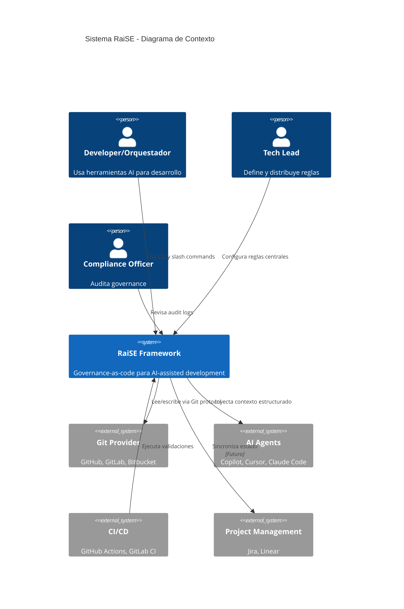
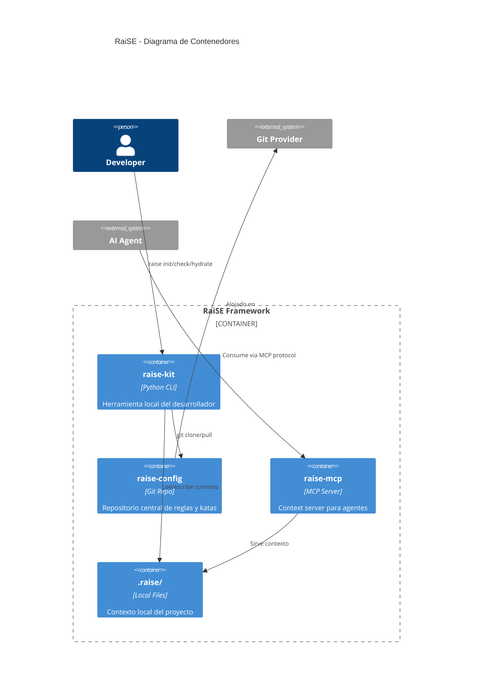
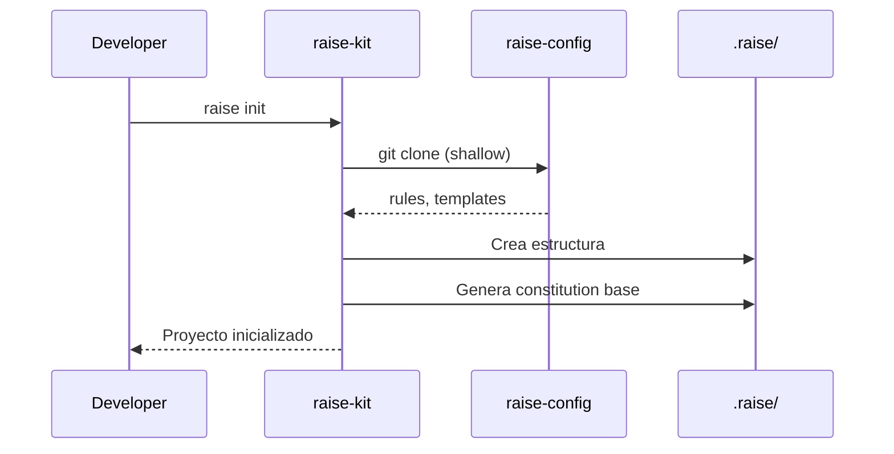
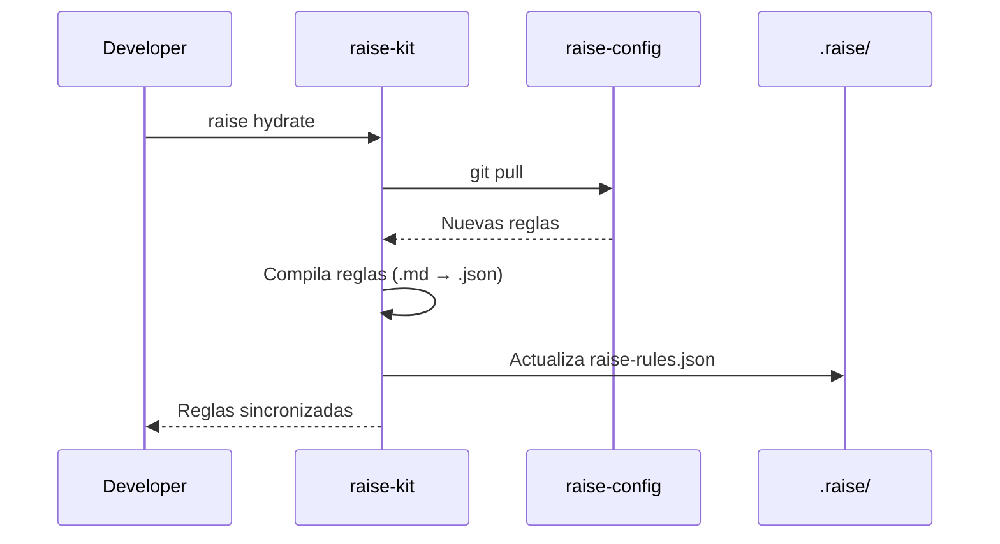
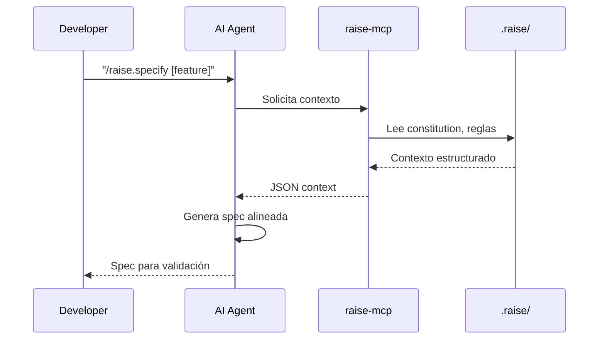

# RaiSE System Architecture
## Vista Técnica del Framework

**Versión:** 1.0.0  
**Fecha:** 27 de Diciembre, 2025  
**Propósito:** Documentar la arquitectura técnica de alto nivel del sistema RaiSE.

---

## Diagrama de Contexto (C4 Level 1)



---

## Diagrama de Contenedores (C4 Level 2)



---

## Componentes Core

### raise-kit (CLI)

**Propósito:** Interfaz principal del desarrollador con RaiSE.

**Responsabilidades:**
- Inicializar proyectos con estructura RaiSE
- Sincronizar reglas desde repositorio central
- Validar compliance contra reglas
- Ejecutar katas de validación

**Stack tecnológico:**
- Python 3.11+
- Click (CLI framework)
- Rich (terminal UI)
- httpx (HTTP async)

**Comandos principales:**
| Comando | Descripción |
|---------|-------------|
| `raise init` | Inicializa proyecto con estructura .raise/ |
| `raise hydrate` | Sincroniza reglas desde raise-config |
| `raise check` | Valida proyecto contra reglas |
| `raise validate` | Ejecuta katas de validación |

---

### raise-config (Central Repo)

**Propósito:** Fuente de verdad centralizada para reglas, katas y templates.

**Responsabilidades:**
- Almacenar reglas compartidas
- Versionar katas de validación
- Distribuir templates estándar
- Proveer configuración base

**Estructura:**
```
raise-config/
├── rules/           # Reglas en .mdc format
├── katas/           # Katas L0-L3
├── templates/       # Templates de documentos
├── agents/          # Definiciones de agentes
└── raise.yaml       # Configuración base
```

**Distribución:** Via Git (clone/pull), no requiere servidor.

---

### raise-mcp (Context Server)

**Propósito:** Servir contexto estructurado a agentes AI via MCP protocol.

**Responsabilidades:**
- Leer contexto local (.raise/)
- Servir reglas y specs bajo demanda
- Mantener vista coherente del proyecto
- Proveer herramientas a agentes

**Protocolo:** Model Context Protocol (Anthropic)

**Estado:** Planificado para v0.3

---

### .raise/ (Local Context)

**Propósito:** Contexto específico del proyecto.

**Estructura estándar:**
```
.raise/
├── memory/
│   ├── constitution.md    # Principios del proyecto
│   └── raise-rules.json   # Reglas compiladas
├── specs/                 # Especificaciones activas
├── plans/                 # Planes de implementación
└── raise.yaml             # Config local
```

---

## Flujos de Datos Principales

### Flujo 1: Inicialización de Proyecto



### Flujo 2: Sincronización de Reglas



### Flujo 3: Desarrollo con Contexto



---

## Decisiones Arquitectónicas Clave

| ID | Decisión | Opciones Consideradas | Elegida | Rationale |
|----|----------|----------------------|---------|-----------|
| ADR-001 | CLI en Python | Python, Go, Rust | Python | Ecosistema ML/AI, facilidad de extensión |
| ADR-002 | Git como distribución | NPM, PyPI, Git | Git | Platform agnostic, no requiere registry |
| ADR-003 | MCP para contexto | Custom API, LSP, MCP | MCP | Estándar emergente, soporte multi-agente |
| ADR-004 | Markdown para humanos | YAML, TOML, MD | Markdown | Legibilidad, diff-friendly |
| ADR-005 | JSON para máquinas | JSON, YAML | JSON | Parseo rápido, soporte universal |

---

## Principios Técnicos

### 1. Platform Agnosticism
- Sin dependencia de GitHub/GitLab/Bitbucket específico
- Git protocol como transporte universal
- Funciona 100% on-premise

### 2. Git as API
- Distribución via clone/pull, no API REST
- Versionado nativo de reglas
- Branching para experimentos

### 3. Local-First
- Contexto vive en el proyecto, no en cloud
- MCP server local, no SaaS
- Datos sensibles nunca salen del ambiente

### 4. Progressive Enhancement
- Funciona con cero configuración (defaults)
- Cada feature es opt-in
- Complejidad solo cuando se necesita

---

## Constraints y Trade-offs

| Constraint | Implicación | Trade-off |
|------------|-------------|-----------|
| Git-only distribution | No hay auto-update | Manual `hydrate` requerido |
| Local-first | No hay analytics central | Menos insights de uso |
| Platform agnostic | No deep integration | Más setup en algunos IDEs |
| Python CLI | Dependency en Python runtime | Distribución como binario (PyInstaller) |

---

## Roadmap Técnico

| Versión | Componentes | Estado |
|---------|-------------|--------|
| v0.1 | raise-kit (init, check, hydrate) | En desarrollo |
| v0.2 | DoD validation, Katas engine | Planificado |
| v0.3 | raise-mcp, Multi-agent support | Planificado |
| v1.0 | Stable API, Enterprise features | Futuro |

---

*Este documento evoluciona con las decisiones arquitectónicas del proyecto.*
