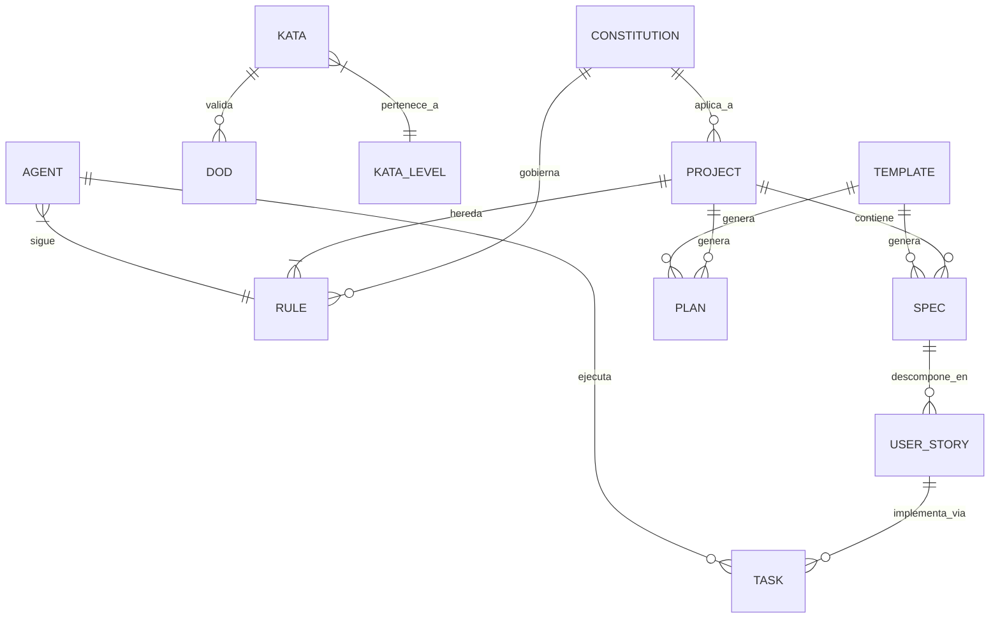
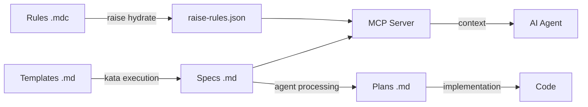

# RaiSE Data Architecture
## Estructuras de Datos y Ontología

**Versión:** 1.0.0  
**Fecha:** 27 de Diciembre, 2025  
**Propósito:** Documentar las estructuras de datos, schemas y ontología de RaiSE.

---

## Ontología de Conceptos



---

## Entidades Core

### Constitution

**Definición:** Principios inmutables que gobiernan el proyecto.

**Atributos:**
| Campo | Tipo | Requerido | Descripción |
|-------|------|-----------|-------------|
| version | semver | ✅ | Versión del documento |
| identity | object | ✅ | Qué es y qué no es |
| principles | array | ✅ | Principios innegociables |
| values | array | ✅ | Valores de diseño |
| restrictions | object | ✅ | Nunca/Siempre |

**Ubicación:** `.raise/memory/constitution.md`

---

### Rule

**Definición:** Directiva que gobierna comportamiento de agentes o calidad de código.

**Atributos:**
| Campo | Tipo | Requerido | Descripción |
|-------|------|-----------|-------------|
| id | string | ✅ | Identificador único (ej. 001-naming) |
| title | string | ✅ | Nombre descriptivo |
| scope | enum | ✅ | agent, code, process |
| priority | int | ✅ | 1-999, menor = mayor prioridad |
| content | markdown | ✅ | Contenido de la regla |
| globs | array | ❌ | Patrones de archivo donde aplica |

**Formato humano:** `.mdc` (Markdown con frontmatter)  
**Formato máquina:** `.json` (compilado)

**Ubicación:**
- Origen: `raise-config/rules/*.mdc`
- Compilado: `.raise/memory/raise-rules.json`

---

### Kata

**Definición:** Proceso estructurado que codifica un estándar o patrón.

**Atributos:**
| Campo | Tipo | Requerido | Descripción |
|-------|------|-----------|-------------|
| id | string | ✅ | Ej. L1-04 |
| level | enum | ✅ | L0, L1, L2, L3 |
| title | string | ✅ | Nombre descriptivo |
| purpose | string | ✅ | Para qué sirve |
| inputs | array | ✅ | Qué consume |
| outputs | array | ✅ | Qué produce |
| steps | array | ✅ | Pasos a seguir |
| dod | array | ❌ | Definition of Done |

**Niveles:**
| Nivel | Propósito |
|-------|-----------|
| L0 | Meta-katas: filosofía |
| L1 | Proceso: metodología |
| L2 | Componentes: patrones |
| L3 | Técnico: especialización |

**Ubicación:** `raise-config/katas/L{n}-*.md`

---

### Spec (Specification)

**Definición:** Documento que describe QUÉ construir.

**Tipos:**
- PRD (Product Requirements Document)
- Solution Vision
- Technical Design
- Feature Specification

**Atributos comunes:**
| Campo | Tipo | Requerido | Descripción |
|-------|------|-----------|-------------|
| jira_id | string | ✅ | Identificador externo |
| title | string | ✅ | Nombre descriptivo |
| status | enum | ✅ | draft, review, approved |
| version | semver | ✅ | Versión del documento |
| stakeholders | array | ❌ | Interesados |
| content | markdown | ✅ | Contenido principal |

**Ubicación:** `.raise/specs/{jira-id}-{type}.md`

---

### User Story

**Definición:** Requisito desde perspectiva del usuario.

**Atributos:**
| Campo | Tipo | Requerido | Descripción |
|-------|------|-----------|-------------|
| jira_id | string | ✅ | Identificador JIRA |
| title | string | ✅ | Como [rol], quiero [acción] |
| description | string | ✅ | Contexto y detalles |
| acceptance_criteria | array | ✅ | Criterios BDD (Dado/Cuando/Entonces) |
| priority | enum | ✅ | P0, P1, P2, P3 |
| story_points | int | ❌ | Estimación |

**Formato BDD para AC:**
```gherkin
Dado [contexto inicial]
Cuando [acción del usuario]
Entonces [resultado esperado]
```

**Ubicación:** `.raise/specs/{feature-id}/{jira-id}-US-*.md`

---

### Agent

**Definición:** Configuración de un agente de IA especializado.

**Atributos:**
| Campo | Tipo | Requerido | Descripción |
|-------|------|-----------|-------------|
| name | string | ✅ | Nombre del agente |
| version | semver | ✅ | Versión de la spec |
| identity | object | ✅ | Rol, misión, dominios |
| behavior | object | ✅ | Principios, persistencia |
| capabilities | object | ✅ | Tareas primarias/secundarias |
| tools | array | ❌ | Herramientas disponibles |
| safety | object | ✅ | Condiciones de rechazo |

**Formato:** YAML

**Ubicación:** `raise-config/agents/{agent-name}/spec.yaml`

---

## Formatos de Archivo

### Markdown (Humanos)

Usado para: Constitution, Specs, Katas, Plans

**Estructura esperada:**
```markdown
# Título del Documento

**Versión:** X.Y.Z  
**Fecha:** YYYY-MM-DD  
**Estado:** draft|review|approved

---

## Sección Principal

Contenido...

---

*Footer con notas*
```

**Frontmatter (opcional):**
```yaml
---
jira_id: PROJ-123
type: user_story
priority: P1
---
```

---

### MDC (Rules)

Markdown con configuración embedded para reglas de Cursor.

**Estructura:**
```markdown
---
description: Descripción breve de la regla
globs:
  - "**/*.py"
  - "src/**/*.ts"
priority: 100
---

# Título de la Regla

Contenido de la regla en Markdown...
```

---

### JSON (Máquinas)

Usado para: Reglas compiladas, configuración

**Schema raise-rules.json:**
```json
{
  "$schema": "https://raise.dev/schemas/rules.json",
  "version": "1.0.0",
  "compiled_at": "2025-12-27T00:00:00Z",
  "rules": [
    {
      "id": "001-naming",
      "title": "Naming Conventions",
      "priority": 100,
      "scope": "code",
      "globs": ["**/*.py"],
      "content_hash": "sha256:abc123..."
    }
  ]
}
```

---

### YAML (Agents)

Usado para: Definiciones de agentes

**Schema reducido:**
```yaml
agent_specification:
  version: "0.4.0"
  metadata:
    name: "agent-name"
    description: "..."
  identity:
    short_role: "Role Label"
    mission: "..."
  behavior:
    core_principles: [...]
  capabilities:
    primary_tasks: [...]
    non_goals: [...]
```

---

## Flujo de Transformación



---

## Versionado de Schemas

### Política de Compatibilidad

| Cambio | Acción |
|--------|--------|
| Nuevo campo opcional | Versión minor (1.x) |
| Campo requerido nuevo | Versión major (x.0) |
| Deprecación de campo | Aviso + 2 versiones |
| Eliminación de campo | Versión major (x.0) |

### Migración

Cuando cambia un schema:
1. Crear script de migración en `raise-kit`
2. Mantener backward compatibility por 2 versiones minor
3. Documentar cambios en CHANGELOG

---

## Relaciones entre Entidades

| Origen | Relación | Destino |
|--------|----------|---------|
| Constitution | gobierna | Rule |
| Rule | aplica a | Project |
| Kata | valida | DoD |
| Spec | descompone en | User Story |
| User Story | implementa via | Task |
| Agent | ejecuta | Task |
| Agent | sigue | Rule |
| Template | genera | Spec, Plan |

---

*Este documento define la ontología canónica de RaiSE. Actualizar con cada nueva entidad.*
