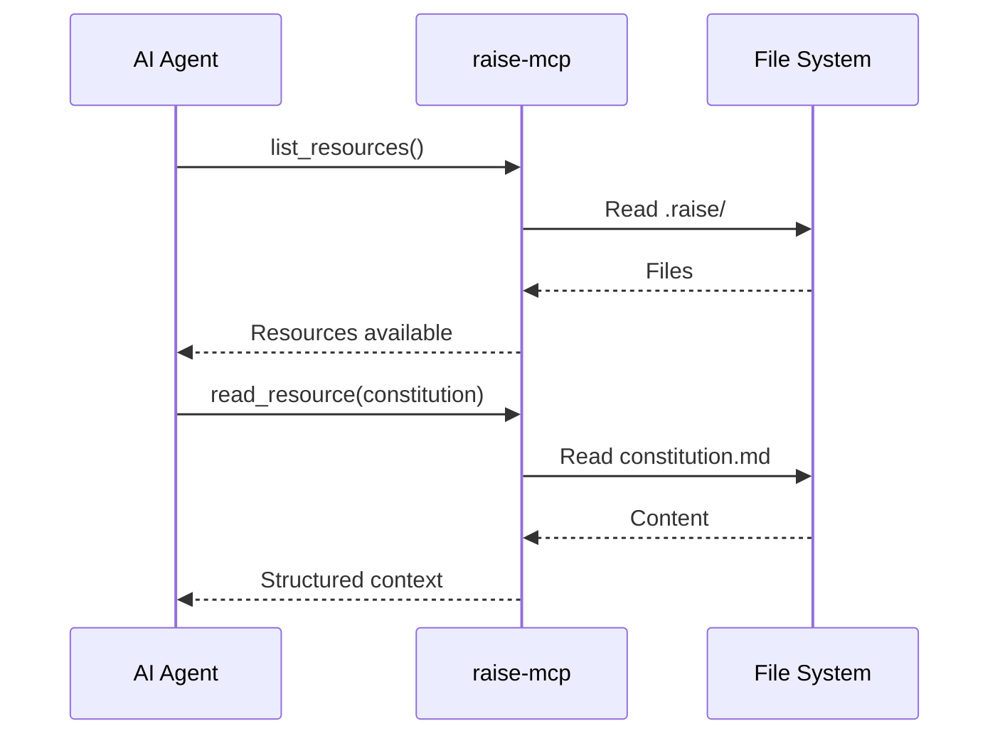
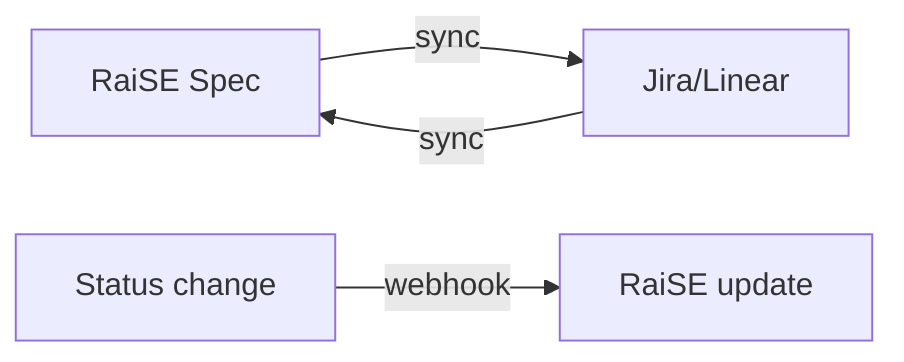

# RaiSE Integration Patterns
## Patrones de Integración con el Ecosistema

**Versión:** 1.0.0  
**Fecha:** 27 de Diciembre, 2025  
**Propósito:** Documentar cómo RaiSE se integra con herramientas externas.

---

## Matriz de Integraciones

| Sistema | Tipo | Estado | Prioridad |
|---------|------|--------|-----------|
| GitHub | VCS | ✅ Soportado | P0 |
| GitLab | VCS | ✅ Soportado | P0 |
| Bitbucket | VCS | ✅ Soportado | P1 |
| Cursor | IDE | ✅ Soportado | P0 |
| VS Code | IDE | 📋 Planificado | P1 |
| Claude (Anthropic) | Agent | ✅ Soportado | P0 |
| GitHub Copilot | Agent | ✅ Soportado | P0 |
| OpenAI GPT | Agent | ✅ Soportado | P1 |
| Jira | PM | 📋 Planificado | P2 |
| Linear | PM | 📋 Planificado | P2 |

---

## Patrones de Integración

### Patrón: VCS Provider

**Interface abstracta:**
```python
class VCSProvider(Protocol):
    def clone(self, url: str, path: Path) -> None: ...
    def pull(self, path: Path, branch: str) -> None: ...
    def get_current_branch(self, path: Path) -> str: ...
    def get_remote_url(self, path: Path) -> str: ...
```

**Implementaciones:**

| Provider | Notas |
|----------|-------|
| GitHub | Soporte HTTPS y SSH |
| GitLab | Incluye self-hosted |
| Bitbucket | Cloud y Server |

**Principio:** RaiSE usa Git protocol directamente, no APIs específicas de cada provider. Esto garantiza platform agnosticism.

---

### Patrón: IDE/Agent

**Mecanismos de integración:**

| Mecanismo | Descripción | Agentes |
|-----------|-------------|---------|
| `.cursorrules` / `.mdc` | Reglas nativas de Cursor | Cursor AI |
| `CLAUDE.md` | Instructions para Claude | Claude Code |
| MCP Server | Context Protocol | Claude, otros MCP-compatible |
| Custom Instructions | Prompts de sistema | Copilot, GPT |

**Estructura de reglas para Cursor:**
```
.cursor/
└── rules/
    ├── 001-naming.mdc
    ├── 002-security.mdc
    └── ...
```

**Estructura para Claude:**
```
CLAUDE.md          # Root level instructions
.raise/
└── memory/
    └── constitution.md
```

---

### Patrón: MCP Server

**Propósito:** Servir contexto estructurado a agentes via Model Context Protocol.

**Arquitectura:**


**Resources expuestos:**
| Resource | URI | Descripción |
|----------|-----|-------------|
| Constitution | `raise://constitution` | Principios del proyecto |
| Rules | `raise://rules` | Reglas activas |
| Current Spec | `raise://specs/current` | Spec en trabajo |
| Current Plan | `raise://plans/current` | Plan activo |

**Tools expuestos:**
| Tool | Descripción |
|------|-------------|
| `validate_dod` | Validar contra DoD |
| `check_rules` | Verificar compliance |
| `generate_artifact` | Crear desde template |

---

### Patrón: Project Management

**Estado:** Planificado para v0.3+

**Flujo bidireccional:**


**Capacidades planificadas:**
- Sincronizar specs → issues
- Importar issues → specs
- Actualizar estado bidireccional
- Mapear DoD → workflow states

---

## APIs Externas Consumidas

| API | Propósito | Auth | Rate Limits |
|-----|-----------|------|-------------|
| Git (protocol) | Clone/pull repos | SSH/HTTPS | N/A |
| GitHub API | Metadata (opcional) | Token | 5000/hr |
| GitLab API | Metadata (opcional) | Token | 2000/hr |

**Nota:** RaiSE funciona sin APIs. Las APIs son opcionales para features avanzadas.

---

## APIs Expuestas

### raise-mcp (MCP Server)

| Endpoint | Método | Descripción |
|----------|--------|-------------|
| Resources | `list_resources` | Lista recursos disponibles |
| Resources | `read_resource` | Lee recurso específico |
| Tools | `call_tool` | Ejecuta herramienta |

**Autenticación:** Local only (no auth required)

### raise-kit CLI

La CLI no expone APIs HTTP. Interacción via comandos:
```bash
raise check --format json  # Output estructurado
raise validate --output report.json
```

---

## Extensibilidad

### Crear Nueva Integración

1. **Implementar interface** del patrón correspondiente
2. **Registrar** en configuración
3. **Probar** con suite de integración
4. **Documentar** en este archivo

### Plugin System (Futuro)

```yaml
# raise.yaml
plugins:
  - name: raise-jira
    version: "^1.0"
    config:
      instance: https://company.atlassian.net
```

---

*Este documento se actualiza con cada nueva integración.*
