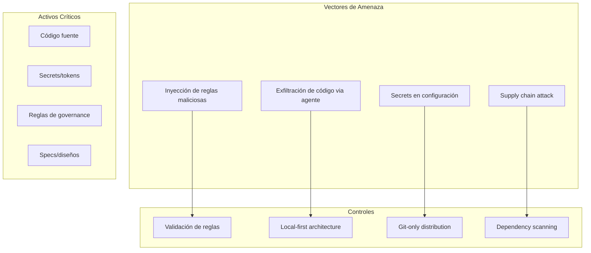
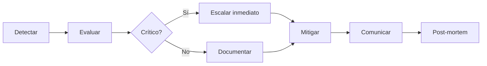

# RaiSE Security & Compliance
## Postura de Seguridad y Compliance

**Versión:** 1.0.0  
**Fecha:** 27 de Diciembre, 2025  
**Propósito:** Documentar políticas de seguridad y roadmap de compliance.

---

## Modelo de Amenazas



---

## Activos Críticos

| Activo | Clasificación | Controles |
|--------|---------------|-----------|
| Código fuente | Confidencial | Local-first, no cloud |
| API keys/secrets | Crítico | Nunca en archivos RaiSE |
| Reglas (.mdc) | Interno | Versionado, code review |
| Specs/diseños | Interno | Acceso por proyecto |
| Constitution | Público | Versionado immutable |

---

## Vectores de Ataque y Mitigación

### 1. Inyección de Reglas Maliciosas

**Amenaza:** Atacante modifica reglas en raise-config para alterar comportamiento de agentes.

**Mitigación:**
- Code review obligatorio para cambios en reglas
- Branch protection en repos de config
- Firma de commits (GPG)
- Audit log de cambios

### 2. Exfiltración via Agente

**Amenaza:** Agente AI envía código/secrets a servidor externo.

**Mitigación:**
- Arquitectura local-first (MCP server local)
- No hay telemetría hacia cloud RaiSE
- Reglas de seguridad que restringen acceso a red
- Auditoría de herramientas del agente

### 3. Secrets en Configuración

**Amenaza:** Usuario guarda secrets en archivos .raise/.

**Mitigación:**
- `.gitignore` por default incluye patrones de secrets
- Validación CLI que detecta secrets patterns
- Documentación clara sobre manejo de secrets
- Pre-commit hooks opcionales

### 4. Supply Chain Attack

**Amenaza:** Dependencia maliciosa en raise-kit.

**Mitigación:**
- Dependency scanning (Safety, Snyk)
- Lock files (uv.lock)
- Minimal dependencies policy
- Security advisories monitoring

---

## Políticas de Datos

### Data Residency
- **Principio:** Datos nunca salen del ambiente local
- **Implementación:** No hay cloud backend, todo es Git-native
- **Excepción:** Si usuario configura sync externo explícitamente

### Encryption

| Contexto | Método |
|----------|--------|
| At rest | Responsabilidad del sistema host |
| In transit (Git) | SSH/HTTPS estándar |
| MCP (local) | No aplica (localhost) |

### Retention

| Dato | Retención | Responsable |
|------|-----------|-------------|
| Logs CLI | No se persisten por default | Usuario |
| Session logs | Opcional, local | Usuario |
| Artifacts | Versionado en Git | Usuario |

---

## Compliance Roadmap

| Framework | Estado | Target Date | Notas |
|-----------|--------|-------------|-------|
| EU AI Act | 📋 En análisis | Q2 2025 | Trazabilidad requerida |
| SOC2 Type I | 📋 Planificado | Q3 2026 | Para tier Enterprise |
| ISO 27001 | 📋 Futuro | 2027 | Largo plazo |
| GDPR | ✅ By design | - | No PII procesado |

### EU AI Act Relevance

RaiSE ayuda a organizaciones a cumplir EU AI Act mediante:
- **Trazabilidad:** Auditoría de decisiones AI en Git
- **Governance:** Políticas como código versionado
- **Documentación:** Specs y plans como evidencia
- **Supervisión humana:** Principio de Heutagogía

---

## Audit Trail

### Qué se Loguea

| Evento | Datos | Ubicación |
|--------|-------|-----------|
| `raise init` | Timestamp, options | Opcional: session log |
| `raise check` | Results, violations | Opcional: CI output |
| Cambios en reglas | Git history | raise-config repo |
| Cambios en specs | Git history | Project repo |

### Retención
- **Default:** No hay retención central
- **Recomendado:** CI logs según política org
- **Enterprise:** Configuración de audit sink

### Acceso
- Quien tenga acceso al repo Git
- CI/CD logs según permisos de pipeline

---

## Incident Response

### Proceso



### Clasificación

| Severidad | Criterio | Response Time |
|-----------|----------|---------------|
| Crítico | Compromiso de secrets, RCE | 4 horas |
| Alto | Vulnerabilidad explotable | 24 horas |
| Medio | Vulnerabilidad potencial | 7 días |
| Bajo | Mejora de seguridad | Siguiente release |

### Contacto
- **Email:** security@[dominio] (a definir)
- **Disclosure:** Responsible disclosure policy

---

## Secure Development

### Requisitos para Contributors

1. **Commits firmados** (GPG) para merges
2. **2FA** en cuentas de GitHub/GitLab
3. **Branch protection** habilitado
4. **Code review** obligatorio

### CI/CD Security

```yaml
# Checks obligatorios
- name: Security Scan
  run: |
    safety check
    bandit -r src/
- name: Dependency Audit
  run: pip-audit
```

---

## Hardening Guide

### Para Organizaciones

1. **raise-config privado:** No usar repo público para reglas internas
2. **Branch protection:** Requerir PRs y reviews
3. **Minimal permissions:** Tokens con scope mínimo
4. **Audit activado:** Habilitar Git audit logs
5. **Rotación:** Rotar tokens periódicamente

### Para Developers

1. **No secrets en .raise/:** Usar variables de entorno
2. **Revisar reglas:** Entender qué reglas se aplican
3. **Actualizar:** Mantener raise-kit actualizado
4. **Reportar:** Reportar comportamiento sospechoso

---

*Este documento se revisa trimestralmente o con cada incident.*
