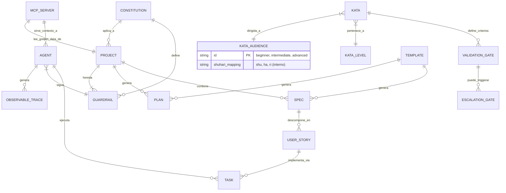
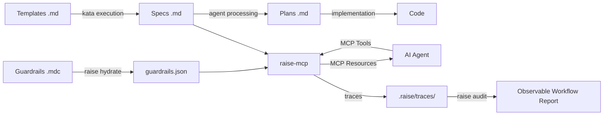

# RaiSE Data Architecture
## Estructuras de Datos y Ontología

**Versión:** 2.1.0  
**Fecha:** 29 de Diciembre, 2025  
**Propósito:** Documentar las estructuras de datos, schemas y ontología canónica de RaiSE.

> **Nota v2.1:** Campo `audience` añadido a Kata (ADR-009). Diagrama ER actualizado. Encoding UTF-8 corregido.

---

## Ontología de Conceptos



---

## Entidades Core

### Constitution

**Definición:** Principios inmutables que gobiernan el proyecto. Documento de máxima jerarquía.

**Atributos:**

| Campo | Tipo | Requerido | Descripción |
|-------|------|-----------|-------------|
| version | semver | ✅ | Versión del documento |
| identity | object | ✅ | Qué es y qué no es |
| principles | array | ✅ | Principios innegociables (§1-§9) |
| values | array | ✅ | Valores de diseño |
| restrictions | object | ✅ | Nunca/Siempre |

**Ubicación:** `.raise/memory/constitution.md`

**Referencia MCP:** `raise://constitution`

---

### Guardrail [v2.0: antes "Rule"]

**Definición:** Control que gobierna comportamiento de agentes o calidad de código. Los Guardrails son protecciones activas, no reglas pasivas.

**Atributos:**

| Campo | Tipo | Requerido | Descripción |
|-------|------|-----------|-------------|
| id | string | ✅ | Identificador único (ej. `guard-001-naming`) |
| title | string | ✅ | Nombre descriptivo |
| scope | enum | ✅ | `agent`, `code`, `process`, `security` |
| severity | enum | ✅ | `error`, `warning`, `info` |
| priority | int | ✅ | 1-999, menor = mayor prioridad |
| content | markdown | ✅ | Contenido del guardrail |
| globs | array | ❌ | Patrones de archivo donde aplica |
| enforcement | enum | ✅ | `block`, `warn`, `log` |

**Formato humano:** `.mdc` (Markdown con frontmatter)  
**Formato máquina:** `.json` (compilado)

**Ubicación:**
- Origen: `raise-config/guardrails/*.mdc`
- Compilado: `.raise/memory/guardrails.json`

**Referencia MCP:** `raise://guardrails`

---

### Validation Gate [v2.0: antes "DoD"]

**Definición:** Punto de inspección que debe pasarse antes de avanzar a la siguiente fase. Implementa el principio Jidoka.

**Atributos:**

| Campo | Tipo | Requerido | Descripción |
|-------|------|-----------|-------------|
| id | string | ✅ | Identificador (ej. `gate-design`) |
| phase | enum | ✅ | `context`, `discovery`, `vision`, `design`, `backlog`, `plan`, `code`, `deploy` |
| criteria | array | ✅ | Lista de criterios a validar |
| escalation_threshold | float | ❌ | Confidence bajo el cual escalar (0.0-1.0) |
| blocking | boolean | ✅ | Si bloquea avance o solo advierte |

**Fases estándar:**

| Gate | Fase | Pregunta clave |
|------|------|----------------|
| `gate-context` | 0 | ¿Stakeholders y restricciones claros? |
| `gate-discovery` | 1 | ¿PRD completo y validado? |
| `gate-vision` | 2 | ¿Alineación negocio-técnica? |
| `gate-design` | 3 | ¿Arquitectura consistente? |
| `gate-backlog` | 4 | ¿HUs siguen formato estándar? |
| `gate-plan` | 5 | ¿Pasos atómicos y verificables? |
| `gate-code` | 6 | ¿Código validado multinivel? |
| `gate-deploy` | 7 | ¿Feature en producción estable? |

**Ubicación:** Definidos en katas correspondientes

**Referencia MCP:** Tool `validate_gate`

---

### Escalation Gate [v2.0: NUEVO]

**Definición:** Trigger para intervención humana (HITL). Se activa cuando un Validation Gate falla o la confianza es baja.

**Atributos:**

| Campo | Tipo | Requerido | Descripción |
|-------|------|-----------|-------------|
| trigger_source | string | ✅ | Gate o condición que lo activó |
| reason | string | ✅ | Por qué se requiere intervención |
| context | object | ✅ | Información para el Orquestador |
| options | array | ✅ | Acciones posibles |
| timeout | duration | ❌ | Tiempo máximo de espera |

**Referencia MCP:** Tool `escalate`

---

### Observable Trace [v2.0: NUEVO]

**Definición:** Registro de una interacción agente-MCP para auditoría y Observable Workflow.

**Atributos:**

| Campo | Tipo | Requerido | Descripción |
|-------|------|-----------|-------------|
| trace_id | uuid | ✅ | Identificador único |
| session_id | uuid | ✅ | Sesión de trabajo |
| timestamp | datetime | ✅ | Momento de la acción |
| action | string | ✅ | Tipo de acción (resource_read, tool_call, etc.) |
| actor | enum | ✅ | `agent`, `orchestrator`, `system` |
| input | object | ✅ | Datos de entrada |
| output | object | ✅ | Resultado |
| duration_ms | int | ✅ | Tiempo de ejecución |
| gate_status | enum | ❌ | `passed`, `failed`, `escalated` |

**Ubicación:** `.raise/traces/{date}/{session_id}.jsonl`

**Formato:** JSON Lines (un trace por línea)

---

### Kata

**Definición:** Proceso estructurado que codifica un estándar o patrón. Ejercicio deliberado de mejora.

**Atributos:**

| Campo | Tipo | Requerido | Descripción |
|-------|------|-----------|-------------|
| id | string | ✅ | Ej. `L1-04` |
| level | enum | ✅ | `L0`, `L1`, `L2`, `L3` (qué enseña) |
| audience | enum | ✅ | `beginner`, `intermediate`, `advanced` (a quién) [v2.1] |
| title | string | ✅ | Nombre descriptivo |
| purpose | string | ✅ | Para qué sirve |
| inputs | array | ✅ | Qué consume |
| outputs | array | ✅ | Qué produce |
| steps | array | ✅ | Pasos a seguir |
| validation_gate | string | ❌ | Gate que este kata valida |
| prerequisites | array | ❌ | Katas que deben completarse antes [v2.1] |

**Niveles (Level) — Qué enseña:**

| Nivel | Propósito | Ejemplo |
|-------|-----------|---------|
| L0 | Meta-katas: filosofía | Principios RaiSE |
| L1 | Proceso: metodología | Generación de planes |
| L2 | Componentes: patrones | Análisis de código |
| L3 | Técnico: especialización | Modelado de datos |

**Audiencia (Audience) — A quién está dirigida:** [v2.1 - ADR-009]

| Audience | Características | Mapeo Interno |
|----------|-----------------|---------------|
| `beginner` | Pasos exactos, copiar la forma, sin variación | Shu (守) |
| `intermediate` | Adaptación al contexto, entender el "por qué" | Ha (破) |
| `advanced` | Crear variaciones propias, fluir sin forma | Ri (離) |

> **Nota de diseño (ADR-009):** El mapeo ShuHaRi es interno para mantenedores. Los usuarios ven solo términos universales (`beginner/intermediate/advanced`). Esta decisión balancea diferenciación filosófica con simplicidad de onboarding.

**Ubicación:** `raise-config/katas/L{n}-*.md`

---

### Spec (Specification)

**Definición:** Documento que describe QUÉ construir. Artefacto central del Context Engineering.

**Tipos:**
- PRD (Product Requirements Document)
- Solution Vision
- Technical Design
- Feature Specification

**Atributos comunes:**

| Campo | Tipo | Requerido | Descripción |
|-------|------|-----------|-------------|
| id | string | ✅ | Identificador (ej. JIRA ID) |
| title | string | ✅ | Nombre descriptivo |
| status | enum | ✅ | `draft`, `review`, `approved` |
| version | semver | ✅ | Versión del documento |
| stakeholders | array | ❌ | Interesados |
| content | markdown | ✅ | Contenido principal |

**Ubicación:** `.raise/specs/{id}-{type}.md`

**Referencia MCP:** `raise://specs/{id}`

---

### User Story

**Definición:** Requisito desde perspectiva del usuario.

**Atributos:**

| Campo | Tipo | Requerido | Descripción |
|-------|------|-----------|-------------|
| id | string | ✅ | Identificador |
| title | string | ✅ | Como [rol], quiero [acción] |
| description | string | ✅ | Contexto y detalles |
| acceptance_criteria | array | ✅ | Criterios BDD (Dado/Cuando/Entonces) |
| priority | enum | ✅ | `P0`, `P1`, `P2`, `P3` |
| story_points | int | ❌ | Estimación |

**Formato BDD para AC:**
```gherkin
Dado [contexto inicial]
Cuando [acción del usuario]
Entonces [resultado esperado]
```

**Ubicación:** `.raise/specs/{feature-id}/{id}-US-*.md`

---

### Agent

**Definición:** Configuración de un agente de IA especializado.

**Atributos:**

| Campo | Tipo | Requerido | Descripción |
|-------|------|-----------|-------------|
| name | string | ✅ | Nombre del agente |
| version | semver | ✅ | Versión de la spec |
| identity | object | ✅ | Rol, misión, dominios |
| behavior | object | ✅ | Principios, persistencia |
| capabilities | object | ✅ | Tareas primarias/secundarias |
| mcp_tools | array | ❌ | Tools MCP que puede invocar |
| guardrails | array | ✅ | Guardrails que debe seguir |
| safety | object | ✅ | Condiciones de rechazo |

**Formato:** YAML

**Ubicación:** `raise-config/agents/{agent-name}/spec.yaml`

---

## Formatos de Archivo

### Markdown (Humanos)

Usado para: Constitution, Specs, Katas, Plans

**Estructura esperada:**
```markdown
# Título del Documento

**Versión:** X.Y.Z  
**Fecha:** YYYY-MM-DD  
**Estado:** draft|review|approved

---

## Sección Principal

Contenido...

---

*Footer con notas*
```

**Frontmatter (opcional):**
```yaml
---
id: PROJ-123
type: user_story
priority: P1
audience: intermediate
---
```

---

### MDC (Guardrails)

Markdown con configuración embedded para Cursor y otros IDEs.

**Estructura:**
```markdown
---
description: Descripción breve del guardrail
globs:
  - "**/*.py"
  - "src/**/*.ts"
priority: 100
severity: error
enforcement: block
---

# Título del Guardrail

Contenido del guardrail en Markdown...
```

---

### JSON (Máquinas)

Usado para: Guardrails compilados, configuración

**Schema guardrails.json:** [v2.0: renombrado de raise-rules.json]
```json
{
  "$schema": "https://raise.dev/schemas/guardrails.v2.json",
  "version": "2.0.0",
  "compiled_at": "2025-12-28T00:00:00Z",
  "guardrails": [
    {
      "id": "guard-001-naming",
      "title": "Naming Conventions",
      "priority": 100,
      "scope": "code",
      "severity": "error",
      "enforcement": "block",
      "globs": ["**/*.py"],
      "content_hash": "sha256:abc123..."
    }
  ]
}
```

---

### JSONL (Traces)

Usado para: Observable Workflow traces

**Estructura:**
```jsonl
{"trace_id":"uuid1","session_id":"sess1","timestamp":"2025-12-28T10:00:00Z","action":"resource_read","actor":"agent","input":{"uri":"raise://constitution"},"output":{"status":"ok"},"duration_ms":45}
{"trace_id":"uuid2","session_id":"sess1","timestamp":"2025-12-28T10:00:01Z","action":"tool_call","actor":"agent","input":{"tool":"validate_gate","args":{"gate":"gate-design"}},"output":{"status":"passed"},"duration_ms":120}
```

---

### YAML (Agents)

Usado para: Definiciones de agentes

**Schema reducido:**
```yaml
agent_specification:
  version: "2.0.0"
  metadata:
    name: "agent-name"
    description: "..."
  identity:
    short_role: "Role Label"
    mission: "..."
  behavior:
    core_principles: [...]
  capabilities:
    primary_tasks: [...]
    mcp_tools: [validate_gate, escalate]
    non_goals: [...]
  guardrails:
    - guard-001-naming
    - guard-002-security
```

---

## Flujo de Transformación



---

## Versionado de Schemas

### Política de Compatibilidad

| Cambio | Acción |
|--------|--------|
| Nuevo campo opcional | Versión minor (1.x) |
| Campo requerido nuevo | Versión major (x.0) |
| Deprecación de campo | Aviso + 2 versiones |
| Eliminación de campo | Versión major (x.0) |
| Renombre de entidad | Versión major + migration script |

### Migración v1.0 → v2.0

| Cambio | Script |
|--------|--------|
| `raise-rules.json` → `guardrails.json` | `raise migrate --to v2` |
| `rules/` → `guardrails/` | Automático en hydrate |
| `dod` field → `validation_gate` | Automático en hydrate |

### Migración v2.0 → v2.1 [NUEVO]

| Cambio | Script |
|--------|--------|
| Añadir `audience` a Katas | Manual o `raise kata migrate` |

---

## Relaciones entre Entidades

| Origen | Relación | Destino |
|--------|----------|---------|
| Constitution | define | Guardrail |
| Guardrail | aplica a | Project |
| Kata | define_criterios | Validation Gate |
| Kata | dirigida_a | Kata Audience [v2.1] |
| Validation Gate | puede_triggerar | Escalation Gate |
| Spec | descompone en | User Story |
| User Story | implementa via | Task |
| Agent | ejecuta | Task |
| Agent | sigue | Guardrail |
| Agent | genera | Observable Trace |
| Template | genera | Spec, Plan |
| MCP Server | sirve_contexto_a | Agent |
| MCP Server | lee_golden_data_de | Project |

---

## Jerarquía de Entidades

```
Constitution (Inmutable)
    │
    ├── Guardrails (Controles)
    │       │
    │       └── enforcement: block|warn|log
    │
    ├── Validation Gates (Checkpoints)
    │       │
    │       └── Escalation Gates (HITL)
    │
    └── Specs (Intención)
            │
            ├── User Stories
            │       │
            │       └── Tasks
            │
            └── Plans
```

---

## Changelog

### v2.1.0 (2025-12-29)
- NUEVO: Campo `audience` en Kata (ADR-009)
- NUEVO: Campo `prerequisites` en Kata
- NUEVO: Entidad KATA_AUDIENCE en diagrama ER
- NUEVO: Tabla de mapeo ShuHaRi (interno)
- FIX: Encoding UTF-8 corregido en todo el documento

### v2.0.0 (2025-12-28)
- **BREAKING:** Rule → Guardrail (schema y ubicación)
- **BREAKING:** DoD → Validation Gate
- **BREAKING:** raise-rules.json → guardrails.json
- NUEVO: Entidad Escalation Gate
- NUEVO: Entidad Observable Trace
- NUEVO: Formato JSONL para traces
- NUEVO: Atributos severity y enforcement en Guardrail
- NUEVO: Atributo mcp_tools en Agent
- Diagrama ER actualizado con nuevas entidades
- Flujo de transformación incluye Observable Workflow

---

*Este documento define la ontología canónica de RaiSE. Actualizar con cada nueva entidad. Referencias cruzadas: [10-system-architecture-v2.md](./10-system-architecture-v2.md), [20-glossary-v2.md](./20-glossary-v2.md), [ADR-009](./adr/adr-009-shuhari-hybrid.md).*
