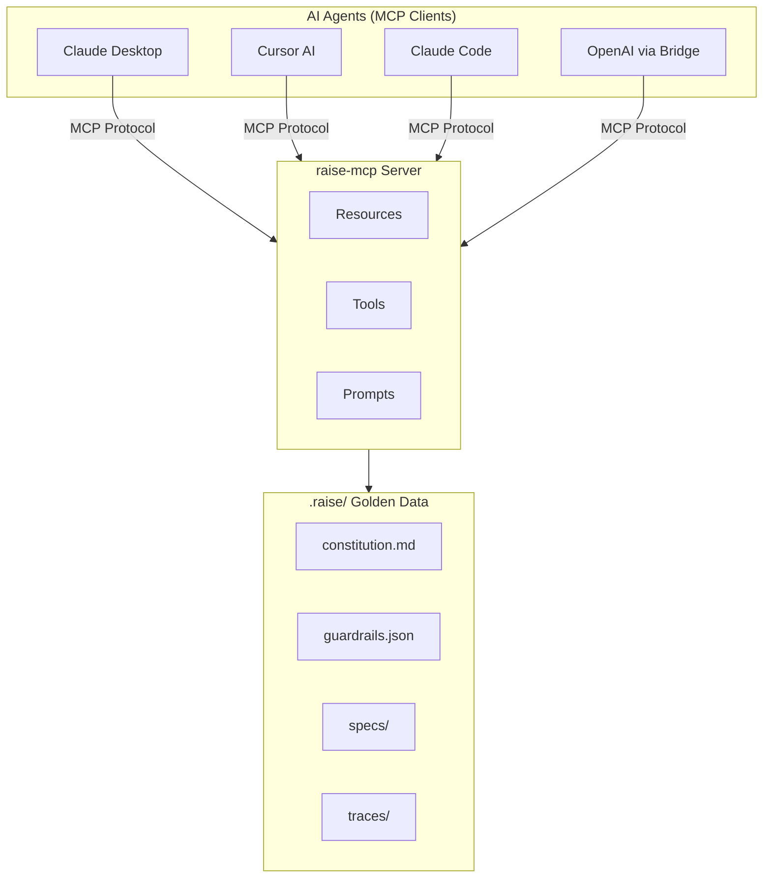
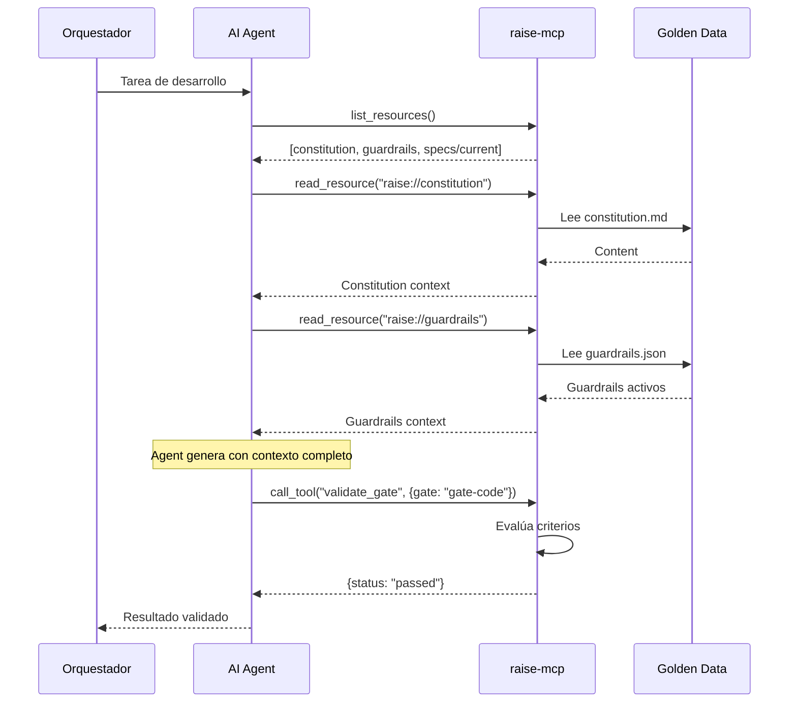
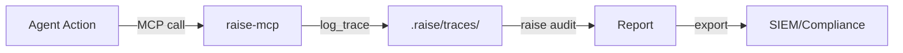
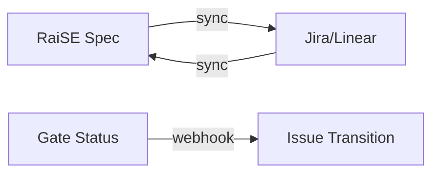
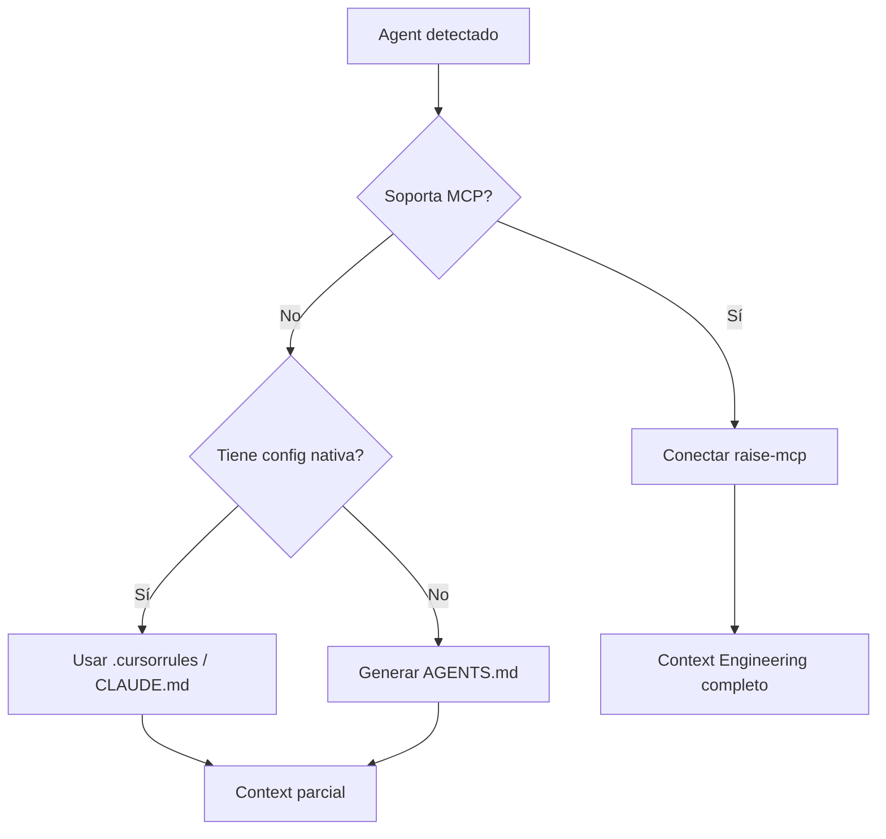

# RaiSE Integration Patterns
## Patrones de Integración con el Ecosistema

**Versión:** 2.0.0  
**Fecha:** 28 de Diciembre, 2025  
**Propósito:** Documentar cómo RaiSE se integra con herramientas externas via MCP y otros mecanismos.

---

## Matriz de Integraciones

| Sistema | Tipo | Mecanismo | Estado | Prioridad |
|---------|------|-----------|--------|-----------|
| GitHub | VCS | Git protocol | ✅ Soportado | P0 |
| GitLab | VCS | Git protocol | ✅ Soportado | P0 |
| Bitbucket | VCS | Git protocol | ✅ Soportado | P1 |
| Cursor | IDE | MCP + .cursorrules | ✅ Soportado | P0 |
| VS Code | IDE | MCP + extension | 📋 Planificado | P1 |
| Claude (Anthropic) | Agent | MCP native | ✅ Soportado | P0 |
| Claude Code | Agent | MCP + CLAUDE.md | ✅ Soportado | P0 |
| GitHub Copilot | Agent | Custom Instructions | ✅ Soportado | P0 |
| OpenAI GPT | Agent | MCP (via bridge) | 🟡 En desarrollo | P1 |
| Jira | PM | REST API | 📋 Planificado | P2 |
| Linear | PM | GraphQL API | 📋 Planificado | P2 |

---

## Patrón Principal: MCP-Native

RaiSE es **MCP-native**: el Model Context Protocol es el mecanismo primario de integración con agentes AI.

### Arquitectura MCP



### Primitivos MCP Expuestos

#### Resources (Contexto Estructurado)

| URI | Descripción | Formato |
|-----|-------------|---------|
| `raise://constitution` | Principios del proyecto | Markdown |
| `raise://guardrails` | Guardrails activos compilados | JSON |
| `raise://guardrails/{id}` | Guardrail específico | Markdown |
| `raise://specs` | Lista de specs disponibles | JSON |
| `raise://specs/{id}` | Spec específica | Markdown |
| `raise://specs/current` | Spec en trabajo actual | Markdown |
| `raise://plans/current` | Plan de implementación activo | Markdown |
| `raise://context` | Contexto agregado para tarea | JSON |

#### Tools (Acciones)

| Tool | Descripción | Parámetros |
|------|-------------|------------|
| `validate_gate` | Valida artefacto contra Validation Gate | `gate_id`, `artifact_path` |
| `check_guardrail` | Verifica compliance contra guardrail | `guardrail_id`, `content` |
| `generate_artifact` | Crea artefacto desde template | `template_id`, `variables` |
| `escalate` | Solicita intervención del Orquestador | `reason`, `context`, `options` |
| `log_trace` | Registra acción en Observable Workflow | `action`, `input`, `output` |

#### Prompts (Templates Reutilizables)

| Prompt | Descripción | Variables |
|--------|-------------|-----------|
| `constitution_context` | Inyecta Constitution en contexto | — |
| `guardrail_check` | Template para verificación de guardrail | `guardrail_id` |
| `gate_validation` | Template para validación de gate | `gate_id`, `criteria` |
| `escalation_request` | Formato de solicitud HITL | `reason`, `options` |

---

## Patrones de Integración por Tipo

### Patrón: VCS Provider

**Principio:** RaiSE usa Git protocol directamente, no APIs específicas. Esto garantiza platform agnosticism.

**Interface abstracta:**
```python
class VCSProvider(Protocol):
    def clone(self, url: str, path: Path) -> None: ...
    def pull(self, path: Path, branch: str) -> None: ...
    def get_current_branch(self, path: Path) -> str: ...
    def get_remote_url(self, path: Path) -> str: ...
```

**Implementaciones:**

| Provider | Notas |
|----------|-------|
| GitHub | HTTPS y SSH, incluye GitHub Enterprise |
| GitLab | Cloud y self-hosted |
| Bitbucket | Cloud y Server |
| Azure DevOps | Via Git protocol |

---

### Patrón: IDE Integration

**Mecanismos de integración por IDE:**

| IDE | MCP | Archivo Config | Fallback |
|-----|-----|----------------|----------|
| Cursor | ✅ Native | `.cursorrules` | .mdc files |
| VS Code | 🟡 Via extension | `settings.json` | AGENTS.md |
| JetBrains | 📋 Planificado | `.idea/` | AGENTS.md |
| Neovim | 📋 Planificado | `init.lua` | AGENTS.md |

**Estructura para Cursor (MCP + fallback):**
```
proyecto/
├── .cursor/
│   └── rules/
│       ├── guard-001-naming.mdc
│       ├── guard-002-security.mdc
│       └── ...
├── .raise/
│   └── memory/
│       ├── constitution.md
│       └── guardrails.json
└── raise.yaml  # Configura raise-mcp
```

**Estructura para Claude Code:**
```
proyecto/
├── CLAUDE.md              # Instructions root level
├── .raise/
│   └── memory/
│       └── constitution.md
└── raise.yaml             # Configura raise-mcp
```

**Estructura universal (AGENTS.md):**
```
proyecto/
├── AGENTS.md              # Estándar emergente de comunidad
├── .raise/
│   └── memory/
│       └── constitution.md
└── raise.yaml
```

---

### Patrón: Agent Integration

**Flujo MCP estándar:**



**Configuración por agente:**

| Agente | Conexión MCP | Config File |
|--------|--------------|-------------|
| Claude Desktop | `claude_desktop_config.json` | Sección `mcpServers` |
| Cursor | Built-in | `.cursor/mcp.json` |
| Claude Code | Automático | `raise.yaml` |
| Copilot | Via bridge | Custom Instructions |

**Ejemplo: claude_desktop_config.json**
```json
{
  "mcpServers": {
    "raise": {
      "command": "raise",
      "args": ["mcp", "--project", "/path/to/project"]
    }
  }
}
```

---

### Patrón: Observable Workflow Integration

**Propósito:** Generar traces auditables de todas las interacciones MCP.



**Formato de trace (JSONL):**
```jsonl
{"trace_id":"uuid","timestamp":"ISO8601","action":"resource_read","uri":"raise://constitution","duration_ms":45,"status":"ok"}
{"trace_id":"uuid","timestamp":"ISO8601","action":"tool_call","tool":"validate_gate","input":{"gate":"gate-code"},"output":{"status":"passed"},"duration_ms":120}
```

**Integración con sistemas externos:**

| Sistema | Mecanismo | Estado |
|---------|-----------|--------|
| Archivo local | JSONL nativo | ✅ Soportado |
| OpenTelemetry | OTLP export | 📋 Planificado |
| Datadog | Log forwarding | 📋 Planificado |
| Splunk | HEC endpoint | 📋 Planificado |

---

### Patrón: Project Management (Futuro)

**Estado:** Planificado para v0.4+

**Flujo bidireccional:**


**Capacidades planificadas:**
- Sincronizar specs ↔ issues
- Importar issues ↔ specs
- Mapear Validation Gates ↔ workflow states
- Actualizar estado bidireccional
- Generar reportes de compliance

---

## APIs

### APIs Externas Consumidas

| API | Propósito | Auth | Requerido |
|-----|-----------|------|-----------|
| Git protocol | Clone/pull repos | SSH/HTTPS | ✅ Sí |
| GitHub API | Metadata (opcional) | Token | ❌ No |
| GitLab API | Metadata (opcional) | Token | ❌ No |

**Principio:** RaiSE funciona sin APIs externas. Git protocol es suficiente.

### APIs Expuestas

#### raise-mcp (MCP Server)

| Método MCP | Descripción |
|------------|-------------|
| `list_resources` | Lista recursos disponibles |
| `read_resource` | Lee recurso específico |
| `list_tools` | Lista tools disponibles |
| `call_tool` | Ejecuta herramienta |
| `list_prompts` | Lista prompts disponibles |
| `get_prompt` | Obtiene prompt con variables |

**Autenticación:** Local only (no auth required)

**Transporte:** stdio (estándar MCP)

#### raise-kit CLI

La CLI no expone APIs HTTP. Interacción via comandos:
```bash
raise check --format json      # Output estructurado
raise kata --output report.json
raise audit --format jsonl     # Observable Workflow export
raise mcp                      # Inicia MCP server
```

---

## Extensibilidad

### Crear Nueva Integración MCP

1. **Definir Resources** adicionales en `raise.yaml`
2. **Implementar Tools** custom si necesario
3. **Registrar** en configuración MCP
4. **Documentar** en este archivo

**Ejemplo: Resource custom**
```yaml
# raise.yaml
mcp:
  custom_resources:
    - uri: "raise://custom/metrics"
      handler: "metrics_handler"
      description: "Project metrics"
```

### Plugin System (v1.0+)

```yaml
# raise.yaml
plugins:
  - name: raise-jira
    version: "^1.0"
    config:
      instance: https://company.atlassian.net
      project: PROJ
  
  - name: raise-datadog
    version: "^1.0"
    config:
      api_key: ${DATADOG_API_KEY}
      traces: true
```

---

## Compatibilidad y Fallbacks

### Matriz de Compatibilidad

| Agente | MCP Native | Fallback 1 | Fallback 2 |
|--------|------------|------------|------------|
| Claude Desktop | ✅ | — | — |
| Claude Code | ✅ | CLAUDE.md | — |
| Cursor | ✅ | .cursorrules | AGENTS.md |
| Copilot | ❌ | Custom Instructions | AGENTS.md |
| GPT-4 | 🟡 Bridge | System prompt | AGENTS.md |

### Fallback Strategy



**Comando de generación de fallback:**
```bash
raise export --format cursorrules  # Genera .cursorrules
raise export --format claude       # Genera CLAUDE.md
raise export --format agents       # Genera AGENTS.md
```

---

## Changelog

### v2.1.0 (2025-12-28)
- MCP promovido a patrón principal de integración
- Terminología: rules → guardrails, DoD → Validation Gates
- NUEVO: Primitivos MCP detallados (Resources, Tools, Prompts)
- NUEVO: Patrón Observable Workflow Integration
- NUEVO: Matriz de compatibilidad y fallbacks
- NUEVO: Comando `raise export` para fallbacks
- Tools actualizados: `validate_dod` → `validate_gate`, `check_rules` → `check_guardrail`
- Añadido soporte OpenAI via bridge

---

*Este documento se actualiza con cada nueva integración. Referencias: [10-system-architecture.md](./10-system-architecture.md), [11-data-architecture.md](./11-data-architecture.md).*
