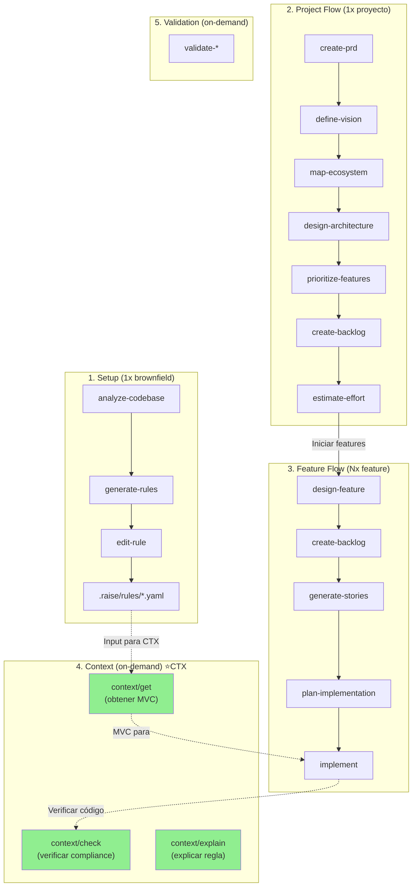

```mermaid
graph TD
    subgraph raise-kit [".raise-kit/"]

        %% --- CAPA DE COMANDOS ---
        subgraph commands ["commands/ (Ejecutables)"]

            subgraph setup ["setup/ (SAR + Init)"]
                s_init["init-project"]
                s_analyze["analyze-codebase"]
                s_rules_gen["generate-rules"]
                s_rules_edit["edit-rule"]
            end

            subgraph context ["context/ (CTX Component) ⭐NEW"]
                c_get["get"]
                c_check["check"]
                c_explain["explain"]
            end

            subgraph projects ["project/ (Project Flow)"]
                p_prd["create-prd"]
                p_vis["define-vision"]
                p_eco["map-ecosystem"]
                p_arch["design-architecture"]
                p_prior["prioritize-features"]
                p_back["create-backlog"]
                p_est["estimate-effort"]
            end

            subgraph features ["feature/ (Feature Flow)"]
                f_design["design-feature"]
                f_backlog["create-backlog"]
                f_stories["generate-stories"]
                f_plan["plan-implementation"]
                f_impl["implement"]
            end

            subgraph validate ["validate/ (Gates On-Demand)"]
                v_prd["validate-prd"]
                v_vis["validate-vision"]
                v_eco["validate-ecosystem"]
                v_arch["validate-architecture"]
                v_prior["validate-prioritization"]
                v_back["validate-backlog"]
                v_est["validate-estimation"]
                v_fdes["validate-feature-design"]
                v_stor["validate-stories"]
                v_plan["validate-plan"]
                v_req["validate-requirements"]
            end

            subgraph improve ["improve/ (Continuous Improvement)"]
                i_kata["manage-kata"]
                i_retro["run-retrospective (Planned)"]
                i_audit["audit-conventions (Planned)"]
            end

            subgraph tools ["tools/ (Utilities)"]
                t_export["export-issues"]
                t_contract["generate-contract"]
            end
        end

        %% --- CAPA DE RECURSOS ---
        subgraph resources ["Resources"]

            subgraph gates_tpl ["gates/raise/ (Gate Docs)"]
                g_prd["gate-prd.md ✅"]
                g_vis["gate-vision.md ✅"]
                g_eco["gate-ecosystem.md ❌"]
                g_arch["gate-architecture.md ✅"]
                g_prior["gate-prioritization.md ❌"]
                g_back["gate-backlog.md ✅"]
                g_est["gate-estimation.md ✅"]
                g_fdes["gate-feature-design.md ❌"]
                g_stor["gate-stories.md ❌"]
                g_plan["gate-plan.md ❌"]
                g_req["gate-requirements.md ❌"]
            end

            subgraph templates ["templates/raise/ (Artifact Templates)"]
                tm_prd["project_requirements.md"]
                tm_vis["solution_vision.md"]
                tm_eco["ecosystem_map.md"]
                tm_arch["technical_design.md"]
                tm_prior["feature_prioritization.md"]
                tm_back["project_backlog.md"]
                tm_est["estimation_roadmap.md"]
                tm_fdes["feature_design.md"]
                tm_stor["user_story.md"]
                tm_plan["implementation_plan.md"]
            end

            subgraph scripts ["scripts/bash/ (Context & Utils)"]
                sc_chk["check-prerequisites.sh"]
                sc_proj["create-new-project.sh"]
                sc_feat["create-new-feature.sh"]
                sc_upd["update-agent-context.sh"]
                sc_val["validate-structure.sh"]
            end
        end

    end

    %% --- RELACIONES: SETUP/SAR ---
    s_analyze -->|Genera| tm_arch
    s_rules_gen -->|Genera| rules_yaml[".raise/rules/*.yaml"]
    s_rules_edit -->|Modifica| rules_yaml

    %% --- RELACIONES: CONTEXT/CTX ---
    c_get -->|Lee| rules_yaml
    c_get -->|Lee| graph_yaml[".raise/graph.yaml"]
    c_get -->|Entrega| mvc["MVC al Agente"]
    c_check -->|Valida código vs| rules_yaml
    c_explain -->|Explica| rules_yaml

    %% --- RELACIONES: PROJECT FLOW ---
    p_prd -->|Genera| tm_prd
    p_prd -->|Handoff| v_prd

    p_vis -->|Consume| tm_prd
    p_vis -->|Genera| tm_vis
    p_vis -->|Handoff| v_vis

    p_eco -->|Consume| tm_vis
    p_eco -->|Genera| tm_eco
    p_eco -->|Handoff| v_eco

    p_arch -->|Consume| tm_vis
    p_arch -->|Genera| tm_arch
    p_arch -->|Handoff| v_arch

    p_prior -->|Consume| tm_arch
    p_prior -->|Genera| tm_prior
    p_prior -->|Handoff| v_prior

    p_back -->|Consume| tm_prior
    p_back -->|Genera| tm_back
    p_back -->|Handoff| v_back

    p_est -->|Consume| tm_back
    p_est -->|Genera| tm_est
    p_est -->|Handoff| v_est

    %% --- RELACIONES: FEATURE FLOW ---
    f_design -->|Consume Feature de| tm_prior
    f_design -->|Genera| tm_fdes
    f_design -->|Jidoka inline| f_design
    f_design -->|Handoff| v_fdes

    f_backlog -->|Consume| tm_fdes
    f_backlog -->|Genera| backlog_feat["feature_backlog.md"]

    f_stories -->|Consume item de| backlog_feat
    f_stories -->|Genera| tm_stor
    f_stories -->|Handoff| v_stor

    f_plan -->|Consume| tm_stor
    f_plan -->|Genera| tm_plan
    f_plan -->|Jidoka inline| f_plan
    f_plan -->|Handoff| v_plan

    f_impl -->|Consume| tm_plan
    f_impl -.->|Usa| c_get
```

# Arquitectura de Comandos `.raise-kit` v2.1

Arquitectura definitiva de comandos RaiSE v2.1 - Consolidación de MVP0 (Fernando) + CTX Component (Emilio).

> **Status**: ✅ Aprobado - Fuente de verdad para implementación de comandos.
> **Fecha aprobación**: 2026-01-28

---

## Decisiones Arquitectónicas

> [!IMPORTANT]
> **7 Categorías de Comandos**: RaiSE v2.1 organiza comandos en 7 categorías semánticas:
> - `setup/` - Configuración inicial y SAR (brownfield)
> - `context/` - Componente CTX (entrega de MVC al agente) ← **NUEVO vs MVP0**
> - `project/` - Flujo de proyecto (greenfield)
> - `feature/` - Flujo de feature
> - `validate/` - Gates de validación on-demand
> - `improve/` - Mejora continua (katas, retrospectivas)
> - `tools/` - Utilidades (export, contratos)
>
> **Rationale**: Separación clara de concerns. `context/` es el puente entre SAR (extracción) y uso diario.

> [!IMPORTANT]
> **Dual Validation Approach**: (Adoptado de MVP0)
> - **Jidoka Built-in**: Validación inline en comandos core (prevención durante creación)
> - **Gates Explícitos**: Comandos `validate/` para validación exhaustiva bajo demanda
>
> **Rationale**: Combina prevención automática (shift-left) con control granular.

> [!NOTE]
> **Nomenclatura Adoptada**: (Alineado con MVP0)
> - ✅ `verbo-sustantivo` sin prefijo `raise.`
> - ✅ Ejemplos: `create-prd`, `design-feature`, `validate-plan`
> - ✅ Carpetas sin numeración: `setup/`, `project/`, `feature/`

> [!NOTE]
> **Diferencias vs MVP0**:
> - ✅ Agrega categoría `context/` (componente CTX)
> - ✅ Separa `improve/` de `tools/`
> - ✅ Mantiene `validate/` como categoría (adoptado de MVP0)
> - ✅ Total: 7 categorías vs 5 de MVP0

---



---

## Estructura de Directorios Detallada

```text
.raise-kit/
├── commands/
│   │
│   ├── setup/                              # SAR + Project Init (4 comandos)
│   │   ├── init-project.md                 # Greenfield: Initialize project structure
│   │   ├── analyze-codebase.md             # Brownfield: SAR analysis
│   │   ├── generate-rules.md               # Brownfield: Extract rules from codebase
│   │   └── edit-rule.md                    # Brownfield: Modify existing rule
│   │
│   ├── context/                            # CTX Component (3 comandos) ⭐ NUEVO
│   │   ├── get.md                          # Obtener MVC para tarea específica
│   │   ├── check.md                        # Verificar compliance de código vs reglas
│   │   └── explain.md                      # Explicar regla específica
│   │
│   ├── project/                            # Project Flow (7 comandos)
│   │   ├── create-prd.md                   # Discovery → PRD
│   │   ├── define-vision.md                # PRD → Solution Vision
│   │   ├── map-ecosystem.md                # Vision → Ecosystem Map
│   │   ├── design-architecture.md          # Vision → Technical Design
│   │   ├── prioritize-features.md          # Tech Design → Feature Prioritization
│   │   ├── create-backlog.md               # Prioritization → Project Backlog
│   │   └── estimate-effort.md              # Backlog → Estimation Roadmap
│   │
│   ├── feature/                            # Feature Flow (5 comandos)
│   │   ├── design-feature.md               # Feature ID → Feature Design (incluye spec)
│   │   ├── create-backlog.md               # Feature Design → Feature Backlog
│   │   ├── generate-stories.md             # Backlog Item → User Story individual
│   │   ├── plan-implementation.md          # Stories → Plan + Tasks (integrado)
│   │   └── implement.md                    # Plan → Code + Tests
│   │
│   ├── validate/                           # Gates On-Demand (11 comandos)
│   │   ├── validate-prd.md                 # Gate: PRD quality
│   │   ├── validate-vision.md              # Gate: Vision alignment
│   │   ├── validate-ecosystem.md           # Gate: Ecosystem completeness
│   │   ├── validate-architecture.md        # Gate: Tech Design quality
│   │   ├── validate-prioritization.md      # Gate: Prioritization matrix
│   │   ├── validate-backlog.md             # Gate: Backlog quality
│   │   ├── validate-estimation.md          # Gate: Estimation accuracy
│   │   ├── validate-feature-design.md      # Gate: Feature Design completeness
│   │   ├── validate-stories.md             # Gate: User Stories quality (Gherkin)
│   │   ├── validate-plan.md                # Gate: Plan consistency
│   │   └── validate-requirements.md        # Gate: Requirements quality
│   │
│   ├── improve/                            # Continuous Improvement (3+ comandos)
│   │   ├── manage-kata.md                  # Gestión de katas
│   │   ├── run-retrospective.md            # (Planned) Ejecutar retrospectiva
│   │   └── audit-conventions.md            # (Planned) Auditar convenciones vs código
│   │
│   └── tools/                              # Utilities (2 comandos)
│       ├── export-issues.md                # Exportar issues a GitHub/GitLab/Jira
│       └── generate-contract.md            # Generar Statement of Work (SOW)
│
├── gates/
│   └── raise/
│       ├── gate-prd.md ✅
│       ├── gate-vision.md ✅
│       ├── gate-ecosystem.md ❌ FALTA
│       ├── gate-architecture.md ✅
│       ├── gate-prioritization.md ❌ FALTA
│       ├── gate-backlog.md ✅
│       ├── gate-estimation.md ✅
│       ├── gate-feature-design.md ❌ FALTA
│       ├── gate-stories.md ❌ FALTA
│       ├── gate-plan.md ❌ FALTA
│       └── gate-requirements.md ❌ FALTA
│
├── templates/
│   └── raise/
│       ├── solution/
│       │   ├── project_requirements.md
│       │   ├── solution_vision.md
│       │   ├── ecosystem_map.md
│       │   ├── technical_design.md
│       │   ├── feature_prioritization.md
│       │   ├── project_backlog.md
│       │   └── estimation_roadmap.md
│       └── feature/
│           ├── feature_design.md
│           ├── feature_backlog.md
│           ├── user_story.md
│           └── implementation_plan.md
│
└── scripts/
    └── bash/
        ├── check-prerequisites.sh
        ├── create-new-project.sh
        ├── create-new-feature.sh
        ├── update-agent-context.sh
        └── validate-structure.sh
```

---

## Inventario de Comandos

### Total: 35 ejecutables (24 comandos + 11 gates)

| Categoría | Cantidad | Comandos | Estado |
|-----------|----------|----------|--------|
| **setup/** | 4 | init-project, analyze-codebase, generate-rules, edit-rule | ✅ Existentes |
| **context/** | 3 | get, check, explain | ⭐ NUEVOS (CTX) |
| **project/** | 7 | create-prd, define-vision, map-ecosystem, design-architecture, prioritize-features, create-backlog, estimate-effort | ✅ 5 existentes + 2 nuevos |
| **feature/** | 5 | design-feature, create-backlog, generate-stories, plan-implementation, implement | ✅ 3 existentes + 2 nuevos |
| **validate/** | 11 | validate-* | 🟡 5 existentes + 6 faltantes |
| **improve/** | 3 | manage-kata, run-retrospective, audit-conventions | 🟡 1 planeado + 2 futuros |
| **tools/** | 2 | export-issues, generate-contract | ✅ Existentes |
| **TOTAL** | **35** | | **22 activos + 7 nuevos + 6 gates faltantes** |

---

## Comparativa: MVP0 vs v2.1

### Categorías

| Categoría | MVP0 (Fernando) | v2.1 (Propuesta) | Diferencia |
|-----------|-----------------|------------------|------------|
| setup/ | ✅ 4 comandos | ✅ 4 comandos | Sin cambios |
| **context/** | ❌ No existe | ✅ 3 comandos | **+3 comandos CTX** |
| project/ | ✅ 7 comandos | ✅ 7 comandos | Sin cambios |
| feature/ | ✅ 5 comandos | ✅ 5 comandos | Sin cambios |
| validate/ (gates/) | ✅ 11 comandos | ✅ 11 comandos | Renombrado gates/ → validate/ |
| **improve/** | 🟡 1 (en improve/) | ✅ 3 comandos | **+2 comandos futuros** |
| **tools/** | ❌ No existe | ✅ 2 comandos | **generate-contract movido aquí** |

### Cambios Específicos

| Aspecto | MVP0 | v2.1 | Decisión |
|---------|------|------|----------|
| Componente CTX | ❌ Faltaba | ✅ `context/` con 3 comandos | **Agregar** |
| Gates como categoría | `gates/` | `validate/` | **Renombrar** (más intuitivo) |
| `generate-contract` | En `project/` | En `tools/` | **Mover** (es utilidad, no flujo core) |
| `improve/` | 1 comando | 3+ comandos | **Expandir** (mejora continua) |
| `manage-kata` | En `improve/` | En `improve/` | Sin cambios |

---

## Happy Path: Flujo End-to-End

### Flujo Completo con CTX



### Ejemplo de Sesión con CTX

```bash
# === SETUP (brownfield, 1x) ===
/analyze-codebase
/generate-rules
/edit-rule "naming-convention-services"

# === PROJECT FLOW (1x) ===
/create-prd "Sistema de gestión de inventario"
/validate-prd
/define-vision
/validate-vision
/map-ecosystem
/design-architecture
/validate-architecture
/prioritize-features
/create-backlog
/estimate-effort

# === FEATURE FLOW (por cada feature) ===
/design-feature "FID-001: Gestión de Productos"
/validate-feature-design
/create-backlog
/generate-stories "Item 1: CRUD productos"
/generate-stories "Item 2: Búsqueda"
/validate-stories
/plan-implementation
/validate-plan

# === IMPLEMENTACIÓN CON CTX ===
/context/get --task "implementar CRUD productos" --scope "src/products/"
# → Agente recibe MVC con reglas aplicables
/implement
/context/check --file "src/products/ProductService.ts"
# → Verifica compliance del código generado

# === MEJORA CONTINUA ===
/improve/audit-conventions
/improve/run-retrospective
```

---

## Componente CTX: Detalle

### context/get

**Propósito**: Entregar Minimum Viable Context (MVC) al agente para una tarea específica.

**Input**:
- `--task "descripción de la tarea"`
- `--scope "path/pattern"` (opcional)
- `--file "archivo específico"` (opcional)
- `--min-confidence 0.80` (default)
- `--max-tokens 4000` (default)

**Output**: MVC estructurado (YAML/JSON/Markdown)
```yaml
query:
  task: "implementar servicio de usuarios"
  scope: "src/services/"
  min_confidence: 0.80

primary_rules:           # Reglas directamente aplicables (full content)
  - id: "ts-service-suffix"
    title: "Services must end with 'Service'"
    intent: "Consistencia en naming de servicios"
    pattern: { ... }
    examples: { ... }

context_rules:           # Reglas relacionadas (summaries only)
  - id: "ts-repository-pattern"
    title: "Use Repository pattern for data access"
    relevance: "Services often depend on repositories"

warnings:                # Conflictos, deprecaciones
  - type: "low_confidence"
    rule_id: "ts-optional-logging"
    message: "Rule has 65% adoption, consider reviewing"

graph_context:           # Subgrafo relevante
  nodes: ["ts-service-suffix", "ts-repository-pattern"]
  edges: [{ from: "ts-service-suffix", to: "ts-repository-pattern", type: "related_to" }]
```

**Características**:
- ✅ **Determinista**: Mismo input = mismo output (sin LLM en retrieval)
- ✅ **Token-efficient**: Summaries para context_rules
- ✅ **Graph-aware**: Traversal de relaciones

### context/check

**Propósito**: Verificar compliance de código contra reglas extraídas.

**Input**:
- `--file "path/to/file.ts"` o `--dir "path/to/dir/"`
- `--rules "rule-id-1,rule-id-2"` (opcional, todas por default)
- `--min-confidence 0.80`

**Output**: Reporte de compliance
```yaml
file: "src/services/UserService.ts"
status: "PASS"  # PASS | FAIL | WARNINGS

checks:
  - rule_id: "ts-service-suffix"
    status: "PASS"
    evidence: "Class name 'UserService' matches pattern"

  - rule_id: "ts-no-any"
    status: "FAIL"
    evidence: "Line 45: `data: any` violates rule"
    suggestion: "Use explicit type or unknown"

summary:
  passed: 8
  failed: 1
  warnings: 2
```

### context/explain

**Propósito**: Explicar una regla específica con ejemplos y rationale.

**Input**:
- `--rule "rule-id"`
- `--verbose` (opcional, incluir todos los ejemplos)

**Output**: Explicación detallada
```yaml
rule:
  id: "ts-service-suffix"
  title: "Services must end with 'Service'"

explanation:
  intent: "Mantener consistencia en naming para facilitar navegación"
  adoption_rate: "95% (38/40 services)"
  enforcement: "strong"

examples:
  positive:
    - code: "class UserService { ... }"
      source: "src/services/UserService.ts"
    - code: "class PaymentService { ... }"
      source: "src/services/PaymentService.ts"
  negative:
    - code: "class UserManager { ... }"
      fix: "Rename to UserService"

related_rules:
  - id: "ts-repository-pattern"
    relationship: "Services often use repositories"
```

---

## Decisiones Arquitectónicas Clave

| # | Decisión | Rationale | Status |
|---|----------|-----------|--------|
| D1 | **7 categorías de comandos** | Separación clara de concerns; cada categoría tiene propósito distinto | ✅ Propuesto |
| D2 | **`context/` es categoría obligatoria** | CTX es componente core de RaiSE v2.0; sin él, las reglas extraídas no se usan | ✅ Propuesto |
| D3 | **Gates como comandos `validate/`** | Mejor DX que gates como recursos; discoverable, ejecutable on-demand | ✅ Adoptado de MVP0 |
| D4 | **`improve/` separado de `tools/`** | Mejora continua tendrá múltiples comandos; semánticamente distinto de utilidades | ✅ Propuesto |
| D5 | **`generate-contract` en `tools/`** | SOW es utilidad de delivery, no parte del flujo core de proyecto | ✅ Propuesto |
| D6 | **Dual Validation: Jidoka + Gates** | Prevención automática + control granular bajo demanda | ✅ Adoptado de MVP0 |
| D7 | **Nomenclatura `verbo-sustantivo`** | Conciso, intuitivo, alineado con convenciones CLI modernas | ✅ Adoptado de MVP0 |

---

## Gaps Identificados

### Gate Docs Faltantes

| # | Gate Doc | Prioridad | Responsable |
|---|----------|-----------|-------------|
| 1 | `gate-ecosystem.md` | 🟡 Media | Fernando |
| 2 | `gate-prioritization.md` | 🟡 Media | Fernando |
| 3 | `gate-feature-design.md` | 🔴 Alta | Fernando |
| 4 | `gate-stories.md` | 🔴 Alta | Fernando |
| 5 | `gate-plan.md` | 🔴 Alta | Fernando |
| 6 | `gate-requirements.md` | 🟡 Media | Fernando |

### Comandos CTX (Nuevos)

| # | Comando | Prioridad | Responsable |
|---|---------|-----------|-------------|
| 1 | `context/get.md` | 🔴 Alta | Emilio |
| 2 | `context/check.md` | 🔴 Alta | Emilio |
| 3 | `context/explain.md` | 🟡 Media | Emilio |

### Comandos Improve (Planeados)

| # | Comando | Prioridad | Responsable |
|---|---------|-----------|-------------|
| 1 | `improve/manage-kata.md` | 🟡 Media | Emilio |
| 2 | `improve/run-retrospective.md` | 🟢 Baja | TBD |
| 3 | `improve/audit-conventions.md` | 🟢 Baja | TBD |

---

## Mapeo de Nombres: MVP0 → v2.1

### Sin Cambios (Adoptados de MVP0)

| Categoría | Comandos |
|-----------|----------|
| setup/ | init-project, analyze-codebase, generate-rules, edit-rule |
| project/ | create-prd, define-vision, map-ecosystem, design-architecture, prioritize-features, create-backlog, estimate-effort |
| feature/ | design-feature, create-backlog, generate-stories, plan-implementation, implement |

### Cambios

| MVP0 | v2.1 | Cambio |
|------|------|--------|
| `gates/` (categoría) | `validate/` | Renombrado |
| `gates/validate-design` | `validate/validate-architecture` | Renombrado para claridad |
| `project/generate-contract` | `tools/generate-contract` | Movido |
| (no existía) | `context/get` | **NUEVO** |
| (no existía) | `context/check` | **NUEVO** |
| (no existía) | `context/explain` | **NUEVO** |
| `improve/manage-kata` | `improve/manage-kata` | Sin cambios |
| (no existía) | `improve/run-retrospective` | **NUEVO** (planeado) |
| (no existía) | `improve/audit-conventions` | **NUEVO** (planeado) |

---

## División de Trabajo

### Fernando (Project + Feature + Validate)

```
project/
├── create-prd.md ✅
├── define-vision.md ✅
├── map-ecosystem.md
├── design-architecture.md ✅
├── prioritize-features.md
├── create-backlog.md ✅
└── estimate-effort.md ✅

feature/
├── design-feature.md
├── create-backlog.md
├── generate-stories.md
├── plan-implementation.md ✅
└── implement.md ✅

validate/
└── (11 comandos)

gates/raise/
└── (6 gate docs faltantes)
```

### Emilio (Setup + Context + Improve)

```
setup/
├── init-project.md
├── analyze-codebase.md ✅
├── generate-rules.md ✅
└── edit-rule.md ✅

context/
├── get.md           ⭐ NUEVO
├── check.md         ⭐ NUEVO
└── explain.md       ⭐ NUEVO

improve/
├── manage-kata.md
├── run-retrospective.md (Planned)
└── audit-conventions.md (Planned)

tools/
├── export-issues.md
└── generate-contract.md (movido de project/)
```

---

## Decisiones Aprobadas

| # | Decisión | Resolución |
|---|----------|------------|
| 1 | Nombre de categoría para gates | ✅ `validate/` (más intuitivo) |
| 2 | Ubicación de `generate-contract` | ✅ `tools/` (utilidad, no flujo core) |
| 3 | Implementación de `context/` | ✅ Wave 2 (después de setup/ y project/) |
| 4 | Responsable de `improve/` | ✅ Emilio (manage-kata), TBD (otros) |

---

## Referencias

- **RaiSE v2.1 Vision**: `/specs/raise/vision.md`
- **Command Standardization**: `/specs/raise/commands/standardization.md`
- **CTX Component Vision**: `/specs/raise/ctx/vision.md`
- **SAR Component Vision**: `/specs/raise/sar/vision.md`
- **Framework Architecture**: `/specs/raise/architecture.md`

---

**Fecha**: 2026-01-28
**Versión**: 2.1
**Status**: ✅ Aprobado - Fuente de verdad
**Autores**: Emilio + Fernando
