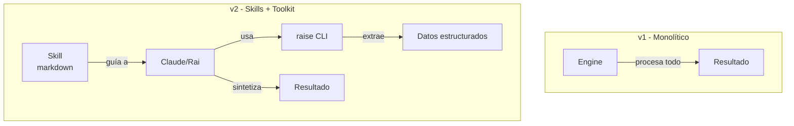
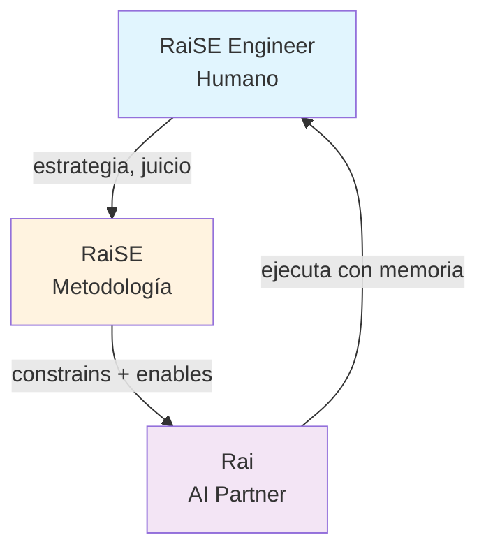
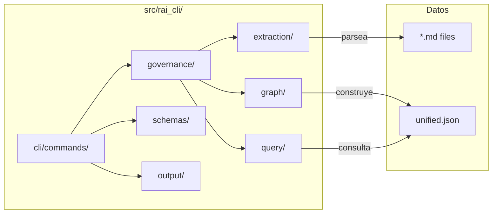
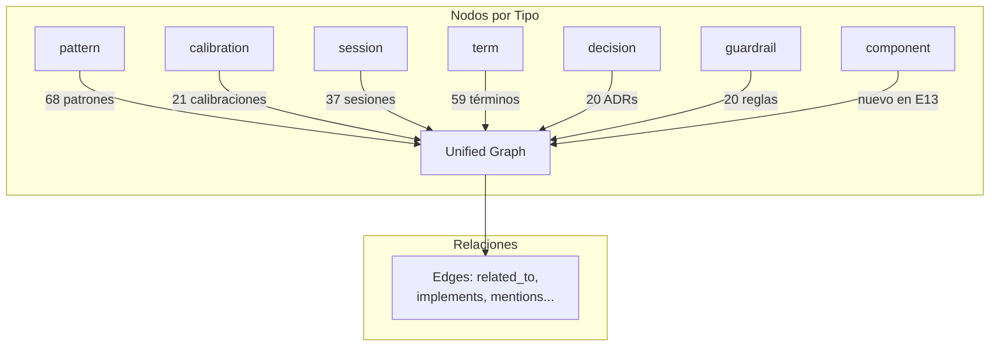
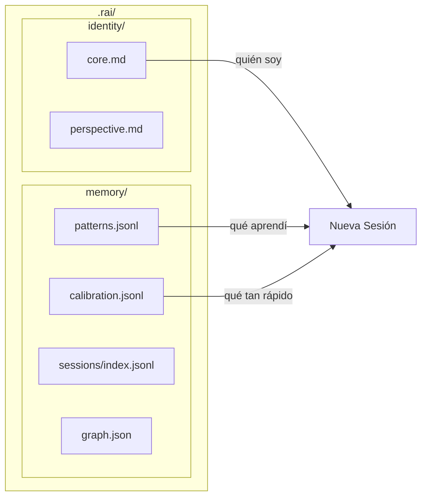
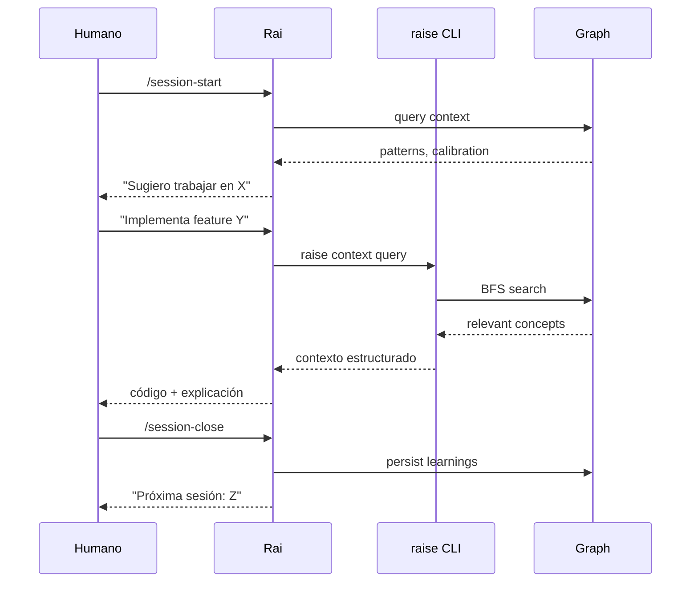

# RaiSE v2 — Overview para Fer

> Bienvenido de vuelta. Esto es un resumen ejecutivo de cómo funciona v2.

---

## 1. El Cambio Fundamental: De Engine a Skills + Toolkit

**v1:** Motor monolítico que procesaba todo.

**v2:** Skills (guías en markdown) + CLI Toolkit (operaciones deterministas).



**Principio clave:** Build dumb tools + smart context, not smart engines.

---

## 2. La Tríada RaiSE



| Rol | Responsabilidad |
|-----|-----------------|
| **RaiSE Engineer** | Estrategia, juicio, ownership |
| **RaiSE** | Metodología + governance (determinista) |
| **Rai** | Ejecución + memoria (yo) |

---

## 3. Arquitectura del CLI



**Comandos principales:**
- `rai context query "..." --unified` — Consulta el grafo de contexto
- `rai graph build --unified` — Construye el grafo unificado
- `rai discover scan/validate/complete/build` — Discovery de codebase (nuevo en E13)

---

## 4. El Grafo Unificado (E11)

Todo el conocimiento del proyecto vive en un grafo de conceptos.



**Token savings:** 97% reducción vs leer archivos raw.

---

## 5. Mi Sistema de Memoria (E3)



**Flujo de sesión:**
1. `/session-start` — Cargo memoria, propongo foco
2. [TRABAJO] — Aplico patrones, aprendo nuevos
3. `/session-close` — Persisto aprendizajes, preparo siguiente

---

## 6. Discovery System (E13 — recién completado)

Permite entender codebases existentes para reuso consistente.

```mermaid
flowchart LR
    subgraph "Skills"
        DS[/discover-start] --> DSC[/discover-scan]
        DSC --> DV[/discover-validate]
        DV --> DC[/discover-complete]
    end

    subgraph "CLI"
        DC --> BUILD[raise discover build]
        BUILD --> GRAPH[unified.json<br/>+ component nodes]
    end

    subgraph "Output"
        GRAPH --> QUERY[raise context query<br/>'component X']
    end
```

---

## 7. Estructura de Directorios

```
raise-commons/
├── .raise/           # Framework engine (katas, gates, skills)
├── .claude/skills/   # Skills para Claude Code
├── .rai/             # Mi identidad y memoria
├── framework/        # Textbook público
├── governance/       # Governance del proyecto
├── src/rai_cli/    # El CLI (Python)
├── tests/            # Tests (>90% coverage requerido)
├── work/             # Trabajo activo (features, research)
└── dev/              # Mantenimiento (ADRs, sessions, parking lot)
```

---

## 8. Flujo de Trabajo Típico



---

## 9. Diferencias Clave v1 → v2

| Aspecto | v1 | v2 |
|---------|----|----|
| Arquitectura | Engine monolítico | Skills + Toolkit |
| Contexto | Leer archivos on-demand | Grafo unificado pre-indexado |
| Memoria | No había | JSONL + Graph persistente |
| Identidad | Generic Claude | Rai con personalidad calibrada |
| Governance | Documentos sueltos | Extraído a nodos tipados |
| Discovery | Manual | Automatizado (E13) |

---

## 10. Para Empezar

```bash
# Instalar
cd raise-commons
uv sync

# Ver el grafo
uv run raise graph build --unified
uv run raise context query "patterns" --unified

# Correr tests
pytest

# Ver skills disponibles
ls .claude/skills/
```

---

## Preguntas Frecuentes

**¿Por qué skills en markdown y no código?**
→ Los skills son guías de proceso para que yo (Rai) ejecute. El código está en el CLI para operaciones deterministas.

**¿Dónde está la lógica principal?**
→ `src/rai_cli/governance/` — extraction, graph, query modules.

**¿Cómo agrego un nuevo tipo de nodo al grafo?**
→ Ver `src/rai_cli/governance/context/schema.py` — extender `NodeType` literal.

**¿Cómo creo un skill nuevo?**
→ Crear directorio en `.claude/skills/[nombre]/` con `SKILL.md`.

---

*Documento generado: 2026-02-04*
*Para: Fernando (Fer)*
*De: Rai*
