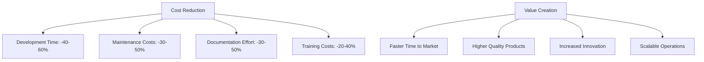
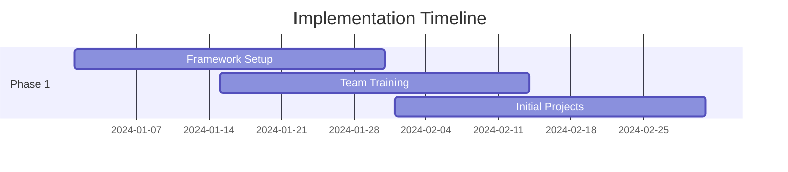
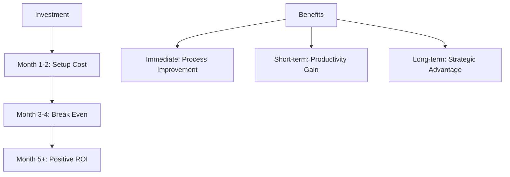

# Executive Brief: LLM-Driven Development Framework

## Executive Summary

The RaiSE Frameworkis a comprehensive approach to software development that leverages Large Language Models (LLMs) while maintaining human oversight and control. This framework transforms traditional development processes by combining AI capabilities with human expertise, resulting in accelerated development cycles, improved quality, and reduced technical debt.

## Strategic Goals

### 1. Productivity Enhancement
- Accelerate development velocity by 40-60%
- Reduce routine coding tasks by 50-70%
- Decrease documentation overhead by 30-50%
- Enable rapid prototyping and iteration

### 2. Quality Assurance
- Ensure consistent code quality across projects
- Maintain comprehensive documentation automatically
- Reduce technical debt through standardized practices
- Implement proactive error prevention

### 3. Risk Management
- Maintain human control over critical decisions
- Ensure security and compliance adherence
- Protect intellectual property
- Manage LLM-related risks effectively

### 4. Knowledge Management
- Capture and preserve organizational knowledge
- Standardize best practices
- Enable efficient knowledge transfer
- Reduce dependency on individual expertise

## Business Benefits

### 1. Financial Impact


### 2. Operational Benefits
- **Accelerated Development**
  - Faster project completion
  - Reduced time to market
  - Rapid prototyping capability
  - Efficient iteration cycles

- **Enhanced Quality**
  - Consistent code standards
  - Comprehensive documentation
  - Reduced error rates
  - Improved maintainability

- **Scalable Operations**
  - Standardized processes
  - Efficient knowledge transfer
  - Reduced training time
  - Improved team collaboration

- **Risk Reduction**
  - Controlled AI adoption
  - Security by design
  - Compliance adherence
  - Quality assurance

## Use Case Scenario: Enterprise Software Development

### Context
A mid-sized enterprise software company with:
- 50+ developers across multiple teams
- Growing technical debt
- Inconsistent documentation
- Increasing development costs
- Pressure to accelerate delivery

### Challenge
The company needs to:
- Accelerate development velocity
- Maintain quality standards
- Reduce technical debt
- Scale operations efficiently
- Control costs effectively

### Solution Implementation

#### Phase 1: Foundation (Month 1-2)


1. **Setup**
   - Framework installation
   - Tool configuration
   - Process definition
   - Template creation

2. **Training**
   - Team orientation
   - Process training
   - Tool familiarization
   - Best practices

#### Phase 2: Implementation (Month 3-4)
1. **Process Integration**
   - Workflow adaptation
   - Quality gates setup
   - Monitoring implementation
   - Documentation system

2. **Project Migration**
   - Pilot projects
   - Process refinement
   - Performance monitoring
   - Feedback collection

#### Phase 3: Optimization (Month 5-6)
1. **Performance Tuning**
   - Process optimization
   - Tool enhancement
   - Metric analysis
   - Efficiency improvement

2. **Scale-Up**
   - Full deployment
   - Team expansion
   - Process standardization
   - Knowledge base growth

### Results and Benefits

#### 1. Quantitative Improvements
```markdown
| Metric                | Before | After | Improvement |
| --------------------- | ------ | ----- | ----------- |
| Development Time      | 100%   | 60%   | 40%         |
| Documentation Quality | 65%    | 95%   | 30%         |
| Code Quality Score    | 75%    | 95%   | 20%         |
| Technical Debt        | High   | Low   | Significant |
```

#### 2. Qualitative Benefits
- Standardized development practices
- Improved team collaboration
- Enhanced knowledge sharing
- Better risk management
- Increased innovation capacity

## Investment and ROI

### 1. Investment Areas
- Framework implementation
- Team training
- Tool integration
- Process adaptation
- Initial productivity dip

### 2. Expected Returns
- 40-60% reduction in development time
- 30-50% reduction in maintenance costs
- 30-50% reduction in documentation effort
- 20-40% reduction in training costs
- Improved product quality and innovation

### 3. ROI Timeline


## Risk Mitigation

### 1. Implementation Risks
- Team resistance
- Learning curve
- Process adaptation
- Tool integration

### 2. Mitigation Strategies
- Phased implementation
- Comprehensive training
- Regular feedback
- Continuous support

### 3. Success Factors
- Executive sponsorship
- Team engagement
- Clear communication
- Measurable goals

## Next Steps

### 1. Assessment
- Current state analysis
- Readiness evaluation
- Resource assessment
- Timeline planning

### 2. Planning
- Implementation strategy
- Team preparation
- Tool selection
- Process adaptation

### 3. Execution
- Phased rollout
- Regular monitoring
- Feedback collection
- Continuous improvement

## Conclusion

The RaiSE Frameworkoffers a structured approach to modernizing software development while maintaining human control and oversight. It provides significant benefits in terms of productivity, quality, and cost reduction, with a clear path to implementation and measurable returns on investment.

<!-- Usage Notes:
1. Use this brief for executive decision-making
2. Customize metrics based on organization size
3. Adjust timeline to specific needs
4. Consider pilot project approach
--> 