# LLM-Driven Development Documentation Framework

## Overview

This comprehensive documentation framework provides a structured approach to LLM-driven development, covering everything from foundational concepts to advanced techniques. The framework is organized into five main parts, each addressing specific aspects of the development lifecycle.

## Framework Structure

```mermaid
graph TD
    A[Documentation Framework] --> B[Part 1: Foundations]
    A --> C[Part 2: Document Orchestration]
    A --> D[Part 3: Development Workflow]
    A --> E[Part 4: Advanced Topics]
    A --> F[Part 5: Tools & Techniques]
    
    B --> B1[Core Concepts]
    B --> B2[Process Overview]
    B --> B3[Best Practices]
    
    C --> C1[Solution Vision]
    C --> C2[Feature Prioritization]
    C --> C3[Architecture Documentation]
    C --> C4[Core Rules]
    C --> C5[Integration & Traceability]
    
    D --> D1[LLM Development]
    D --> D2[Testing & QA]
    D --> D3[Problem Resolution]
    D --> D4[Documentation Management]
    
    E --> E1[Prompt Engineering]
    E --> E2[Performance Optimization]
    E --> E3[Security & Compliance]
    E --> E4[Team Collaboration]
    
    F --> F1[Development Tools]
    F --> F2[Automation & CI/CD]
    F --> F3[Monitoring & Analytics]
    F --> F4[Troubleshooting & Support]
```

## Part 1: Foundations

### Core Concepts
- LLM-driven development principles
- Role of human orchestrators
- Document-driven development
- Quality and validation frameworks

### Process Overview
- Development lifecycle
- Document orchestration
- Quality gates
- Continuous improvement

### Best Practices
- Document management
- Version control
- Quality assurance
- Team collaboration

## Part 2: Document Orchestration

### Solution Vision Development
- Business context analysis
- Vision refinement
- MVP scope definition
- Success criteria establishment

### Feature Prioritization
- Value-effort analysis
- MVP feature selection
- Backlog organization
- Implementation planning

### Architecture Documentation
- System overview
- Component design
- Technical decisions
- Evolution management

### Core Rules Documentation
- Development standards
- Quality gates
- Testing requirements
- Security guidelines

### Integration and Traceability
- Document relationships
- Change impact analysis
- Version management
- Cross-reference documentation

## Part 3: Development Workflow

### LLM-Assisted Development
- Context preparation
- Prompt engineering
- Code implementation
- Review process

### Testing and Quality Assurance
- Test planning
- Test implementation
- Execution framework
- Results analysis

### Problem Resolution and Debugging
- Issue analysis
- Debug strategy
- Root cause analysis
- Solution implementation

### Documentation and Knowledge Management
- Documentation planning
- Content creation
- Knowledge organization
- Maintenance process

## Part 4: Advanced Topics

### Prompt Engineering and Optimization
- Prompt architecture
- Context engineering
- Output optimization
- Chain-of-thought prompting

### Performance Optimization and Scaling
- Response time optimization
- Token optimization
- Caching strategy
- Load management

### Security and Compliance
- Security architecture
- Data protection
- Compliance framework
- Risk management

### Team Collaboration and Process Integration
- Team structure
- Communication patterns
- Knowledge sharing
- Process integration

## Part 5: Tools and Techniques

### Development Tools and Environments
- IDE configuration
- LLM integration tools
- Version control
- Testing tools

### Automation and CI/CD Integration
- Process automation
- Pipeline configuration
- Quality automation
- Monitoring and alerts

### Monitoring and Analytics
- Performance monitoring
- Quality monitoring
- Usage analytics
- Data analysis

### Troubleshooting and Support
- Problem identification
- Diagnostic tools
- Resolution process
- Support tools

## Usage Guidelines

### Document Selection
1. Start with Solution Vision for new projects
2. Use Feature Prioritization for backlog management
3. Maintain Architecture Documentation for technical decisions
4. Follow Core Rules for development standards

### Process Integration
1. Incorporate into existing development workflows
2. Establish quality gates and checkpoints
3. Implement monitoring and analytics
4. Maintain documentation and knowledge base

### Best Practices
1. Regular document review and updates
2. Consistent use of templates
3. Continuous process improvement
4. Team training and support

### Quality Control
1. Document validation
2. Process adherence
3. Quality metrics tracking
4. Regular audits

## Templates and Tools

### Document Templates
- Solution Vision Template
- Feature Prioritization Matrix
- Architecture Documentation Template
- Core Rules Template

### Process Templates
- Development Workflow Guide
- Testing Strategy Template
- Problem Resolution Template
- Support Process Template

### Tool Integration
- Development environment setup
- CI/CD pipeline configuration
- Monitoring system setup
- Support tool configuration

## Maintenance and Evolution

### Regular Reviews
- Document currency
- Process effectiveness
- Tool efficiency
- Team feedback

### Updates and Improvements
- Template refinement
- Process optimization
- Tool enhancement
- Knowledge base expansion

### Version Control
- Document versioning
- Change tracking
- Archive management
- Access control

### Team Support
- Training programs
- Knowledge sharing
- Support channels
- Feedback collection

<!-- Usage Notes:
1. Start with Foundations for new teams
2. Use Document Orchestration for project setup
3. Follow Development Workflow for daily tasks
4. Refer to Advanced Topics as needed
5. Leverage Tools and Techniques for implementation
--> 