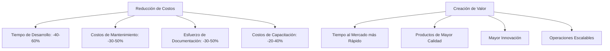
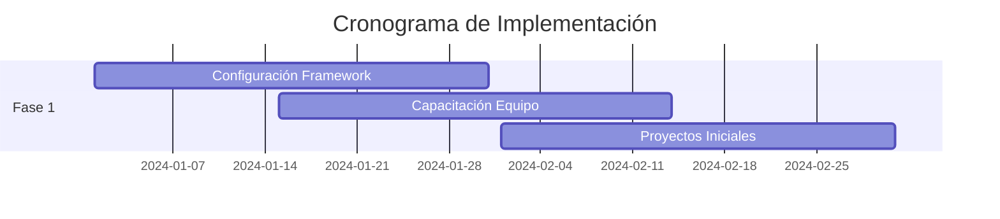
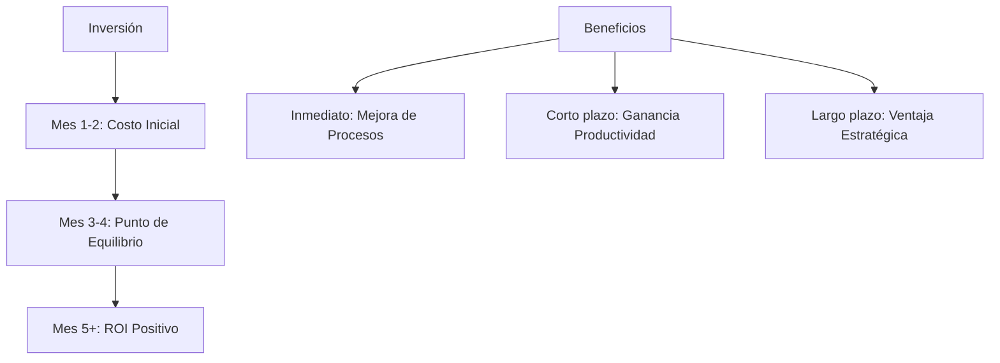

# Resumen Ejecutivo: Framework rAIse (Reliable AI Software Engineering)

## Resumen Ejecutivo

El Framework rAIse es un enfoque integral para el desarrollo de software que aprovecha los Modelos de Lenguaje Grande (LLMs) mientras mantiene la supervisión y el control humano. Este framework transforma los procesos de desarrollo tradicionales combinando las capacidades de la IA con la experiencia humana, resultando en ciclos de desarrollo acelerados, mejor calidad y reducción de la deuda técnica.

## Objetivos Estratégicos

### 1. Mejora de la Productividad
- Acelerar la velocidad de desarrollo en un 40-60%
- Reducir tareas rutinarias de codificación en un 50-70%
- Disminuir la sobrecarga de documentación en un 30-50%
- Habilitar prototipado e iteración rápida

### 2. Aseguramiento de la Calidad
- Asegurar calidad de código consistente en todos los proyectos
- Mantener documentación completa automáticamente
- Reducir deuda técnica mediante prácticas estandarizadas
- Implementar prevención proactiva de errores

### 3. Gestión de Riesgos
- Mantener control humano sobre decisiones críticas
- Asegurar cumplimiento de seguridad y normativas
- Proteger la propiedad intelectual
- Gestionar efectivamente los riesgos relacionados con LLM

### 4. Gestión del Conocimiento
- Capturar y preservar el conocimiento organizacional
- Estandarizar mejores prácticas
- Permitir transferencia eficiente de conocimiento
- Reducir dependencia de experiencia individual

## Beneficios Empresariales

### 1. Impacto Financiero


### 2. Beneficios Operativos
- **Desarrollo Acelerado**
  - Finalización más rápida de proyectos
  - Reducción del tiempo al mercado
  - Capacidad de prototipado rápido
  - Ciclos de iteración eficientes

- **Calidad Mejorada**
  - Estándares de código consistentes
  - Documentación completa
  - Tasas de error reducidas
  - Mejor mantenibilidad

- **Operaciones Escalables**
  - Procesos estandarizados
  - Transferencia eficiente de conocimiento
  - Tiempo de capacitación reducido
  - Mejor colaboración en equipo

- **Reducción de Riesgos**
  - Adopción controlada de IA
  - Seguridad por diseño
  - Cumplimiento normativo
  - Aseguramiento de calidad

## Caso de Uso: Desarrollo de Software Empresarial

### Contexto
Una empresa de software de tamaño medio con:
- 50+ desarrolladores en múltiples equipos
- Deuda técnica creciente
- Documentación inconsistente
- Costos de desarrollo en aumento
- Presión para acelerar la entrega

### Desafío
La empresa necesita:
- Acelerar la velocidad de desarrollo
- Mantener estándares de calidad
- Reducir deuda técnica
- Escalar operaciones eficientemente
- Controlar costos efectivamente

### Implementación de la Solución

#### Fase 1: Fundación (Mes 1-2)


1. **Configuración**
   - Instalación del framework
   - Configuración de herramientas
   - Definición de procesos
   - Creación de plantillas

2. **Capacitación**
   - Orientación del equipo
   - Capacitación en procesos
   - Familiarización con herramientas
   - Mejores prácticas

#### Fase 2: Implementación (Mes 3-4)
1. **Integración de Procesos**
   - Adaptación del flujo de trabajo
   - Configuración de puertas de calidad
   - Implementación de monitoreo
   - Sistema de documentación

2. **Migración de Proyectos**
   - Proyectos piloto
   - Refinamiento de procesos
   - Monitoreo de rendimiento
   - Recolección de feedback

#### Fase 3: Optimización (Mes 5-6)
1. **Ajuste de Rendimiento**
   - Optimización de procesos
   - Mejora de herramientas
   - Análisis de métricas
   - Mejora de eficiencia

2. **Escalamiento**
   - Despliegue completo
   - Expansión del equipo
   - Estandarización de procesos
   - Crecimiento de base de conocimiento

### Resultados y Beneficios

#### 1. Mejoras Cuantitativas
```markdown
| Métrica               | Antes | Después | Mejora  |
| --------------------- | ----- | ------- | ------- |
| Tiempo Desarrollo     | 100%  | 60%     | 40%     |
| Calidad Documentación | 65%   | 95%     | 30%     |
| Puntuación Calidad    | 75%   | 95%     | 20%     |
| Deuda Técnica         | Alta  | Baja    | Notable |
```

#### 2. Beneficios Cualitativos
- Prácticas de desarrollo estandarizadas
- Mejor colaboración en equipo
- Mejor compartición de conocimiento
- Mejor gestión de riesgos
- Mayor capacidad de innovación

## Inversión y ROI

### 1. Áreas de Inversión
- Implementación del framework
- Capacitación del equipo
- Integración de herramientas
- Adaptación de procesos
- Caída inicial de productividad

### 2. Retornos Esperados
- 40-60% reducción en tiempo de desarrollo
- 30-50% reducción en costos de mantenimiento
- 30-50% reducción en esfuerzo de documentación
- 20-40% reducción en costos de capacitación
- Mejor calidad de producto e innovación

### 3. Línea de Tiempo ROI


## Mitigación de Riesgos

### 1. Riesgos de Implementación
- Resistencia del equipo
- Curva de aprendizaje
- Adaptación de procesos
- Integración de herramientas

### 2. Estrategias de Mitigación
- Implementación por fases
- Capacitación integral
- Feedback regular
- Soporte continuo

### 3. Factores de Éxito
- Patrocinio ejecutivo
- Compromiso del equipo
- Comunicación clara
- Objetivos medibles

## Próximos Pasos

### 1. Evaluación
- Análisis del estado actual
- Evaluación de preparación
- Evaluación de recursos
- Planificación de cronograma

### 2. Planificación
- Estrategia de implementación
- Preparación del equipo
- Selección de herramientas
- Adaptación de procesos

### 3. Ejecución
- Despliegue por fases
- Monitoreo regular
- Recolección de feedback
- Mejora continua

## Conclusión

El Framework rAIse ofrece un enfoque estructurado para modernizar el desarrollo de software mientras mantiene el control y supervisión humana. Proporciona beneficios significativos en términos de productividad, calidad y reducción de costos, con un camino claro hacia la implementación y retornos de inversión medibles.

<!-- Notas de Uso:
1. Utilizar este resumen para toma de decisiones ejecutivas
2. Personalizar métricas según tamaño de organización
3. Ajustar cronograma a necesidades específicas
4. Considerar enfoque de proyecto piloto
--> 