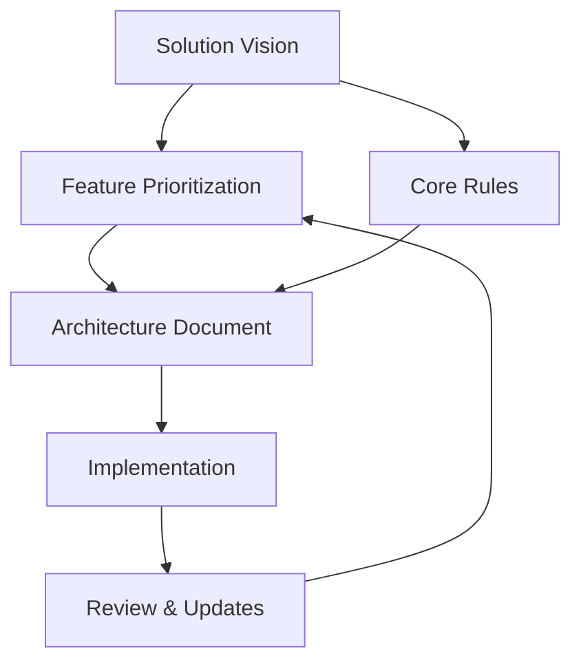
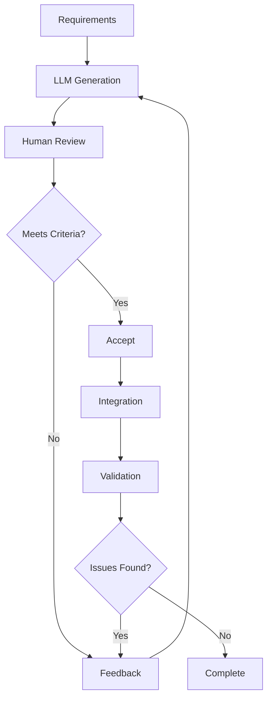
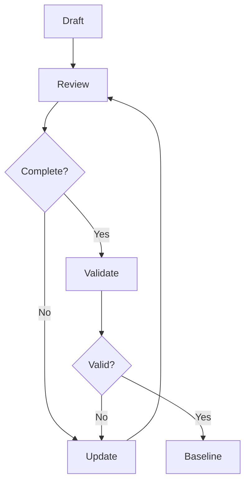

# Core Process Overview

## Document-Driven Development

### Philosophy
Document-Driven Development (DDD) in LLM-assisted development serves as both a communication framework and a quality assurance mechanism. It ensures:
- Clear direction for LLM outputs
- Consistent validation criteria
- Traceable decision making
- Maintainable codebase

### Document Hierarchy


### Document Lifecycle

1. **Creation Phase**
   - Template selection
   - Initial content
   - Stakeholder review
   - Baseline establishment

2. **Usage Phase**
   - Guide implementation
   - Reference for decisions
   - Validation criteria
   - Progress tracking

3. **Maintenance Phase**
   - Regular updates
   - Version control
   - Change tracking
   - Archive outdated versions

## Quality Gates and Validation Points

### Documentation Quality Gates

1. **Completeness Check**
   ```markdown
   # Documentation Checklist
   - [ ] All required sections filled
   - [ ] Clear success criteria defined
   - [ ] Dependencies documented
   - [ ] Constraints specified
   - [ ] Assumptions listed
   - [ ] Risks identified
   ```

2. **Content Validation**
   ```markdown
   # Validation Criteria
   - [ ] Aligns with business goals
   - [ ] Technical feasibility confirmed
   - [ ] Security requirements addressed
   - [ ] Performance criteria defined
   - [ ] Maintenance considerations included
   ```

3. **Consistency Check**
   ```markdown
   # Consistency Checklist
   - [ ] Terminology consistent
   - [ ] References accurate
   - [ ] Dependencies aligned
   - [ ] Version numbers correct
   - [ ] Links valid
   ```

### Implementation Quality Gates

1. **Code Generation**
   ```markdown
   # Code Quality Checklist
   - [ ] Meets style guidelines
   - [ ] Includes error handling
   - [ ] Security measures implemented
   - [ ] Performance optimized
   - [ ] Well documented
   ```

2. **Architecture Compliance**
   ```markdown
   # Architecture Checklist
   - [ ] Follows defined patterns
   - [ ] Respects constraints
   - [ ] Handles edge cases
   - [ ] Scales appropriately
   - [ ] Maintains isolation
   ```

3. **Security Validation**
   ```markdown
   # Security Checklist
   - [ ] Authentication proper
   - [ ] Authorization implemented
   - [ ] Data protection ensured
   - [ ] Logging appropriate
   - [ ] Error handling secure
   ```

## Feedback Loops

### Development Feedback Cycle


### Documentation Feedback Cycle


## Success Metrics

### Documentation Quality
1. **Completeness**
   - All sections filled
   - Clear requirements
   - Defined criteria
   - Tracked changes

2. **Accuracy**
   - Technical correctness
   - Business alignment
   - Current information
   - Valid references

3. **Usability**
   - Clear structure
   - Easy navigation
   - Consistent format
   - Accessible content

### Implementation Quality
1. **Code Quality**
   - Style compliance
   - Error handling
   - Performance
   - Security

2. **Architecture Quality**
   - Pattern compliance
   - Scalability
   - Maintainability
   - Security

3. **Process Quality**
   - Cycle time
   - First-time acceptance
   - Defect rate
   - Documentation coverage

## Process Evolution

### Continuous Improvement
1. **Measurement**
   - Track metrics
   - Gather feedback
   - Monitor trends
   - Identify patterns

2. **Analysis**
   - Review performance
   - Identify bottlenecks
   - Assess effectiveness
   - Compare alternatives

3. **Adjustment**
   - Update processes
   - Refine templates
   - Improve tools
   - Enhance training

### Knowledge Management
1. **Capture**
   - Document decisions
   - Record solutions
   - Track issues
   - Save patterns

2. **Organization**
   - Categorize information
   - Link related items
   - Maintain versions
   - Archive outdated

3. **Distribution**
   - Share learnings
   - Train team
   - Update docs
   - Communicate changes

## Best Practices

### Process Management
1. **Planning**
   - Set clear goals
   - Define steps
   - Allocate resources
   - Track progress

2. **Execution**
   - Follow process
   - Document work
   - Validate results
   - Handle issues

3. **Review**
   - Check quality
   - Verify compliance
   - Assess results
   - Plan improvements

### Team Collaboration
1. **Communication**
   - Clear channels
   - Regular updates
   - Documented decisions
   - Shared understanding

2. **Coordination**
   - Defined roles
   - Clear responsibilities
   - Tracked dependencies
   - Managed handoffs

3. **Learning**
   - Share knowledge
   - Document lessons
   - Update processes
   - Train team

<!-- Usage Notes:
1. Use as reference for process implementation
2. Adapt to team needs
3. Update based on experience
4. Share improvements
--> 