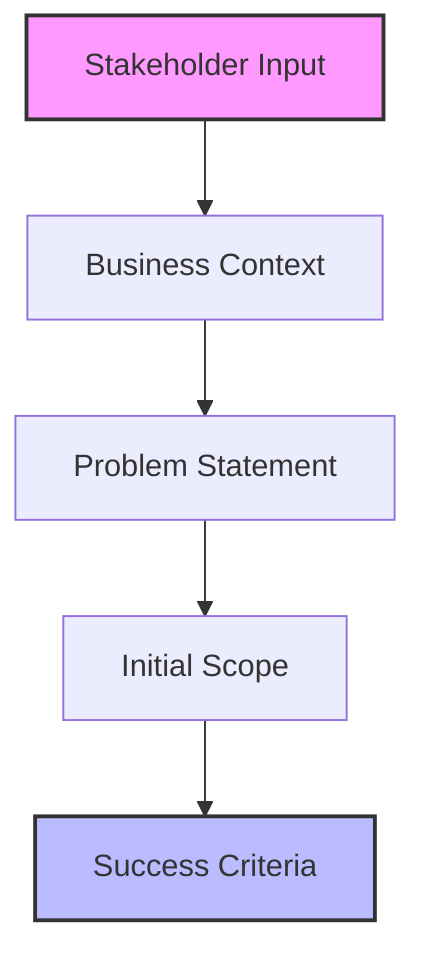
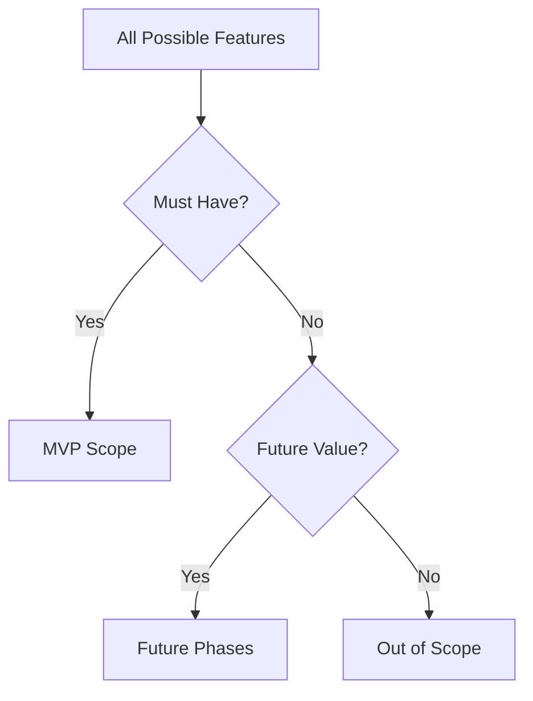
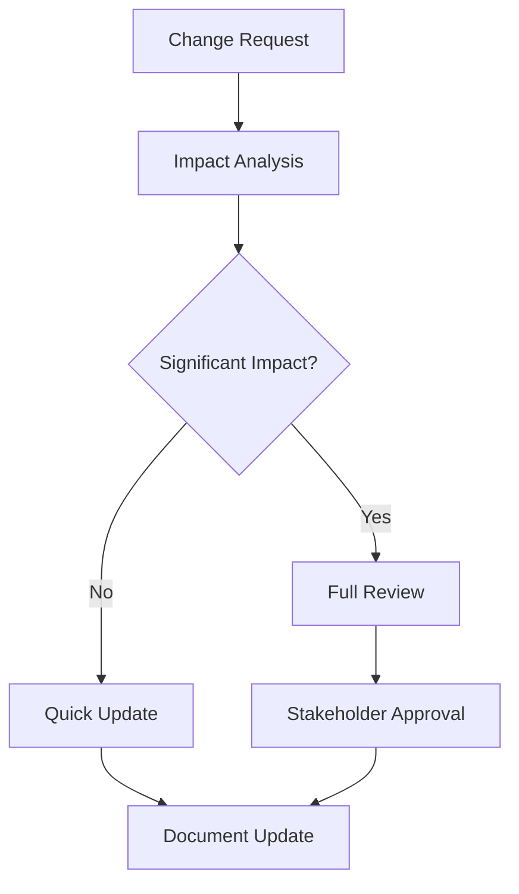

# Solution Vision Development Guide

## Overview

The Solution Vision document serves as the foundational reference for all development activities. This guide explains how to effectively work with LLMs to create, validate, and maintain this crucial document.

## Document Creation Process

### 1. Requirement Gathering


#### Effective LLM Prompting
```markdown
# Context Extraction Prompt
Please analyze the following stakeholder input and help structure it into:
1. Core problem statement
2. Key stakeholders and their needs
3. Success criteria
4. Initial scope boundaries

Input:
[Stakeholder Input]

Expected Output Format:
- Problem Statement: [Clear, concise problem definition]
- Stakeholders:
  - [Stakeholder 1]: [Needs/Pain Points]
  - [Stakeholder 2]: [Needs/Pain Points]
- Success Criteria:
  - [Measurable Criterion 1]
  - [Measurable Criterion 2]
- Scope Boundaries:
  - Must Have: [Core Features]
  - Out of Scope: [Excluded Features]
```

### 2. Vision Refinement

#### Strategic Alignment Check
```markdown
# Alignment Validation Checklist
- [ ] Business goals clearly mapped
- [ ] Success metrics are measurable
- [ ] Stakeholder needs addressed
- [ ] Technical constraints considered
- [ ] Resource limitations acknowledged
```

#### Vision Statement Development
```markdown
# Vision Statement Template
For [target users],
Who need [key benefit],
The [solution name] is a [solution category]
That provides [key features/capabilities].
Unlike [current alternatives],
Our solution [key differentiators].
```

### 3. MVP Scope Definition

#### Scope Boundary Exercise


#### LLM-Assisted Scope Analysis
```markdown
# Scope Analysis Prompt
Given the following feature list, help categorize each item into:
1. Must Have (MVP)
2. Nice to Have (Future)
3. Out of Scope

For each feature, provide:
- Category
- Rationale
- Dependencies
- Risk Level

Features:
[Feature List]
```

## Validation Process

### 1. Content Validation

#### Completeness Check
```markdown
# Solution Vision Completeness Checklist
- [ ] Problem statement is clear and specific
- [ ] All stakeholders identified
- [ ] Success criteria are measurable
- [ ] MVP scope is defined
- [ ] Constraints are documented
- [ ] Assumptions are listed
```

#### Quality Assessment
```markdown
# Quality Criteria
- [ ] Business value clearly articulated
- [ ] Technical feasibility confirmed
- [ ] Resource requirements identified
- [ ] Timeline expectations set
- [ ] Risks documented
```

### 2. Stakeholder Validation

#### Review Process
1. **Initial Review**
   - Technical feasibility
   - Business alignment
   - Resource requirements
   - Timeline viability

2. **Stakeholder Feedback**
   - Capture concerns
   - Document suggestions
   - Update requirements
   - Adjust scope

3. **Final Validation**
   - Confirm changes
   - Get approvals
   - Baseline document
   - Communicate updates

## Maintenance Guidelines

### 1. Regular Reviews

#### Review Schedule
- Sprint Planning: Quick alignment check
- Monthly: Detailed review
- Quarterly: Strategic review
- Ad-hoc: When major changes occur

#### Review Focus Areas
```markdown
# Review Checklist
- [ ] Business goals still aligned
- [ ] Success criteria still valid
- [ ] MVP scope appropriate
- [ ] Assumptions still valid
- [ ] Risks still accurate
```

### 2. Change Management

#### Change Process


#### Documentation Updates
```markdown
# Change Log Entry Template
Date: [YYYY-MM-DD]
Type: [Scope|Criteria|Constraint|Other]
Change: [Description]
Rationale: [Justification]
Impact: [Affected Areas]
Approved By: [Stakeholder]
```

## Best Practices

### 1. LLM Interaction

#### Effective Prompting
- Provide complete context
- Use structured formats
- Request specific outputs
- Validate assumptions

#### Output Validation
- Cross-reference with stakeholders
- Verify technical feasibility
- Check business alignment
- Confirm completeness

### 2. Document Management

#### Version Control
- Use semantic versioning
- Track major changes
- Maintain change log
- Archive old versions

#### Accessibility
- Central repository
- Clear naming
- Easy navigation
- Regular backups

## Common Pitfalls

### 1. Vision Development
- Unclear problem statement
- Unmeasurable criteria
- Scope creep
- Missing stakeholders

### 2. Document Maintenance
- Outdated information
- Inconsistent updates
- Poor version control
- Lost context

## Templates and Examples

### 1. Problem Statement Template
```markdown
[Stakeholder group] needs [capability]
because [problem/opportunity].
The impact of this problem is [quantified impact].
```

### 2. Success Criteria Template
```markdown
Business Metrics:
- [Metric 1]: [Target] by [Date]
- [Metric 2]: [Target] by [Date]

User Metrics:
- [Metric 1]: [Target] by [Date]
- [Metric 2]: [Target] by [Date]
```

<!-- Usage Notes:
1. Adapt templates to project needs
2. Maintain consistent documentation
3. Regular stakeholder engagement
4. Continuous validation
--> 