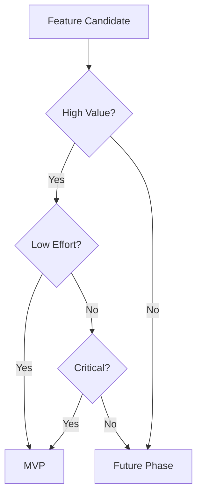
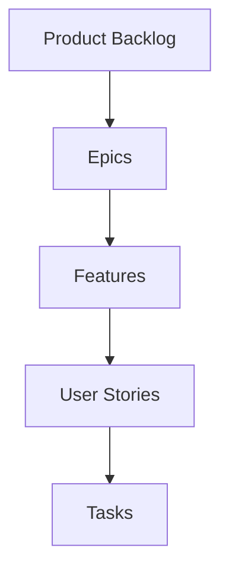
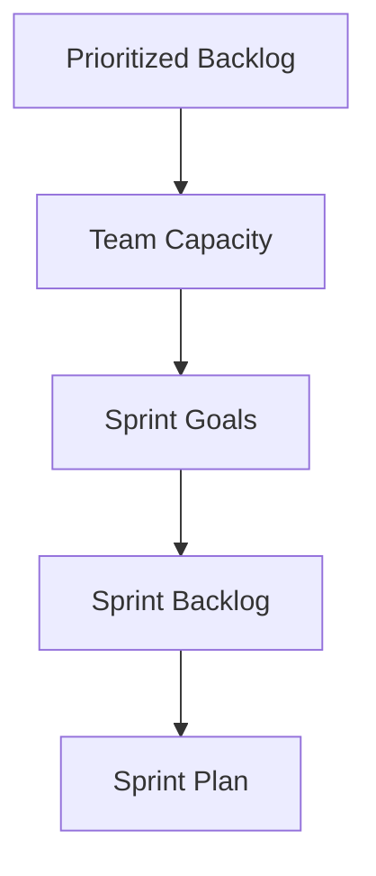

# Feature Prioritization Guide

## Overview

Feature prioritization is crucial for maintaining focus and delivering value incrementally. This guide explains how to effectively use LLMs to assist in feature analysis, prioritization, and backlog management.

## Prioritization Framework

### 1. Value-Effort Analysis

#### Scoring Matrix
```markdown
# Impact Scoring (1-5)
1: Minimal impact on business/users
3: Moderate impact, clear benefits
5: Critical impact, significant value

# Effort Scoring (1-5)
1: Simple implementation, minimal risk
3: Moderate complexity, manageable risk
5: High complexity, significant risk

Priority Score = Impact / Effort
```

#### LLM-Assisted Scoring
```markdown
# Feature Analysis Prompt
For each feature, please analyze and provide:

1. Impact Score (1-5)
   - Business value
   - User value
   - Strategic alignment
   - Risk reduction

2. Effort Score (1-5)
   - Technical complexity
   - Integration points
   - Testing requirements
   - Operational impact

3. Dependencies
   - Technical prerequisites
   - Business dependencies
   - External factors

4. Implementation Risks
   - Technical risks
   - Business risks
   - Operational risks

Feature: [Feature Description]
```

### 2. MVP Feature Selection

#### Selection Criteria


#### Validation Checklist
```markdown
# MVP Feature Validation
- [ ] Addresses core problem
- [ ] Delivers clear value
- [ ] Technically feasible
- [ ] Fits resource constraints
- [ ] Manageable risk level
```

## Backlog Organization

### 1. Structure

#### Hierarchy


#### LLM-Assisted Breakdown
```markdown
# Story Breakdown Prompt
For the following feature, please help break it down into:
1. User stories (As a... I want... So that...)
2. Acceptance criteria
3. Technical tasks
4. Dependencies

Feature: [Feature Description]
Epic: [Epic Name]

Expected Format:
## User Stories
1. Story 1
   - Acceptance Criteria
   - Tasks
   - Dependencies

2. Story 2
   ...
```

### 2. Prioritization Maintenance

#### Regular Review Process
1. **Weekly Triage**
   - New items assessment
   - Priority adjustments
   - Dependency updates
   - Risk reassessment

2. **Sprint Planning**
   - Capacity planning
   - Story point estimation
   - Sprint goal alignment
   - Dependency check

3. **Backlog Refinement**
   - Story breakdown
   - Acceptance criteria
   - Technical discussion
   - Estimation validation

## Implementation Planning

### 1. Sprint Planning

#### Planning Process


#### Sprint Goal Template
```markdown
# Sprint Goal Definition
Sprint: [Number]
Dates: [Start] to [End]

Primary Goal:
[Clear, achievable objective]

Success Criteria:
1. [Criterion 1]
2. [Criterion 2]

Key Deliverables:
1. [Deliverable 1]
2. [Deliverable 2]

Dependencies:
- [Internal/External dependencies]

Risks:
- [Identified risks and mitigation]
```

### 2. Progress Tracking

#### Metrics Dashboard
```markdown
# Sprint Metrics
- Velocity: [Points/Sprint]
- Completion Rate: [%]
- Quality Metrics: [Defects/Story]
- Technical Debt: [Hours]
```

#### Status Reporting
```markdown
# Daily Status Template
Date: [YYYY-MM-DD]

Progress:
- [Completed items]
- [In-progress items]

Blockers:
- [Current blockers]

Risks:
- [New/Updated risks]

Next Steps:
- [Planned actions]
```

## Best Practices

### 1. Feature Analysis

#### Value Assessment
- Clear business impact
- Measurable outcomes
- User value focus
- Strategic alignment

#### Effort Estimation
- Technical complexity
- Resource requirements
- Timeline constraints
- Risk factors

### 2. Backlog Management

#### Organization
- Clear hierarchy
- Consistent format
- Updated priorities
- Tracked dependencies

#### Maintenance
- Regular reviews
- Priority updates
- Dependency checks
- Risk assessments

## Common Pitfalls

### 1. Prioritization Issues
- Subjective scoring
- Missing dependencies
- Unclear criteria
- Scope creep

### 2. Backlog Problems
- Too detailed too early
- Outdated items
- Missing context
- Poor organization

## Templates and Tools

### 1. Feature Template
```markdown
# Feature Description
Title: [Feature Name]
Epic: [Epic Name]
Priority: [Score]

Business Value:
[Clear value proposition]

User Value:
[User benefit description]

Technical Considerations:
- [Architecture impact]
- [Integration points]
- [Performance requirements]

Dependencies:
- [List of dependencies]

Risks:
- [Identified risks]
```

### 2. Story Template
```markdown
# User Story
As a [user type]
I want [capability]
So that [benefit]

Acceptance Criteria:
1. [Criterion 1]
2. [Criterion 2]

Technical Notes:
- [Implementation details]
- [Technical constraints]

Dependencies:
- [Required stories/features]
```

<!-- Usage Notes:
1. Regular priority reviews
2. Keep backlog lean
3. Focus on value delivery
4. Maintain clear documentation
--> 