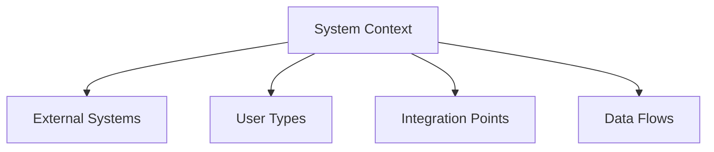
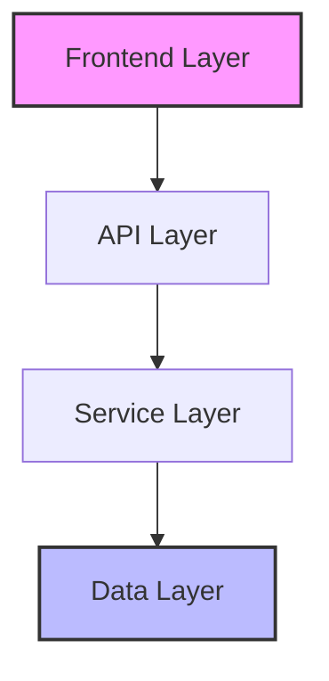
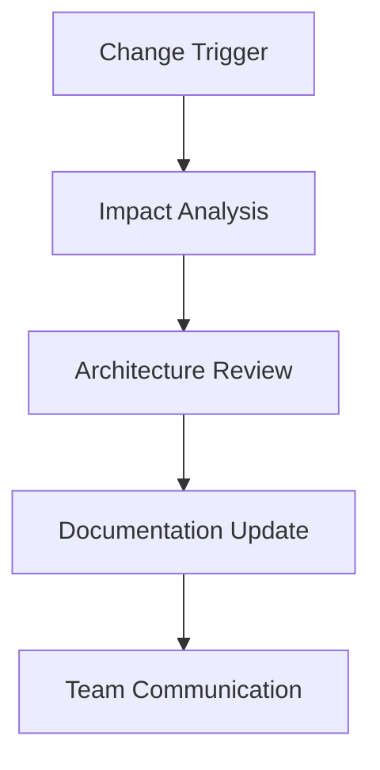

# Architecture Documentation Guide

## Overview

Architecture documentation captures the system's technical foundation, design decisions, and evolution. This guide explains how to effectively use LLMs to create, validate, and maintain comprehensive architecture documentation.

## Document Structure

### 1. System Overview

#### Context Diagram


#### LLM-Assisted Context Analysis
```markdown
# Context Analysis Prompt
Please analyze the system requirements and help identify:

1. System Boundaries
   - Core functionality
   - External interfaces
   - User interactions
   - Data boundaries

2. Integration Points
   - External systems
   - APIs
   - Data flows
   - Authentication points

3. Key Constraints
   - Technical limitations
   - Business rules
   - Compliance requirements
   - Performance needs

System Description:
[System Description]
```

### 2. Core Architecture Components

#### Component Diagram Template


#### Component Documentation
```markdown
# Component Template
Name: [Component Name]
Type: [Service/API/UI/etc.]
Purpose: [Primary responsibility]

Interfaces:
- Input: [Input interfaces]
- Output: [Output interfaces]

Dependencies:
- Required: [Must-have dependencies]
- Optional: [Nice-to-have dependencies]

Constraints:
- Performance: [Performance requirements]
- Security: [Security requirements]
- Scalability: [Scaling needs]
```

### 3. Technical Decisions

#### Decision Record Template
```markdown
# Architecture Decision Record (ADR)
## Title: [Decision Title]

### Status
[Proposed/Accepted/Deprecated/Superseded]

### Context
[What is the issue that we're seeing that is motivating this decision or change?]

### Decision
[What is the change that we're proposing and/or doing?]

### Consequences
[What becomes easier or more difficult to do because of this change?]

### Alternatives Considered
[What other approaches did we consider?]

### Validation
[How will we know if this decision is successful?]
```

#### LLM-Assisted Decision Analysis
```markdown
# Decision Analysis Prompt
For the following architectural decision, please analyze:

1. Impact Assessment
   - Technical impact
   - Performance impact
   - Security implications
   - Maintenance considerations

2. Risk Analysis
   - Implementation risks
   - Operational risks
   - Migration risks
   - Mitigation strategies

3. Alternative Comparison
   - Pros and cons
   - Cost analysis
   - Implementation effort
   - Long-term implications

Decision Context:
[Decision Description]
```

## Documentation Process

### 1. Initial Documentation

#### Architecture Canvas
```markdown
# Architecture Canvas
## System Purpose
[Core system objectives]

## Key Requirements
- Functional: [Key functional requirements]
- Non-functional: [Key non-functional requirements]

## Technical Stack
- Frontend: [Frontend technologies]
- Backend: [Backend technologies]
- Data: [Data technologies]
- Infrastructure: [Infrastructure components]

## Key Patterns
- [Architectural patterns used]
- [Design patterns employed]

## Integration Points
- [External system integrations]
- [API dependencies]
```

#### Validation Checklist
```markdown
# Architecture Documentation Checklist
- [ ] System context defined
- [ ] Components identified
- [ ] Interfaces documented
- [ ] Patterns described
- [ ] Constraints listed
- [ ] Decisions recorded
```

### 2. Evolution Management

#### Change Process


#### Version Control
```markdown
# Version History Template
Version: [Semantic Version]
Date: [YYYY-MM-DD]
Author: [Name]

Changes:
- [Major changes]
- [Minor changes]
- [Patches]

Impact:
- [Affected components]
- [Required updates]
- [Migration needs]
```

## Best Practices

### 1. Documentation Quality

#### Clarity Guidelines
- Use consistent terminology
- Provide clear diagrams
- Include examples
- Explain rationale

#### Completeness Checks
- All components covered
- Interfaces documented
- Decisions recorded
- Constraints listed

### 2. Maintenance Strategy

#### Regular Reviews
- Monthly architecture review
- Quarterly alignment check
- Impact assessment
- Update planning

#### Update Triggers
- New requirements
- Technical changes
- Performance issues
- Security concerns

## Common Challenges

### 1. Documentation Issues
- Outdated information
- Missing context
- Unclear decisions
- Incomplete coverage

### 2. Process Problems
- Inconsistent updates
- Poor communication
- Missing validation
- Lost knowledge

## Templates and Examples

### 1. Component Template
```markdown
# Component Documentation
## Overview
Name: [Component Name]
Purpose: [Component Purpose]
Owner: [Team/Individual]

## Technical Details
- Technology: [Tech Stack]
- Dependencies: [Dependencies]
- Interfaces: [APIs/Events]

## Operational Aspects
- Scaling: [Scaling Strategy]
- Monitoring: [Monitoring Approach]
- Recovery: [Recovery Process]
```

### 2. Interface Template
```markdown
# Interface Specification
## API Details
Name: [API Name]
Version: [Version]
Protocol: [Protocol]

## Endpoints
### [Endpoint 1]
- Method: [HTTP Method]
- Path: [URL Path]
- Request: [Request Format]
- Response: [Response Format]
- Error Handling: [Error Scenarios]
```

<!-- Usage Notes:
1. Keep documentation current
2. Validate with stakeholders
3. Review regularly
4. Update proactively
--> 