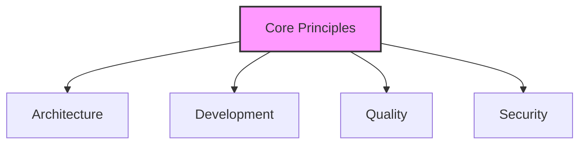
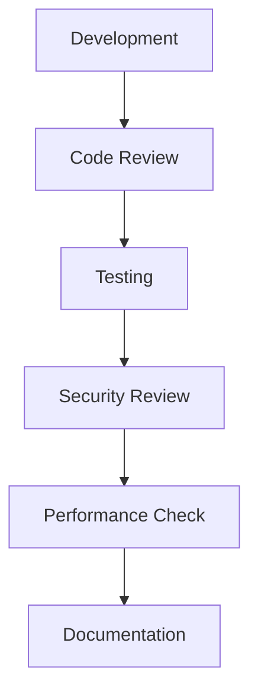
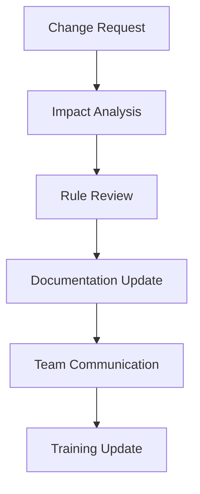

# Core Rules Documentation Guide

## Overview

Core Rules documentation establishes the foundational principles, standards, and practices for development. This guide explains how to effectively use LLMs to create, validate, and maintain core rules documentation that ensures consistency and quality.

## Document Structure

### 1. Principles and Standards

#### Core Principles Framework


#### LLM-Assisted Principles Analysis
```markdown
# Principles Analysis Prompt
Please analyze our development context and help establish:

1. Core Principles
   - Architectural principles
   - Development standards
   - Quality requirements
   - Security guidelines

2. Implementation Guidelines
   - Best practices
   - Common patterns
   - Anti-patterns
   - Edge cases

3. Validation Criteria
   - Success metrics
   - Quality gates
   - Review points
   - Compliance checks

Context:
[Development Context]
```

### 2. Development Standards

#### Code Standards Template
```markdown
# Code Standards
## Naming Conventions
- Files: [Convention]
- Classes: [Convention]
- Functions: [Convention]
- Variables: [Convention]

## Structure Guidelines
- File organization
- Module patterns
- Component structure
- Test organization

## Quality Requirements
- Code coverage
- Performance metrics
- Security checks
- Documentation needs
```

#### LLM-Assisted Standards Development
```markdown
# Standards Development Prompt
For the following development area, please help define:

1. Standard Practices
   - Coding conventions
   - Documentation requirements
   - Testing approaches
   - Review processes

2. Quality Metrics
   - Performance benchmarks
   - Quality thresholds
   - Coverage requirements
   - Error tolerances

3. Validation Methods
   - Review procedures
   - Testing strategies
   - Monitoring approaches
   - Feedback loops

Area: [Development Area]
```

### 3. Quality Gates

#### Quality Gates Framework


#### Gate Definitions
```markdown
# Quality Gate Template
## Gate: [Gate Name]

### Purpose
[Gate objective]

### Entry Criteria
- [Criterion 1]
- [Criterion 2]

### Exit Criteria
- [Criterion 1]
- [Criterion 2]

### Validation Process
1. [Step 1]
2. [Step 2]

### Responsible Roles
- [Role 1]: [Responsibilities]
- [Role 2]: [Responsibilities]
```

## Documentation Process

### 1. Initial Setup

#### Rules Framework
```markdown
# Rules Framework Template
## Domain: [Domain Name]

### Principles
1. [Principle 1]
   - Rationale
   - Implementation
   - Validation

2. [Principle 2]
   - Rationale
   - Implementation
   - Validation

### Standards
1. [Standard 1]
   - Requirements
   - Guidelines
   - Validation

2. [Standard 2]
   - Requirements
   - Guidelines
   - Validation
```

#### Validation Checklist
```markdown
# Rules Documentation Checklist
- [ ] Principles defined
- [ ] Standards established
- [ ] Guidelines documented
- [ ] Examples provided
- [ ] Validation criteria set
- [ ] Review process defined
```

### 2. Maintenance Process

#### Update Workflow


#### Version Management
```markdown
# Version Control Template
Version: [Semantic Version]
Date: [YYYY-MM-DD]
Author: [Name]

Updates:
- [Rule changes]
- [Standard updates]
- [Guideline modifications]

Impact:
- [Affected areas]
- [Required actions]
- [Training needs]
```

## Best Practices

### 1. Rule Development

#### Clarity Guidelines
- Clear rationale
- Specific examples
- Implementation guides
- Validation methods

#### Effectiveness Checks
- Measurable impact
- Practical application
- Team adoption
- Continuous feedback

### 2. Documentation Management

#### Organization
- Logical structure
- Clear hierarchy
- Cross-references
- Version control

#### Accessibility
- Easy navigation
- Search capability
- Quick reference
- Training materials

## Common Challenges

### 1. Rule Definition
- Unclear requirements
- Conflicting standards
- Implementation gaps
- Validation issues

### 2. Adoption Problems
- Resistance to change
- Incomplete understanding
- Inconsistent application
- Poor communication

## Templates and Examples

### 1. Principle Template
```markdown
# Principle Documentation
## Overview
Name: [Principle Name]
Scope: [Application Scope]
Owner: [Team/Individual]

## Details
### Rationale
[Why this principle exists]

### Guidelines
- [Guideline 1]
- [Guideline 2]

### Implementation
- [Implementation approach]
- [Best practices]
- [Common pitfalls]

### Validation
- [Validation methods]
- [Success criteria]
- [Review process]
```

### 2. Standard Template
```markdown
# Standard Specification
## Overview
Area: [Technical Area]
Level: [Required/Recommended]
Scope: [Application Scope]

## Requirements
### Technical Requirements
- [Requirement 1]
- [Requirement 2]

### Quality Requirements
- [Quality metric 1]
- [Quality metric 2]

### Validation
- [Validation process]
- [Review checklist]
- [Testing requirements]
```

<!-- Usage Notes:
1. Regular rule reviews
2. Continuous improvement
3. Team feedback integration
4. Training updates
--> 