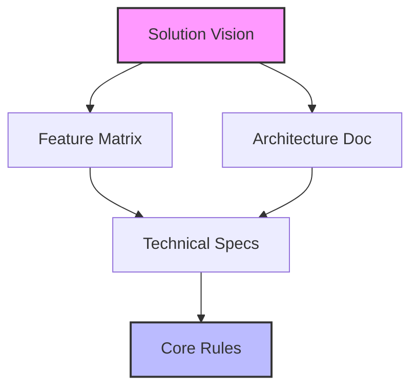
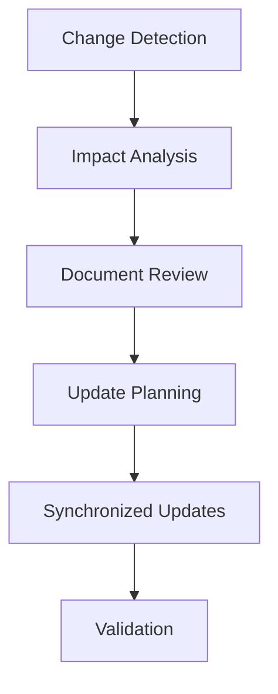

# Document Integration and Traceability Guide

## Overview

Document integration and traceability ensure that all documentation works together cohesively while maintaining clear relationships between different artifacts. This guide explains how to effectively use LLMs to maintain document relationships and ensure consistency across the documentation ecosystem.

## Integration Framework

### 1. Document Relationships

#### Relationship Map


#### LLM-Assisted Relationship Analysis
```markdown
# Relationship Analysis Prompt
Please analyze the following documents and identify:

1. Direct Dependencies
   - Parent documents
   - Child documents
   - Peer documents
   - Reference documents

2. Impact Relationships
   - Changes that affect other docs
   - Required synchronization
   - Version dependencies
   - Update triggers

3. Validation Requirements
   - Cross-document checks
   - Consistency rules
   - Update procedures
   - Review processes

Documents:
[Document List]
```

### 2. Traceability Matrix

#### Matrix Template
```markdown
# Traceability Matrix
## Business Requirements
| Requirement ID | Vision Ref | Feature Ref | Arch Ref | Rules Ref |
| -------------- | ---------- | ----------- | -------- | --------- |
| REQ-001        | VS-1.2     | FT-3.4      | AR-2.1   | CR-1.5    |
| REQ-002        | VS-2.1     | FT-1.2      | AR-3.4   | CR-2.3    |

## Technical Requirements
| Requirement ID | Arch Ref | Feature Ref | Rules Ref | Test Ref |
| -------------- | -------- | ----------- | --------- | -------- |
| TECH-001       | AR-1.1   | FT-2.3      | CR-3.2    | TS-1.4   |
| TECH-002       | AR-2.3   | FT-4.1      | CR-1.7    | TS-2.2   |
```

#### LLM-Assisted Traceability
```markdown
# Traceability Analysis Prompt
For the following requirement, please help establish:

1. Document References
   - Vision alignment
   - Feature coverage
   - Architecture impact
   - Rule compliance

2. Implementation Traces
   - Technical specifications
   - Design decisions
   - Test coverage
   - Validation points

3. Change Impact
   - Affected documents
   - Required updates
   - Validation needs
   - Communication plan

Requirement:
[Requirement Description]
```

## Integration Process

### 1. Document Synchronization

#### Sync Workflow


#### Sync Checklist
```markdown
# Synchronization Checklist
- [ ] Change impact assessed
- [ ] Affected docs identified
- [ ] Updates planned
- [ ] Changes synchronized
- [ ] Cross-references updated
- [ ] Consistency validated
```

### 2. Version Control

#### Version Strategy
```markdown
# Version Control Guidelines
## Major Version Changes
- Significant structural changes
- Breaking changes
- Major requirement updates
- Architecture changes

## Minor Version Updates
- Feature additions
- Non-breaking changes
- Documentation expansion
- Rule refinements

## Patch Updates
- Error corrections
- Clarifications
- Minor improvements
- Reference updates
```

#### Change Log Template
```markdown
# Change Log Entry
Version: [Semantic Version]
Date: [YYYY-MM-DD]
Author: [Name]

## Changes
### Document Updates
- [Document 1]: [Changes]
- [Document 2]: [Changes]

### Cross-References
- [Updated references]
- [New connections]
- [Removed links]

### Validation
- [Consistency checks]
- [Review results]
- [Outstanding items]
```

## Best Practices

### 1. Integration Management

#### Consistency Guidelines
- Use consistent terminology
- Maintain clear references
- Update related documents
- Validate cross-references

#### Review Process
- Regular consistency checks
- Cross-document validation
- Reference verification
- Impact assessment

### 2. Traceability Management

#### Trace Maintenance
- Keep links current
- Update relationships
- Document dependencies
- Track changes

#### Impact Analysis
- Assess change impact
- Plan updates
- Coordinate changes
- Validate results

## Common Challenges

### 1. Integration Issues
- Inconsistent terminology
- Broken references
- Missing links
- Outdated relationships

### 2. Traceability Problems
- Lost connections
- Incomplete traces
- Complex dependencies
- Update coordination

## Templates and Tools

### 1. Reference Template
```markdown
# Cross-Reference Documentation
## Document Information
Source: [Document Name]
Version: [Version]
Last Updated: [Date]

## References
### Outgoing References
- [Reference 1]: [Target Document]
- [Reference 2]: [Target Document]

### Incoming References
- [Reference 1]: [Source Document]
- [Reference 2]: [Source Document]

## Dependencies
### Required Documents
- [Document 1]: [Purpose]
- [Document 2]: [Purpose]

### Related Documents
- [Document 1]: [Relationship]
- [Document 2]: [Relationship]
```

### 2. Impact Analysis Template
```markdown
# Change Impact Analysis
## Change Description
Type: [Change Type]
Scope: [Affected Areas]
Priority: [Priority Level]

## Document Impact
### Direct Impact
- [Document 1]: [Required Changes]
- [Document 2]: [Required Changes]

### Indirect Impact
- [Document 1]: [Potential Effects]
- [Document 2]: [Potential Effects]

## Action Plan
### Updates Required
1. [Update 1]
2. [Update 2]

### Validation Steps
1. [Step 1]
2. [Step 2]
```

<!-- Usage Notes:
1. Regular integration reviews
2. Maintain traceability
3. Coordinate updates
4. Validate consistency
--> 