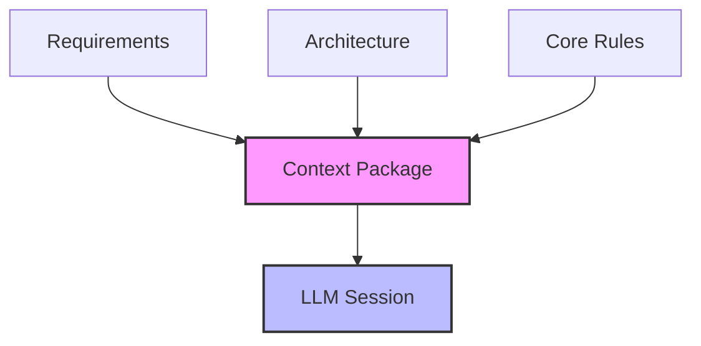
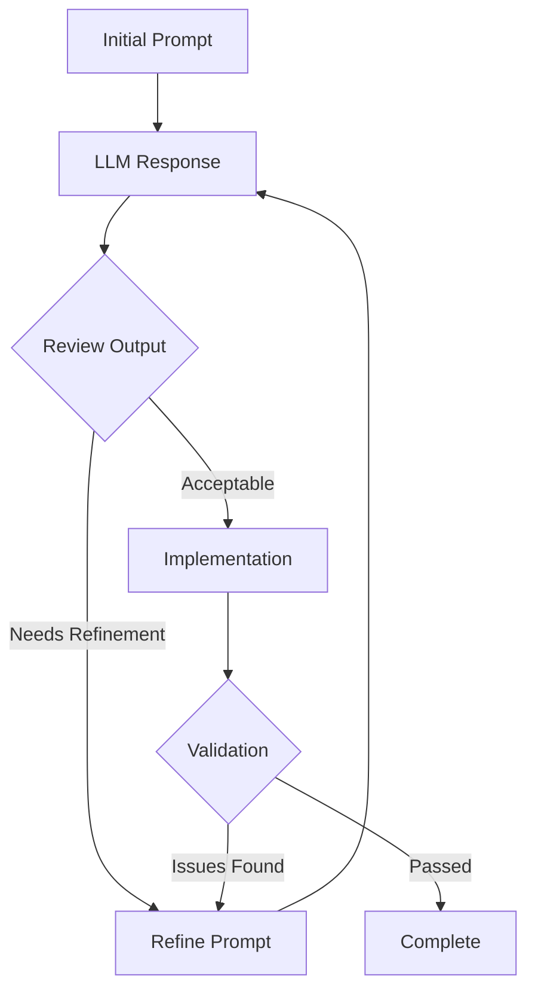

# LLM-Assisted Development Guide

## Overview

This guide outlines the practical workflow for developing software with LLM assistance, focusing on effective collaboration between human developers and AI to maximize productivity while maintaining quality and control.

## Development Workflow

### 1. Task Preparation

#### Context Assembly


#### Context Template
```markdown
# Development Context Package
## Task Overview
- Task ID: [Task identifier]
- Type: [Feature/Bug/Enhancement]
- Priority: [Priority level]

## Requirements
- [User story/requirement]
- [Acceptance criteria]
- [Technical constraints]

## Technical Context
- [Architecture considerations]
- [Design patterns]
- [Core rules]

## Dependencies
- [System dependencies]
- [Integration points]
- [External services]
```

### 2. LLM Interaction

#### Prompt Engineering
```markdown
# Development Prompt Template
## Task Context
[Provide relevant context from Context Package]

## Current State
[Describe current implementation or starting point]

## Desired Outcome
[Specify expected results and acceptance criteria]

## Constraints
- Technical: [Technical limitations]
- Business: [Business rules]
- Performance: [Performance requirements]

## Required Output
1. [Implementation plan]
2. [Code structure]
3. [Test coverage]
4. [Documentation updates]
```

#### Iterative Development Process


### 3. Code Implementation

#### Implementation Checklist
```markdown
# Implementation Quality Gates
- [ ] Follows architecture patterns
- [ ] Adheres to core rules
- [ ] Includes error handling
- [ ] Has proper logging
- [ ] Includes tests
- [ ] Documentation updated
```

#### LLM-Assisted Implementation
```markdown
# Implementation Prompt Template
Please help implement the following component:

## Component Details
- Name: [Component name]
- Purpose: [Component purpose]
- Interfaces: [Required interfaces]

## Requirements
1. [Functional requirement]
2. [Technical requirement]
3. [Performance requirement]

## Constraints
- [Technical constraints]
- [Business rules]
- [Performance targets]

## Expected Deliverables
1. Component implementation
2. Unit tests
3. Integration tests
4. Documentation updates
```

### 4. Code Review

#### Review Process
```markdown
# Code Review Template
## Implementation Review
- [ ] Meets requirements
- [ ] Follows patterns
- [ ] Error handling
- [ ] Performance
- [ ] Security

## Test Review
- [ ] Test coverage
- [ ] Edge cases
- [ ] Integration tests
- [ ] Performance tests

## Documentation Review
- [ ] API documentation
- [ ] Usage examples
- [ ] Configuration
- [ ] Dependencies
```

#### LLM-Assisted Review
```markdown
# Review Prompt Template
Please review the following implementation:

## Review Focus
1. Code quality and patterns
2. Error handling and edge cases
3. Performance considerations
4. Security implications
5. Test coverage

## Implementation Context
[Provide code and context]

## Expected Output
1. Issues found
2. Improvement suggestions
3. Security concerns
4. Performance optimizations
```

## Best Practices

### 1. Effective LLM Collaboration

#### Prompt Writing
- Be specific and clear
- Provide complete context
- Define constraints
- Specify output format

#### Output Validation
- Review thoroughly
- Test edge cases
- Verify constraints
- Check performance

### 2. Quality Control

#### Code Quality
- Architecture alignment
- Pattern compliance
- Error handling
- Performance optimization

#### Testing Strategy
- Unit test coverage
- Integration testing
- Performance testing
- Security testing

## Common Challenges

### 1. Technical Issues
- Incomplete context
- Misunderstood requirements
- Performance problems
- Integration issues

### 2. Process Problems
- Poor prompt quality
- Inadequate validation
- Missing tests
- Incomplete documentation

## Templates and Examples

### 1. Feature Implementation Template
```markdown
# Feature Implementation Plan
## Overview
Feature: [Feature name]
Scope: [Implementation scope]
Priority: [Priority level]

## Technical Design
- Architecture: [Architecture approach]
- Patterns: [Design patterns]
- Components: [Component list]

## Implementation Steps
1. [Step 1]
   - Tasks
   - Validation
   - Dependencies

2. [Step 2]
   - Tasks
   - Validation
   - Dependencies

## Testing Strategy
- Unit Tests: [Approach]
- Integration: [Approach]
- Performance: [Approach]

## Documentation
- API docs
- Usage examples
- Configuration
- Dependencies
```

### 2. Bug Fix Template
```markdown
# Bug Fix Implementation
## Issue Analysis
Problem: [Problem description]
Impact: [Impact assessment]
Root Cause: [Root cause analysis]

## Fix Implementation
- Approach: [Fix approach]
- Changes: [Required changes]
- Validation: [Test cases]

## Regression Prevention
- Tests: [New tests]
- Monitoring: [Monitoring changes]
- Documentation: [Doc updates]
```

<!-- Usage Notes:
1. Maintain clear communication
2. Validate all outputs
3. Document decisions
4. Keep context current
--> 