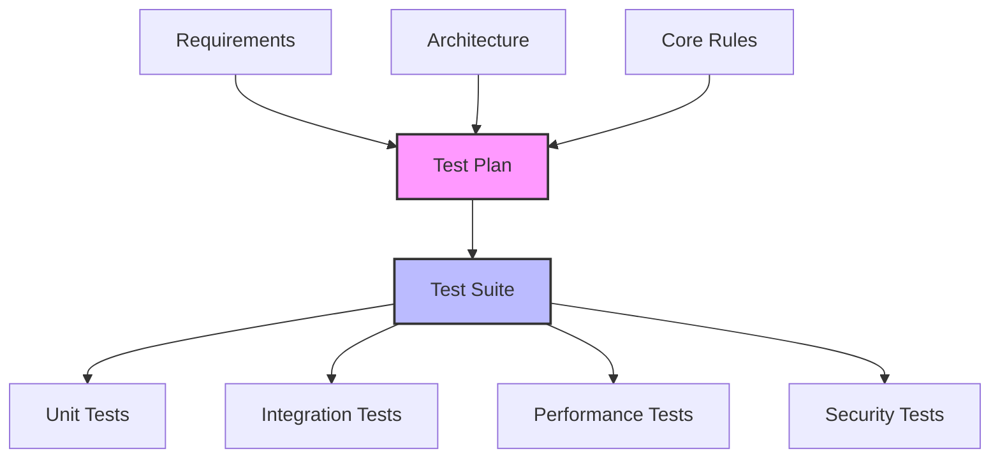
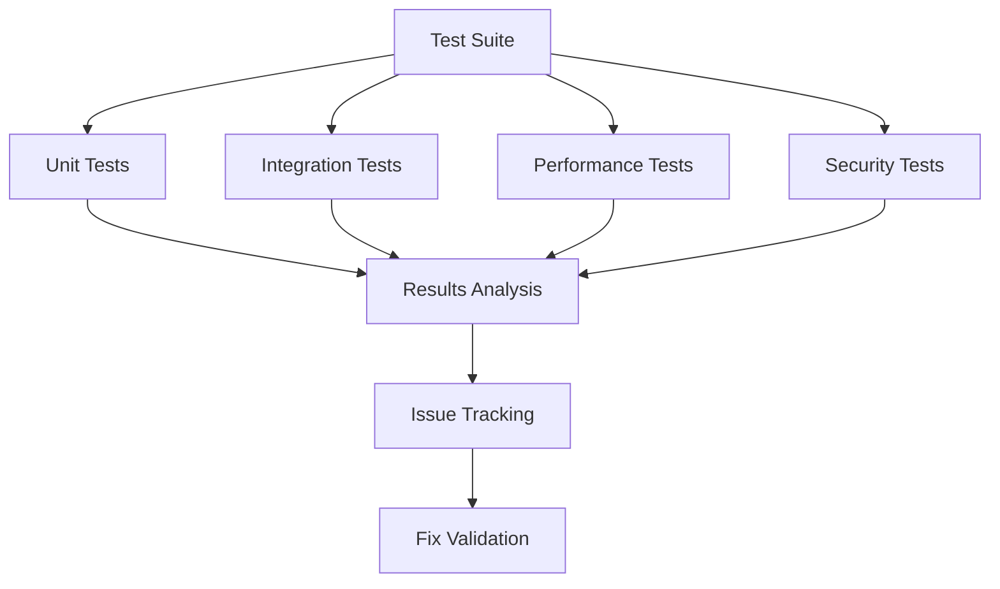
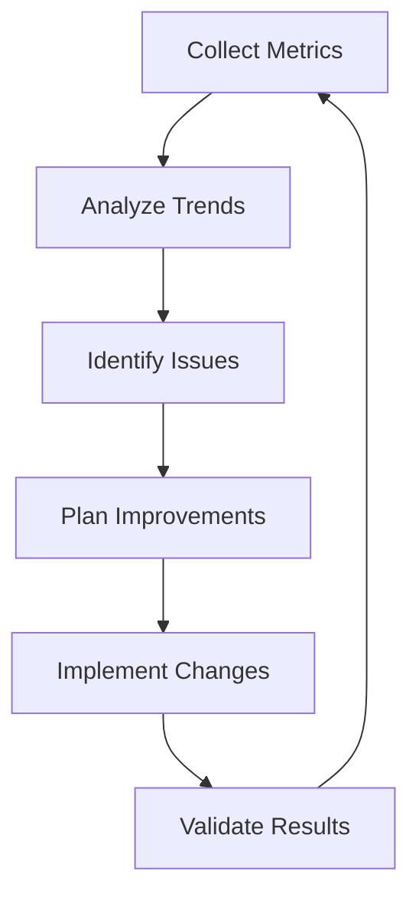

# Testing and Quality Assurance Guide

## Overview

This guide outlines how to effectively use LLMs to enhance testing and quality assurance processes, ensuring comprehensive test coverage and robust validation procedures while maintaining efficiency and reliability.

## Testing Strategy

### 1. Test Planning

#### Test Coverage Framework


#### LLM-Assisted Test Planning
```markdown
# Test Plan Generation Prompt
Please analyze the following component and help create a comprehensive test plan:

## Component Details
- Name: [Component name]
- Purpose: [Component purpose]
- Interfaces: [Component interfaces]

## Requirements
1. Functional requirements
2. Performance requirements
3. Security requirements
4. Compliance requirements

## Expected Output
1. Test scenarios
2. Edge cases
3. Integration points
4. Performance criteria
5. Security validations

Component:
[Component Description]
```

### 2. Test Implementation

#### Test Case Template
```markdown
# Test Case Specification
## Overview
ID: [Test case ID]
Type: [Unit/Integration/Performance/Security]
Priority: [Priority level]

## Test Details
### Preconditions
- [Precondition 1]
- [Precondition 2]

### Test Steps
1. [Step 1]
2. [Step 2]

### Expected Results
- [Expected outcome 1]
- [Expected outcome 2]

### Validation Criteria
- [Validation point 1]
- [Validation point 2]
```

#### LLM-Assisted Test Generation
```markdown
# Test Generation Prompt
Please help generate test cases for the following scenario:

## Scenario Context
[Describe the feature/component to test]

## Test Requirements
- Functional coverage
- Edge cases
- Error conditions
- Performance aspects
- Security considerations

## Expected Output
1. Unit test cases
2. Integration test scenarios
3. Performance test cases
4. Security test cases
```

### 3. Test Execution

#### Execution Framework


#### Test Execution Checklist
```markdown
# Test Execution Checklist
## Environment Setup
- [ ] Test environment configured
- [ ] Test data prepared
- [ ] Dependencies available
- [ ] Monitoring enabled

## Execution Steps
- [ ] Unit tests run
- [ ] Integration tests run
- [ ] Performance tests run
- [ ] Security tests run

## Results Validation
- [ ] All tests executed
- [ ] Results documented
- [ ] Issues logged
- [ ] Metrics collected
```

### 4. Results Analysis

#### LLM-Assisted Analysis
```markdown
# Test Analysis Prompt
Please analyze the following test results and provide insights:

## Test Results
[Provide test execution results]

## Required Analysis
1. Pass/fail patterns
2. Performance trends
3. Security implications
4. Quality metrics

## Expected Output
1. Issue categorization
2. Root cause analysis
3. Improvement suggestions
4. Risk assessment
```

## Quality Assurance Process

### 1. Quality Gates

#### Gate Definition Template
```markdown
# Quality Gate Specification
## Gate: [Gate Name]

### Entry Criteria
- [Criterion 1]
- [Criterion 2]

### Quality Checks
- [Check 1]
- [Check 2]

### Exit Criteria
- [Criterion 1]
- [Criterion 2]

### Validation Process
1. [Validation step 1]
2. [Validation step 2]
```

#### LLM-Assisted Quality Validation
```markdown
# Quality Validation Prompt
Please validate the following implementation against our quality standards:

## Implementation Context
[Provide implementation details]

## Quality Standards
1. Code quality
2. Test coverage
3. Performance metrics
4. Security requirements

## Expected Output
1. Compliance assessment
2. Gap analysis
3. Improvement recommendations
4. Risk evaluation
```

### 2. Continuous Improvement

#### Metrics Collection
```markdown
# Quality Metrics Dashboard
## Code Quality
- Complexity: [Metric]
- Coverage: [Metric]
- Duplication: [Metric]
- Technical Debt: [Metric]

## Test Quality
- Pass Rate: [Metric]
- Coverage: [Metric]
- Reliability: [Metric]
- Performance: [Metric]

## Process Quality
- Cycle Time: [Metric]
- Defect Rate: [Metric]
- Fix Time: [Metric]
- Regression Rate: [Metric]
```

#### Improvement Process


## Best Practices

### 1. Test Management

#### Test Organization
- Logical structure
- Clear naming
- Proper isolation
- Efficient setup

#### Test Maintenance
- Regular updates
- Dependency management
- Performance optimization
- Documentation

### 2. Quality Control

#### Code Review
- Pattern compliance
- Error handling
- Performance
- Security

#### Documentation
- Test cases
- Setup procedures
- Maintenance guides
- Troubleshooting

## Common Challenges

### 1. Testing Issues
- Incomplete coverage
- Flaky tests
- Performance bottlenecks
- Environment problems

### 2. Quality Problems
- Inconsistent standards
- Missing validation
- Poor documentation
- Technical debt

## Templates and Examples

### 1. Test Suite Template
```markdown
# Test Suite Specification
## Overview
Suite: [Suite name]
Scope: [Test scope]
Priority: [Priority level]

## Test Cases
### Functional Tests
1. [Test case 1]
2. [Test case 2]

### Integration Tests
1. [Test case 1]
2. [Test case 2]

### Performance Tests
1. [Test case 1]
2. [Test case 2]

### Security Tests
1. [Test case 1]
2. [Test case 2]
```

### 2. Quality Report Template
```markdown
# Quality Assessment Report
## Overview
Component: [Component name]
Version: [Version number]
Date: [Assessment date]

## Quality Metrics
### Code Quality
- [Metric 1]: [Value]
- [Metric 2]: [Value]

### Test Coverage
- [Coverage 1]: [Value]
- [Coverage 2]: [Value]

### Issues Found
1. [Issue 1]
2. [Issue 2]

### Recommendations
1. [Recommendation 1]
2. [Recommendation 2]
```

<!-- Usage Notes:
1. Regular test maintenance
2. Continuous validation
3. Metric monitoring
4. Process improvement
--> 