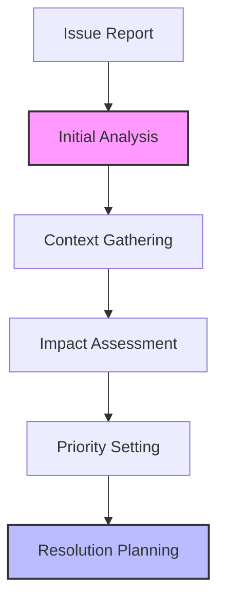
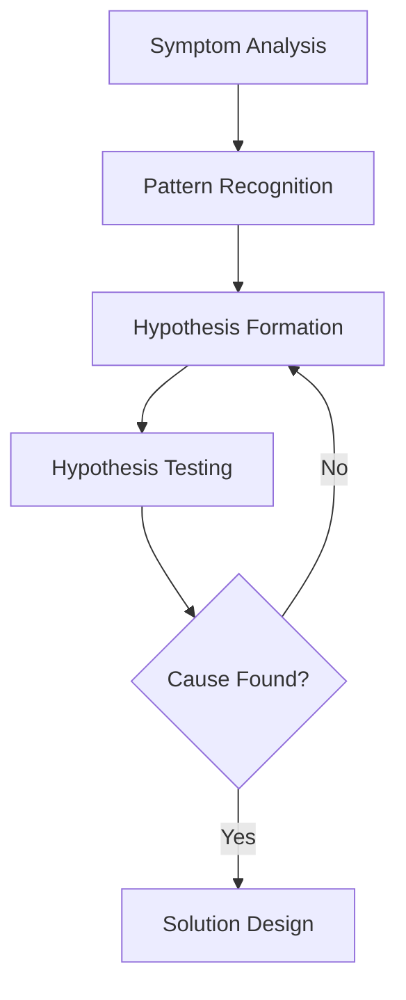
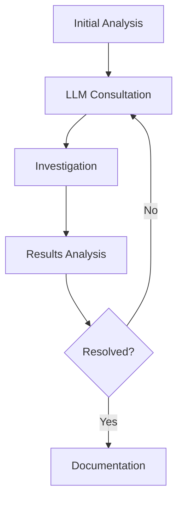

# Problem Resolution and Debugging Guide

## Overview

This guide outlines how to effectively use LLMs for problem resolution and debugging, providing structured approaches to identify, analyze, and resolve issues while maintaining system stability and code quality.

## Problem Resolution Process

### 1. Issue Analysis

#### Analysis Framework


#### LLM-Assisted Analysis
```markdown
# Issue Analysis Prompt
Please analyze the following issue and provide structured insights:

## Issue Description
[Detailed issue description]

## Required Analysis
1. Issue categorization
2. Potential root causes
3. Impact assessment
4. Priority evaluation

## Context Information
- Environment details
- System state
- Error messages
- Recent changes

## Expected Output
1. Initial diagnosis
2. Investigation areas
3. Required information
4. Next steps
```

### 2. Debug Strategy

#### Strategy Template
```markdown
# Debug Strategy Template
## Issue Overview
Type: [Issue type]
Severity: [Severity level]
Impact: [Impact scope]

## Investigation Plan
1. [Investigation step 1]
   - Tools needed
   - Expected outcomes
   - Success criteria

2. [Investigation step 2]
   - Tools needed
   - Expected outcomes
   - Success criteria

## Data Collection
- Logs required
- Metrics needed
- State information
- Environment data
```

#### LLM-Assisted Debug Planning
```markdown
# Debug Planning Prompt
Please help create a debugging strategy for:

## Problem Context
[Problem description and context]

## Available Information
- Error messages
- System state
- Environment details
- Recent changes

## Required Output
1. Investigation steps
2. Data collection plan
3. Tool requirements
4. Success criteria
```

### 3. Root Cause Analysis

#### Analysis Process


#### RCA Template
```markdown
# Root Cause Analysis Template
## Issue Timeline
1. [Event 1]
2. [Event 2]

## Investigation Path
1. [Investigation step 1]
   - Findings
   - Evidence
   - Conclusions

2. [Investigation step 2]
   - Findings
   - Evidence
   - Conclusions

## Root Cause
- Primary cause
- Contributing factors
- Environmental conditions
```

### 4. Solution Implementation

#### Solution Template
```markdown
# Solution Implementation Plan
## Fix Overview
Type: [Fix type]
Scope: [Implementation scope]
Risk: [Risk level]

## Implementation Steps
1. [Step 1]
   - Actions
   - Validation
   - Rollback plan

2. [Step 2]
   - Actions
   - Validation
   - Rollback plan

## Verification Plan
- Test cases
- Validation steps
- Success criteria
```

#### LLM-Assisted Implementation
```markdown
# Solution Implementation Prompt
Please help design a solution for:

## Problem Context
[Problem description and root cause]

## Requirements
- Fix requirements
- Constraints
- Dependencies
- Risks

## Expected Output
1. Implementation plan
2. Test strategy
3. Rollback procedure
4. Validation steps
```

## Best Practices

### 1. Problem Management

#### Issue Documentation
- Clear description
- Complete context
- Investigation notes
- Resolution steps

#### Knowledge Base
- Common issues
- Resolution patterns
- Prevention measures
- Lessons learned

### 2. Debug Techniques

#### Systematic Approach
- Reproduce issue
- Isolate problem
- Test hypothesis
- Verify solution

#### Tool Usage
- Logging tools
- Monitoring systems
- Debug utilities
- Analysis tools

## Common Challenges

### 1. Investigation Issues
- Incomplete information
- Complex interactions
- Intermittent problems
- Environment differences

### 2. Resolution Problems
- Multiple root causes
- Side effects
- Performance impact
- Regression risks

## Templates and Examples

### 1. Issue Investigation Template
```markdown
# Issue Investigation Report
## Overview
Issue ID: [Issue identifier]
Type: [Issue type]
Priority: [Priority level]

## Investigation
### Steps Taken
1. [Step 1]
   - Actions
   - Findings
   - Conclusions

2. [Step 2]
   - Actions
   - Findings
   - Conclusions

### Evidence Collected
- Log entries
- Error messages
- System metrics
- State information

### Root Cause
- Primary cause
- Contributing factors
- Environmental conditions
```

### 2. Fix Implementation Template
```markdown
# Fix Implementation Report
## Overview
Fix ID: [Fix identifier]
Issue: [Related issue]
Scope: [Implementation scope]

## Implementation
### Changes Made
1. [Change 1]
   - Purpose
   - Impact
   - Validation

2. [Change 2]
   - Purpose
   - Impact
   - Validation

### Testing
- Test cases
- Results
- Coverage

### Verification
- Validation steps
- Success criteria
- Sign-off
```

### 3. Prevention Measures
```markdown
# Prevention Plan
## Immediate Actions
1. [Action 1]
2. [Action 2]

## Long-term Improvements
1. [Improvement 1]
2. [Improvement 2]

## Monitoring
- Metrics to track
- Alert thresholds
- Review schedule
```

## LLM Interaction Guidelines

### 1. Context Provision

#### Essential Information
- Issue description
- Environment details
- Error messages
- Recent changes

#### Supporting Data
- Log excerpts
- Stack traces
- Configuration
- Dependencies

### 2. Iterative Resolution

#### Investigation Cycle


#### Progress Tracking
```markdown
# Resolution Progress
## Completed Steps
1. [Step 1]: [Outcome]
2. [Step 2]: [Outcome]

## Current Status
- Findings
- Blockers
- Next steps

## Remaining Work
1. [Task 1]
2. [Task 2]
```

<!-- Usage Notes:
1. Systematic investigation
2. Complete documentation
3. Thorough validation
4. Knowledge sharing
--> 