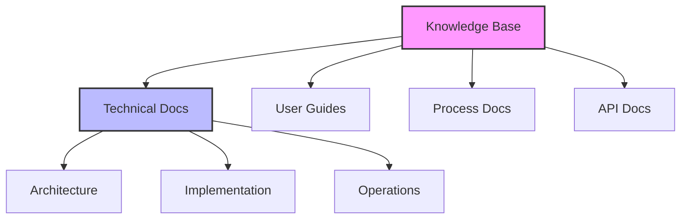
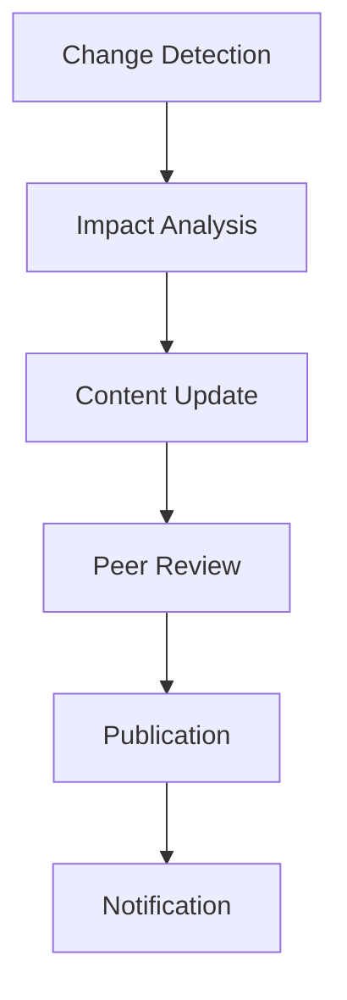

# Documentation and Knowledge Management Guide

## Overview

This guide outlines how to effectively use LLMs for documentation and knowledge management, ensuring comprehensive, maintainable, and accessible documentation while facilitating knowledge sharing and preservation across the team.

## Documentation Strategy

### 1. Documentation Planning

#### Documentation Framework


#### LLM-Assisted Planning
```markdown
# Documentation Planning Prompt
Please help create a documentation plan for:

## Project Context
[Project description and scope]

## Documentation Needs
1. Technical documentation
2. User documentation
3. Process documentation
4. API documentation

## Required Output
1. Documentation structure
2. Content outline
3. Priority order
4. Maintenance plan
```

### 2. Content Creation

#### Technical Documentation Template
```markdown
# Technical Document Template
## Overview
Title: [Document title]
Scope: [Document scope]
Audience: [Target audience]

## Technical Details
### Architecture
- Components
- Interactions
- Dependencies
- Constraints

### Implementation
- Key algorithms
- Data structures
- Design patterns
- Error handling

### Operations
- Deployment
- Monitoring
- Maintenance
- Troubleshooting
```

#### LLM-Assisted Content Generation
```markdown
# Content Generation Prompt
Please help document the following component:

## Component Details
- Name: [Component name]
- Purpose: [Component purpose]
- Architecture: [Architecture details]
- Implementation: [Implementation details]

## Documentation Requirements
1. Technical accuracy
2. Completeness
3. Clarity
4. Examples

## Expected Output
1. Component documentation
2. Usage examples
3. Configuration guide
4. Troubleshooting guide
```

### 3. Knowledge Organization

#### Knowledge Base Structure
```markdown
# Knowledge Base Organization
## Technical Knowledge
1. Architecture
   - System design
   - Components
   - Patterns

2. Implementation
   - Code guidelines
   - Best practices
   - Common patterns

3. Operations
   - Deployment
   - Monitoring
   - Maintenance

## Process Knowledge
1. Development
   - Workflows
   - Standards
   - Tools

2. Quality Assurance
   - Testing
   - Reviews
   - Validation

3. Operations
   - Procedures
   - Checklists
   - Guidelines
```

#### LLM-Assisted Organization
```markdown
# Knowledge Organization Prompt
Please help organize the following knowledge base:

## Content Areas
[List of content areas]

## Organization Goals
1. Easy navigation
2. Clear structure
3. Logical grouping
4. Quick access

## Expected Output
1. Content structure
2. Navigation design
3. Cross-references
4. Search strategy
```

### 4. Maintenance Process

#### Update Workflow


#### Documentation Review Template
```markdown
# Documentation Review Checklist
## Content Quality
- [ ] Technical accuracy
- [ ] Completeness
- [ ] Clarity
- [ ] Examples provided

## Structure
- [ ] Logical organization
- [ ] Clear headings
- [ ] Proper formatting
- [ ] Consistent style

## References
- [ ] Links valid
- [ ] Cross-references correct
- [ ] Dependencies noted
- [ ] Version information
```

## Best Practices

### 1. Documentation Quality

#### Content Standards
- Technical accuracy
- Clear structure
- Consistent style
- Regular updates

#### Quality Control
- Peer review
- Technical validation
- User feedback
- Regular audits

### 2. Knowledge Sharing

#### Collaboration Tools
- Documentation platform
- Version control
- Search capability
- Feedback system

#### Access Management
- Role-based access
- Version tracking
- Change history
- Audit trail

## Common Challenges

### 1. Documentation Issues
- Outdated content
- Inconsistent style
- Missing information
- Poor organization

### 2. Knowledge Management
- Information silos
- Knowledge gaps
- Access problems
- Update delays

## Templates and Examples

### 1. API Documentation Template
```markdown
# API Documentation
## Overview
Name: [API name]
Version: [Version]
Purpose: [API purpose]

## Endpoints
### [Endpoint 1]
Method: [HTTP method]
Path: [URL path]
Description: [Endpoint purpose]

#### Request
```json
{
  "field1": "type1",
  "field2": "type2"
}
```

#### Response
```json
{
  "field1": "type1",
  "field2": "type2"
}
```

#### Error Handling
- [Error 1]: [Description]
- [Error 2]: [Description]
```

### 2. Process Documentation Template
```markdown
# Process Documentation
## Overview
Process: [Process name]
Purpose: [Process purpose]
Owner: [Process owner]

## Steps
1. [Step 1]
   - Actions
   - Inputs
   - Outputs
   - Validation

2. [Step 2]
   - Actions
   - Inputs
   - Outputs
   - Validation

## Quality Gates
1. [Gate 1]
   - Criteria
   - Validation
   - Sign-off

2. [Gate 2]
   - Criteria
   - Validation
   - Sign-off
```

### 3. Knowledge Base Article Template
```markdown
# Knowledge Base Article
## Overview
Topic: [Topic name]
Category: [Category]
Audience: [Target audience]

## Content
### Background
[Context and background information]

### Details
[Technical details and explanation]

### Examples
[Practical examples and use cases]

### Troubleshooting
[Common issues and solutions]

## References
- [Reference 1]
- [Reference 2]

## Metadata
- Created: [Date]
- Updated: [Date]
- Author: [Name]
- Reviewers: [Names]
```

## LLM Interaction Guidelines

### 1. Documentation Generation

#### Content Requirements
- Clear purpose
- Target audience
- Technical depth
- Examples needed

#### Quality Standards
- Technical accuracy
- Completeness
- Clarity
- Consistency

### 2. Knowledge Extraction

#### Context Gathering
```markdown
# Context Collection Template
## Domain
[Knowledge domain]

## Scope
- Topics covered
- Depth required
- Audience level
- Use cases

## Requirements
- Technical details
- Examples
- References
- Validation
```

#### Knowledge Validation
```markdown
# Validation Checklist
## Technical Accuracy
- [ ] Facts verified
- [ ] Examples tested
- [ ] References checked
- [ ] Updates included

## Completeness
- [ ] All topics covered
- [ ] Dependencies noted
- [ ] Edge cases included
- [ ] Examples provided
```

<!-- Usage Notes:
1. Regular updates
2. Quality validation
3. User feedback
4. Knowledge sharing
--> 