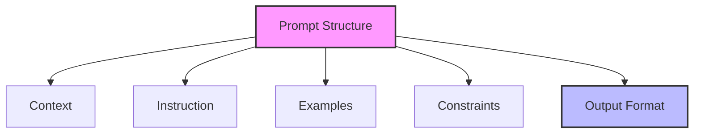
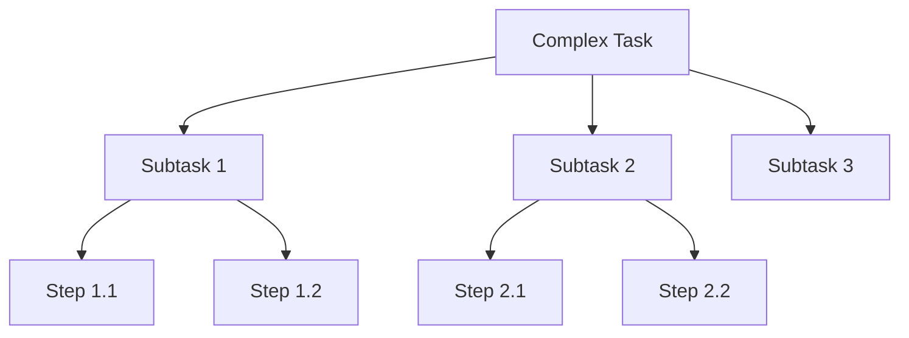
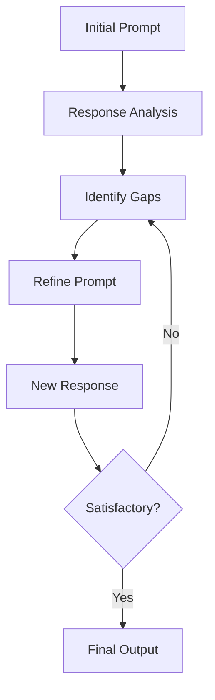

# Prompt Engineering and Optimization Guide

## Overview

This guide covers advanced techniques for prompt engineering and optimization, helping teams craft more effective prompts for LLMs and achieve better, more consistent results in software development tasks.

## Prompt Engineering Principles

### 1. Prompt Architecture

#### Core Components


#### Component Templates
```markdown
# Context Component
## Background Information
- Project context
- Technical environment
- Current state
- Related systems

## Requirements
- Business requirements
- Technical requirements
- Constraints
- Dependencies

# Instruction Component
## Primary Task
- Clear objective
- Expected outcome
- Success criteria
- Validation points

## Constraints
- Technical limitations
- Business rules
- Performance requirements
- Security considerations

# Examples Component
## Sample Scenarios
- Input examples
- Expected outputs
- Edge cases
- Error scenarios

# Output Format
## Structure
- Format specification
- Required sections
- Data types
- Validation rules
```

### 2. Context Engineering

#### Context Framework
```markdown
# Context Framework Template
## Project Context
- Project name: [Name]
- Domain: [Domain]
- Phase: [Phase]
- Scope: [Scope]

## Technical Context
- Architecture: [Architecture details]
- Stack: [Technology stack]
- Constraints: [Technical constraints]
- Standards: [Coding standards]

## Business Context
- Goals: [Business goals]
- Requirements: [Key requirements]
- Constraints: [Business constraints]
- Timeline: [Time constraints]

## Current State
- Status: [Current status]
- Issues: [Known issues]
- Dependencies: [Dependencies]
- Risks: [Known risks]
```

#### Context Optimization
```markdown
# Context Optimization Checklist
## Relevance
- [ ] Essential information included
- [ ] Unnecessary details removed
- [ ] Clear scope defined
- [ ] Dependencies identified

## Clarity
- [ ] Clear terminology
- [ ] Consistent naming
- [ ] Explicit requirements
- [ ] Defined constraints

## Completeness
- [ ] All requirements covered
- [ ] Edge cases included
- [ ] Constraints specified
- [ ] Dependencies listed
```

### 3. Instruction Crafting

#### Instruction Patterns
```markdown
# Task Instruction Template
## Objective
[Clear statement of what needs to be accomplished]

## Requirements
1. Functional Requirements
   - [Requirement 1]
   - [Requirement 2]

2. Technical Requirements
   - [Requirement 1]
   - [Requirement 2]

3. Quality Requirements
   - [Requirement 1]
   - [Requirement 2]

## Constraints
- [Constraint 1]
- [Constraint 2]

## Expected Output
- [Output specification]
- [Format requirements]
- [Validation criteria]
```

#### Task Decomposition


### 4. Output Engineering

#### Output Templates
```markdown
# Code Generation Template
## Implementation
```[language]
[Code structure template]
```

## Documentation
- Purpose: [Component purpose]
- Usage: [Usage instructions]
- Examples: [Usage examples]

## Tests
```[language]
[Test structure template]
```

# Analysis Output Template
## Findings
1. [Finding category 1]
   - Observations
   - Implications
   - Recommendations

2. [Finding category 2]
   - Observations
   - Implications
   - Recommendations

## Recommendations
1. [Recommendation 1]
   - Rationale
   - Implementation
   - Impact

2. [Recommendation 2]
   - Rationale
   - Implementation
   - Impact
```

#### Validation Framework
```markdown
# Output Validation Checklist
## Technical Accuracy
- [ ] Meets requirements
- [ ] Follows standards
- [ ] Handles edge cases
- [ ] Includes error handling

## Completeness
- [ ] All requirements addressed
- [ ] Documentation complete
- [ ] Tests included
- [ ] Examples provided

## Quality
- [ ] Code quality
- [ ] Performance
- [ ] Security
- [ ] Maintainability
```

## Advanced Techniques

### 1. Chain-of-Thought Prompting

#### Process Template
```markdown
# Chain-of-Thought Template
## Problem Analysis
1. Understanding
   - Key aspects
   - Requirements
   - Constraints

2. Approach
   - Strategy
   - Components
   - Steps

3. Implementation
   - Details
   - Validation
   - Testing

4. Review
   - Verification
   - Optimization
   - Documentation
```

#### Implementation Example
```markdown
# Development Task
Let's approach this step by step:

1. First, let's understand the requirements:
   - [Requirement analysis]

2. Now, let's plan the implementation:
   - [Implementation plan]

3. Let's consider the technical aspects:
   - [Technical considerations]

4. Here's the implementation approach:
   - [Implementation details]

5. Finally, let's validate:
   - [Validation steps]
```

### 2. Few-Shot Learning

#### Example Template
```markdown
# Few-Shot Learning Template
## Example 1
Input: [Sample input 1]
Process:
1. [Step 1]
2. [Step 2]
Output: [Expected output 1]

## Example 2
Input: [Sample input 2]
Process:
1. [Step 1]
2. [Step 2]
Output: [Expected output 2]

## Target Task
Input: [Actual input]
Process:
1. [Step 1]
2. [Step 2]
Expected Output: [Required output]
```

#### Pattern Matching
```markdown
# Pattern Recognition Template
## Pattern 1
Context: [Context description]
Solution: [Solution approach]
Implementation: [Implementation details]

## Pattern 2
Context: [Context description]
Solution: [Solution approach]
Implementation: [Implementation details]

## Current Case
Context: [Current context]
Required: [Solution requirements]
```

### 3. Iterative Refinement

#### Refinement Process


#### Refinement Template
```markdown
# Iterative Refinement Template
## Iteration 1
Prompt: [Initial prompt]
Response: [Response]
Analysis: [Gap analysis]
Refinement: [Prompt refinement]

## Iteration 2
Prompt: [Refined prompt]
Response: [Response]
Analysis: [Gap analysis]
Refinement: [Prompt refinement]

## Final Version
Prompt: [Final prompt]
Response: [Final response]
Validation: [Validation results]
```

## Best Practices

### 1. Prompt Design

#### Clarity Guidelines
- Be specific and explicit
- Use consistent terminology
- Define clear boundaries
- Specify output format

#### Optimization Tips
- Remove ambiguity
- Include essential context
- Set clear constraints
- Define success criteria

### 2. Quality Control

#### Validation Process
- Technical accuracy
- Requirement compliance
- Output quality
- Performance impact

#### Improvement Cycle
- Collect feedback
- Analyze patterns
- Refine prompts
- Document learnings

## Common Challenges

### 1. Prompt Issues
- Ambiguous instructions
- Missing context
- Unclear constraints
- Poor formatting

### 2. Output Problems
- Inconsistent results
- Quality issues
- Performance impact
- Integration challenges

## Templates and Examples

### 1. Development Prompt Template
```markdown
# Development Task Prompt
## Context
[Project and technical context]

## Requirements
[Specific requirements]

## Constraints
[Technical and business constraints]

## Expected Output
[Output specifications]

## Examples
[Relevant examples]

## Validation Criteria
[Success criteria]
```

### 2. Analysis Prompt Template
```markdown
# Analysis Task Prompt
## Scope
[Analysis scope]

## Focus Areas
[Areas to analyze]

## Required Insights
[Expected insights]

## Output Format
[Required format]

## Examples
[Sample analysis]

## Quality Criteria
[Quality requirements]
```

<!-- Usage Notes:
1. Regular prompt review
2. Pattern documentation
3. Success tracking
4. Continuous improvement
--> 