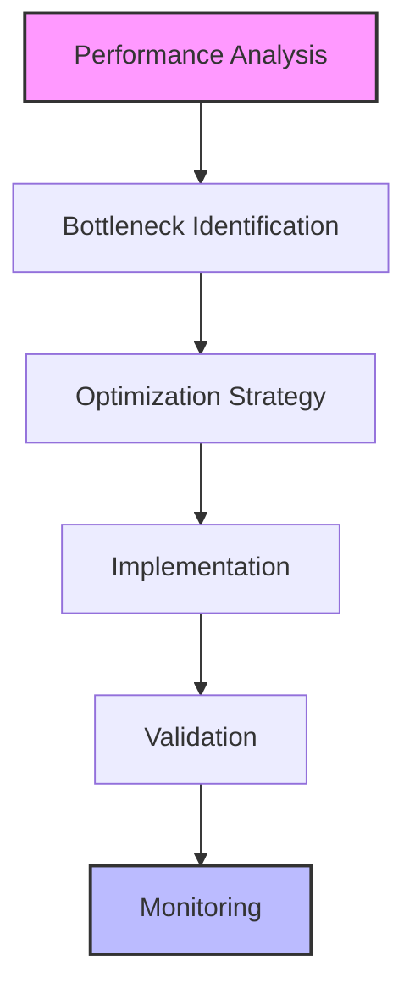
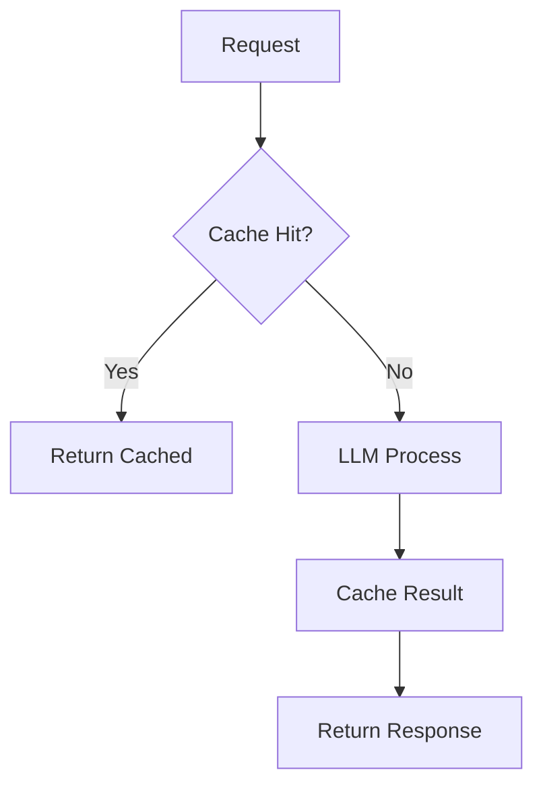
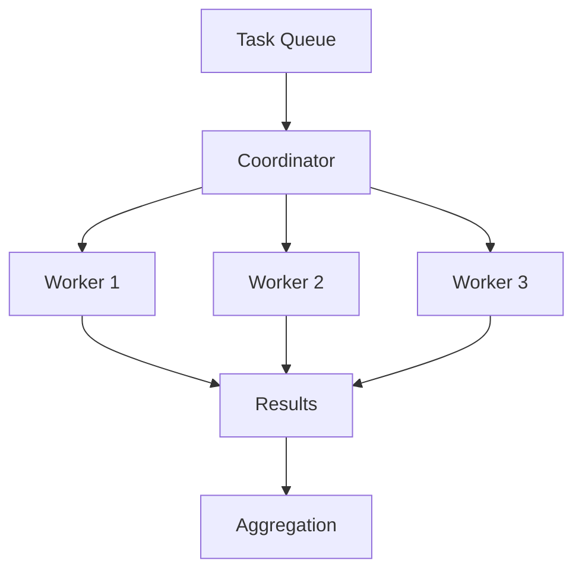
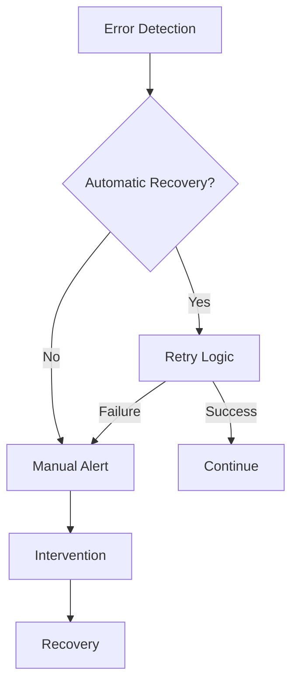

# Performance Optimization and Scaling Guide

## Overview

This guide covers advanced techniques for optimizing LLM-driven development processes and scaling them effectively across larger projects and teams, focusing on efficiency, reliability, and maintainability.

## Performance Optimization

### 1. Response Time Optimization

#### Optimization Framework


#### Performance Analysis Template
```markdown
# Performance Analysis Template
## Current Metrics
- Response time: [Average time]
- Token usage: [Token count]
- Error rate: [Error percentage]
- Success rate: [Success percentage]

## Bottlenecks
1. [Bottleneck 1]
   - Impact
   - Root cause
   - Optimization potential

2. [Bottleneck 2]
   - Impact
   - Root cause
   - Optimization potential

## Optimization Targets
- Response time target: [Target time]
- Token usage target: [Target count]
- Error rate target: [Target percentage]
- Success rate target: [Target percentage]
```

### 2. Token Optimization

#### Token Usage Guidelines
```markdown
# Token Optimization Strategies
## Context Optimization
- Essential information only
- Structured format
- Clear boundaries
- Efficient encoding

## Prompt Optimization
- Clear instructions
- Minimal examples
- Focused scope
- Efficient format

## Response Optimization
- Structured output
- Specific format
- Limited verbosity
- Essential content
```

#### Optimization Checklist
```markdown
# Token Usage Checklist
## Context Review
- [ ] Remove unnecessary information
- [ ] Optimize format
- [ ] Compress examples
- [ ] Structure efficiently

## Prompt Review
- [ ] Clear instructions
- [ ] Minimal context
- [ ] Efficient format
- [ ] Focused scope

## Output Review
- [ ] Structured response
- [ ] Essential content
- [ ] Efficient format
- [ ] Limited verbosity
```

### 3. Caching Strategy

#### Cache Framework


#### Cache Implementation
```markdown
# Caching Strategy Template
## Cache Levels
1. Request Level
   - Key structure
   - Expiration
   - Invalidation
   - Storage

2. Response Level
   - Format
   - Validation
   - Updates
   - Cleanup

## Cache Management
- Invalidation rules
- Update strategy
- Cleanup process
- Monitoring
```

## Scaling Strategies

### 1. Parallel Processing

#### Parallel Framework
```markdown
# Parallel Processing Template
## Task Distribution
1. Task Analysis
   - Dependencies
   - Parallelization potential
   - Resource requirements
   - Coordination needs

2. Distribution Strategy
   - Task allocation
   - Resource management
   - Synchronization
   - Error handling

## Implementation
1. Coordinator
   - Task queue
   - Resource allocation
   - Progress tracking
   - Error handling

2. Workers
   - Task processing
   - Result reporting
   - Error handling
   - Resource management
```

#### Coordination Pattern


### 2. Load Management

#### Load Balancing
```markdown
# Load Balancing Template
## Strategy
1. Distribution Rules
   - Resource capacity
   - Task priority
   - Load metrics
   - Health checks

2. Scaling Rules
   - Trigger conditions
   - Scale-up rules
   - Scale-down rules
   - Resource limits

## Implementation
1. Load Balancer
   - Distribution logic
   - Health monitoring
   - Failover handling
   - Metrics collection

2. Resource Pool
   - Capacity management
   - Resource allocation
   - Health monitoring
   - Cleanup
```

#### Health Monitoring
```markdown
# Health Monitoring Template
## Metrics
- Response time
- Error rate
- Resource usage
- Queue length

## Thresholds
- Warning levels
- Critical levels
- Action triggers
- Recovery points

## Actions
- Scale up/down
- Failover
- Recovery
- Notification
```

### 3. Error Handling

#### Error Management Framework
```markdown
# Error Handling Template
## Error Categories
1. System Errors
   - Resource issues
   - Network problems
   - Service failures
   - Configuration errors

2. Process Errors
   - Invalid input
   - Invalid state
   - Timeout issues
   - Validation failures

## Recovery Strategies
1. Automatic Recovery
   - Retry logic
   - Fallback options
   - Resource cleanup
   - State recovery

2. Manual Intervention
   - Alert triggers
   - Escalation path
   - Recovery steps
   - Validation process
```

#### Recovery Process


## Best Practices

### 1. Performance Management

#### Monitoring Strategy
- Key metrics
- Alert thresholds
- Trend analysis
- Capacity planning

#### Optimization Process
- Regular review
- Performance testing
- Optimization cycles
- Documentation

### 2. Scale Management

#### Resource Planning
- Capacity assessment
- Growth projection
- Resource allocation
- Cost optimization

#### Implementation Strategy
- Gradual scaling
- Controlled rollout
- Monitoring points
- Rollback plans

## Common Challenges

### 1. Performance Issues
- Response delays
- Resource constraints
- Token limitations
- Integration bottlenecks

### 2. Scaling Problems
- Coordination overhead
- Resource contention
- Error propagation
- Cost management

## Templates and Examples

### 1. Performance Analysis Template
```markdown
# Performance Analysis Report
## Overview
Component: [Component name]
Period: [Analysis period]
Focus: [Analysis focus]

## Metrics
### Response Time
- Average: [Time]
- P95: [Time]
- P99: [Time]

### Resource Usage
- CPU: [Usage]
- Memory: [Usage]
- Network: [Usage]

### Error Rates
- System: [Rate]
- Process: [Rate]
- Integration: [Rate]

## Recommendations
1. [Recommendation 1]
   - Impact
   - Implementation
   - Resources

2. [Recommendation 2]
   - Impact
   - Implementation
   - Resources
```

### 2. Scaling Plan Template
```markdown
# Scaling Strategy
## Current State
- Load: [Current load]
- Resources: [Current resources]
- Performance: [Current metrics]

## Target State
- Load: [Target load]
- Resources: [Required resources]
- Performance: [Target metrics]

## Implementation Plan
1. Phase 1
   - Actions
   - Timeline
   - Resources
   - Validation

2. Phase 2
   - Actions
   - Timeline
   - Resources
   - Validation

## Monitoring Plan
- Metrics
- Thresholds
- Alerts
- Reviews
```

<!-- Usage Notes:
1. Regular performance review
2. Continuous optimization
3. Proactive scaling
4. Cost management
--> 