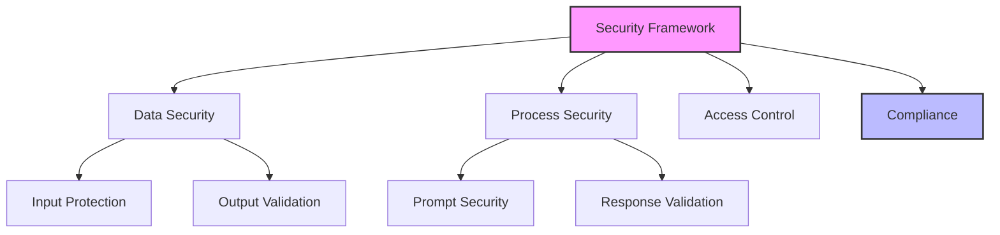
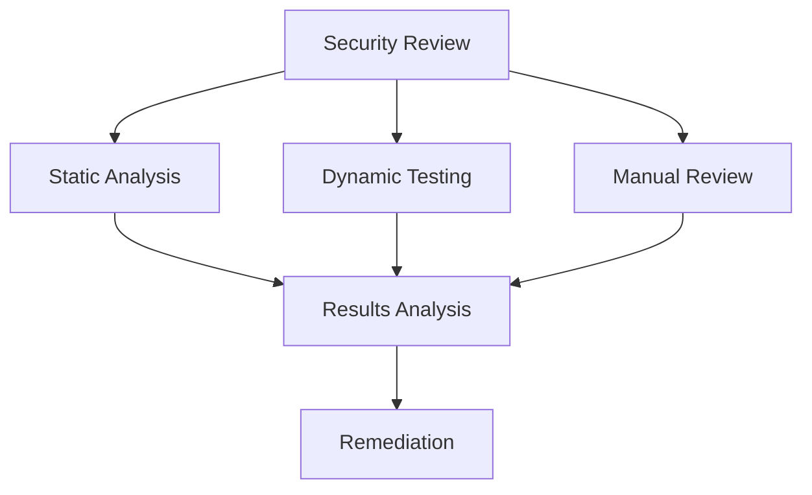
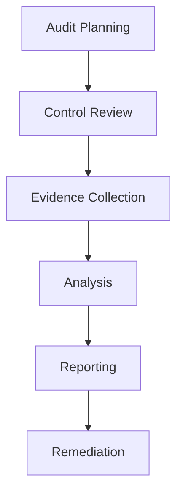
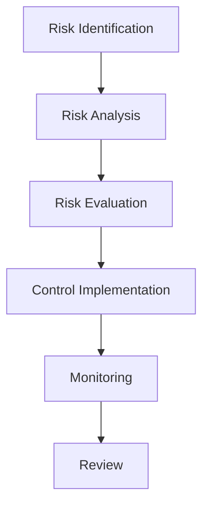

# Security and Compliance Guide

## Overview

This guide outlines advanced security and compliance considerations for LLM-driven development, ensuring robust protection of sensitive information, compliance with regulations, and maintenance of security best practices throughout the development lifecycle.

## Security Framework

### 1. Security Architecture

#### Security Layers


#### Security Controls Template
```markdown
# Security Controls Framework
## Data Protection
1. Input Controls
   - Data validation
   - Sanitization
   - Classification
   - Encryption

2. Output Controls
   - Content filtering
   - Data masking
   - Validation rules
   - Audit logging

## Process Security
1. Execution Controls
   - Authentication
   - Authorization
   - Rate limiting
   - Monitoring

2. Integration Controls
   - API security
   - Data transfer
   - Error handling
   - Logging
```

### 2. Data Protection

#### Data Classification
```markdown
# Data Classification Template
## Sensitivity Levels
1. Public
   - Definition
   - Handling rules
   - Storage requirements
   - Access controls

2. Internal
   - Definition
   - Handling rules
   - Storage requirements
   - Access controls

3. Confidential
   - Definition
   - Handling rules
   - Storage requirements
   - Access controls

4. Restricted
   - Definition
   - Handling rules
   - Storage requirements
   - Access controls
```

#### Protection Measures
```markdown
# Data Protection Checklist
## Input Protection
- [ ] Data validation
- [ ] Content filtering
- [ ] PII detection
- [ ] Encryption

## Storage Protection
- [ ] Encryption at rest
- [ ] Access controls
- [ ] Audit logging
- [ ] Backup security

## Transfer Protection
- [ ] Encryption in transit
- [ ] Secure protocols
- [ ] Authentication
- [ ] Authorization
```

### 3. Process Security

#### Secure Development
```markdown
# Secure Development Template
## Code Security
1. Static Analysis
   - Security scanning
   - Dependency checks
   - Code review
   - Compliance validation

2. Dynamic Analysis
   - Security testing
   - Penetration testing
   - Vulnerability scanning
   - Performance testing

## Deployment Security
1. Environment Security
   - Configuration
   - Access control
   - Monitoring
   - Logging

2. Runtime Security
   - Process isolation
   - Resource control
   - Error handling
   - Recovery
```

#### Security Validation


## Compliance Framework

### 1. Regulatory Compliance

#### Compliance Matrix
```markdown
# Compliance Requirements Template
## Regulatory Standards
1. [Standard 1]
   - Requirements
   - Controls
   - Validation
   - Documentation

2. [Standard 2]
   - Requirements
   - Controls
   - Validation
   - Documentation

## Implementation
1. Technical Controls
   - Security measures
   - Monitoring
   - Reporting
   - Auditing

2. Process Controls
   - Procedures
   - Training
   - Documentation
   - Review
```

#### Compliance Monitoring
```markdown
# Compliance Monitoring Template
## Monitoring Areas
1. Data Handling
   - Collection
   - Processing
   - Storage
   - Transmission

2. Access Control
   - Authentication
   - Authorization
   - Audit logging
   - Review

3. Security Controls
   - Implementation
   - Effectiveness
   - Updates
   - Documentation
```

### 2. Audit Management

#### Audit Framework


#### Audit Process
```markdown
# Audit Process Template
## Preparation
1. Scope Definition
   - Systems
   - Processes
   - Time period
   - Requirements

2. Resource Planning
   - Team
   - Tools
   - Schedule
   - Documentation

## Execution
1. Evidence Collection
   - System logs
   - Documentation
   - Interviews
   - Testing

2. Analysis
   - Findings
   - Gaps
   - Risks
   - Recommendations
```

### 3. Risk Management

#### Risk Assessment
```markdown
# Risk Assessment Template
## Risk Categories
1. Technical Risks
   - Security vulnerabilities
   - System failures
   - Integration issues
   - Performance problems

2. Compliance Risks
   - Regulatory violations
   - Policy breaches
   - Documentation gaps
   - Process failures

## Risk Analysis
1. Impact Assessment
   - Business impact
   - Technical impact
   - Compliance impact
   - Reputation impact

2. Mitigation Strategy
   - Controls
   - Procedures
   - Monitoring
   - Review
```

#### Risk Management Process


## Best Practices

### 1. Security Management

#### Security Controls
- Access control
- Data protection
- Process security
- Monitoring

#### Security Operations
- Incident response
- Change management
- Patch management
- Security training

### 2. Compliance Management

#### Documentation
- Policies
- Procedures
- Controls
- Evidence

#### Review Process
- Regular audits
- Control testing
- Gap analysis
- Improvement plans

## Common Challenges

### 1. Security Issues
- Data exposure
- Access control
- Process vulnerabilities
- Integration security

### 2. Compliance Problems
- Regulatory changes
- Documentation gaps
- Control failures
- Audit findings

## Templates and Examples

### 1. Security Assessment Template
```markdown
# Security Assessment Report
## Overview
System: [System name]
Scope: [Assessment scope]
Date: [Assessment date]

## Findings
### Vulnerabilities
1. [Finding 1]
   - Risk level
   - Impact
   - Recommendation

2. [Finding 2]
   - Risk level
   - Impact
   - Recommendation

## Recommendations
1. [Recommendation 1]
   - Priority
   - Implementation
   - Timeline

2. [Recommendation 2]
   - Priority
   - Implementation
   - Timeline
```

### 2. Compliance Review Template
```markdown
# Compliance Review Report
## Overview
Standard: [Compliance standard]
Scope: [Review scope]
Period: [Review period]

## Assessment
### Controls Review
1. [Control 1]
   - Status
   - Evidence
   - Gaps
   - Actions

2. [Control 2]
   - Status
   - Evidence
   - Gaps
   - Actions

## Action Plan
1. [Action 1]
   - Priority
   - Resources
   - Timeline
   - Validation

2. [Action 2]
   - Priority
   - Resources
   - Timeline
   - Validation
```

<!-- Usage Notes:
1. Regular security review
2. Continuous compliance
3. Risk assessment
4. Control validation
--> 