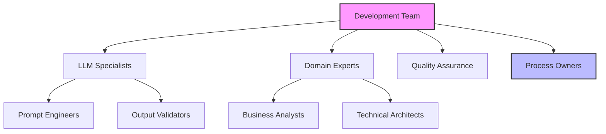
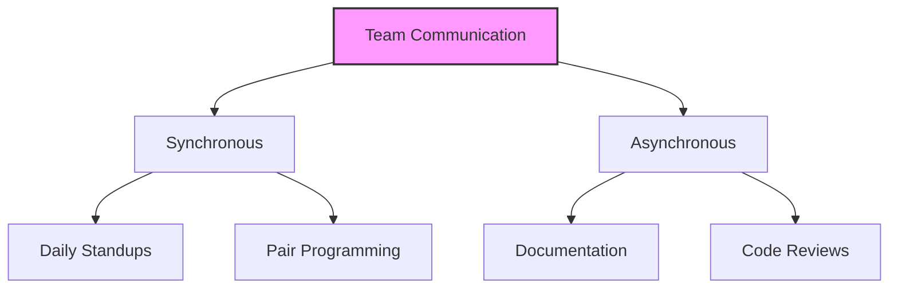
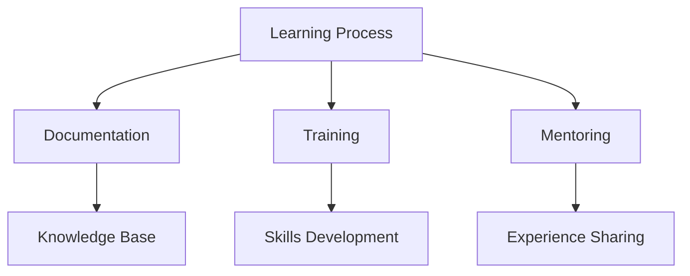
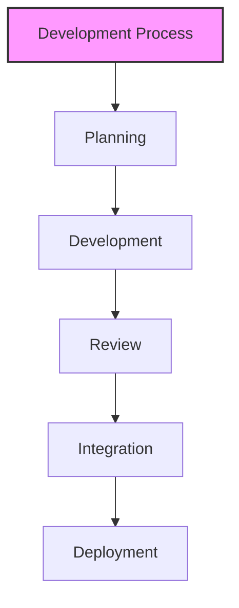
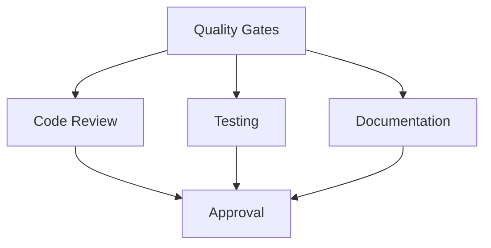
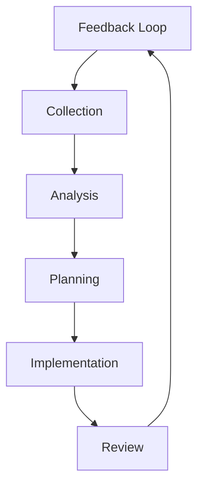

# Team Collaboration and Process Integration Guide

## Overview

This guide outlines advanced strategies for integrating LLM-driven development into team workflows and existing development processes, ensuring effective collaboration, knowledge sharing, and process optimization across the organization.

## Team Collaboration Framework

### 1. Collaboration Model

#### Team Structure


#### Role Definitions Template
```markdown
# Team Roles Framework
## Technical Roles
1. LLM Specialists
   - Responsibilities
   - Skills required
   - Key activities
   - Success metrics

2. Domain Experts
   - Responsibilities
   - Skills required
   - Key activities
   - Success metrics

## Process Roles
1. Quality Assurance
   - Responsibilities
   - Skills required
   - Key activities
   - Success metrics

2. Process Owners
   - Responsibilities
   - Skills required
   - Key activities
   - Success metrics
```

### 2. Communication Patterns

#### Communication Flow


#### Communication Guidelines
```markdown
# Communication Protocol
## Synchronous Communication
1. Daily Standups
   - Format
   - Duration
   - Participants
   - Agenda

2. Pair Programming
   - Session structure
   - Tools
   - Documentation
   - Feedback

## Asynchronous Communication
1. Documentation
   - Standards
   - Templates
   - Review process
   - Updates

2. Code Reviews
   - Guidelines
   - Checklist
   - Timeline
   - Feedback
```

### 3. Knowledge Sharing

#### Knowledge Base Structure
```markdown
# Knowledge Management Template
## Technical Knowledge
1. LLM Integration
   - Best practices
   - Common patterns
   - Troubleshooting
   - Updates

2. Development Practices
   - Standards
   - Guidelines
   - Examples
   - Resources

## Process Knowledge
1. Workflows
   - Procedures
   - Templates
   - Checkpoints
   - Reviews

2. Best Practices
   - Guidelines
   - Examples
   - Lessons learned
   - Improvements
```

#### Learning Framework


## Process Integration

### 1. Development Process

#### Process Flow


#### Integration Points
```markdown
# Process Integration Template
## Development Phases
1. Planning
   - LLM integration points
   - Tools and resources
   - Documentation
   - Validation

2. Development
   - Coding standards
   - Review process
   - Testing requirements
   - Documentation

3. Integration
   - Merge process
   - Quality checks
   - Documentation
   - Deployment
```

### 2. Quality Assurance

#### QA Framework
```markdown
# Quality Assurance Template
## Review Process
1. Code Review
   - Standards
   - Checklist
   - Documentation
   - Feedback

2. Documentation Review
   - Completeness
   - Accuracy
   - Clarity
   - Updates

## Testing Process
1. Unit Testing
   - Coverage
   - Standards
   - Documentation
   - Validation

2. Integration Testing
   - Scope
   - Process
   - Documentation
   - Validation
```

#### Quality Gates


### 3. Continuous Improvement

#### Improvement Process
```markdown
# Improvement Framework
## Process Areas
1. Development
   - Metrics
   - Analysis
   - Actions
   - Validation

2. Collaboration
   - Communication
   - Knowledge sharing
   - Team dynamics
   - Effectiveness

## Implementation
1. Changes
   - Planning
   - Execution
   - Monitoring
   - Review

2. Validation
   - Metrics
   - Feedback
   - Adjustments
   - Documentation
```

#### Feedback Loop


## Best Practices

### 1. Team Management

#### Collaboration Guidelines
- Clear communication
- Regular feedback
- Knowledge sharing
- Process adherence

#### Process Management
- Regular reviews
- Continuous improvement
- Documentation updates
- Team training

### 2. Integration Management

#### Development Integration
- Standard procedures
- Quality controls
- Documentation
- Validation

#### Process Integration
- Workflow alignment
- Tool integration
- Monitoring
- Optimization

## Common Challenges

### 1. Team Issues
- Communication gaps
- Knowledge silos
- Process adoption
- Tool integration

### 2. Process Problems
- Integration complexity
- Quality control
- Documentation
- Maintenance

## Templates and Examples

### 1. Team Collaboration Template
```markdown
# Team Collaboration Plan
## Overview
Team: [Team name]
Scope: [Collaboration scope]
Period: [Time period]

## Structure
### Roles
1. [Role 1]
   - Responsibilities
   - Activities
   - Deliverables

2. [Role 2]
   - Responsibilities
   - Activities
   - Deliverables

## Communication
1. [Channel 1]
   - Purpose
   - Participants
   - Frequency
   - Format

2. [Channel 2]
   - Purpose
   - Participants
   - Frequency
   - Format
```

### 2. Process Integration Template
```markdown
# Process Integration Plan
## Overview
Process: [Process name]
Scope: [Integration scope]
Timeline: [Implementation period]

## Integration Points
### Development
1. [Phase 1]
   - Activities
   - Tools
   - Documentation
   - Validation

2. [Phase 2]
   - Activities
   - Tools
   - Documentation
   - Validation

## Quality Gates
1. [Gate 1]
   - Criteria
   - Validation
   - Documentation
   - Sign-off

2. [Gate 2]
   - Criteria
   - Validation
   - Documentation
   - Sign-off
```

<!-- Usage Notes:
1. Regular process review
2. Team feedback
3. Continuous improvement
4. Documentation updates
--> 