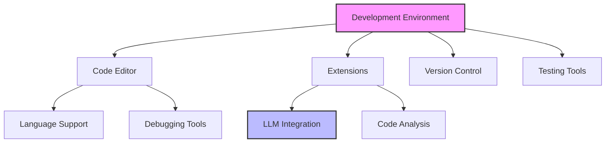
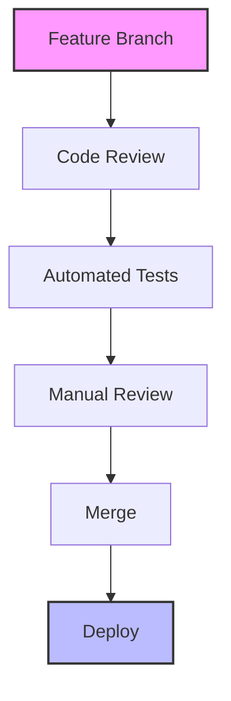
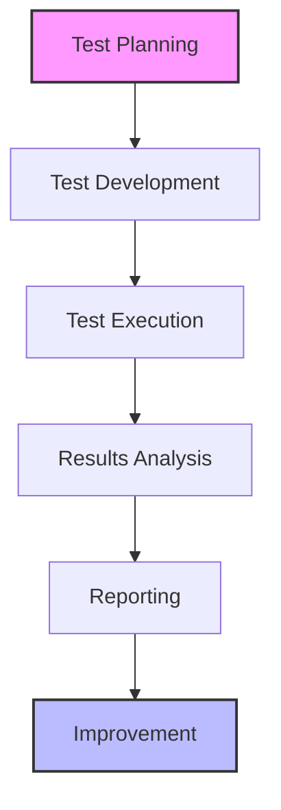
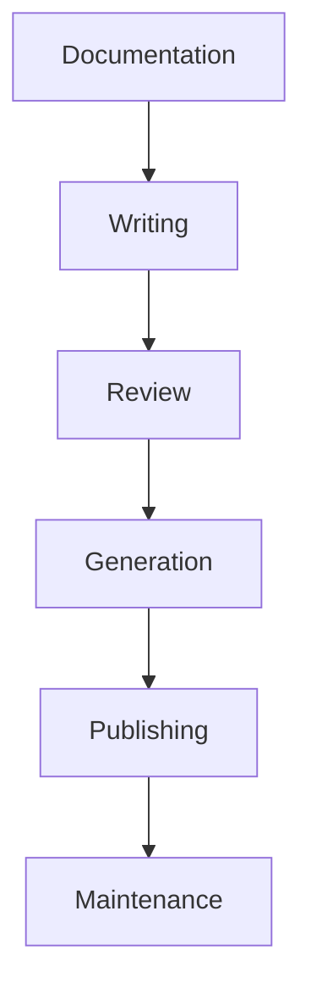

# LLM Development Tools and Environments Guide

## Overview

This guide outlines essential tools, environments, and configurations for effective LLM-driven development, focusing on productivity, reliability, and maintainability of the development process.

## Development Environment

### 1. IDE Configuration

#### Core Components


#### Setup Template
```markdown
# IDE Setup Guide
## Core Configuration
1. Editor Settings
   - Language support
   - Code formatting
   - Syntax highlighting
   - Auto-completion

2. Extensions
   - LLM integration
   - Code analysis
   - Documentation
   - Testing

## Project Configuration
1. Workspace Setup
   - Project structure
   - Build configuration
   - Debug settings
   - Run configurations

2. Version Control
   - Git integration
   - Branch management
   - Code review
   - CI/CD integration
```

### 2. LLM Integration Tools

#### Tool Categories
```markdown
# LLM Tools Framework
## Development Tools
1. Code Generation
   - Prompt templates
   - Code snippets
   - Documentation
   - Testing

2. Code Analysis
   - Review assistance
   - Refactoring
   - Optimization
   - Security checks

## Support Tools
1. Documentation
   - API documentation
   - Code comments
   - Usage examples
   - Troubleshooting

2. Testing
   - Test generation
   - Coverage analysis
   - Performance testing
   - Security testing
```

#### Integration Setup
```markdown
# Integration Configuration
## Tool Setup
1. API Configuration
   - Endpoints
   - Authentication
   - Rate limiting
   - Error handling

2. Local Setup
   - Cache configuration
   - Proxy settings
   - Logging
   - Monitoring

## Usage Guidelines
1. Best Practices
   - Prompt design
   - Response handling
   - Error management
   - Performance optimization

2. Workflow Integration
   - Development process
   - Code review
   - Documentation
   - Testing
```

### 3. Version Control

#### Git Configuration
```markdown
# Version Control Setup
## Repository Structure
1. Branch Strategy
   - Main branches
   - Feature branches
   - Release branches
   - Hotfix branches

2. Workflow
   - Branch creation
   - Code review
   - Merge process
   - Release management

## Integration
1. CI/CD Pipeline
   - Build process
   - Testing
   - Deployment
   - Monitoring

2. Code Review
   - Review process
   - Guidelines
   - Automation
   - Documentation
```

#### Workflow Diagram


## Development Tools

### 1. Code Generation Tools

#### Tool Framework
```markdown
# Code Generation Tools
## Primary Tools
1. LLM Integration
   - API access
   - Templates
   - Configuration
   - Output handling

2. Code Scaffolding
   - Project templates
   - Component generation
   - Test generation
   - Documentation

## Support Tools
1. Code Analysis
   - Static analysis
   - Dynamic analysis
   - Security scanning
   - Performance profiling

2. Documentation
   - API documentation
   - Code comments
   - Usage examples
   - Troubleshooting
```

#### Usage Guidelines
```markdown
# Tool Usage Guide
## Implementation
1. Setup Process
   - Installation
   - Configuration
   - Integration
   - Validation

2. Usage Workflow
   - Code generation
   - Review process
   - Documentation
   - Testing

## Best Practices
1. Code Quality
   - Standards
   - Review process
   - Testing
   - Documentation

2. Performance
   - Optimization
   - Monitoring
   - Analysis
   - Improvement
```

### 2. Testing Tools

#### Testing Framework
```markdown
# Testing Tools Setup
## Test Categories
1. Unit Testing
   - Test framework
   - Mock tools
   - Coverage tools
   - Analysis tools

2. Integration Testing
   - API testing
   - End-to-end testing
   - Performance testing
   - Security testing

## Implementation
1. Test Setup
   - Configuration
   - Data setup
   - Environment
   - Documentation

2. Test Execution
   - Running tests
   - Results analysis
   - Reporting
   - Maintenance
```

#### Testing Process


### 3. Documentation Tools

#### Documentation Framework
```markdown
# Documentation Tools
## Core Tools
1. API Documentation
   - Generator tools
   - Templates
   - Integration
   - Publishing

2. Code Documentation
   - Comment tools
   - Style guides
   - Generation
   - Validation

## Support Tools
1. Diagram Tools
   - Architecture diagrams
   - Flow diagrams
   - Sequence diagrams
   - Component diagrams

2. Publishing Tools
   - Static site generators
   - Version control
   - Search integration
   - Access control
```

#### Documentation Process


## Best Practices

### 1. Tool Management

#### Selection Criteria
- Integration capabilities
- Maintenance requirements
- Community support
- Documentation quality

#### Implementation Strategy
- Phased rollout
- Team training
- Support process
- Feedback collection

### 2. Environment Management

#### Setup Guidelines
- Standard configuration
- Version control
- Dependency management
- Security settings

#### Maintenance Process
- Regular updates
- Performance monitoring
- Security patches
- Backup strategy

## Common Challenges

### 1. Tool Issues
- Integration problems
- Performance impact
- Learning curve
- Maintenance overhead

### 2. Environment Problems
- Configuration drift
- Dependency conflicts
- Resource constraints
- Security vulnerabilities

## Templates and Examples

### 1. Environment Setup Template
```markdown
# Development Environment Setup
## Overview
Environment: [Environment name]
Purpose: [Environment purpose]
Scope: [Setup scope]

## Configuration
### Tools
1. [Tool 1]
   - Version
   - Configuration
   - Integration
   - Usage

2. [Tool 2]
   - Version
   - Configuration
   - Integration
   - Usage

## Guidelines
1. [Guideline 1]
   - Purpose
   - Implementation
   - Validation
   - Maintenance

2. [Guideline 2]
   - Purpose
   - Implementation
   - Validation
   - Maintenance
```

### 2. Tool Integration Template
```markdown
# Tool Integration Plan
## Overview
Tool: [Tool name]
Purpose: [Integration purpose]
Scope: [Integration scope]

## Implementation
### Setup
1. [Phase 1]
   - Tasks
   - Configuration
   - Testing
   - Documentation

2. [Phase 2]
   - Tasks
   - Configuration
   - Testing
   - Documentation

## Validation
1. [Check 1]
   - Criteria
   - Process
   - Results
   - Actions

2. [Check 2]
   - Criteria
   - Process
   - Results
   - Actions
```

<!-- Usage Notes:
1. Regular tool review
2. Environment maintenance
3. Documentation updates
4. Team training
--> 