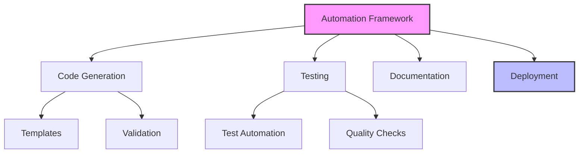
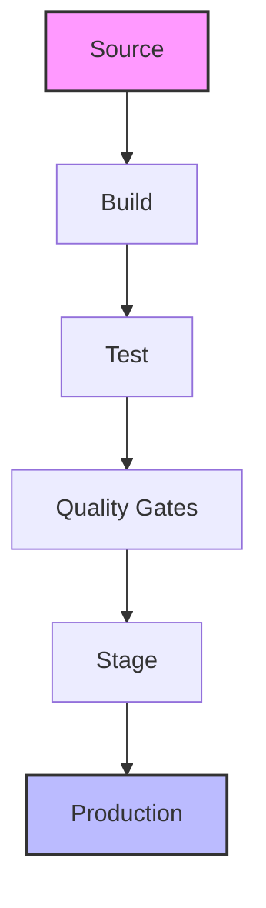
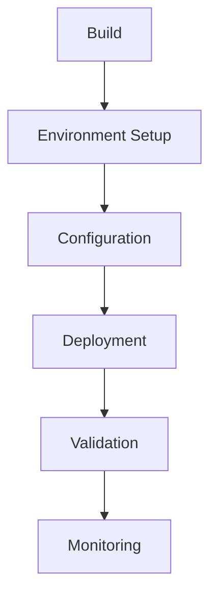
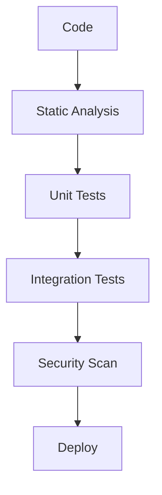

# Automation and CI/CD Integration Guide

## Overview

This guide outlines strategies for automating LLM-driven development processes and integrating them into continuous integration and deployment pipelines, ensuring consistent, reliable, and efficient development workflows.

## Automation Framework

### 1. Process Automation

#### Automation Components


#### Automation Template
```markdown
# Process Automation Template
## Development Automation
1. Code Generation
   - Template management
   - Code scaffolding
   - Documentation
   - Testing

2. Code Analysis
   - Static analysis
   - Security scanning
   - Performance profiling
   - Quality checks

## Pipeline Automation
1. Build Process
   - Dependency management
   - Compilation
   - Asset generation
   - Packaging

2. Deployment Process
   - Environment setup
   - Configuration
   - Deployment
   - Validation
```

### 2. CI/CD Pipeline

#### Pipeline Structure
```markdown
# CI/CD Pipeline Framework
## Pipeline Stages
1. Build Stage
   - Code checkout
   - Dependency resolution
   - Compilation
   - Asset generation

2. Test Stage
   - Unit testing
   - Integration testing
   - Security scanning
   - Performance testing

3. Deploy Stage
   - Environment preparation
   - Configuration
   - Deployment
   - Validation

## Quality Gates
1. Code Quality
   - Static analysis
   - Code coverage
   - Security checks
   - Performance metrics

2. Release Quality
   - Integration tests
   - User acceptance
   - Performance validation
   - Security validation
```

#### Pipeline Flow


### 3. Environment Management

#### Environment Configuration
```markdown
# Environment Management Template
## Environment Types
1. Development
   - Configuration
   - Tools
   - Access
   - Monitoring

2. Staging
   - Configuration
   - Testing
   - Validation
   - Monitoring

3. Production
   - Configuration
   - Security
   - Monitoring
   - Backup

## Management Process
1. Setup
   - Infrastructure
   - Configuration
   - Tools
   - Documentation

2. Maintenance
   - Updates
   - Monitoring
   - Backup
   - Recovery
```

#### Deployment Process


## CI/CD Integration

### 1. Pipeline Configuration

#### Configuration Framework
```markdown
# Pipeline Configuration Template
## Build Configuration
1. Source Control
   - Repository setup
   - Branch strategy
   - Merge process
   - Hooks

2. Build Process
   - Dependencies
   - Compilation
   - Testing
   - Packaging

## Deployment Configuration
1. Environment Setup
   - Infrastructure
   - Configuration
   - Security
   - Monitoring

2. Deployment Process
   - Strategy
   - Rollback
   - Validation
   - Monitoring
```

#### Integration Points
```markdown
# Integration Points Template
## Development Integration
1. Code Generation
   - Templates
   - Validation
   - Documentation
   - Testing

2. Code Analysis
   - Quality checks
   - Security scanning
   - Performance testing
   - Documentation

## Deployment Integration
1. Environment Setup
   - Configuration
   - Security
   - Monitoring
   - Backup

2. Release Process
   - Validation
   - Deployment
   - Monitoring
   - Rollback
```

### 2. Quality Automation

#### Quality Framework
```markdown
# Quality Automation Template
## Code Quality
1. Static Analysis
   - Code style
   - Best practices
   - Security
   - Performance

2. Dynamic Analysis
   - Unit tests
   - Integration tests
   - Performance tests
   - Security tests

## Process Quality
1. Build Quality
   - Dependency check
   - Compilation
   - Asset generation
   - Packaging

2. Deployment Quality
   - Configuration
   - Security
   - Performance
   - Reliability
```

#### Quality Gates


### 3. Monitoring and Alerts

#### Monitoring Framework
```markdown
# Monitoring Template
## System Monitoring
1. Performance Metrics
   - Response time
   - Resource usage
   - Error rates
   - Throughput

2. Health Metrics
   - Service status
   - Dependencies
   - Security
   - Backup status

## Process Monitoring
1. Pipeline Metrics
   - Build success
   - Test coverage
   - Deployment success
   - Recovery time

2. Quality Metrics
   - Code quality
   - Test quality
   - Documentation
   - Security
```

#### Alert Configuration
```markdown
# Alert Configuration Template
## System Alerts
1. Performance Alerts
   - Thresholds
   - Triggers
   - Notifications
   - Actions

2. Health Alerts
   - Service checks
   - Dependency checks
   - Security alerts
   - Backup alerts

## Process Alerts
1. Pipeline Alerts
   - Build failures
   - Test failures
   - Deployment issues
   - Quality gates

2. Quality Alerts
   - Code quality
   - Test coverage
   - Security issues
   - Documentation
```

## Best Practices

### 1. Pipeline Management

#### Pipeline Guidelines
- Consistent configuration
- Automated testing
- Quality gates
- Monitoring

#### Maintenance Strategy
- Regular updates
- Performance tuning
- Security patches
- Documentation

### 2. Automation Management

#### Process Guidelines
- Standard workflows
- Error handling
- Recovery procedures
- Documentation

#### Quality Control
- Automated testing
- Code review
- Security scanning
- Performance testing

## Common Challenges

### 1. Pipeline Issues
- Configuration drift
- Integration problems
- Performance impact
- Reliability issues

### 2. Automation Problems
- Process complexity
- Maintenance overhead
- Error handling
- Resource constraints

## Templates and Examples

### 1. Pipeline Configuration Template
```markdown
# Pipeline Configuration
## Overview
Pipeline: [Pipeline name]
Purpose: [Pipeline purpose]
Scope: [Configuration scope]

## Stages
### Build
1. [Stage 1]
   - Steps
   - Configuration
   - Validation
   - Output

2. [Stage 2]
   - Steps
   - Configuration
   - Validation
   - Output

## Quality Gates
1. [Gate 1]
   - Criteria
   - Validation
   - Actions
   - Documentation

2. [Gate 2]
   - Criteria
   - Validation
   - Actions
   - Documentation
```

### 2. Automation Script Template
```markdown
# Automation Script
## Overview
Script: [Script name]
Purpose: [Script purpose]
Scope: [Script scope]

## Implementation
### Process
1. [Step 1]
   - Actions
   - Validation
   - Error handling
   - Logging

2. [Step 2]
   - Actions
   - Validation
   - Error handling
   - Logging

## Validation
1. [Check 1]
   - Criteria
   - Process
   - Results
   - Actions

2. [Check 2]
   - Criteria
   - Process
   - Results
   - Actions
```

<!-- Usage Notes:
1. Regular pipeline review
2. Automation maintenance
3. Documentation updates
4. Team training
--> 