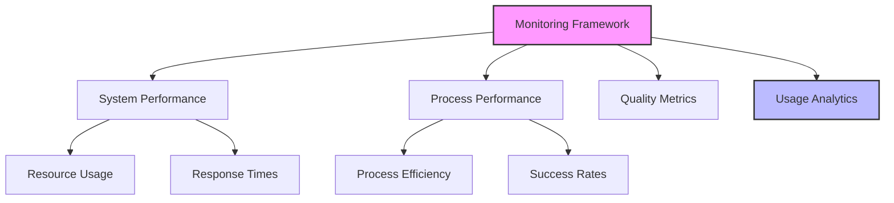
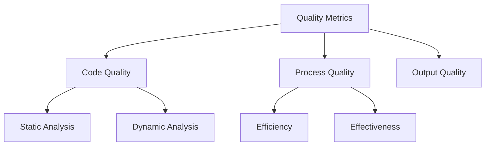
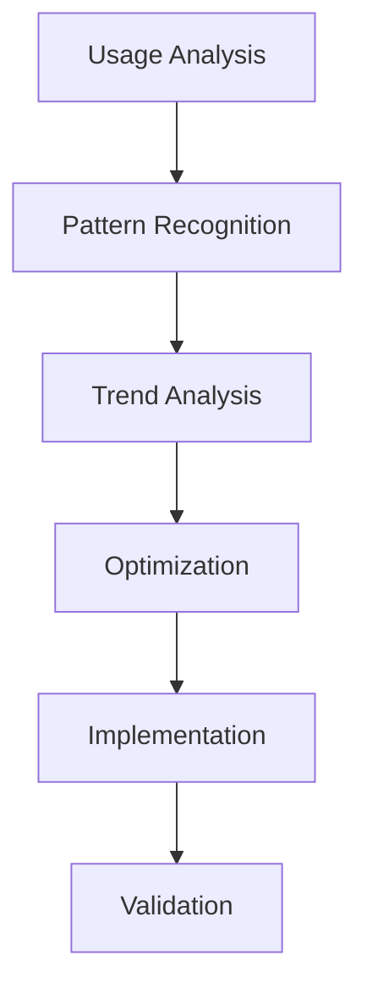
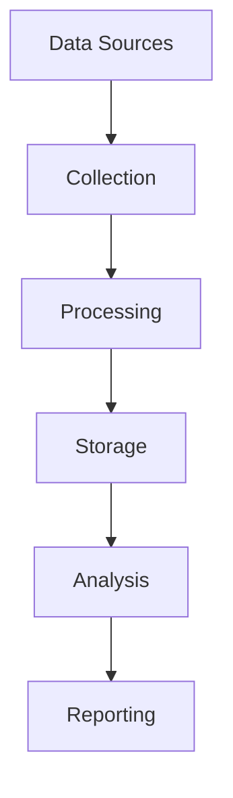

# Monitoring and Analytics Guide

## Overview

This guide outlines comprehensive strategies for monitoring LLM-driven development processes and analyzing their effectiveness, focusing on performance, quality, and continuous improvement through data-driven insights.

## Monitoring Framework

### 1. Performance Monitoring

#### Monitoring Components


#### Metrics Framework
```markdown
# Performance Metrics Template
## System Metrics
1. Resource Usage
   - CPU utilization
   - Memory usage
   - Network traffic
   - Storage usage

2. Response Metrics
   - Response times
   - Throughput
   - Error rates
   - Latency

## Process Metrics
1. Efficiency Metrics
   - Process duration
   - Resource efficiency
   - Cost efficiency
   - Quality metrics

2. Success Metrics
   - Completion rates
   - Error rates
   - Recovery rates
   - Quality scores
```

### 2. Quality Monitoring

#### Quality Framework
```markdown
# Quality Monitoring Template
## Code Quality
1. Static Analysis
   - Code standards
   - Best practices
   - Security checks
   - Performance analysis

2. Dynamic Analysis
   - Test coverage
   - Runtime behavior
   - Error handling
   - Performance metrics

## Process Quality
1. Development Quality
   - Code review metrics
   - Documentation quality
   - Test quality
   - Deployment success

2. Operational Quality
   - System reliability
   - Service availability
   - Error recovery
   - User satisfaction
```

#### Quality Metrics


### 3. Usage Analytics

#### Analytics Framework
```markdown
# Usage Analytics Template
## System Usage
1. Resource Utilization
   - API usage
   - Storage usage
   - Network usage
   - Compute usage

2. Performance Patterns
   - Usage patterns
   - Peak periods
   - Bottlenecks
   - Optimization opportunities

## User Interaction
1. Usage Patterns
   - Feature usage
   - User behavior
   - Error patterns
   - Success patterns

2. User Experience
   - Response times
   - Error rates
   - Success rates
   - Satisfaction metrics
```

#### Usage Patterns


## Analytics Framework

### 1. Data Collection

#### Collection Framework
```markdown
# Data Collection Template
## System Data
1. Performance Data
   - Resource metrics
   - Response metrics
   - Error metrics
   - Usage metrics

2. Process Data
   - Development metrics
   - Quality metrics
   - Efficiency metrics
   - Success metrics

## Analysis Data
1. Trend Data
   - Usage patterns
   - Performance trends
   - Quality trends
   - Cost trends

2. Impact Data
   - Business impact
   - Technical impact
   - User impact
   - Cost impact
```

#### Collection Process


### 2. Data Analysis

#### Analysis Framework
```markdown
# Analysis Template
## Performance Analysis
1. System Performance
   - Resource efficiency
   - Response efficiency
   - Error patterns
   - Optimization opportunities

2. Process Performance
   - Development efficiency
   - Quality metrics
   - Cost efficiency
   - Success rates

## Impact Analysis
1. Technical Impact
   - System improvements
   - Process improvements
   - Quality improvements
   - Cost reductions

2. Business Impact
   - Productivity gains
   - Quality improvements
   - Cost savings
   - User satisfaction
```

#### Analysis Process
```markdown
# Analysis Process Template
## Data Processing
1. Data Preparation
   - Collection
   - Cleaning
   - Transformation
   - Validation

2. Analysis Steps
   - Pattern recognition
   - Trend analysis
   - Impact assessment
   - Recommendations

## Results
1. Findings
   - Key insights
   - Patterns
   - Trends
   - Impacts

2. Recommendations
   - Improvements
   - Optimizations
   - Changes
   - Validations
```

### 3. Reporting and Visualization

#### Reporting Framework
```markdown
# Reporting Template
## Performance Reports
1. System Performance
   - Resource usage
   - Response times
   - Error rates
   - Trends

2. Process Performance
   - Efficiency metrics
   - Quality metrics
   - Success rates
   - Trends

## Analysis Reports
1. Trend Analysis
   - Usage patterns
   - Performance patterns
   - Quality patterns
   - Cost patterns

2. Impact Analysis
   - Technical impact
   - Business impact
   - User impact
   - Cost impact
```

#### Visualization Types
```markdown
# Visualization Template
## Performance Visualizations
1. System Metrics
   - Resource usage graphs
   - Response time charts
   - Error rate trends
   - Usage patterns

2. Process Metrics
   - Efficiency charts
   - Quality trends
   - Success rates
   - Cost analysis

## Analysis Visualizations
1. Trend Analysis
   - Pattern graphs
   - Trend lines
   - Correlation charts
   - Impact analysis

2. Comparative Analysis
   - Benchmark comparisons
   - Historical trends
   - Performance comparisons
   - Cost analysis
```

## Best Practices

### 1. Monitoring Management

#### Collection Guidelines
- Comprehensive metrics
- Regular collection
- Data validation
- Storage optimization

#### Analysis Strategy
- Regular analysis
- Pattern recognition
- Trend analysis
- Impact assessment

### 2. Analytics Management

#### Process Guidelines
- Standard analysis
- Regular reporting
- Clear visualization
- Action planning

#### Quality Control
- Data accuracy
- Analysis quality
- Report clarity
- Recommendation quality

## Common Challenges

### 1. Data Issues
- Collection problems
- Quality issues
- Storage limitations
- Analysis complexity

### 2. Process Problems
- Resource constraints
- Analysis limitations
- Reporting delays
- Implementation challenges

## Templates and Examples

### 1. Monitoring Configuration Template
```markdown
# Monitoring Configuration
## Overview
System: [System name]
Scope: [Monitoring scope]
Period: [Time period]

## Metrics
### Performance
1. [Metric 1]
   - Description
   - Collection
   - Analysis
   - Reporting

2. [Metric 2]
   - Description
   - Collection
   - Analysis
   - Reporting

## Analysis
1. [Analysis 1]
   - Purpose
   - Process
   - Output
   - Actions

2. [Analysis 2]
   - Purpose
   - Process
   - Output
   - Actions
```

### 2. Analytics Report Template
```markdown
# Analytics Report
## Overview
Report: [Report name]
Period: [Analysis period]
Focus: [Analysis focus]

## Analysis
### Findings
1. [Finding 1]
   - Description
   - Impact
   - Trend
   - Recommendation

2. [Finding 2]
   - Description
   - Impact
   - Trend
   - Recommendation

## Recommendations
1. [Action 1]
   - Purpose
   - Implementation
   - Impact
   - Validation

2. [Action 2]
   - Purpose
   - Implementation
   - Impact
   - Validation
```

<!-- Usage Notes:
1. Regular monitoring review
2. Analytics maintenance
3. Report updates
4. Process improvement
--> 