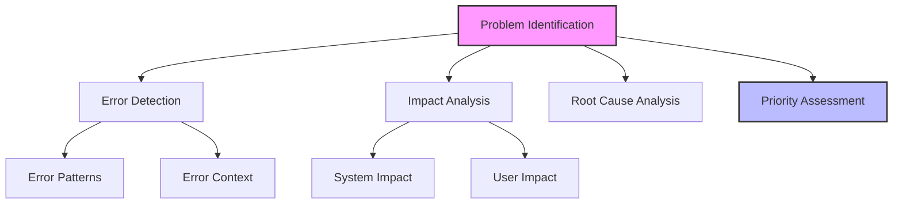
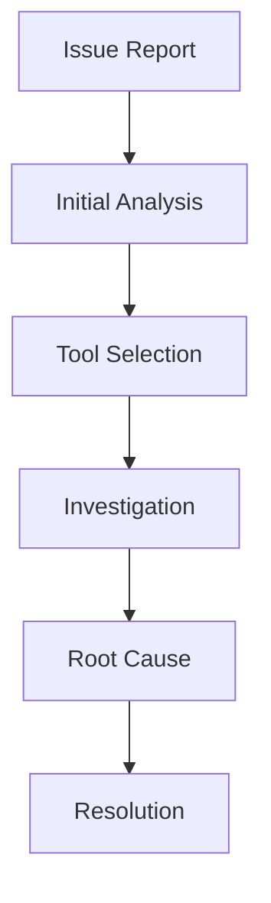
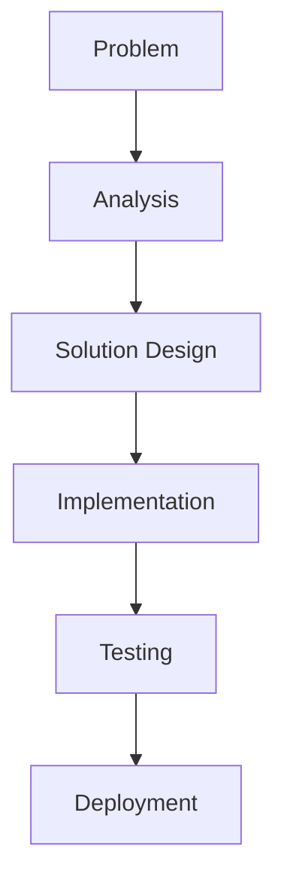
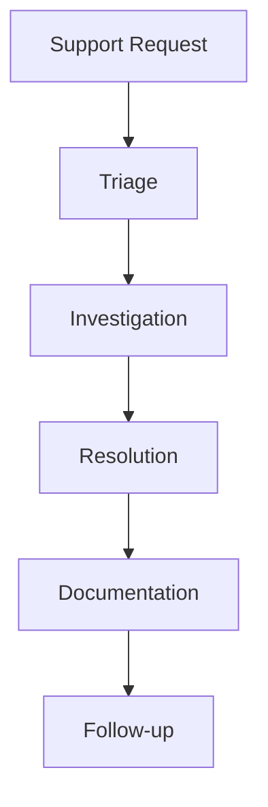

# Troubleshooting and Support Tools Guide

## Overview

This guide outlines comprehensive strategies and tools for troubleshooting issues in LLM-driven development and providing effective support, focusing on problem identification, resolution, and continuous improvement of support processes.

## Troubleshooting Framework

### 1. Problem Identification

#### Identification Components


#### Problem Template
```markdown
# Problem Analysis Template
## Error Information
1. Error Details
   - Error type
   - Error message
   - Stack trace
   - Context

2. Impact Assessment
   - System impact
   - User impact
   - Business impact
   - Dependencies

## Analysis
1. Initial Assessment
   - Severity
   - Priority
   - Scope
   - Dependencies

2. Root Cause Analysis
   - Error patterns
   - Contributing factors
   - System state
   - Environmental factors
```

### 2. Diagnostic Tools

#### Tool Framework
```markdown
# Diagnostic Tools Template
## System Tools
1. Logging Tools
   - Log collection
   - Log analysis
   - Pattern detection
   - Correlation analysis

2. Monitoring Tools
   - Performance monitoring
   - Resource monitoring
   - Error tracking
   - Usage analytics

## Analysis Tools
1. Debug Tools
   - Code debugging
   - State inspection
   - Flow analysis
   - Performance profiling

2. Testing Tools
   - Unit testing
   - Integration testing
   - Load testing
   - Security testing
```

#### Diagnostic Process


### 3. Resolution Process

#### Resolution Framework
```markdown
# Resolution Process Template
## Investigation
1. Problem Analysis
   - Error analysis
   - Impact assessment
   - Root cause analysis
   - Solution options

2. Solution Design
   - Fix approach
   - Implementation plan
   - Testing strategy
   - Validation criteria

## Implementation
1. Fix Implementation
   - Code changes
   - Configuration updates
   - Environment changes
   - Documentation

2. Validation
   - Testing
   - Performance check
   - Security review
   - User acceptance
```

#### Resolution Flow


## Support Tools

### 1. Documentation Tools

#### Documentation Framework
```markdown
# Support Documentation Template
## User Documentation
1. Usage Guides
   - Features
   - Workflows
   - Configuration
   - Troubleshooting

2. Error Guides
   - Common errors
   - Resolution steps
   - Prevention tips
   - Contact information

## Technical Documentation
1. System Documentation
   - Architecture
   - Components
   - Dependencies
   - Configuration

2. Support Documentation
   - Troubleshooting guides
   - Debug procedures
   - Recovery processes
   - Escalation paths
```

#### Documentation Process
```markdown
# Documentation Process
## Content Creation
1. Initial Draft
   - Content outline
   - Key information
   - Examples
   - References

2. Review Process
   - Technical review
   - User review
   - Updates
   - Publication

## Maintenance
1. Regular Updates
   - Content review
   - Updates
   - Validation
   - Distribution

2. Version Control
   - Change tracking
   - Version management
   - Archive
   - Access control
```

### 2. Communication Tools

#### Communication Framework
```markdown
# Communication Tools Template
## Support Channels
1. Direct Support
   - Chat support
   - Email support
   - Phone support
   - Video support

2. Self-Service
   - Knowledge base
   - FAQs
   - Tutorials
   - Forums

## Process Tools
1. Issue Tracking
   - Ticket system
   - Status tracking
   - Priority management
   - Resolution tracking

2. Collaboration
   - Team communication
   - Knowledge sharing
   - Documentation
   - Training
```

#### Support Process


### 3. Analysis Tools

#### Analysis Framework
```markdown
# Analysis Tools Template
## Performance Analysis
1. System Analysis
   - Performance metrics
   - Resource usage
   - Error patterns
   - Usage patterns

2. Process Analysis
   - Resolution time
   - Success rate
   - User satisfaction
   - Cost efficiency

## Impact Analysis
1. Technical Impact
   - System stability
   - Performance impact
   - Security impact
   - Maintenance impact

2. Business Impact
   - User productivity
   - System availability
   - Support costs
   - User satisfaction
```

#### Analysis Process
```markdown
# Analysis Process
## Data Collection
1. System Data
   - Performance data
   - Error data
   - Usage data
   - Cost data

2. Process Data
   - Resolution metrics
   - Quality metrics
   - Efficiency metrics
   - Satisfaction metrics

## Analysis
1. Pattern Analysis
   - Trend analysis
   - Root cause analysis
   - Impact analysis
   - Cost analysis

2. Recommendations
   - Process improvements
   - System improvements
   - Tool improvements
   - Training needs
```

## Best Practices

### 1. Support Management

#### Process Guidelines
- Clear procedures
- Regular training
- Knowledge sharing
- Quality control

#### Tool Management
- Regular updates
- Integration testing
- Performance monitoring
- Security reviews

### 2. Quality Management

#### Quality Guidelines
- Standard procedures
- Documentation quality
- Response time
- Resolution quality

#### Improvement Process
- Regular review
- Feedback collection
- Process updates
- Training updates

## Common Challenges

### 1. Support Issues
- Complex problems
- Resource constraints
- Knowledge gaps
- Tool limitations

### 2. Process Problems
- Communication issues
- Documentation gaps
- Tool integration
- Quality control

## Templates and Examples

### 1. Troubleshooting Template
```markdown
# Troubleshooting Guide
## Overview
Issue: [Issue description]
Priority: [Priority level]
Impact: [Impact assessment]

## Investigation
### Steps
1. [Step 1]
   - Action
   - Tools
   - Results
   - Next steps

2. [Step 2]
   - Action
   - Tools
   - Results
   - Next steps

## Resolution
1. [Solution 1]
   - Implementation
   - Validation
   - Documentation
   - Follow-up

2. [Solution 2]
   - Implementation
   - Validation
   - Documentation
   - Follow-up
```

### 2. Support Process Template
```markdown
# Support Process
## Overview
Process: [Process name]
Scope: [Process scope]
Tools: [Required tools]

## Steps
### Investigation
1. [Step 1]
   - Actions
   - Tools
   - Documentation
   - Validation

2. [Step 2]
   - Actions
   - Tools
   - Documentation
   - Validation

## Resolution
1. [Action 1]
   - Implementation
   - Testing
   - Documentation
   - Follow-up

2. [Action 2]
   - Implementation
   - Testing
   - Documentation
   - Follow-up
```

<!-- Usage Notes:
1. Regular process review
2. Tool maintenance
3. Documentation updates
4. Team training
--> 