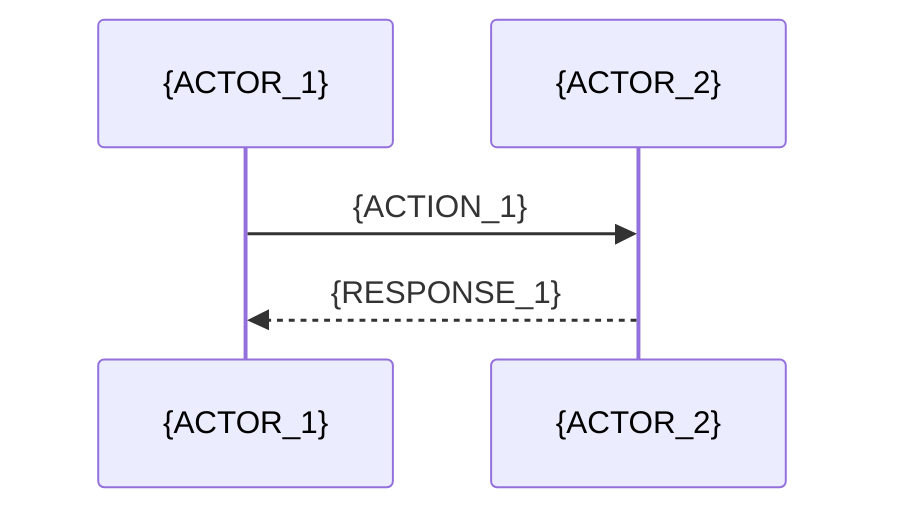
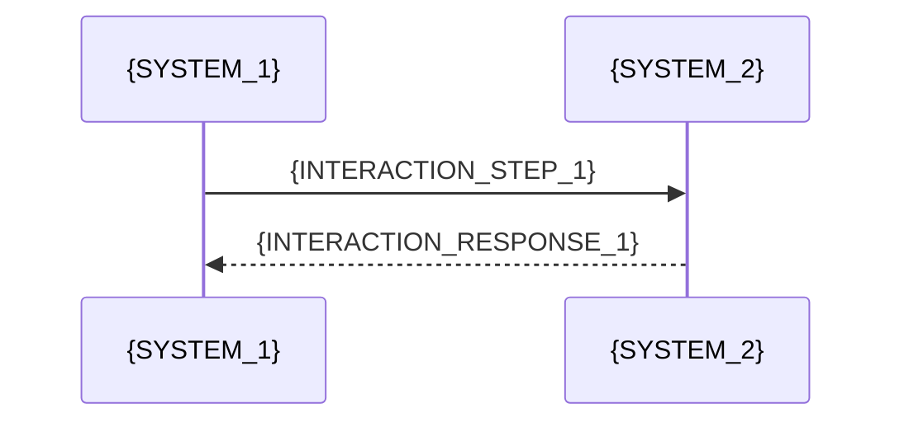

# {SYSTEM_NAME} - Architecture Document

## System Overview

{HIGH_LEVEL_ARCHITECTURE_DESCRIPTION}

## Core Architecture Components

**{COMPONENT_CATEGORY_1}**
- {COMPONENT_1_DESCRIPTION}
- {COMPONENT_2_DESCRIPTION}
- {COMPONENT_3_DESCRIPTION}

**{COMPONENT_CATEGORY_2}**
```typescript
// Core type definitions
type {TYPE_NAME} = {
  {TYPE_DEFINITION}
}
```

## System Components

### {COMPONENT_1}
**Purpose**: {COMPONENT_1_PURPOSE}
```typescript
class {CLASS_NAME} {
  {CLASS_DEFINITION}
}
```

### {COMPONENT_2}
**Purpose**: {COMPONENT_2_PURPOSE}
```typescript
class {CLASS_NAME_2} {
  {CLASS_DEFINITION_2}
}
```

## Processing Flow

### {FLOW_1}


### {FLOW_2}
```mermaid
stateDiagram-v2
    [*] --> {STATE_1}
    {STATE_1} --> {STATE_2}: {CONDITION_1}
    {STATE_2} --> [*]
```

## Technical Constraints

**{CONSTRAINT_CATEGORY_1}**
- {CONSTRAINT_1}
- {CONSTRAINT_2}
- {CONSTRAINT_3}

## Security Architecture

**{SECURITY_DOMAIN_1}**
- {SECURITY_MEASURE_1}
- {SECURITY_MEASURE_2}
- {SECURITY_MEASURE_3}

## Error Handling

**{ERROR_STRATEGY}**
```typescript
interface {ERROR_INTERFACE} {
  {ERROR_INTERFACE_DEFINITION}
}
```

## Monitoring & Observability

**{MONITORING_CATEGORY}**
- {METRIC_1}
- {METRIC_2}
- {METRIC_3}

## Integration Points

**{INTEGRATION_CATEGORY}**
```typescript
{INTEGRATION_CODE_EXAMPLE}
```

## System Interactions

### {INTERACTION_1} Flow


### System Architecture
```mermaid
classDiagram
    class {CLASS_1} {
        {CLASS_1_DEFINITION}
    }
    
    class {CLASS_2} {
        {CLASS_2_DEFINITION}
    }
    
    {CLASS_1} --> {CLASS_2}
```

<!-- Template Usage Instructions:
1. Replace all {PLACEHOLDER} values with actual content
2. Include relevant diagrams using mermaid syntax
3. Document all technical constraints
4. Provide clear component interactions
5. Include security considerations
6. Add monitoring requirements
7. Document integration points
--> 