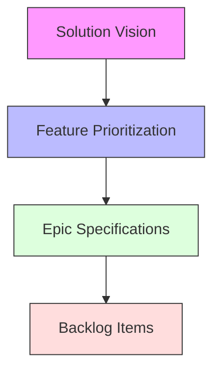

# Backlog Construction Process

## Foundational Inputs


## Phase 1: Vision Alignment
**Input**: `solution-vision-template.md`  
**Output**: Marked epic candidates

1. Extract MVP features from vision doc
2. Group related features into epic themes
3. Document in `epic-template.md`:
   ```markdown
   ## Strategic Alignment
   - Business Goal: {From Vision > Business Goals}
   - Success Metrics: {From Vision > Success Criteria}
   ```

## Phase 2: Feature Breakdown
**Input**: `feature-prioritization-template.md`  
**Output**: Technical enablers list

1. For each high-priority feature:
   ```typescript
   interface FeatureBreakdown {
     userStories: string[];
     technicalEnablers: string[];
     risks: string[];
   }
   ```
2. Create enabler tickets referencing:
   - Architecture docs
   - Core rules
   - System specifications

## Phase 3: Backlog Item Creation
**Input**: `backlog-item-specification-template.md`  
**Output**: Ready backlog items

### User Story Checklist
- [ ] Linked to parent epic
- [ ] BDD scenarios defined
- [ ] Technical constraints documented
- [ ] LLM guidance included

### Enabler Checklist
- [ ] Architecture impact analyzed
- [ ] Quality gates defined
- [ ] Implementation steps outlined

## Phase 4: Sprint Readiness
**Input**: Prioritized backlog  
**Output**: Sprint backlog

1. Apply KISS filters:
   ```mermaid
   graph TD
      A[All Items] --> B{Can be split?}
      B -->|Yes| C[Split]
      B -->|No| D{Meets DoD?}
      D -->|Yes| E[Ready]
      D -->|No| F[Needs refinement]
   ```
2. Validate against quality gates:
   - Architecture alignment
   - Security requirements
   - BDD completeness

## Quality Gates

### Epic-Level
- [ ] Strategic alignment confirmed
- [ ] Architecture impact documented
- [ ] Success metrics measurable

### Story-Level
- [ ] BDD scenarios executable
- [ ] Technical constraints valid
- [ ] LLM guidance sufficient

### Enabler-Level
- [ ] Core rules referenced
- [ ] Implementation steps clear
- [ ] Quality gates defined

## Process Improvement

### Retrospective Checklist
1. Measure cycle time from vision to ready
2. Track rework percentage
3. Identify documentation gaps
4. Update templates if needed

<!-- Usage Instructions:
1. Start with existing vision docs
2. Maintain traceability
3. Validate at each gate
4. Improve incrementally
--> 