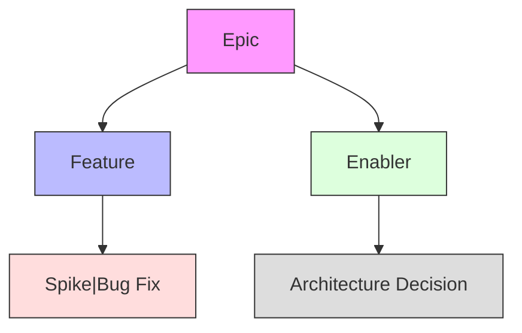

# {EPIC_NAME} - Epic Specification

## Strategic Alignment
- **Business Goal**: {GOAL_REFERENCE}
- **Architecture Impact**: {COMPONENT_REFERENCE}
- **Success Metrics**: 
  - {METRIC_1}: {TARGET}
  - {METRIC_2}: {TARGET}

## Technical Context
```typescript
// Core interfaces impacted
interface EpicContext {
  systemDependencies: string[];
  architecturalPatterns: string[];
  qualityAttributes: string[];
}
```

## Backlog Relationship Rules


## BDD Acceptance Criteria
```gherkin
Feature: {EPIC_NAME}
  As a {STAKEHOLDER_ROLE}
  I need {EPIC_CAPABILITY}
  So that {BUSINESS_OUTCOME}

  @epic
  Scenario: Core business value delivery
    Given {INITIAL_STATE}
    When {MAIN_ACTION}
    Then {OUTCOME_MEASUREMENT}

  @quality
  Scenario: Quality attribute validation
    Given {SYSTEM_CONDITION}
    When {LOAD_OR_EVENT}
    Then {PERFORMANCE_TARGET}
```

<!-- Template Usage Instructions:
1. Reference architecture-document-template.md for technical details
2. Link to feature-prioritization-template.md
3. Maintain traceability to solution-vision-template.md
4. Validate against core-rules-template.yaml
5. Update during sprint reviews
--> 