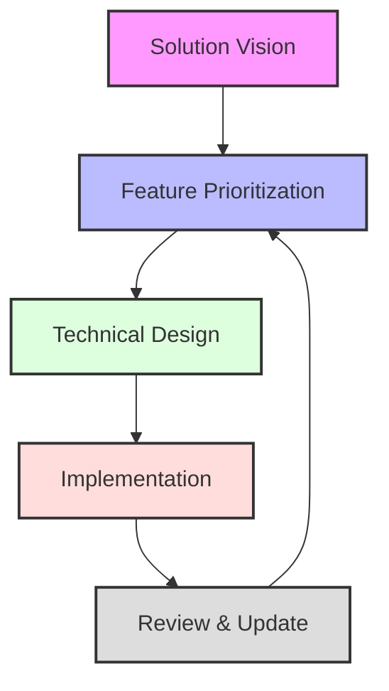

# LLM-Driven Development Quick Reference

## Document Flow

## Daily Checklist

### Morning (15 mins)
- [ ] Review sprint goals
- [ ] Check technical constraints
- [ ] Plan day's work

### Development Loop
- [ ] Follow core rules
- [ ] Update docs as needed
- [ ] Track KPIs

### End of Day (15 mins)
- [ ] Document learnings
- [ ] Update risks
- [ ] Plan tomorrow

## Document Usage Matrix

| Phase          | Primary Document       | When to Use        | When to Update    |
| -------------- | ---------------------- | ------------------ | ----------------- |
| Vision         | solution-vision        | Project start      | Business changes  |
| Planning       | feature-prioritization | Sprint planning    | Priority changes  |
| Technical      | agent-spec, core-rules | Pre-implementation | Pattern changes   |
| Implementation | architecture-doc       | During development | Component changes |

## Quality Gates Checklist

### Documentation
- [ ] Templates complete
- [ ] Metrics defined
- [ ] Dependencies mapped
- [ ] Assumptions valid

### Implementation
- [ ] Core rules followed
- [ ] Architecture aligned
- [ ] Security reviewed
- [ ] KPIs met

## Key Ceremonies

### Sprint Planning (75 mins)
1. Vision check (15m)
2. Feature selection (30m)
3. Technical planning (30m)

### Daily Sync (15 mins)
1. Goals review
2. Constraints check
3. Doc updates

### Sprint Review (60 mins)
1. Metrics review (30m)
2. Doc updates (30m)

### Retrospective (60 mins)
1. Doc review (30m)
2. Process adjustment (30m)

## Update Triggers

### Vision Document
- New requirements
- Market changes
- Success criteria changes

### Feature Matrix
- New features
- Changed priorities
- New dependencies

### Technical Docs
- New constraints
- Pattern updates
- Security changes

## Best Practices Summary

### Documentation
- Keep it lean
- Stay consistent
- Easy to access

### Process
- Stay agile
- Focus on value
- Maintain quality

### Tools
- Version control
- Agile integration
- LLM assistance

<!-- Quick Reference Notes:
1. Use as daily guide
2. Adapt timeboxes as needed
3. Focus on value delivery
4. Keep docs current
--> 