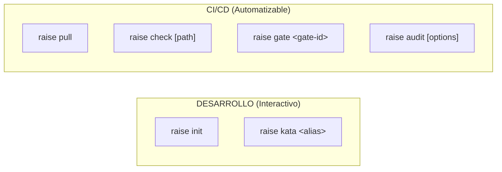
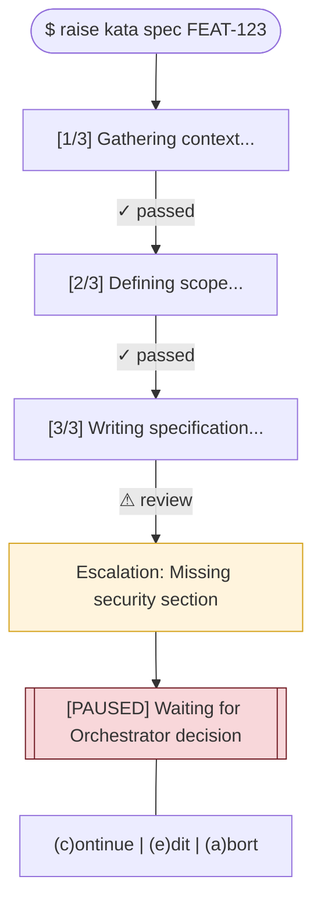
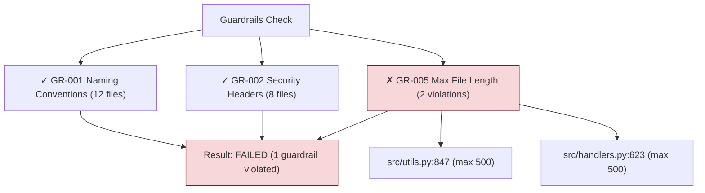
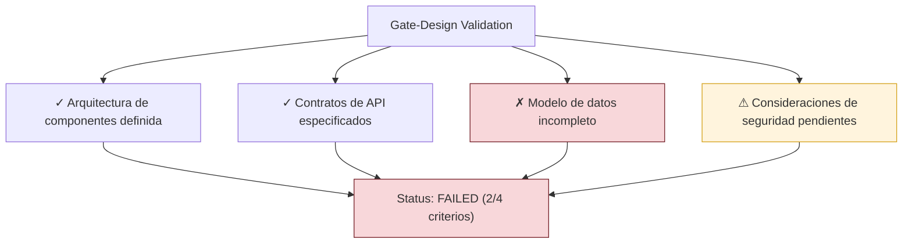
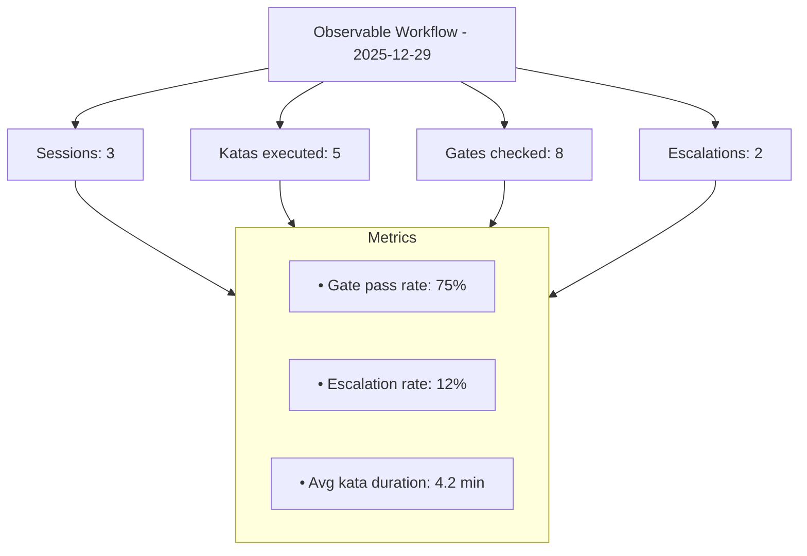
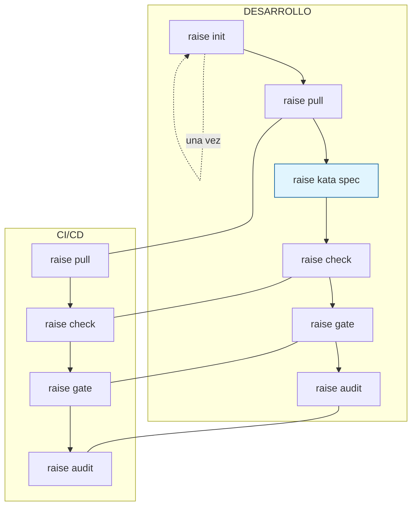

# RaiSE Commands Reference
## Referencia de Comandos CLI

**Versión:** 2.1.0  
**Fecha:** 29 de Diciembre, 2025  
**Propósito:** Documentar comandos disponibles para Orquestadores.

> **Nota v2.1:** Ontología de comandos rediseñada (ADR-010). `hydrate` → `pull`, `validate` → `kata`. Comandos clasificados por contexto de uso.

---

## Contextos de Uso

RaiSE CLI distingue dos contextos de uso con características distintas:

| Contexto | Características | Comandos |
|----------|-----------------|----------|
| **Desarrollo** | Interactivo, requiere Orquestador, puede escalar (Jidoka) | `init`, `kata` |
| **CI/CD** | Automatizado, sin humano, exit codes determinísticos | `pull`, `check`, `gate`, `audit` |



---

## Comandos MVP (v0.1)

| Comando | Contexto | Descripción |
|---------|----------|-------------|
| `raise init` | Dev | Inicializar proyecto |
| `raise pull` | Ambos | Sincronizar Golden Data |
| `raise kata` | Dev | Ejecutar proceso (Jidoka) |
| `raise check` | Ambos | Verificar guardrails |
| `raise gate` | Ambos | Verificar Validation Gate |
| `raise audit` | Ambos | Exportar Observable Workflow |

---

## raise init

Inicializa un proyecto con estructura RaiSE.

**Contexto:** Desarrollo (interactivo)

**Sintaxis:**
```bash
raise init [opciones]
```

**Opciones:**

| Flag | Descripción | Default |
|------|-------------|---------|
| `--agent <nombre>` | Agente objetivo | auto-detect |
| `--template <nombre>` | Template de proyecto | standard |
| `--config <url>` | URL de raise-config | default repo |
| `--skip-pull` | No sincronizar Golden Data | false |
| `--mcp` | Inicializar MCP server | true |

**Ejemplos:**
```bash
# Inicialización básica
raise init

# Con agente específico
raise init --agent cursor

# Sin sincronización inicial
raise init --skip-pull
```

**Resultado:**
```
.raise/
├── memory/
│   ├── constitution.md
│   └── guardrails.json
├── specs/
├── traces/
├── raise.yaml
└── README.md
```

---

## raise pull

Sincroniza Golden Data desde el repositorio central (raise-config).

**Contexto:** Desarrollo + CI/CD

**Sintaxis:**
```bash
raise pull [opciones]
```

**Opciones:**

| Flag | Descripción | Default |
|------|-------------|---------|
| `--config <url>` | URL de raise-config | desde raise.yaml |
| `--branch <nombre>` | Branch a sincronizar | main |
| `--force` | Sobrescribir cambios locales | false |
| `--guardrails-only` | Solo sincronizar guardrails | false |

**Ejemplos:**
```bash
# Sincronizar todo
raise pull

# Solo guardrails (rápido)
raise pull --guardrails-only

# Desde branch específico
raise pull --branch develop
```

**Exit Codes:**

| Código | Significado |
|--------|-------------|
| 0 | Sincronización exitosa |
| 1 | Error de conexión o conflicto |

**Resultado:**
- Actualiza `.raise/memory/guardrails.json`
- Sincroniza katas disponibles
- Actualiza templates
- Regenera recursos MCP

---

## raise kata

Ejecuta una Kata (proceso estructurado con Jidoka).

**Contexto:** Desarrollo (interactivo) — **No usar en CI/CD**

**Principio Jidoka:** Cada paso de la Kata tiene validación integrada. Si falla, el proceso se detiene y escala al Orquestador para decisión.

**Sintaxis:**
```bash
raise kata <alias|id> [target] [opciones]
```

**Aliases Disponibles:**

| Alias | Kata ID | Propósito |
|-------|---------|-----------|
| `spec` | L1-spec-writing | Crear especificación |
| `plan` | L1-implementation-plan | Crear plan de implementación |
| `design` | L1-technical-design | Crear diseño técnico |
| `review` | L2-code-review | Revisar código |
| `story` | L1-user-story | Crear User Story |

**Opciones:**

| Flag | Descripción | Default |
|------|-------------|---------|
| `--input <archivo>` | Archivo de entrada | - |
| `--output <archivo>` | Archivo de salida | auto |
| `--dry-run` | Mostrar pasos sin ejecutar | false |

**Ejemplos:**
```bash
# Ejecutar kata de especificación
raise kata spec FEAT-123

# Por ID explícito
raise kata L2-03 --input context.md

# Ver pasos sin ejecutar
raise kata plan --dry-run
```

**Flujo de Ejecución:**


**¿Por qué no en CI/CD?**
- Las Katas pueden requerir decisiones humanas (Escalation)
- El proceso es creativo, no solo verificación
- Sin Orquestador presente, no hay quién resuelva escalations

---

## raise check

Verifica código contra guardrails activos.

**Contexto:** Desarrollo + CI/CD

**Sintaxis:**
```bash
raise check [path] [opciones]
```

**Opciones:**

| Flag | Descripción | Default |
|------|-------------|---------|
| `--guardrails <ids>` | Solo verificar guardrails específicos | todos |
| `--format <fmt>` | Formato de salida (text/json) | text |
| `--strict` | Fallar en warnings | false |
| `--trace` | Registrar en Observable Workflow | true |

**Ejemplos:**
```bash
# Verificar proyecto completo
raise check

# Verificar directorio específico
raise check src/

# Solo ciertos guardrails
raise check --guardrails GR-001,GR-002

# Para CI/CD (JSON + strict)
raise check --format json --strict
```

**Exit Codes:**

| Código | Significado |
|--------|-------------|
| 0 | Sin errores |
| 1 | Errores encontrados |
| 2 | Warnings (con --strict) |

**Output Ejemplo:**


---

## raise gate

Verifica un Validation Gate del flujo de valor.

**Contexto:** Desarrollo + CI/CD

**Sintaxis:**
```bash
raise gate <gate-id> [opciones]
```

**Gates Estándar:**

| Gate ID | Fase | Pregunta Clave |
|---------|------|----------------|
| `Gate-Context` | Discovery | ¿Stakeholders claros? |
| `Gate-Discovery` | Discovery | ¿PRD validado? |
| `Gate-Vision` | Vision | ¿Alineación negocio-técnica? |
| `Gate-Design` | Design | ¿Arquitectura consistente? |
| `Gate-Backlog` | Planning | ¿HUs bien formadas? |
| `Gate-Plan` | Planning | ¿Pasos verificables? |
| `Gate-Code` | Implementation | ¿Código validado? |
| `Gate-Deploy` | Deployment | ¿Feature estable? |

**Opciones:**

| Flag | Descripción | Default |
|------|-------------|---------|
| `--artifact <ruta>` | Artefacto a validar | auto-detect |
| `--format <fmt>` | Formato (text/json) | text |

**Ejemplos:**
```bash
# Verificar gate de diseño
raise gate Gate-Design

# Con artefacto específico
raise gate Gate-Design --artifact specs/FEAT-123-design.md

# Para CI/CD
raise gate Gate-Code --format json
```

**Exit Codes:**

| Código | Significado |
|--------|-------------|
| 0 | Gate passed |
| 1 | Gate failed |

**Output Ejemplo:**


---

## raise audit

Exporta y reporta Observable Workflow.

**Contexto:** Desarrollo + CI/CD

**Sintaxis:**
```bash
raise audit [opciones]
```

**Opciones:**

| Flag | Descripción | Default |
|------|-------------|---------|
| `--session <id>` | Session específica | última |
| `--period <range>` | Período (today/week/month) | today |
| `--format <fmt>` | Formato (text/json/csv/md) | text |
| `--output <ruta>` | Guardar a archivo | stdout |
| `--metrics` | Incluir métricas agregadas | true |

**Ejemplos:**
```bash
# Auditoría de hoy
raise audit

# Última semana en Markdown
raise audit --period week --format md --output report.md

# Para CI/CD (JSON)
raise audit --format json --output traces.json
```

**Output Ejemplo:**


---

## Integración CI/CD

### GitHub Actions

```yaml
name: RaiSE Validation
on: [push, pull_request]

jobs:
  validate:
    runs-on: ubuntu-latest
    steps:
      - uses: actions/checkout@v4
      
      - name: Setup RaiSE
        run: pip install raise-kit
      
      # Sincronizar Golden Data
      - name: Pull Golden Data
        run: raise pull
      
      # Verificar guardrails
      - name: Check Guardrails
        run: raise check --format json --strict
      
      # Verificar gate de código
      - name: Validate Code Gate
        run: raise gate Gate-Code --format json
      
      # Exportar traces
      - name: Export Audit
        if: always()
        run: raise audit --format json --output traces.json
      
      - uses: actions/upload-artifact@v4
        if: always()
        with:
          name: raise-traces
          path: traces.json
```

### Pre-commit Hook

```yaml
# .pre-commit-config.yaml
repos:
  - repo: local
    hooks:
      - id: raise-check
        name: RaiSE Guardrails
        entry: raise check --strict
        language: system
        pass_filenames: false
```

### GitLab CI

```yaml
raise-validation:
  stage: test
  script:
    - pip install raise-kit
    - raise pull
    - raise check --format json --strict
    - raise gate Gate-Code
  artifacts:
    when: always
    paths:
      - traces.json
    reports:
      dotenv: raise-report.env
```

---

## Comandos Diferidos (v0.2+)

Los siguientes comandos están planificados pero excluidos del MVP:

| Comando | Versión | Propósito |
|---------|---------|-----------|
| `raise mcp` | v0.2 | Gestionar MCP server explícitamente |
| `raise guardrail` | v0.2 | Gestionar guardrails locales |
| `raise generate` | v0.2 | Generar artefactos desde templates |

---

## Migración desde v2.0

| Comando v2.0 | Comando v2.1 | Notas |
|--------------|--------------|-------|
| `raise hydrate` | `raise pull` | Alias temporal disponible |
| `raise validate` | `raise kata` | Semántica cambia: proceso, no validación |
| `--skip-hydrate` | `--skip-pull` | — |

**Aliases de compatibilidad** (disponibles hasta v1.0):
```bash
raise hydrate  # → Ejecuta raise pull con warning
```

---

## Resumen Visual



---

## Changelog

### v2.1.0 (2025-12-29)
- **BREAKING:** `raise hydrate` → `raise pull` (ADR-010)
- **BREAKING:** `raise validate` → `raise kata` (ADR-010)
- **NUEVO:** Clasificación de comandos por contexto (Dev vs CI/CD)
- **NUEVO:** Aliases de kata (spec, plan, design, review, story)
- **NUEVO:** Flag `--skip-pull` (reemplaza `--skip-hydrate`)
- **REMOVIDO:** Comandos diferidos a v0.2 (mcp, guardrail, generate)

### v2.0.0 (2025-12-28)
- Comandos para Validation Gates
- Comandos para Observable Workflow
- Terminología actualizada (guardrails, gates)

---

*Esta referencia documenta comandos CLI para RaiSE v0.1 MVP. Ver [ADR-010](./adr/adr-010-cli-ontology.md) para decisiones de diseño.*
