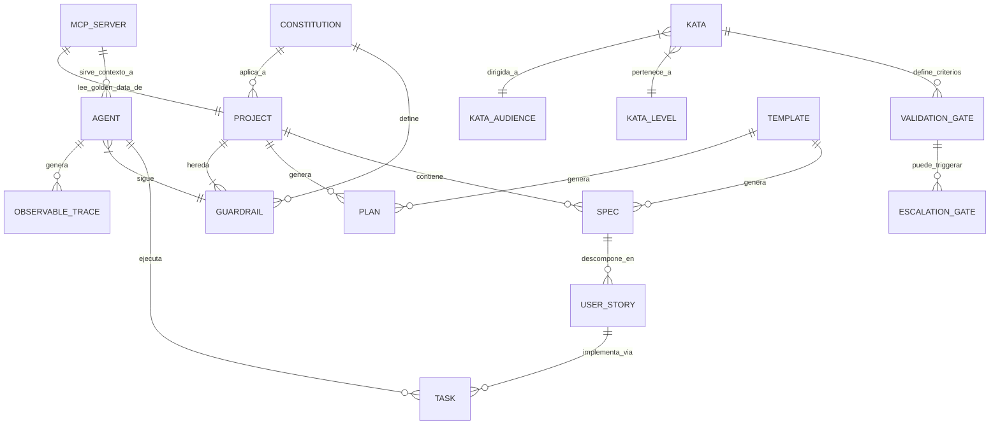

# RaiSE Ontology Bundle
## Contexto Mínimo para Transferencia Cross-Project

**Versión:** 2.1.0  
**Fecha:** 07 de Enero, 2026  
**Propósito:** Proveer el contexto ontológico esencial de RaiSE a cualquier agente de Claude Code, independientemente del dominio del proyecto.

> **Uso:** Subir este único archivo a la sección "Project Knowledge" de cualquier proyecto de Claude Code para que el agente herede la ontología, vocabulario y principios de RaiSE.

---

## Índice de Contenidos

1. [Constitution](#1-constitution) — Principios inmutables (§1-§8)
2. [Glosario Core](#2-glosario-core) — Vocabulario canónico (~35 términos)
3. [Modelo de Entidades](#3-modelo-de-entidades) — Diagrama ER y schemas
4. [Jerarquías de Referencia](#4-jerarquías-de-referencia) — Estructuras de trabajo
5. [Anti-Términos](#5-anti-términos) — Qué NO usar

---

# 1. Constitution

## Identidad

**RaiSE es** el sistema operativo metodológico para gobernar agentes de IA en el desarrollo de software empresarial. Es un framework de **Context Engineering** que aplica principios Lean al desarrollo AI-asistido.

**RaiSE NO es:**
- Un reemplazo del desarrollador humano
- Un IDE o editor de código
- Una herramienta de "vibe coding" acelerado
- Un vendor lock-in a plataformas específicas
- Prompt engineering superficial

---

## Principios Innegociables

### §1. Humanos Definen, Máquinas Ejecutan
Los humanos especifican el **"Qué"** en lenguaje natural (Markdown). Las máquinas reciben el **"Cómo"** en formato estructurado (JSON). La especificación es la fuente de verdad; el código es su expresión.

**Implicación práctica:** El rol del desarrollador evoluciona a **Orquestador**—quien diseña contexto, valida outputs, y mantiene ownership del sistema.

### §2. Governance as Code
Las políticas, guardrails y estándares son artefactos versionados en Git, no documentos estáticos en wikis olvidadas. Lo que no está en el repositorio, no existe.

**Jerarquía de Governance:**
```
Constitution (Principios inmutables)
    ↓
Guardrails (Directivas operacionales)
    ↓
Specs (Contratos de implementación)
    ↓
Validation Gates (Puntos de control)
```

### §3. Platform Agnosticism
RaiSE funciona donde funciona Git. No hay dependencia de GitHub, GitLab, Bitbucket, ni ningún proveedor específico. El protocolo Git es el transporte universal.

**Extensión MCP:** Adoptamos MCP (Model Context Protocol) como estándar de integración con agentes, pero sin lock-in—el fallback a archivos estáticos (.cursorrules, .claude.md) siempre existe.

### §4. Validation Gates en Cada Fase
No existe un solo "Done". Cada fase tiene su propia **Validation Gate** que debe cruzarse antes de avanzar. La calidad no es un evento final; es un proceso continuo.

**Los 8 Validation Gates estándar:**

| Gate | Fase | Criterio Core |
|------|------|---------------|
| Gate-Context | Discovery | Stakeholders y restricciones claras |
| Gate-Discovery | Discovery | PRD validado |
| Gate-Vision | Vision | Solution Vision aprobada |
| Gate-Design | Design | Tech Design completo |
| Gate-Backlog | Planning | HUs priorizadas |
| Gate-Plan | Planning | Implementation Plan verificado |
| Gate-Code | Implementation | Código que pasa validaciones |
| Gate-Deploy | Deployment | Feature en producción |

### §5. Heutagogía sobre Dependencia
El sistema no solo entrega el pescado, **enseña a pescar**. Al finalizar sesiones críticas, RaiSE desafía al humano para asegurar comprensión y ownership de la solución.

**Las 4 preguntas heutagógicas:**
1. ¿Qué aprendiste que no sabías antes?
2. ¿Qué cambiarías del proceso?
3. ¿Hay mejoras para el framework?
4. ¿En qué eres más capaz ahora?

### §6. Mejora Continua (Kaizen)
Si un prompt falló o el código requirió muchas iteraciones, los guardrails y katas se refinan. El sistema aprende de sus errores y mejora para la siguiente vez.

### §7. Lean Software Development
RaiSE aplica los principios del Toyota Production System al desarrollo asistido por IA:

| Principio Lean | Manifestación en RaiSE |
|----------------|------------------------|
| Eliminar desperdicio | Context-first (no hallucinations) |
| Amplificar aprendizaje | Checkpoints heutagógicos |
| Decidir tarde | Specs antes de código |
| Entregar rápido | Validation Gates (no batch) |
| Empoderar al equipo | Modelo Orquestador |
| Construir integridad | Jidoka (parar en defectos) |
| Ver el todo | Golden Data coherente |

### §8. Observable Workflow
Cada decisión del agente debe ser **trazable y auditable**. No hay cajas negras. La observabilidad es prerequisito para mejora continua y compliance regulatorio.

---

## Valores de Diseño

| Valor | Sobre | Explicación |
|-------|-------|-------------|
| **Simplicidad** | Completitud | Preferir soluciones simples que cubran 80% de casos |
| **Composabilidad** | Monolitos | Componentes pequeños que se combinan |
| **Transparencia** | Magia | Todo debe ser inspeccionable y explicable |
| **Convención** | Configuración | Defaults sensatos, override cuando necesario |
| **Evolución** | Revolución | Cambios incrementales sobre rewrites totales |
| **Observabilidad** | Opacidad | Trazabilidad por defecto |

---

## Restricciones Absolutas

### Nunca:
- Procesar código sin contexto estructurado previo
- Guardar secretos, tokens o PII en archivos de configuración
- Crear dependencia de APIs propietarias cuando existe alternativa Git-native
- Sacrificar trazabilidad por velocidad
- Generar código sin plan de implementación documentado
- Ejecutar sin Observable Workflow activo
- Ignorar Escalation Gates cuando el agente tiene baja confianza

### Siempre:
- Validar specs contra la constitution antes de planificar
- Documentar decisiones arquitectónicas (ADRs)
- Mantener backward compatibility en schemas
- Proveer escape hatches para usuarios avanzados
- Escalar al Orquestador ante ambigüedad

---

# 2. Glosario Core

## Términos Fundamentales

### Agent (Agente)
Sistema de IA que ejecuta tareas de desarrollo de software bajo la orquestación de un humano. Ejemplos: GitHub Copilot, Claude Code, Cursor, Windsurf.

> **Principio:** Los agentes son ejecutores, no decisores autónomos.

### Constitution (Constitución)
Conjunto de principios inmutables que gobiernan todas las decisiones en un proyecto RaiSE. Es el documento de mayor jerarquía y raramente cambia.

### Context Engineering
Disciplina de diseñar el ambiente informacional completo que un LLM consume para ejecutar tareas. Evolución de "prompt engineering" hacia una práctica arquitectónica.

> Acuñado por Andrej Karpathy (2025): "No es prompt engineering, es **context engineering**—arquitectar todo el ambiente de información en el que opera el LLM."

### Corpus
Colección estructurada de documentos que proporciona contexto a agentes de IA. El corpus es "Golden Data"—información verificada y canónica.

### Escalation Gate
Punto específico en el flujo donde el agente debe escalar al Orquestador humano para decisión o aprobación. Subtipo de Validation Gate enfocado en HITL (Human-in-the-Loop).

**Criterios típicos de escalación:**
- Confianza del agente < umbral definido
- Decisión de alto impacto (arquitectura, seguridad)
- Ambigüedad en spec o contexto
- Primer uso de un patrón nuevo

> **Métrica de referencia**: 10-15% de escalación es óptimo (85-90% ejecución autónoma).

### Golden Data
Información verificada, estructurada y canónica que alimenta el contexto de agentes. Refleja la realidad específica del proyecto/organización.

### Guardrail (antes: Rule)
Directiva operacional que gobierna el comportamiento del agente o la calidad del código. Definida en Markdown (para humanos), distribuida en JSON (para máquinas).

**Diferencia con Constitution:**
- **Constitution**: Principios filosóficos, inmutables, alto nivel
- **Guardrail**: Reglas operacionales, cambiantes, enforceables

### Heutagogía
Teoría del aprendizaje auto-determinado. En RaiSE, significa que el Orquestador diseña su propio proceso de aprendizaje a través de cada interacción con agentes de IA. El sistema "enseña a pescar" en lugar de solo "entregar el pescado".

### Jidoka (自働化)
Pilar del Toyota Production System que significa "automatización con toque humano". En RaiSE, se manifiesta como la capacidad de **parar el flujo** cuando se detecta un problema (Validation Gate no pasa), en lugar de acumular defectos.

**Jidoka Inline:** En las Katas, el ciclo Jidoka está embebido en cada paso:

```markdown
### Paso N: [Acción]
[Instrucciones]
**Verificación:** [Cómo saber si funcionó]
> **Si no puedes continuar:** [Causa → Resolución]
```

### Kaizen
Filosofía japonesa de mejora continua incremental. Si un prompt falló o el código requirió muchas iteraciones, los guardrails y katas se refinan.

### Kata
Proceso estructurado que hace visible la desviación del estándar, habilitando el ciclo Jidoka. Inspirado en las katas de artes marciales (práctica deliberada).

**Propósito:** La Kata no es documentación pasiva—es un **sensor** que detecta cuándo algo no va bien, permitiendo al Orquestador parar, corregir y continuar.

**Niveles Semánticos:**

| Nivel | Pregunta Guía | Propósito |
|-------|---------------|-----------|
| **Principios** | ¿Por qué? ¿Cuándo? | Aplicar Constitution |
| **Flujo** | ¿Cómo fluye? | Secuencias de valor |
| **Patrón** | ¿Qué forma? | Estructuras recurrentes |
| **Técnica** | ¿Cómo hacer? | Instrucciones específicas |

### Observable Workflow
Flujo de trabajo donde cada decisión del agente es trazable y auditable. Alineado con el framework MELT (Metrics, Events, Logs, Traces).

### Orquestador (Orchestrator)
Rol evolucionado del desarrollador en RaiSE. El humano define el "Qué" y el "Por qué"; valida el "Cómo" generado por agentes. El orquestador es el director, no un simple consumidor de código.

### ShuHaRi (守破離)
Modelo de maestría de las artes marciales japonesas que describe tres fases de aprendizaje. En RaiSE, ShuHaRi es una **lente** que describe cómo el Orquestador se relaciona con las Katas—no una clasificación de las Katas mismas.

| Fase | Kanji | Significado | Cómo usa las Katas |
|------|-------|-------------|-------------------|
| **Shu** | 守 | Proteger/Obedecer | Sigue cada paso exactamente |
| **Ha** | 破 | Romper/Desprender | Adapta pasos al contexto |
| **Ri** | 離 | Trascender/Separar | Crea variantes o nuevas Katas |

### Spec (Specification)
Documento que describe **QUÉ** construir, no **CÓMO**. Es la fuente de verdad que el agente consume para generar implementación.

### Validation Gate (antes: DoD Fractal)
Punto de control de calidad que debe pasarse antes de avanzar a la siguiente fase. Cada fase del flujo de valor tiene su propio Validation Gate con criterios específicos.

---

## Mapeo Español-Inglés

| Español | Inglés | Notas |
|---------|--------|-------|
| Agente | Agent | |
| Barrera de protección | Guardrail | Antes: Regla |
| Constitución | Constitution | |
| Diseño de contexto | Context Engineering | |
| Especificación | Specification (Spec) | |
| Historia de Usuario | User Story | |
| Kata | Kata | No se traduce |
| Orquestador | Orchestrator | Rol del desarrollador |
| Puerta de escalación | Escalation Gate | |
| Puerta de validación | Validation Gate | Antes: DoD Fractal |

---

# 3. Modelo de Entidades

## Diagrama ER (Ontología)



---

## Schemas de Entidades Core

### Constitution

| Campo | Tipo | Requerido | Descripción |
|-------|------|-----------|-------------|
| version | semver | ✅ | Versión del documento |
| identity | object | ✅ | Qué es y qué no es |
| principles | array | ✅ | Principios innegociables (§1-§8) |
| values | array | ✅ | Valores de diseño |
| restrictions | object | ✅ | Nunca/Siempre |

**Ubicación:** `.raise/memory/constitution.md`

### Guardrail

| Campo | Tipo | Requerido | Descripción |
|-------|------|-----------|-------------|
| id | string | ✅ | Identificador único (ej. `guard-001-naming`) |
| title | string | ✅ | Nombre descriptivo |
| scope | enum | ✅ | `agent`, `code`, `process`, `security` |
| severity | enum | ✅ | `error`, `warning`, `info` |
| enforcement | enum | ✅ | `block`, `warn`, `log` |
| globs | array | ❌ | Patrones de archivo donde aplica |

**Ubicación:** `raise-config/guardrails/*.mdc`

### Validation Gate

| Campo | Tipo | Requerido | Descripción |
|-------|------|-----------|-------------|
| id | string | ✅ | Identificador (ej. `gate-design`) |
| phase | enum | ✅ | `context`, `discovery`, `vision`, `design`, `backlog`, `plan`, `code`, `deploy` |
| criteria | array | ✅ | Lista de criterios a validar |
| escalation_threshold | float | ❌ | Confidence bajo el cual escalar (0.0-1.0) |
| blocking | boolean | ✅ | Si bloquea avance o solo advierte |

### Kata

| Campo | Tipo | Requerido | Descripción |
|-------|------|-----------|-------------|
| id | string | ✅ | Ej. `flujo-04` |
| level | enum | ✅ | `principios`, `flujo`, `patron`, `tecnica` |
| audience | enum | ✅ | `beginner`, `intermediate`, `advanced` |
| title | string | ✅ | Nombre descriptivo |
| purpose | string | ✅ | Para qué sirve |
| inputs | array | ✅ | Qué consume |
| outputs | array | ✅ | Qué produce |
| steps | array | ✅ | Pasos a seguir (con Jidoka inline) |

**Ubicación:** `raise-config/katas/{level}-*.md`

### Spec (Specification)

| Campo | Tipo | Requerido | Descripción |
|-------|------|-----------|-------------|
| id | string | ✅ | Identificador (ej. JIRA ID) |
| title | string | ✅ | Nombre descriptivo |
| status | enum | ✅ | `draft`, `review`, `approved` |
| version | semver | ✅ | Versión del documento |
| content | markdown | ✅ | Contenido principal |

**Tipos:** PRD, Solution Vision, Technical Design, Feature Specification

**Ubicación:** `.raise/specs/{id}-{type}.md`

### User Story

| Campo | Tipo | Requerido | Descripción |
|-------|------|-----------|-------------|
| id | string | ✅ | Identificador |
| title | string | ✅ | Como [rol], quiero [acción] |
| acceptance_criteria | array | ✅ | Criterios BDD (Dado/Cuando/Entonces) |
| priority | enum | ✅ | `P0`, `P1`, `P2`, `P3` |

---

## Relaciones entre Entidades

| Origen | Relación | Destino |
|--------|----------|---------|
| Constitution | define | Guardrail |
| Guardrail | aplica a | Project |
| Kata | define_criterios | Validation Gate |
| Validation Gate | puede_triggerar | Escalation Gate |
| Spec | descompone en | User Story |
| User Story | implementa via | Task |
| Agent | ejecuta | Task |
| Agent | sigue | Guardrail |
| Agent | genera | Observable Trace |

---

# 4. Jerarquías de Referencia

## Jerarquía de Artefactos RaiSE
```
Constitution > Vision > Architecture > Domain > Execution
```

## Jerarquía de Governance
```
Constitution (Principios) → Guardrails (Reglas) → Specs (Contratos) → Validation Gates (Checkpoints)
```

## Jerarquía de Trabajo (Agile)
```
Capability > Feature/Epic > User Story > Task
```

## Jerarquía de Katas
```
Principios > Flujo > Patrón > Técnica
```

| Nivel | Pregunta | Conexión Lean |
|-------|----------|---------------|
| **Principios** | ¿Por qué? | Toyota Way Principles |
| **Flujo** | ¿Cómo fluye? | Value Stream |
| **Patrón** | ¿Qué forma? | Standardized Work |
| **Técnica** | ¿Cómo hacer? | Work Instructions |

---

# 5. Anti-Términos

| Evitar | Usar en su lugar | Razón |
|--------|------------------|-------|
| "Vibe coding" | "Desarrollo sin spec" | RaiSE es spec-first |
| "AI coder" | "Agente de desarrollo" | El humano sigue siendo el coder |
| "Prompt engineering" | "Context Engineering" | RaiSE es arquitectura de contexto |
| "Magic" | "Proceso automatizado" | Principio de transparencia |
| "DoD Fractal" | "Validation Gate" | Terminología HITL estándar |
| "Rule" (aislado) | "Guardrail" | Connota protección activa |
| "L0/L1/L2/L3" | "principios/flujo/patron/tecnica" | Nombres semánticos |

---

## Formato de Referencia a Principios

Para referenciar un principio RaiSE en documentos:

```
[RaiSE: Nombre-Del-Principio]
```

**Principios disponibles:**
- `[RaiSE: Human-Centric]` — Humanos definen, máquinas ejecutan
- `[RaiSE: Governance-as-Code]` — Políticas versionadas en Git
- `[RaiSE: Platform-Agnostic]` — Sin vendor lock-in
- `[RaiSE: Validation-Gates]` — Calidad en cada fase
- `[RaiSE: Heutagogy]` — Enseñar, no reemplazar
- `[RaiSE: Kaizen]` — Mejora continua
- `[RaiSE: Context-Engineering]` — Diseño deliberado del ambiente informacional
- `[RaiSE: Observable-Workflow]` — Trazabilidad completa

---

## Métricas de Calidad AI (Referencia)

| Métrica | Descripción | Benchmark |
|---------|-------------|-----------|
| **Hallucination Rate** | % de información fabricada | <10% target |
| **Re-prompting Rate** | Iteraciones para output aceptable | <3 ideal |
| **Context Adherence** | Alineamiento con spec | >85% target |
| **Escalation Rate** | % de tareas escaladas | 10-15% óptimo |

---

## Changelog

### v2.1.0 (2026-01-07)
- Documento inicial: consolidación de Constitution, Glossary y Data Architecture
- Optimizado para transferencia cross-project (~45KB)
- Encoding UTF-8 limpio
- Eliminadas referencias circulares a otros documentos del corpus

---

*"Los humanos definen el Qué en Markdown. Las máquinas reciben el Cómo en JSON. El protocolo Git es el transporte universal. Cada decisión es observable."*
