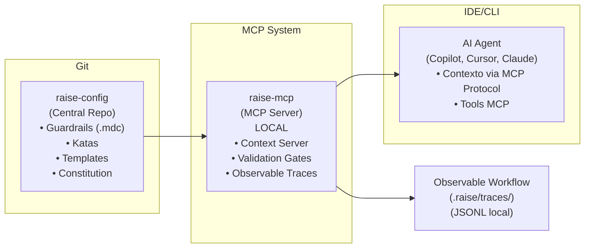
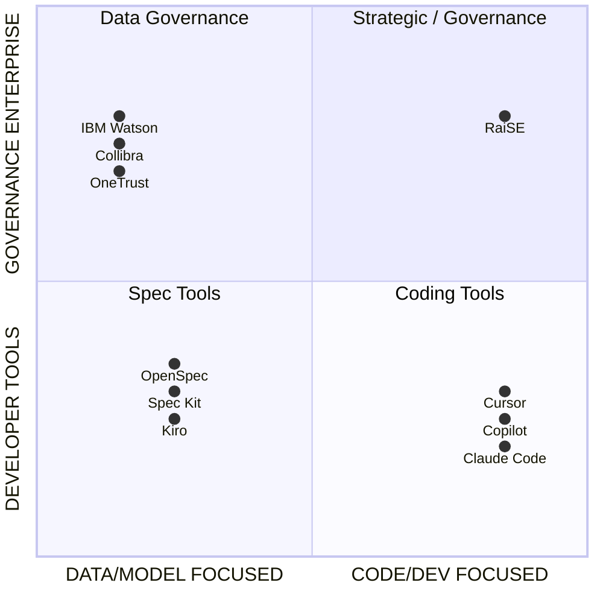

# RaiSE Product Vision

## Reliable AI Software Engineering Framework

**Versión:** 2.0.0**Fecha:** 28 de Diciembre, 2025**Estado:** Ratificado

> **Nota de versión 2.0:** Visión actualizada con diferenciadores MCP-native, Observable Workflow, y terminología v2.1 (Validation Gates, Guardrails, Orquestador).

---

## Problema Central

### El Dolor

Los equipos de desarrollo adoptan herramientas de AI coding (Copilot, Cursor, Claude Code) sin governance. El resultado:

- **Inconsistencia**: Cada desarrollador usa AI de forma diferente, produciendo código heterogéneo
- **Alucinaciones no detectadas**: Sin validación estructurada, errores de AI llegan a producción
- **Pérdida de contexto**: Cada sesión con AI empieza de cero; no hay "memoria" organizacional
- **Atrofia cognitiva**: Desarrolladores aceptan código AI sin entenderlo
- **Compliance gaps**: Regulaciones como EU AI Act exigen trazabilidad que no existe
- **Opacidad de decisiones**: No hay forma de auditar *por qué* el agente tomó una decisión [NUEVO v2.1]

### Evidencia

- El mercado de AI Governance crece 35-50% CAGR, de $200M (2024) a $7B+ (2030)
- 84% de desarrolladores usan AI tools, pero satisfacción cayó a 60% por calidad inconsistente
- 77% de empresas iniciaron frameworks de AI governance; 90% de las que tienen deployments activos
- EU AI Act entra en vigor 2025, mandando trazabilidad y governance
- **11,000+ MCP servers registrados** — MCP es el estándar de facto para Context Engineering [NUEVO v2.1]

---

## Solución Propuesta

**RaiSE** es un framework de Context Engineering que estructura el uso de AI en desarrollo de software mediante governance-as-code y observabilidad nativa.

### Cómo Funciona [ACTUALIZADO v2.1]

### Diferenciadores Clave [ACTUALIZADO v2.1]

| Diferenciador                 | Descripción                                              | Competidores sin esto        |
| ----------------------------- | --------------------------------------------------------- | ---------------------------- |
| **MCP-Native**          | Context Engineering via estándar de facto (11k+ servers) | Spec Kit, OpenSpec, Kiro     |
| **Validation Gates**    | Quality gates por fase, no solo al final                  | Spec Kit, OpenSpec, Kiro     |
| **Observable Workflow** | Trazabilidad completa de decisiones AI                    | **TODOS**              |
| **Escalation Gates**    | HITL explícito con criterios definidos                   | **TODOS**              |
| **Katas Ejecutables**   | Validaciones automáticas de specs y código              | Todos                        |
| **Heutagogía**         | Entrenamiento activo del Orquestador                      | Todos (focus en reemplazo)   |
| **Git-Native**          | Sin APIs propietarias; Git como transporte                | Kiro (AWS), Tessl (SaaS)     |
| **Platform Agnostic**   | GitHub, GitLab, Bitbucket indistintamente                 | Copilot (GitHub), Kiro (AWS) |

---

## Propuesta de Valor Única (UVP)

> **"RaiSE convierte el caos del AI-assisted development en un proceso gobernable, trazable y que mejora continuamente—sin sacrificar la velocidad. Es el único framework MCP-native con Observable Workflow."**

### Value Props por Stakeholder [ACTUALIZADO v2.1]

| Stakeholder                       | Value Prop                                                                                     |
| --------------------------------- | ---------------------------------------------------------------------------------------------- |
| **Developer (Orquestador)** | "Mis herramientas AI producen código consistente porque tienen contexto estructurado via MCP" |
| **Tech Lead**               | "Puedo gobernar cómo mi equipo usa AI con Validation Gates automáticos"                      |
| **VP Engineering**          | "Tengo Observable Workflow: trazabilidad completa para métricas y compliance"                 |
| **CISO**                    | "Los guardrails de seguridad se aplican automáticamente y tengo audit trail"                  |
| **Compliance Officer**      | "EU AI Act cubierto: cada decisión AI es auditable"                                           |

---

## User Personas

### Persona A: "Elena, la Metodóloga"

**Rol:** Staff Engineer / Platform Architect**Contexto:** Empresa de 100+ developers, múltiples equipos**Goals:**

- Estandarizar prácticas de AI-assisted development
- Reducir inconsistencias entre equipos
- Preparar para auditorías de compliance

**Pain Points:**

- Cada equipo usa AI de forma diferente
- No hay forma de medir calidad del código AI-generated
- Regulaciones (EU AI Act) se acercan sin preparación
- **No puede auditar decisiones de agentes** [NUEVO v2.1]

**Jobs-to-be-Done:**

- Definir guardrails que todos los equipos sigan
- Distribuir actualizaciones sin fricción
- Validar cumplimiento automáticamente
- **Generar reportes de Observable Workflow** [NUEVO v2.1]

### Persona B: "Devon, el Orquestador"

**Rol:** Senior Developer → **Orquestador** [ACTUALIZADO]**Contexto:** Trabaja en features con AI daily**Goals:**

- Entregar features rápido y con calidad
- No perder tiempo en setup y configuración
- Entender y poder mantener código AI-generated
- **Crecer como profesional, no atrofiarse** [NUEVO v2.1]

**Pain Points:**

- AI genera código inconsistente con patrones del proyecto
- Tiene que "adivinar" qué contexto darle al AI
- A veces acepta código sin entenderlo completamente
- **No sabe cuándo el agente tiene baja confianza** [NUEVO v2.1]

**Jobs-to-be-Done:**

- Obtener contexto estructurado automáticamente via MCP
- Validar que su código pasa Validation Gates
- Aprender de las decisiones que AI tomó
- **Responder a Escalation Gates de forma informada** [NUEVO v2.1]

### Persona C: "Carlos, el Compliance Officer"

**Rol:** Security/Compliance Manager**Contexto:** Enterprise regulada (Fintech, Healthcare)**Goals:**

- Demostrar governance de AI a auditores
- Trazabilidad de qué código fue AI-generated
- Políticas aplicadas consistentemente

**Pain Points:**

- No sabe qué código es AI-generated
- No hay audit trail de decisiones AI
- Cada auditoría es un scramble

**Jobs-to-be-Done:**

- Generar reportes de compliance automáticos via `raise audit`
- Tener Observable Workflow logs para auditoría
- Demostrar guardrails como código versionado

---

## Casos de Uso Primarios

### CU-1: Onboarding de Proyecto Existente

**Trigger:** Equipo quiere adoptar RaiSE en proyecto brownfield**Flow:**

1. `raise init` escanea el proyecto
2. `raise mcp start` inicia servidor MCP
3. Genera constitution basada en patrones detectados
4. Crea guardrails iniciales respetando el legado
5. Developer usa `/raise.specify` para nueva feature
6. **Observable Workflow comienza a registrar traces** [NUEVO v2.1]

**Outcome:** Proyecto existente tiene governance + observabilidad sin rewrite

### CU-2: Governance Centralizada Multi-Proyecto

**Trigger:** Platform team quiere gobernar 50+ repos**Flow:**

1. Platform team mantiene `raise-config` central
2. Cada repo configura `raise.yaml` con URL del config
3. `raise pull` sincroniza guardrails en cada repo
4. CI ejecuta `raise check` + `raise gate status` bloqueando non-compliance
5. **`raise audit --format json` genera reportes agregados** [NUEVO v2.1]

**Outcome:** Una sola fuente de verdad + métricas aggregadas de Observable Workflow

### CU-3: Desarrollo con Validation Gates [ACTUALIZADO]

**Trigger:** Orquestador comienza feature nueva**Flow:**

1. `/raise.specify` → Genera spec, valida **Gate-Discovery**
2. `/raise.plan` → Genera plan técnico, valida **Gate-Design**
3. `/raise.tasks` → Genera tareas, valida **Gate-Backlog**
4. `/raise.implement` → Ejecuta tareas con validación continua
5. **Escalation Gate si agente tiene baja confianza** [NUEVO v2.1]
6. Kata final valida **Gate-Code**
7. **`raise audit` para revisar sesión** [NUEVO v2.1]

**Outcome:** Cada fase tiene Validation Gate; Orquestador mantiene ownership

### CU-4: Audit Trail para Compliance [ACTUALIZADO]

**Trigger:** Auditor pregunta "¿cómo gobiernan AI?"**Flow:**

1. Mostrar `raise-config` con guardrails versionados en Git
2. Mostrar Observable Workflow: `.raise/traces/*.jsonl`
3. Ejecutar `raise audit --period month --format md`
4. Demostrar trazabilidad spec → plan → código → decisiones

**Outcome:** EU AI Act compliance con evidencia concreta

### CU-5: Escalation Gate en Acción [NUEVO v2.1]

**Trigger:** Agente encuentra ambigüedad durante implementación**Flow:**

1. Agente ejecuta `validate_gate` via MCP
2. Gate falla por criterio ambiguo
3. Agente ejecuta `escalate` tool con opciones
4. Orquestador recibe notificación con contexto
5. Orquestador decide y responde
6. Decisión registrada en Observable Workflow

**Outcome:** Human-in-the-Loop estructurado, decisiones documentadas

---

## Anti-Casos de Uso

Lo que RaiSE **explícitamente NO hace**:

| Anti-Caso                    | Por qué no                                         |
| ---------------------------- | --------------------------------------------------- |
| Reemplazar al developer      | Heutagogía: evolucionamos al Orquestador           |
| Ser otro AI coding assistant | Somos governance + context layer, no generator      |
| Funcionar solo con un IDE    | Platform agnostic por principio                     |
| Requerir cloud/SaaS          | Git-native + MCP local, funciona 100% on-premise    |
| Garantizar código sin bugs  | Reducimos errores, no los eliminamos                |
| Vigilar sin valor            | Observable Workflow es para mejora, no surveillance |

---

## Métricas de Éxito

### Métricas de Adopción

| Métrica                        | Baseline | Target Y1 | Target Y3 |
| ------------------------------- | -------- | --------- | --------- |
| Community users                 | 0        | 5,000     | 100,000   |
| Pro subscribers                 | 0        | 50        | 2,000     |
| Enterprise deals                | 0        | 0         | 10        |
| GitHub stars                    | 0        | 5,000     | 25,000    |
| **MCP Registry listings** | 0        | 1         | N/A       |

### Métricas de Valor

| Métrica                            | Baseline | Target |
| ----------------------------------- | -------- | ------ |
| Tiempo promedio spec → código     | Variable | -40%   |
| Defectos post-release AI code       | Variable | -50%   |
| Auditorías sin hallazgos críticos | N/A      | 100%   |
| Adherencia a patrones definidos     | N/A      | >90%   |
| **Escalation rate**           | N/A      | 10-15% |
| **Re-prompting rate**         | N/A      | <3     |

### Métricas de Engagement

| Métrica                               | Target           |
| -------------------------------------- | ---------------- |
| NPS (Pro/Enterprise)                   | >50              |
| Monthly active CLI users               | >60% of installs |
| Community contributions                | >50/quarter      |
| **Observable Workflow adoption** | >80% of projects |

---

## Competitive Positioning [ACTUALIZADO v2.1]

### Competidores Directos [ACTUALIZADO v2.1]

| Competidor          | Fortaleza                 | Debilidad                | Estrategia vs                    |
| ------------------- | ------------------------- | ------------------------ | -------------------------------- |
| GitHub Spec Kit     | 58k⭐, backing Microsoft  | Sin governance, sin MCP  | MCP-native + Observable Workflow |
| AWS Kiro            | Integración AWS          | Vendor lock-in, overkill | Platform agnostic, local-first   |
| OpenSpec            | Lightweight, TypeScript   | Menos features, sin HITL | Escalation Gates, Heutagogía    |
| BMAD Method         | Multi-agente robusto      | Complejo, curva alta     | Simplicidad + MCP estándar      |
| **LangGraph** | Framework agentic sólido | No es para governance    | Complementario, no competidor    |

### Diferenciador Único [NUEVO v2.1]

**Ningún framework combina:**

1. MCP-native (estándar de facto)
2. Observable Workflow (trazabilidad EU AI Act)
3. Escalation Gates (HITL estructurado)
4. Heutagogía (crecimiento del Orquestador)

---

## Roadmap de Alto Nivel [ACTUALIZADO v2.1]

### v0.1 - Foundation (Q1 2025)

- CLI básico (init, check, pull)
- Soporte 5 agentes principales
- Templates core
- Documentación

### v0.2 - MCP-Native & Validation Gates (Q2 2025)

- **raise-mcp server (CORE)**
- Validation Gates completos (8 gates)
- Guardrails system
- `raise gate`, `raise guardrail` commands

### v0.3 - Observable Workflow (Q3 2025)

- Observable Workflow completo
- `raise audit` command
- JSONL trace storage
- Escalation Gates (HITL)

### v0.4 - Enterprise Preview (Q4 2025)

- SSO/SAML integration
- Team analytics dashboard
- On-premise deployment guide

### v1.0 - Production (Q1 2026)

- Estabilidad API
- SOC2 Type I
- Integraciones Jira/Linear
- Marketplace de katas community

---

## Riesgos y Mitigaciones

| Riesgo                              | Probabilidad | Impacto | Mitigación                                           |
| ----------------------------------- | ------------ | ------- | ----------------------------------------------------- |
| GitHub agrega governance a Spec Kit | Media        | Alto    | MCP-native + Observable son diferenciadores profundos |
| MCP evoluciona con breaking changes | Media        | Medio   | Version pinning, abstraction layer                    |
| Paradigma SDD no gana tracción     | Baja         | Alto    | Pivote a governance + observability puro              |
| Competidor bien-fondeado entra      | Media        | Medio   | First-mover en MCP + Observability                    |
| EU AI Act se diluye                 | Baja         | Medio   | Value prop existe sin regulación                     |

---

## Preguntas Abiertas

1. **Naming final**: ¿RaiSE es el nombre definitivo? (Trademark clearance pendiente)
2. **Pricing validation**: ¿$29/$49/custom es el punto correcto?
3. **First enterprise target**: ¿Qué vertical atacar primero?
4. **MCP transport default**: ¿stdio vs SSE para raise-mcp?

---

## Changelog

### v2.1.0 (2025-12-28)

- Diferenciadores actualizados: MCP-native, Observable Workflow
- Terminología: DoD → Validation Gates, rules → guardrails
- Nuevo CU-5: Escalation Gate en Acción
- Roadmap alineado con ontología v2.1
- Métricas añadidas: escalation rate, re-prompting rate
- Posicionamiento competitivo actualizado

### v1.0.0 (2025-12-26)

- Visión inicial

---

*Este documento es la fuente de verdad para decisiones de producto. Actualizar con cada pivote o aprendizaje significativo.*
