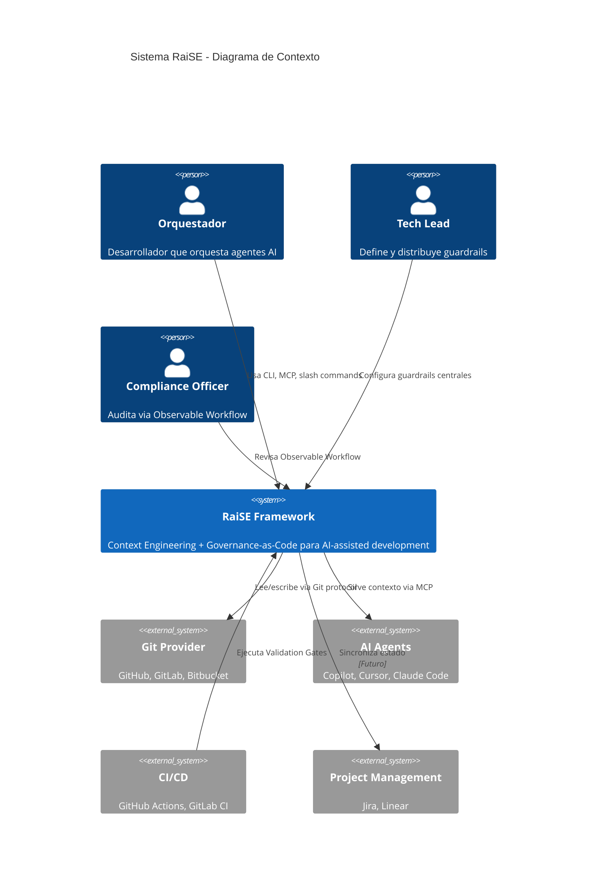
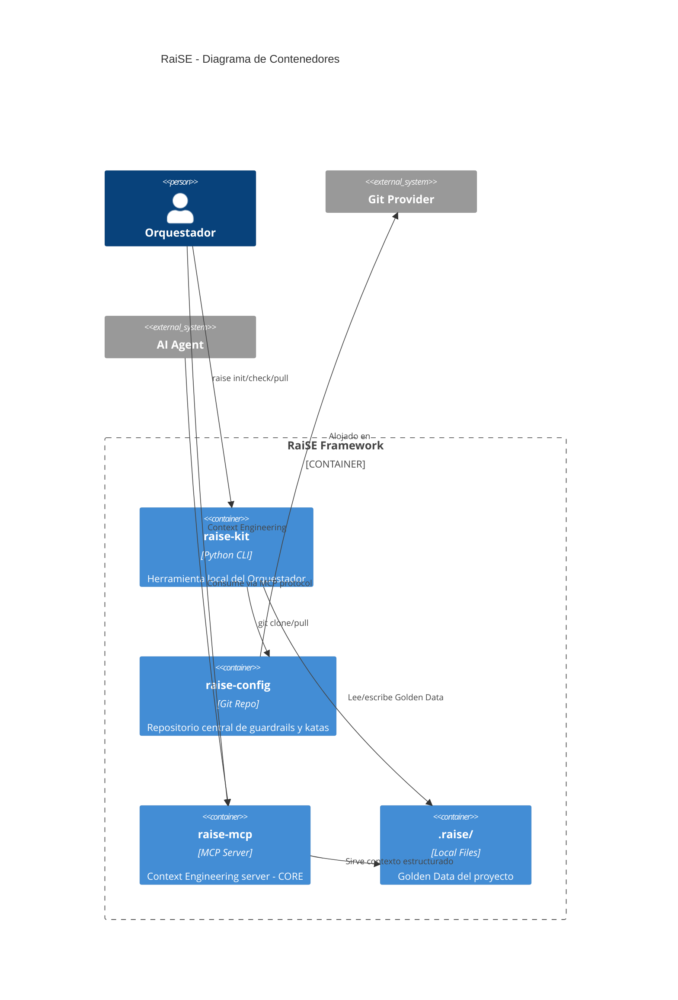
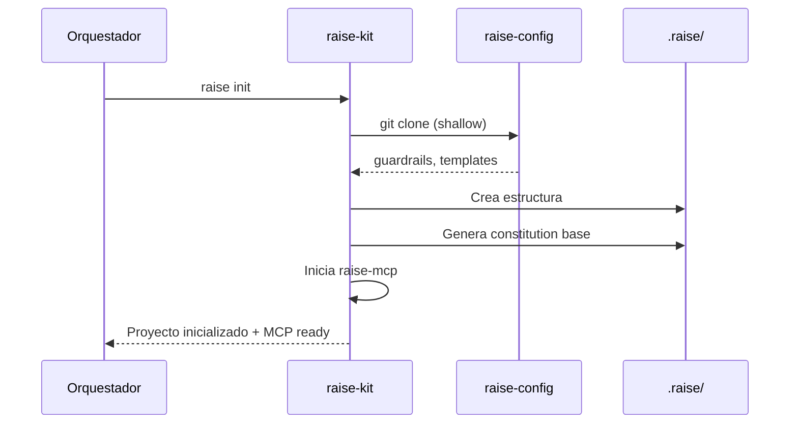
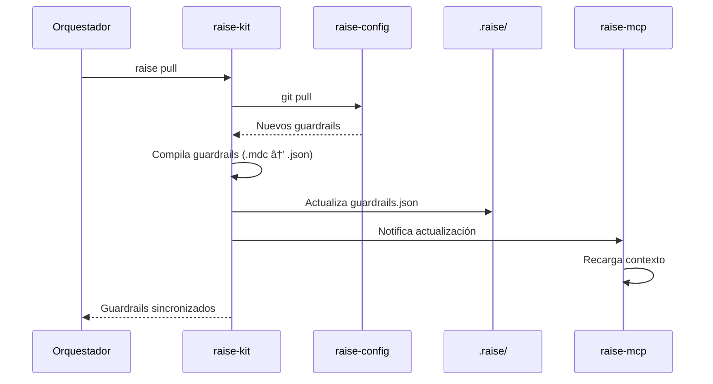
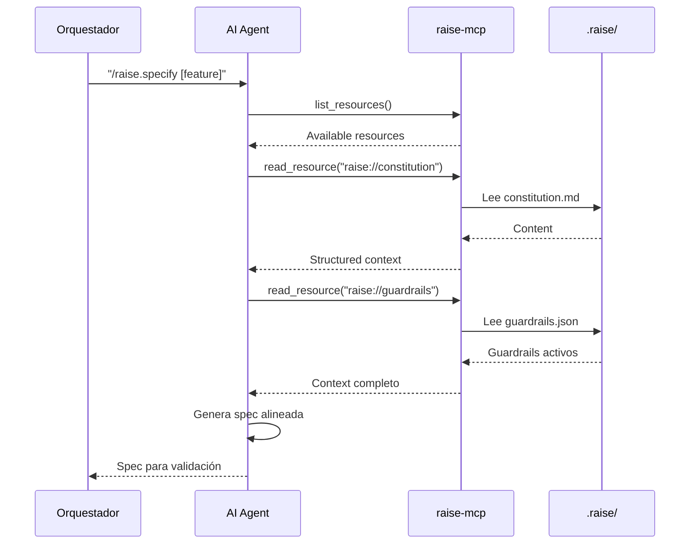
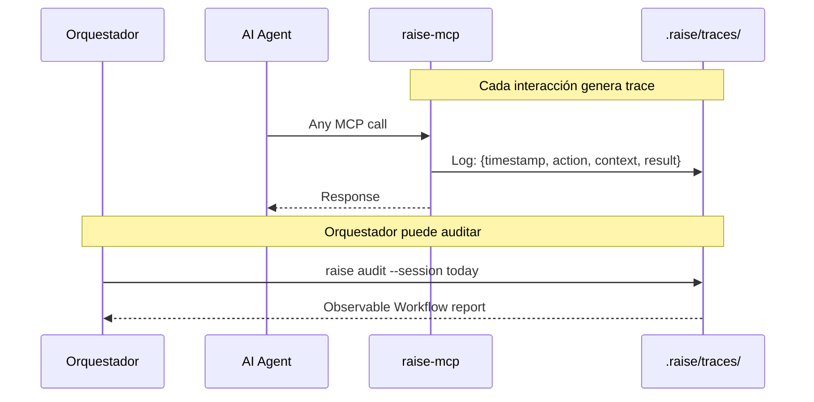

# RaiSE System Architecture
## Vista Técnica del Framework

**Versión:** 2.0.0  
**Fecha:** 28 de Diciembre, 2025  
**Propósito:** Documentar la arquitectura técnica de alto nivel del sistema RaiSE.

---

## Diagrama de Contexto (C4 Level 1)



---

## Diagrama de Contenedores (C4 Level 2)



---

## Componentes Core

### raise-kit (CLI)

**Propósito:** Interfaz principal del Orquestador con RaiSE.

**Responsabilidades:**
- Inicializar proyectos con estructura RaiSE
- Sincronizar guardrails desde repositorio central
- Validar compliance contra guardrails
- Ejecutar katas de validación
- Gestionar Validation Gates

**Stack tecnológico:**
- Python 3.11+
- Click (CLI framework)
- Rich (terminal UI)
- httpx (HTTP async)

**Comandos principales:**

| Comando | Descripción |
|---------|-------------|
| `raise init` | Inicializa proyecto con estructura .raise/ |
| `raise pull` | Sincroniza guardrails desde raise-config |
| `raise check` | Valida proyecto contra guardrails |
| `raise kata` | Ejecuta katas de validación |
| `raise gate` | Verifica Validation Gate específico |
| `raise mcp` | Inicia raise-mcp server local |

---

### raise-config (Central Repo)

**Propósito:** Fuente de verdad centralizada para guardrails, katas y templates.

**Responsabilidades:**
- Almacenar guardrails compartidos
- Versionar katas de validación
- Distribuir templates estándar
- Proveer configuración base

**Estructura:**
```
raise-config/
├── guardrails/       # Guardrails en .mdc format [v2: renombrado de rules/]
├── katas/            # Katas L0-L3
├── templates/        # Templates de documentos
├── agents/           # Definiciones de agentes
└── raise.yaml        # Configuración base
```

**Distribución:** Via Git (clone/pull), no requiere servidor.

---

### raise-mcp (Context Server) — COMPONENTE CORE v2.0

**Propósito:** Servir contexto estructurado a agentes AI via MCP protocol. **Es el motor de Context Engineering.**

**Responsabilidades:**
- Leer Golden Data local (.raise/)
- Servir Constitution, Guardrails y Specs bajo demanda
- Mantener vista coherente del proyecto
- Proveer Tools MCP a agentes
- Implementar Escalation Gates (HITL)
- Generar Observable Workflow traces

**Protocolo:** Model Context Protocol (Anthropic) — estándar de facto con 11,000+ servers

**Primitivos MCP expuestos:**

| Primitivo | Función en RaiSE | Ejemplo |
|-----------|------------------|---------|
| **Resources** | Golden Data estructurado | `raise://constitution`, `raise://specs/current` |
| **Tools** | Acciones que el agente ejecuta | `validate_gate`, `check_guardrail` |
| **Prompts** | Templates reutilizables | Constitution fragments, Kata instructions |
| **Sampling** | Cuando MCP necesita razonamiento LLM | Escalation Gate decisions |

**Resources expuestos:**

| Resource URI | Descripción |
|--------------|-------------|
| `raise://constitution` | Principios del proyecto |
| `raise://guardrails` | Guardrails activos (compilados) |
| `raise://specs/current` | Spec en trabajo actual |
| `raise://plans/current` | Plan de implementación activo |
| `raise://context` | Contexto agregado para tarea actual |

**Tools expuestos:**

| Tool | Descripción |
|------|-------------|
| `validate_gate` | Valida artefacto contra Validation Gate |
| `check_guardrail` | Verifica compliance de código contra guardrail |
| `generate_artifact` | Crea artefacto desde template |
| `escalate` | Solicita intervención del Orquestador (HITL) |

**Estado:** v0.2 (en desarrollo activo)

---

### .raise/ (Local Golden Data)

**Propósito:** Golden Data específico del proyecto.

**Estructura estándar:**
```
.raise/
├── memory/
│   ├── constitution.md      # Principios del proyecto
│   └── guardrails.json      # Guardrails compilados [v2: renombrado]
├── specs/                   # Especificaciones activas
├── plans/                   # Planes de implementación
├── traces/                  # Observable Workflow logs [v2: nuevo]
└── raise.yaml               # Config local
```

**Principio:** Todo en `.raise/` es Golden Data versionado. Lo que no está aquí, no existe para el agente.

---

## Flujos de Datos Principales

### Flujo 1: Inicialización de Proyecto



### Flujo 2: Sincronización de Guardrails



### Flujo 3: Context Engineering (Desarrollo con MCP)



### Flujo 4: Validation Gate Check [NUEVO v2.0]

```mermaid
sequenceDiagram
    participant O as Orquestador
    participant AI as AI Agent
    participant MCP as raise-mcp
    participant Local as .raise/

    AI->>MCP: call_tool("validate_gate", {gate: "Gate-Design", artifact: "spec.md"})
    MCP->>Local: Lee spec.md
    MCP->>Local: Lee Gate-Design criteria
    MCP->>MCP: Evalúa compliance
    alt Gate PASSED
        MCP-->>AI: {status: "passed", details: [...]}
        AI-->>O: ✓ Gate-Design passed
    else Gate FAILED
        MCP-->>AI: {status: "failed", gaps: [...]}
        AI->>MCP: call_tool("escalate", {reason: "Gate failed"})
        MCP-->>O: ⚠️ Escalation: Gate-Design failed
    end
```



### Flujo 5: Observable Workflow [NUEVO v2.0]



---

## Decisiones Arquitectónicas Clave

| ID | Decisión | Opciones Consideradas | Elegida | Rationale |
|----|----------|----------------------|---------|-----------|
| ADR-001 | CLI en Python | Python, Go, Rust | Python | Ecosistema ML/AI, facilidad de extensión |
| ADR-002 | Git como distribución | NPM, PyPI, Git | Git | Platform agnostic, no requiere registry |
| ADR-003 | MCP para contexto | Custom API, LSP, MCP | MCP | Estándar de facto (11k+ servers), soporte multi-agente |
| ADR-004 | Markdown para humanos | YAML, TOML, MD | Markdown | Legibilidad, diff-friendly |
| ADR-005 | JSON para máquinas | JSON, YAML | JSON | Parseo rápido, soporte universal |
| ADR-006 | Observable Workflow local | Cloud telemetry, Local logs | Local | Privacy, compliance, no vendor lock-in |

> Ver [14-adr-index.md](./14-adr-index.md) para detalle completo de cada ADR.

---

## Principios Técnicos

### 1. Platform Agnosticism
- Sin dependencia de GitHub/GitLab/Bitbucket específico
- Git protocol como transporte universal
- Funciona 100% on-premise

### 2. Git as API
- Distribución via clone/pull, no API REST
- Versionado nativo de guardrails
- Branching para experimentos

### 3. Local-First
- Golden Data vive en el proyecto, no en cloud
- MCP server local, no SaaS
- Datos sensibles nunca salen del ambiente

### 4. MCP-Native [NUEVO v2.0]
- MCP es el estándar de interoperabilidad
- Cualquier agente MCP-compatible funciona con RaiSE
- Context Engineering via primitivos MCP (Resources, Tools, Prompts)

### 5. Observable by Default [NUEVO v2.0]
- Cada interacción MCP genera trace
- Traces locales, auditables, versionables
- Base para compliance (EU AI Act)

### 6. Progressive Enhancement
- Funciona con cero configuración (defaults)
- Cada feature es opt-in
- Complejidad solo cuando se necesita

---

## Constraints y Trade-offs

| Constraint | Implicación | Trade-off |
|------------|-------------|-----------|
| Git-only distribution | No hay auto-update | Manual `pull` requerido |
| Local-first | No hay analytics central | Menos insights de uso agregado |
| Platform agnostic | No deep IDE integration | Más setup inicial en algunos IDEs |
| Python CLI | Dependency en Python runtime | Distribución como binario (PyInstaller) |
| MCP-native | Requiere agente MCP-compatible | Fallback a .cursorrules/.claude.md |
| Observable local | No hay dashboard cloud | Reportes via CLI (`raise audit`) |

---

## Roadmap Técnico

| Versión | Componentes | Estado |
|---------|-------------|--------|
| v0.1 | raise-kit (init, check, pull) | ✅ En desarrollo |
| v0.2 | raise-mcp server, Validation Gates | 🔄 En desarrollo |
| v0.3 | Observable Workflow, Escalation Gates | 📋 Planificado |
| v1.0 | Stable API, Enterprise features | 📋 Futuro |

---

## Mapeo a Ontología v2.0

| Concepto | Componente | Primitivo MCP |
|----------|------------|---------------|
| Constitution | `.raise/memory/constitution.md` | Resource: `raise://constitution` |
| Guardrail | `.raise/memory/guardrails.json` | Resource: `raise://guardrails` |
| Spec | `.raise/specs/*.md` | Resource: `raise://specs/*` |
| Validation Gate | Criterios en katas | Tool: `validate_gate` |
| Kata | `raise-config/katas/` | Prompt templates |
| Escalation Gate | HITL trigger | Tool: `escalate` |
| Observable Workflow | `.raise/traces/` | Logging automático |

---

## Changelog

### v2.1.0 (2025-12-29)
- **ADR-010:** Migración de ontología CLI
  - `raise hydrate` → `raise pull` (sincronización)
  - `raise validate` → `raise kata` (ejecución interactiva)
- Actualización de diagramas Mermaid con nueva nomenclatura
- Tabla de comandos raise-kit actualizada

### v2.0.0 (2025-12-28)
- Terminología: rules → guardrails, DoD → Validation Gates
- raise-mcp promovido a COMPONENTE CORE
- NUEVO: Flujo 4 (Validation Gate Check)
- NUEVO: Flujo 5 (Observable Workflow)
- NUEVO: Principio MCP-Native
- NUEVO: Principio Observable by Default
- Estructura .raise/ actualizada (guardrails.json, traces/)
- Mapeo explícito a ontología v2.0
- ADR-006 añadido (Observable Workflow local)

---

*Este documento es la fuente de verdad arquitectónica de RaiSE. Referencias cruzadas verificables en [14-adr-index.md](./14-adr-index.md) y [11-data-architecture.md](./11-data-architecture.md).*
