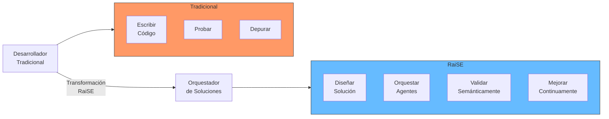
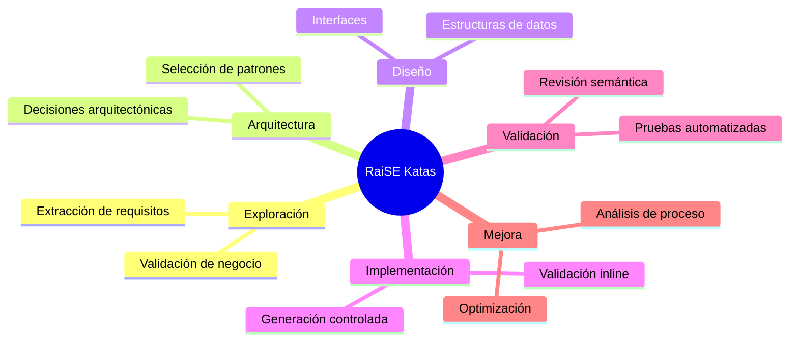
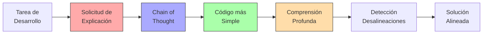
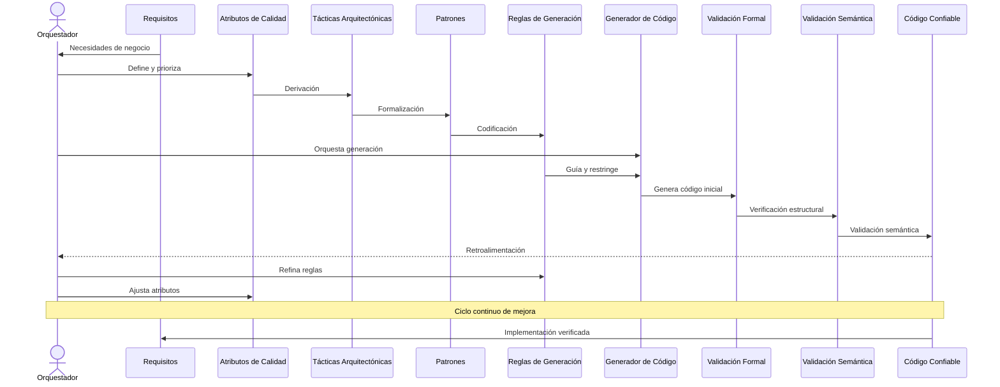
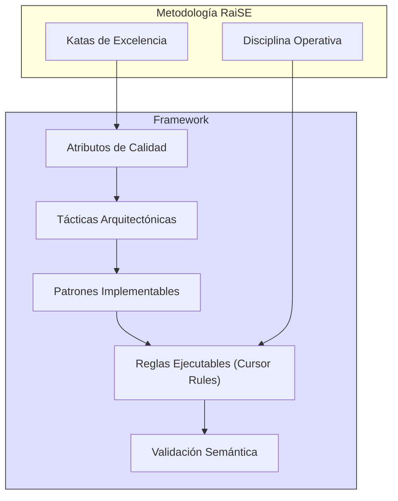
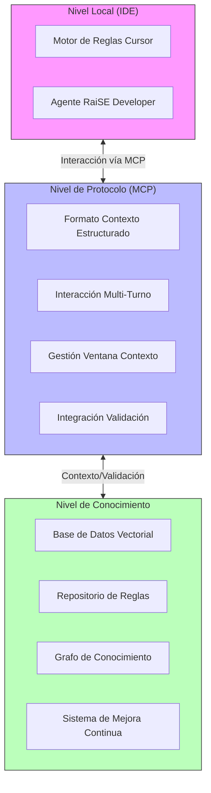
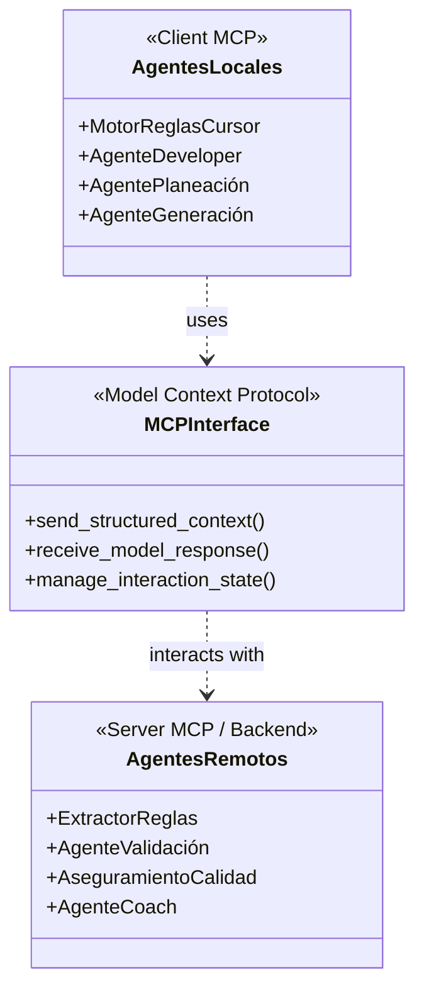
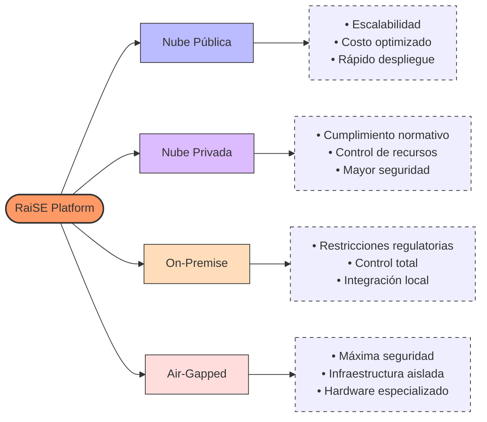
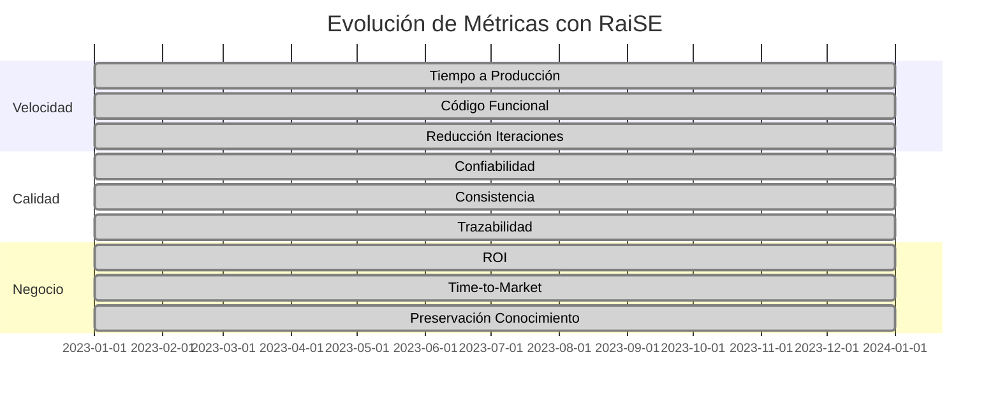
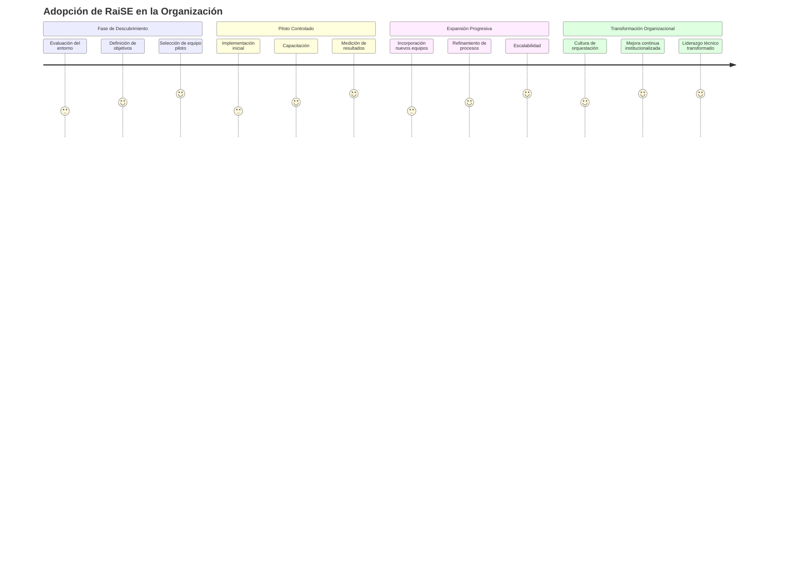

# RaiSE: La Transformación del Desarrollo de Software Empresarial

## Manifiesto RaiSE

> "No reemplazamos desarrolladores. Los elevamos a orquestadores de software confiable."

RaiSE representa un cambio fundamental en cómo concebimos el desarrollo de software. No es simplemente otra herramienta de IA. Es una declaración sobre cómo debe ser el desarrollo de software empresarial en la era de la inteligencia artificial generativa: centrado en las personas, impulsado por principios, y enfocado en resultados verificables.

Creemos firmemente que el valor ya no está en escribir código, sino en orquestar su creación confiable. Nuestra misión es elevar a los desarrolladores de software a roles de liderazgo técnico, permitiéndoles entregar software de mayor calidad, a mayor velocidad, y con mayor consistencia que nunca antes.

![RaiSE Manifiesto - Diagrama conceptual que muestra la transformación del desarrollador a orquestador]

## El Desafío del Desarrollo Empresarial Actual

### La Crisis de la Complejidad

El desarrollo de software empresarial enfrenta una crisis de complejidad creciente. Las organizaciones luchan con:

- **Velocidad insuficiente**: Los ciclos de desarrollo tradicionales no pueden satisfacer las demandas del mercado
- **Inconsistencia en la calidad**: La variabilidad en las prácticas de desarrollo genera resultados impredecibles
- **Pérdida de conocimiento**: La rotación de personal resulta en pérdida crítica de conocimiento organizacional
- **Deuda técnica acumulada**: Las decisiones de corto plazo comprometen la sostenibilidad a largo plazo
- **Escasez de talento**: La demanda de desarrolladores calificados supera ampliamente la oferta disponible

Los intentos de resolver estos problemas mediante la simple adición de más desarrolladores, o la adopción desordenada de herramientas de IA, solo exacerban el problema, creando más complejidad y fragmentación.

### El Cambio Paradigmático de la IA Generativa

La inteligencia artificial generativa ha cambiado fundamentalmente las reglas del desarrollo de software. Sin embargo, la mayoría de las organizaciones están utilizando esta tecnología transformadora de manera subóptima:

- Usando la IA como un "copiloto" glorificado, sin cambiar fundamentalmente el proceso de desarrollo
- Aplicando herramientas de IA de forma inconsistente y ad-hoc
- Careciendo de una estrategia coherente para garantizar calidad y cohesión arquitectónica
- Ignorando la necesidad de evolucionar el rol del desarrollador

Este enfoque fragmentado explota solo una fracción del potencial transformador de la IA generativa, mientras crea nuevos riesgos de inconsistencia y deriva arquitectónica.

![Desafío Actual - Diagrama que contrasta el desarrollo tradicional vs. el desarrollo fragmentado con IA]

## Nuestra Filosofía: Desarrollo Centrado en el Humano

### El Humano como Orquestador

La verdadera revolución no consiste en reemplazar desarrolladores con IA, sino en transformar su rol de "creadores de código" a "orquestadores de soluciones". En RaiSE, el humano siempre permanece en el centro, pero con un propósito transformado:

> "No es cómo el agente me ayuda a hacer software, sino cómo yo ayudo al agente a hacer buen software."

El desarrollador ya no es valorado principalmente por su capacidad para escribir código, sino por su habilidad para:

- Establecer condiciones óptimas para que los agentes de IA rindan al máximo
- Tomar decisiones arquitectónicas informadas con visión holística del sistema
- Asegurar la alineación entre requisitos de negocio y soluciones técnicas
- Evaluar críticamente y mejorar continuamente tanto el proceso como el producto

### Desarrollo como Experiencia de Aprendizaje Consciente

RaiSE redefine el desarrollo de software no como una actividad de producción sino como una experiencia consciente de aprendizaje y comprensión. Esta perspectiva transformadora se basa en tres principios:

1. **Entendimiento sobre codificación**: "No es programar mi objetivo. Yo no quiero aprender a programar. Yo quiero aprender a entender cómo esa implementación va a ser posible."

2. **Alineación como factor crítico**: Las deficiencias en el código generado casi siempre son resultado de fallos en la alineación, no en la capacidad de los modelos.

3. **Explicabilidad como catalizador**: Al solicitar explicaciones, no solo mejoramos la calidad del output, sino que reforzamos nuestro propio entendimiento del problema.

Esta filosofía cambia fundamentalmente la relación entre el desarrollador y la tecnología: el objetivo no es producir más líneas de código más rápido, sino lograr un nivel de comprensión que permita orquestar soluciones complejas con confianza y precisión.

### La Transformación del Rol del Desarrollador

RaiSE facilita la evolución del desarrollador hacia un nuevo paradigma profesional:

| De                               | A                                           |
| :------------------------------- | :------------------------------------------ |
| Escribir código                  | Orquestar generación de código              |
| Enfoque en líneas de código      | Enfoque en decisiones de diseño             |
| Especialista en lenguajes        | Especialista en principios                  |
| Implementador táctico            | Líder técnico estratégico                   |
| Repetidor de patrones            | Creador y evolucionador de patrones         |

Esta transformación no solo eleva el impacto del desarrollador, sino que potencia su crecimiento profesional y su valor para la organización.



## RaiSE Framework: El Arte de la Orquestación

El Framework RaiSE combina una metodología disciplinada, patrones predecibles, y herramientas especializadas para convertir desarrolladores en orquestadores de software confiable.

### Metodología RaiSE: Las Katas de Excelencia

Inspirados en las artes marciales tradicionales, RaiSE introduce el concepto de "katas" de desarrollo: secuencias estructuradas y repetibles de interacciones que, con la práctica, se convierten en segunda naturaleza para el desarrollador.

Estas katas cubren todo el ciclo de desarrollo:

- **Katas de Exploración**: Patrones para extraer y validar requerimientos del negocio
- **Katas de Arquitectura**: Secuencias para transformar requisitos en decisiones arquitectónicas
- **Katas de Diseño**: Flujos para convertir arquitectura en diseño detallado
- **Katas de Implementación**: Patrones para orquestar la generación de código
- **Katas de Validación**: Secuencias para verificar la calidad y conformidad
- **Katas de Mejora**: Rutinas para analizar y optimizar el proceso

El dominio de estas katas permite al desarrollador moverse con fluidez entre niveles de abstracción, manteniendo siempre el control y la visión general del proceso.



### Integración con BDD y Criterios de Aceptación Estructurados

RaiSE incorpora Behavior-Driven Development (BDD) como paradigma central para la definición de criterios de aceptación en sus historias de usuario. Este enfoque ofrece múltiples ventajas:

1. **Formalización semántica**: Los criterios en formato Gherkin (Given-When-Then) proporcionan una estructura precisa que los modelos de IA pueden comprender y aplicar consistentemente.

2. **Puente negocio-desarrollo**: El formato BDD permite expresar requisitos complejos en un lenguaje accesible tanto para stakeholders de negocio como para desarrolladores y agentes de IA.

3. **Base para pruebas automatizadas**: Los criterios BDD se traducen naturalmente en pruebas automatizadas, creando un ciclo virtuoso donde los requisitos guían directamente la validación.

4. **Claridad para la generación**: Los modelos generan código significativamente mejor cuando comprenden el comportamiento esperado a través de criterios BDD estructurados.

Esta integración crea un flujo continuo desde la definición de historias de usuario hasta las pruebas automatizadas, reduciendo drásticamente la ambigüedad y mejorando la calidad del código generado.

### Disciplina Operativa: El Poder de la Consistencia

RaiSE establece una disciplina operativa estructurada que elimina decisiones innecesarias y maximiza el tiempo dedicado a actividades de alto valor:

1. **Sesiones Enfocadas**: Cada sesión de desarrollo tiene un propósito claro y un resultado esperado
2. **Ciclos Cortos**: Iteraciones rápidas de desarrollo-validación-mejora
3. **Separación de Contextos**: Clara distinción entre actividades de desarrollo y mejora continua
4. **Documentación Integrada**: Captura automática del conocimiento como parte del flujo de trabajo
5. **Gestión Rigurosa de Reglas**: Control de versiones y validación formal de las reglas de generación

Esta disciplina no es restrictiva sino liberadora: al eliminar la carga cognitiva de decisiones de bajo valor, libera la capacidad mental para enfocarse en decisiones de alto impacto.

### Explicabilidad como Principio Fundamental

En el corazón de la metodología RaiSE yace un principio frecuentemente subestimado: la explicabilidad. A diferencia de metodologías que priorizan la velocidad de entrega a toda costa, RaiSE establece la explicabilidad como un pilar no negociable del proceso:

1. **Mejora de la calidad generativa**: "Cuando le dices que te explique las cosas suceden dos cosas. La primera lo piensa mejor... empieza a pensar como Chain-of-Thought, sale más veces."

2. **Simplificación natural**: La explicación motiva al modelo a generar soluciones más elegantes y comprensibles: "Se incrementa la calidad, se hace más simple el código."

3. **Comprensión auténtica**: Posicionar al modelo como "maestro" y al desarrollador como "aprendiz", crea un ciclo virtuoso donde ambas partes alcanzan un entendimiento más profundo.

4. **Detección temprana de desalineaciones**: El proceso de explicación revela rápidamente cuando el modelo no ha comprendido correctamente el objetivo.

Al institucionalizar la explicabilidad, RaiSE asegura que cada línea de código generada sea no solo funcional, sino genuinamente comprendida por el equipo humano.



### De Atributos Arquitectónicos a Reglas Concretas

Un proceso fundamental en RaiSE es la transformación de atributos de calidad abstractos (como mantenibilidad, escalabilidad, seguridad) en reglas concretas que guían la generación de código:

1. **Definición de Atributos**: Identificación de los atributos de calidad prioritarios
2. **Derivación de Tácticas**: Selección de tácticas arquitectónicas que soportan estos atributos
3. **Formalización en Patrones**: Traducción de tácticas en patrones implementables
4. **Codificación en Reglas**: Transformación de patrones en reglas ejecutables (Cursor Rules)
5. **Validación Semántica**: Verificación de la efectividad de las reglas en preservar los atributos

Este proceso asegura que cada línea de código generado esté alineada con los objetivos arquitectónicos de alto nivel, creando un puente entre la intención estratégica y la implementación táctica.





## RaiSE Platform: La Infraestructura de la Orquestación

### Arquitectura de Tres Niveles

La plataforma RaiSE opera en tres niveles interconectados:

1.  **Nivel Local (IDE)**: Donde ocurre la interacción directa del desarrollador con los agentes
    *   Extensiones de IDE (Cursor)
    *   Reglas de generación local
    *   Agentes de asistencia inmediata

2.  **Nivel de Protocolo (MCP - Model Context Protocol)**: El canal estructurado para la interacción con modelos de IA, basado en el protocolo MCP de Anthropic. Gestiona:
    *   Formato estandarizado de contexto
    *   Interacciones multi-turno coherentes
    *   Gestión eficiente de la ventana de contexto
    *   Integración con sistemas de validación

3.  **Nivel de Conocimiento**: La base de inteligencia colectiva que evoluciona continuamente
    *   Base de datos vectorial (RAG)
    *   Repositorio de reglas de negocio
    *   Grafos de conocimiento de dominio
    *   Sistema de mejora continua

Esta arquitectura asegura que el conocimiento y el contexto fluyan de manera estructurada y eficiente entre el desarrollador, los agentes de IA y la base de conocimiento organizacional.



### Interfaz del Model Context Protocol (MCP)

En lugar de un "servidor" monolítico, RaiSE expone una interfaz basada en el **Model Context Protocol (MCP)**. Este enfoque ofrece:

- **Estandarización**: Utiliza un protocolo definido (basado en Anthropic) para la comunicación estructurada con modelos de IA.
- **Flexibilidad**: Permite interactuar con diferentes modelos y agentes que soporten el protocolo.
- **Gestión de Contexto Eficiente**: El protocolo está diseñado para manejar de forma óptima la información contextual en conversaciones largas y complejas.
- **Interoperabilidad**: Facilita la integración con otras herramientas y plataformas que adopten MCP.
- **Validación Integrada**: El protocolo puede incorporar mecanismos para la validación formal y semántica dentro del flujo de interacción.
- **Telemetría Detallada**: Captura datos estructurados sobre las interacciones para análisis y mejora continua.

La implementación de RaiSE sobre MCP permite que la orquestación de agentes y la gestión del conocimiento se realicen de manera más distribuida y flexible, centrada en la calidad de la interacción con el modelo.

### Gestión Avanzada de Documentación y Contexto

RaiSE incorpora un sofisticado sistema de gestión de documentación técnica que amplifica significativamente la efectividad de los modelos de IA a través del MCP:

1.  **Indexación Local de Documentación**: "Descarga la información iradia local y eso le permite ir con mucho más detalle a toda la documentación que si lo mandas a la documentación en el web."

2.  **Repositorios Unificados**: Capacidad para condensar bases de código completas en formatos optimizados para el análisis por modelos de IA.

3.  **Contexto Adaptativo**: Selección inteligente de qué documentación es relevante para cada tarea específica, formateada según el MCP.

4.  **Patrones de Referencia**: Catalogación de implementaciones exitosas que sirven como ejemplos para nuevas generaciones.

Este enfoque supera las limitaciones inherentes a los modelos actuales, permitiendo trabajar con bases de código extensas y complejas que de otro modo excederían las ventanas de contexto estándar.

La interfaz MCP de RaiSE implementa estrategias sofisticadas de gestión de contexto para maximizar la efectividad de los modelos, incluyendo:

-   Fragmentación inteligente del contexto.
-   Priorización dinámica de información relevante.
-   Técnicas avanzadas de prompting como Chain-of-Thought reducido.
-   Asignación óptima de tareas a modelos según sus capacidades de razonamiento, gestionada a través de las interacciones MCP.

### Técnicas Avanzadas de Razonamiento para Agentes

RaiSE implementa un conjunto de técnicas cognitivas avanzadas que potencian significativamente las capacidades de razonamiento de sus agentes, habilitadas por la estructura del MCP:

1.  **Chain-of-Thought (CoT)**: Esta técnica incentiva el razonamiento explícito paso a paso, mejorando dramáticamente la capacidad de resolver problemas complejos: "Chain-of-Thought mejora la capacidad de razonamiento."

2.  **Razonamiento Analítico Chicago**: "Si no es evidente, trabajemos juntos en explorar un análisis Chicago del error." Este enfoque estructurado para depuración descompone problemas complejos en componentes analizables.

3.  **Explicación Didáctica**: Posicionando al agente como "maestro" explicando conceptos a un "aprendiz", se logra un razonamiento más claro y preciso.

4.  **Poda de Soluciones DRY**: Aplicación rigurosa del principio "Don't Repeat Yourself" para generar soluciones más elegantes y mantenibles.

Estas técnicas, implementadas sistemáticamente a través de interacciones MCP estructuradas, proporcionan a los agentes RaiSE una ventaja competitiva sustancial en el análisis de problemas complejos y la generación de soluciones robustas.

### Sistema de Agentes Especializados

RaiSE emplea un ecosistema de agentes especializados que interactúan a través del MCP, cada uno con responsabilidades claramente definidas:

#### Agentes de Orquestación Local (Cliente MCP)

-   **Motor de Reglas Cursor**: Control granular sobre la generación de código.
-   **Agente RaiSE Developer**: Asistente de desarrollo contextual.
-   **Agente de Planeación**: Estratega con conocimiento de negocio.
-   **Agente de Generación**: Constructor con validación integrada.

#### Agentes de Procesamiento Remoto (Servidor MCP / Backends)

-   **Extractor de Reglas**: Especialista en modernización de legacy.
-   **Agente de Validación**: Guardián de la calidad del código.
-   **Aseguramiento de Calidad**: Auditor automático.
-   **Agente Coach**: Mentor de mejora continua.

Esta arquitectura modular permite que cada agente se especialice en su área de expertise, comunicándose de forma estandarizada a través del Model Context Protocol.



### Opciones de Despliegue para Entornos Restrictivos

RaiSE ha sido diseñado considerando los requisitos de seguridad y privacidad más exigentes, con opciones de despliegue para entornos altamente restrictivos:

-   **Nube Pública**: Para organizaciones que priorizan escalabilidad y costo.
-   **Nube Privada**: Para empresas con requisitos específicos de cumplimiento.
-   **On-Premise**: Para entornos con restricciones de conectividad o regulatorias.
-   **Air-Gapped**: Solución completamente aislada para organizaciones con requisitos extremos de seguridad.

La opción Air-Gapped utiliza servidores de inferencia local con hardware especializado (NVIDIA), permitiendo operar sin conexión a internet mientras mantiene un alto rendimiento.



## Ciclos de Transformación con RaiSE

### Extracción y Preservación del Conocimiento

RaiSE transforma el conocimiento tácito en activos organizacionales explícitos y reutilizables:

1.  **Captura**: Extracción automática de reglas de negocio y patrones arquitectónicos del código existente.
2.  **Formalización**: Estructuración del conocimiento en modelos semánticos validables.
3.  **Validación**: Verificación de la consistencia y completitud del conocimiento extraído.
4.  **Catalogación**: Organización del conocimiento en repositorios accesibles y buscables.
5.  **Aplicación**: Uso del conocimiento extraído para guiar nueva generación de código.

Este ciclo convierte la experiencia individual en capital intelectual organizacional, mitigando el impacto de la rotación de personal y acelerando la incorporación de nuevos miembros al equipo.

### Modernización de Sistemas Legacy

RaiSE ofrece un enfoque sistemático para modernizar sistemas heredados:

1.  **Análisis automático** de código legacy con extracción de intención de negocio.
2.  **Extracción inteligente** de reglas de negocio sin modificar la lógica core.
3.  **Clasificación y formalización** de la lógica en modelos semánticos.
4.  **Validación** con expertos del dominio para asegurar equivalencia funcional.
5.  **Migración controlada y verificable** a tecnologías modernas.

Este proceso preserva décadas de inversión en lógica de negocio mientras permite la modernización tecnológica, reduciendo significativamente el riesgo y costo asociados.

### Desarrollo Acelerado

El ciclo de desarrollo con RaiSE está optimizado para maximizar velocidad sin comprometer calidad:

1.  **Planeación estratégica** con pleno conocimiento del contexto organizacional.
2.  **Generación controlada** de código alineado con estándares arquitectónicos.
3.  **Validación multinivel** continua contra requisitos de negocio y técnicos.
4.  **Refinamiento de reglas** basado en observaciones del proceso.
5.  **Coaching automatizado** para mejora continua del equipo.

Este ciclo reduce dramáticamente el tiempo de desarrollo mientras aumenta la consistencia y calidad del código producido.

### Balance entre Velocidad y Pruebas Automatizadas

RaiSE establece un equilibrio óptimo entre velocidad de desarrollo y calidad verificable mediante un enfoque estratégico hacia las pruebas:

1.  **Desarrollo Guiado por Pruebas (TDD) Orquestado**: Las pruebas automatizadas se generan antes del código de implementación, estableciendo contratos claros sobre la funcionalidad esperada.

2.  **Reducción Exponencial de Iteraciones**: "Con pruebas unitarias me tardaba yo tres proms en generar la historia de usuario completa casi sin errores; sin pruebas unitarias yo creo que me estoy tardando como cinco o diez interacciones por historia de usuario."

3.  **Pruebas como Referencia Semántica**: "No tienes idea de cuántos pedos resolví referenciando la prueba... lo que estamos esperando es esto, no lo programé así, lo programé así."

4.  **Adaptabilidad Contextual**: Dependiendo de las prioridades del proyecto, RaiSE permite ajustar el nivel de cobertura de pruebas sin comprometer los principios fundamentales.

Este enfoque transforma la percepción de las pruebas automatizadas de una sobrecarga a un acelerador del desarrollo, asegurando que la calidad sea un facilitador —no un obstáculo— para la velocidad.

### Mejora Continua Empresarial

RaiSE implementa un ciclo virtuoso de mejora constante:

1.  **Monitoreo**: Captura detallada de sesiones de desarrollo y patrones de interacción.
2.  **Análisis**: Identificación de ineficiencias, obstáculos y oportunidades de mejora.
3.  **Recomendación**: Generación de sugerencias específicas y accionables.
4.  **Implementación**: Aplicación sistemática de mejoras identificadas.
5.  **Validación**: Medición del impacto de los cambios implementados.

### Retrospectivas Sistemáticas y Evolución de Agentes

RaiSE integra un proceso sistemático de retrospectivas que transforma cada sesión de desarrollo en una oportunidad de mejora continua:

1.  **Retrospectivas Post-Sesión**: "Cuando termine la sesión hago una retrospectiva ágil... y le digo que encuentre puntos de mejora en nuestros estándares de desarrollo, en nuestra interacción como equipo."

2.  **Auto-Mejora de Agentes**: "Le pido que revise el Cursor Rules... luego le pido que me mejore el Cursor... luego le digo: 'Oye, con tu propia definición, en base a lo que tú mismo nos recomendaste, ¿qué mejoras propondrías para tu propio prompt?'"

3.  **Documentación de Lecciones Aprendidas**: Cada retrospectiva genera conocimiento estructurado que se incorpora formalmente al sistema.

4.  **Evolución Guiada por Datos**: El análisis sistemático de patrones de interacción en múltiples sesiones identifica oportunidades de mejora que ningún desarrollador individual podría detectar.

Este ciclo asegura que tanto la plataforma como el proceso evolucionan continuamente para adaptarse a las necesidades cambiantes de la organización, creando un sistema que literalmente mejora con cada uso.

```mermaid
flowchart TB
    subgraph "Extracción y Preservación"
    capture["Captura"]
    form["Formalización"]
    valid1["Validación"]
    catalog["Catalogación"]
    apply["Aplicación"]
    capture --> form --> valid1 --> catalog --> apply --> capture
    end
    
    subgraph "Desarrollo Acelerado"
    plan["Planeación"]
    gen["Generación"]
    valid2["Validación"]
    refine["Refinamiento"]
    coach["Coaching"]
    plan --> gen --> valid2 --> refine --> coach --> plan
    end
    
    subgraph "Mejora Continua"
    monitor["Monitoreo"]
    analyze["Análisis"]
    recommend["Recomendación"]
    implement["Implementación"]
    validate["Validación"]
    monitor --> analyze --> recommend --> implement --> validate --> monitor
    end
    
    subgraph "Modernización Legacy"
    analyze2["Análisis"]
    extract["Extracción"]
    classify["Clasificación"]
    valid3["Validación"]
    migrate["Migración"]
    analyze2 --> extract --> classify --> valid3 --> migrate --> analyze2
    end
    
    classDef cycle fill:#beb,stroke:#333
    class "Extracción y Preservación" cycle
    class "Desarrollo Acelerado" cycle
    class "Mejora Continua" cycle
    class "Modernización Legacy" cycle
```

## Métricas de Impacto Empresarial

### Métricas de Velocidad

-   **Tiempo a Producción**: Reducción del 70% en tiempo de desarrollo
-   **Código Funcional**: 90%+ de código generado funciona a la primera
-   **Iteraciones**: Reducción del 80% en ciclos de corrección

### Métricas de Calidad

-   **Confiabilidad**: 99% de precisión en validación semántica
-   **Consistencia**: 100% de adherencia a estándares empresariales
-   **Trazabilidad**: 100% de decisiones técnicas documentadas

### Métricas de Negocio

-   **ROI**: Reducción del 60% en costos de desarrollo
-   **Time-to-Market**: Aceleración 3-5x en entrega de valor
-   **Conocimiento**: Preservación del 100% del conocimiento crítico



## Modelo Económico y de Servicio

RaiSE ofrece un modelo de servicio flexible que se adapta a las necesidades específicas de cada organización, con acceso a través de **API estándar** y del **Model Context Protocol (MCP)**.

### Componentes del Servicio

-   **Plataforma RaiSE**: La infraestructura core, los agentes especializados y las interfaces (API/MCP).
-   **Infraestructura de Inferencia**: El hardware y software para ejecutar los modelos de IA.
-   **Servicios Profesionales**: Implementación, personalización y capacitación.
-   **Servicios Educativos**: Formación continua y certificación.

### Opciones de Adquisición

-   **Suscripción Enterprise**: Acceso completo a la plataforma con soporte premium.
-   **Licenciamiento On-Premise**: Para entornos con restricciones específicas de seguridad.
-   **Modelo Híbrido**: Combinación de componentes en la nube y on-premise.
-   **Servicios Gestionados**: Operación completa de la plataforma por nuestro equipo.

Los costos de infraestructura de inferencia pueden separarse de la suscripción a la plataforma, permitiendo a las organizaciones utilizar sus propios acuerdos con proveedores de IA o infraestructura existente.

## Implementación Estratégica

### Enfoque Gradual

La implementación de RaiSE sigue un enfoque incremental que minimiza riesgos y maximiza el éxito:

1.  **Fase de Descubrimiento**: Evaluación del entorno y definición de objetivos específicos.
2.  **Piloto Controlado**: Implementación en un equipo o proyecto seleccionado.
3.  **Expansión Progresiva**: Ampliación gradual a más equipos y proyectos.
4.  **Transformación Organizacional**: Adopción completa y evolución continua.



### Factores Críticos de Éxito

-   **Liderazgo Comprometido**: Apoyo visible de la alta dirección.
-   **Disciplina Operativa**: Adherencia consistente a los procesos establecidos.
-   **Enfoque en Valor**: Priorización de iniciativas de alto impacto.
-   **Mejora Continua**: Compromiso con la evolución constante.
-   **Desarrollo de Capacidades**: Inversión en la evolución de habilidades del equipo.

### Consideraciones de Implementación

#### Disciplina Operativa

-   **Separación código/configuración**
-   **Proceso formal de mejora continua**
-   **Documentación automatizada**

#### Seguridad Empresarial

-   **IP protegida en servidor/backend**
-   **Validación multinivel**
-   **Control de acceso empresarial**

#### Escalabilidad Corporativa

-   **Arquitectura distribuida (basada en MCP)**
-   **Procesamiento asíncrono**
-   **Optimización de recursos**

## Transformando el Futuro del Desarrollo

RaiSE no es solo una plataforma o metodología. Es un nuevo paradigma que redefine fundamentalmente cómo concebimos, creamos y evolucionamos el software empresarial.

Al poner a los humanos en el centro—no como productores de código, sino como orquestadores de sistemas complejos—RaiSE desbloquea un nivel de productividad, calidad y satisfacción profesional sin precedentes.

Las organizaciones que adopten este enfoque no solo ganarán una ventaja competitiva temporal; establecerán un nuevo estándar para la excelencia operativa en la era de la IA.

> "El valor ya no está en escribir código. Está en orquestar su creación confiable."

---

*RaiSE: Eleve su desarrollo de software al siguiente nivel.*


