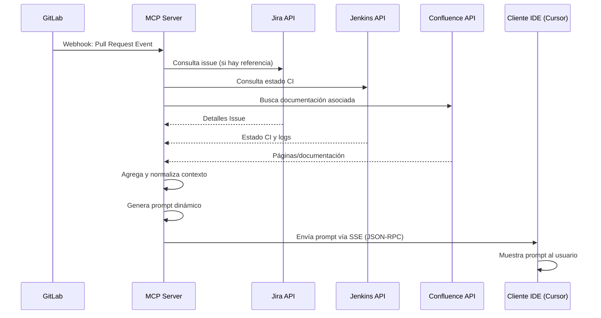
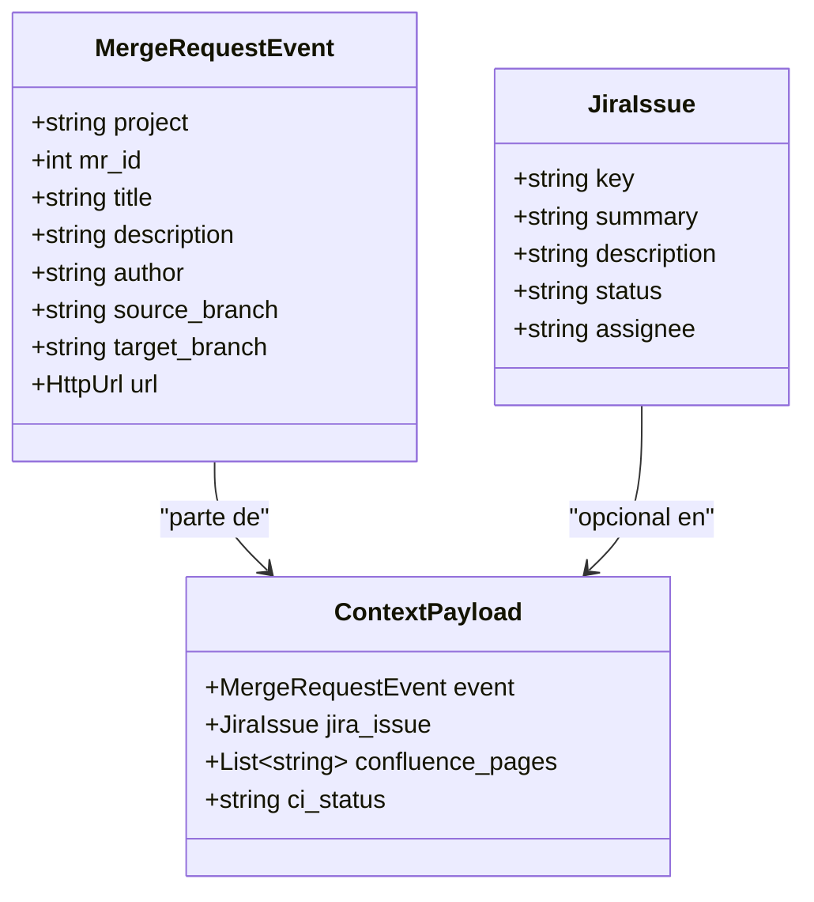

# **Diseño del Servidor MCP Orquestador Semántico para el SDLC**

El **Model Context Protocol (MCP)** es un estándar que permite a sistemas de IA (p. ej. LLMs) conectarse e interactuar con herramientas y servicios externos de forma uniforme ([MCP Servers: A Comprehensive Guide — Another way to explain | by TONI RAMCHANDANI | Data And Beyond | Mar, 2025 | Medium](https://medium.com/data-and-beyond/mcp-servers-a-comprehensive-guide-another-way-to-explain-67c2fa58f650#:~:text=MCP%20stands%20for%20Model%20Context,through%20a%20standardized%20interface)). Un servidor MCP actuará como un *orquestador semántico* en el ciclo de vida de desarrollo de software (SDLC), sirviendo de conector entre los agentes de IA y las fuentes de contexto (código, tickets, documentación, CI/CD, etc.). A continuación se presenta un diseño detallado, modular y técnico del servidor MCP, cubriendo la integración con herramientas externas, flujo de eventos, protocolo de comunicación, dependencias clave y mejores prácticas de escalabilidad, seguridad y trazabilidad.

## **Diseño Conceptual y Modular del Servidor MCP**

El servidor MCP se compondrá de varios **módulos** bien definidos para mantener separación de responsabilidades y facilitar la escalabilidad:

* **Conectores de Integración (APIs externas):** Módulos encargados de interactuar con Jira, GitLab, Confluence, Jenkins, etc. Cada conector manejará la autenticación segura y las consultas específicas de su servicio (por ejemplo, obtención de detalles de un issue en Jira o el estado de un pipeline en Jenkins).

* **Receptor de Eventos:** Un componente (por ejemplo, endpoints webhooks en FastAPI) que recibe **eventos** del entorno de desarrollo (p. ej. apertura de un *Pull Request* en GitLab, cambios en un ticket de Jira o finalización de build en Jenkins). Este receptor validará la procedencia (firma/token de webhook) y normalizará el evento a un modelo interno.

* **Administrador de Contexto:** Módulo central que toma un evento y **agrega el contexto relevante** desde múltiples fuentes. Aplica reglas de seguridad y compliance – por ejemplo, filtrando información sensible o asegurándose de incluir criterios de aceptación de la historia de usuario (prácticas ágiles). También garantiza que el contexto siga lineamientos de la organización (seguridad, normativas) antes de entregarlo a la IA.

* **Generador de Prompts:** Componente que **convierte el contexto agregado en un prompt** utilizable por el agente LLM. Esto puede implicar formatear datos en texto estructurado (por ejemplo, un resumen de cambios de código, descripción de ticket Jira, resultado de pruebas) y aplicar una plantilla de prompt. Podría ofrecer **prompts predefinidos** para ciertas interacciones recurrentes (p. ej. plantilla de *code review*), ajustados dinámicamente según el contexto.

* **Interfaz MCP (Servidor MCP):** Capa que expone los recursos y acciones a través del protocolo MCP para que el agente en el IDE pueda consumirlos. En la práctica, el servidor MCP actúa similar a una API web especializada para LLMs ([GitHub \- jlowin/fastmcp: The fast, Pythonic way to build Model Context Protocol servers](https://github.com/jlowin/fastmcp#:~:text=The%20Model%20Context%20Protocol%20,MCP%20servers%20can) ), pudiendo **exponer datos mediante *Resources* (análogos a endpoints GET)** para cargar información de contexto en el modelo, y **funcionalidades mediante *Tools* (análogos a endpoints POST)** para ejecutar acciones en sistemas externos ([GitHub \- jlowin/fastmcp: The fast, Pythonic way to build Model Context Protocol servers](https://github.com/jlowin/fastmcp#:~:text=The%20Model%20Context%20Protocol%20,MCP%20servers%20can) ). Por ejemplo, un “Resource” podría proporcionar los detalles de un issue de Jira o un diff de código, mientras que un “Tool” podría desencadenar una acción como comentar en un ticket o re-ejecutar un build (si se desea habilitar acciones de dos vías). Esta interfaz MCP se construirá sobre una aplicación web (usando FastAPI/Starlette) con soporte para la especificación MCP.

**Estructuras de datos con Pydantic:** Se utilizarán modelos Pydantic para definir con claridad el esquema de datos en cada módulo. Por ejemplo, podríamos definir un modelo para un evento de Merge Request de GitLab, y otro para encapsular el contexto consolidado:

```py
from pydantic import BaseModel, HttpUrl
from typing import Optional, List

class MergeRequestEvent(BaseModel):
    project: str
    mr_id: int
    title: str
    description: Optional[str]
    author: str
    source_branch: str
    target_branch: str
    url: HttpUrl

class JiraIssue(BaseModel):
    key: str
    summary: str
    description: str
    status: str
    assignee: Optional[str]

class ContextPayload(BaseModel):
    event: MergeRequestEvent
    jira_issue: Optional[JiraIssue] = None
    confluence_pages: List[str] = []
    ci_status: Optional[str] = None
    # ...otros campos de contexto relevante
```

En este ejemplo, `MergeRequestEvent` representa un evento normalizado de apertura de MR, `JiraIssue` podría modelar campos importantes de un ticket, y `ContextPayload` agrupa todo el contexto recopilado. Estos modelos facilitan la validación de datos entrantes (por ejemplo, del webhook) y salientes (prompt), aportando **tipado y documentación automática**. Además, Pydantic permite extender fácilmente para incluir otros tipos de evento (podemos tener modelos para eventos de Jenkins, Confluence, etc., usando herencia o campos opcionales según el origen).

## **Integración con Herramientas Externas (APIs y Autenticación Segura)**

La integración con Jira, GitLab, Confluence y Jenkins se realizará mediante sus APIs REST oficiales, utilizando autenticación robusta y manejando las particularidades de cada una:

* **Jira:** Se usará la API REST de Atlassian. Para entornos cloud, Jira exige usar **token de API** en lugar de usuario/contraseña básica. Por ejemplo, Atlassian documenta el uso de API tokens generados desde la cuenta para autenticarse en llamadas REST ([Basic auth for REST APIs \- Atlassian Developer](https://developer.atlassian.com/cloud/jira/software/basic-auth-for-rest-apis/#:~:text=Basic%20auth%20requires%20API%20tokens,where%20you%20would%20have)). El servidor MCP almacenará de forma segura las credenciales (ej. token y URL de Jira) – idealmente vía variables de entorno o un almacén seguro – y las cargará usando Pydantic (por ejemplo, un modelo `Settings(BaseSettings)` de Pydantic puede mapear `JIRA_TOKEN`, `JIRA_URL` desde el entorno). Con las credenciales, se pueden utilizar librerías oficiales como **atlassian-python-api** o **jira** (que facilitan métodos Python para obtener issues, comentarios, etc.) de forma **asíncrona** (por ejemplo, ejecutando en un loop separado o usando `httpx.AsyncClient` contra la API de Jira Cloud).

* **GitLab:** Se integrará mediante la API REST v4 de GitLab (o GraphQL si se prefiere). Al igual que Jira, se recomienda usar **Personal Access Tokens (PAT)** con permisos restringidos para autenticación, enviados como header HTTP `Authorization: Bearer <token>` o como parámetro (según la configuración) ([Personal access tokens | GitLab Docs](https://docs.gitlab.com/user/profile/personal_access_tokens/#:~:text=Personal%20access%20tokens%20can%20be,to%20OAuth2%20and%20used%20to)). Existe el paquete Python **python-gitlab** que provee una interfaz cómoda (incluyendo manejo de paginación, etc.), el cual se puede configurar con el token y la URL de la instancia (GitLab SaaS o self-hosted). El conector de GitLab se encargará de operaciones como: buscar la info detallada de un Merge Request (descripción, diffs, reviewers), extraer discusiones/comentarios, listar *pipelines* asociadas a un MR, etc. Para recibir eventos en tiempo real, GitLab permite configurar **Webhooks** para eventos como apertura/merge de MRs, pushes, comentarios, etc., que nuestro receptor de eventos debe exponer (ej. endpoint `/webhook/gitlab` que valide un token secreto compartido).

* **Confluence:** Utilizará la API REST de Confluence (parte de Atlassian). La autenticación igualmente mediante token de API del usuario o de servicio con permisos adecuados. Podemos usar nuevamente **atlassian-python-api** (que soporta Confluence) o peticiones HTTP directas con `httpx`. El objetivo del conector Confluence es poder *consultar páginas o buscar contenido relevante* dado un contexto; por ejemplo, buscar una página de diseño cuyos títulos contengan el ID de la tarea Jira o algún keyword del proyecto, o recuperar una página específica si el Jira ticket tiene un link a documentación. Esto permite enriquecer el contexto con especificaciones de requisitos, documentación de arquitectura, etc. (apoyando la metodología ágil al vincular código con su documentación viva).

* **Jenkins:** La integración con Jenkins se hará mediante su API REST (o su API SOAP, pero REST/json es más común). Jenkins requiere normalmente un **API Token de usuario** (o token de API global) y a veces un “crumb” anti-CSRF para modificaciones. Para simplicidad, se puede usar la librería **python-jenkins** para desencadenar y consultar jobs, o hacer llamadas con `httpx` al endpoint JSON de un build. El conector Jenkins podría ofrecer funciones para: obtener el estado de la última ejecución de CI para un determinado commit o MR (por ejemplo, consultando por el nombre de branch o un build tag), extraer logs de build o resultados de pruebas para incluirlos en el contexto. Asimismo, Jenkins puede emitir webhooks (mediante plugins como *GitLab plugin* o *Notification plugin*) al finalizar jobs, que nuestro receptor de eventos debería manejar en un endpoint `/webhook/jenkins` (con token de seguridad) si queremos prompts reactivos tras una ejecución de CI.

**Autenticación y seguridad en integraciones:** En todos los casos, el servidor MCP debe **almacenar tokens de forma segura** (por configuración externa, no hardcode) y usar conexiones HTTPS a las APIs. No se deben exponer directamente los tokens a los agentes LLM ni a los usuarios finales. El servidor actuará como proxy seguro: las llamadas de la IA llegan al servidor MCP, este usa sus credenciales para consultar la herramienta externa y solo devuelve la información necesaria. Esto permite también implementar controles de acceso en el servidor MCP; por ejemplo, podríamos limitar que la IA solo pueda invocar ciertas acciones o leer ciertos campos. De hecho, una práctica recomendada es que el MCP server emita sus propios tokens restringidos para los clientes IA en vez de usar directamente los tokens upstream, de forma que si se compromete el token entre el cliente IDE y el MCP, no se obtengan privilegios completos sino solo lo que el MCP expone ([Build and deploy Remote Model Context Protocol (MCP) servers to Cloudflare](https://blog.cloudflare.com/remote-model-context-protocol-servers-mcp/#:~:text=tomorrow%3F%E2%80%9D%20You%20can%20enforce%20this,only%20what%20the%20client%20needs)). Esta capa de abstracción añade seguridad al **prevenir acceso no autorizado o excesivo** por parte de la IA (mitigando el riesgo de *"Excessive Agency"* identificado por OWASP ([Build and deploy Remote Model Context Protocol (MCP) servers to Cloudflare](https://blog.cloudflare.com/remote-model-context-protocol-servers-mcp/#:~:text=tomorrow%3F%E2%80%9D%20You%20can%20enforce%20this,only%20what%20the%20client%20needs))).

## **Flujo de Eventos y Generación de Prompts Contextuales**

A continuación se detalla el **flujo típico de un evento** (por ejemplo, la apertura de un *Pull Request* en GitLab) y cómo el servidor MCP genera un prompt contextual para el agente LLM:

1. **Evento entrante:** Un desarrollador crea/abre un Merge Request (MR) en GitLab. GitLab envía un webhook HTTP a nuestro servidor MCP (endpoint configurado para eventos de MR). El payload JSON del webhook incluye datos básicos del MR (ID, título, descripción, autor, fuente, destino, etc.). El receptor de eventos del MCP Server valida el webhook (por ejemplo, cabecera `X-Gitlab-Token` coincidente con el secreto esperado) y luego transforma estos datos al modelo `MergeRequestEvent` de Pydantic. Si el evento viniera de otra fuente (Jira, Jenkins), se haría similar con su respectivo modelo.

2. **Enriquecimiento de contexto:** El **administrador de contexto** toma el `MergeRequestEvent` y comienza a recopilar información adicional relevante de cada integración:

   * *Jira:* Si el título o la descripción del MR menciona un ID de ticket (ej. "PROJ-123"), el servidor consultará Jira para obtener los detalles de ese issue (resumen, descripción, estado, **criterios de aceptación**, asignatario, etc.). Incluir los criterios de aceptación y la descripción del requerimiento es crucial para alinear con metodologías ágiles (el agente sabrá *qué se esperaba lograr* con este cambio de código). Si la política exige compliance, por ejemplo, cierta palabra clave en la descripción de commits, el contexto manager podría verificarlo aquí.

   * *GitLab (repositorio):* El servidor obtiene detalles del MR vía API: diffs de archivos modificados, número de líneas cambiadas, aprobadores requeridos, últimos commits en la rama, y cualquier comentario inicial. Estos diffs pueden ser voluminosos; una buena práctica es **resumir o limitar** el contenido (p. ej., extraer sólo los encabezados de archivos y algunos cambios clave) para no desbordar el prompt. Alternativamente, el servidor podría proporcionar el diff completo como un recurso descargable si el agente lo solicita explícitamente.

   * *Jenkins (CI):* Detecta si existe un pipeline vinculado al MR (por convención, nombre de rama igual, o un hook de GitLab CI). Si hay una ejecución en curso o finalizada para ese MR, consulta el estado (en espera, en ejecución, éxito/falla). Si ya terminó con fallo, puede recoger un *resumen de errores de prueba* o el enlace al log. Esto añade contexto sobre la calidad del cambio.

   * *Confluence:* Busca documentación relacionada. Por ejemplo, usando la clave Jira o el nombre del proyecto para encontrar páginas de especificación de requerimientos o diseño. Si encuentra una página relevante (ej. "Diseño módulo X"), podría extraer un par de oraciones clave (o un enlace) para contexto. Aunque no todos los PR tendrán doc asociada, este paso garantiza que si la hay, el agente la conozca (importante para compliance si se requiere mantener doc actualizada).

   * Todos estos **sub-llamados a APIs externas se pueden realizar en paralelo** usando `asyncio` para mejorar rendimiento. Por ejemplo, el servidor puede lanzar concurrentemente la petición a Jira, GitLab y Jenkins usando `await asyncio.gather(...)`, ya que son I/O-bound. Esto reduce la latencia total de compilación del contexto.

3. **Normalización y políticas de contexto:** A medida que se obtienen las respuestas de las APIs, el administrador de contexto las valida y filtra según políticas:

   * Remueve o mascara cualquier dato sensible que no deba llegar al prompt (ej: secretos en configuración, detalles personales de un usuario que no sean relevantes, etc.).

   * Aplica *compliance* corporativa: por ejemplo, si detecta que el MR modifica código en un módulo crítico, podría agregar una nota de seguridad al prompt (“Este cambio toca componentes críticos; revisar adherencia a estándares de seguridad X.”). O si el ticket Jira está en un estado no permitido (ej. la rama no asociada a un ticket aprobado), incluir una advertencia.

   * Formatea cada pieza de contexto en texto claro: e.g., `"**JIRA PROJ-123 - User Story**: Implementar autenticación.\nDescripción: ...\nCriterios de aceptación: ..."`; `"**Cambios en código**: 5 archivos modificados (ver detalles diffs resumidos a continuación...)"`; `"**Estado CI**: Pipeline #1234 falló en pruebas unitarias (2 tests fallidos)."`.

   * El resultado de esta etapa es un objeto `ContextPayload` completo y saneado.

4. **Generación del prompt dinámico:** Usando el `ContextPayload`, el generador de prompts construye el mensaje que se enviará al LLM. Puede haber una plantilla base según el tipo de evento. Por ejemplo, para un PR abierto podríamos definir un prompt tipo *"Code Review Assistant"*:

   * Incluir una breve **instrucción de rol** al inicio, p. ej.: *"Eres un asistente de código que ayuda a revisar cambios en base al contexto del proyecto."*

   * Luego volcar las secciones de contexto: detalles del ticket Jira (requerimiento), resumen del cambio de código, estado de CI, etc.

   * Finalmente, añadir una solicitud explícita al agente: p. ej. *"Por favor, genera un resumen de este Pull Request y señala posibles impactos o si cumple con los criterios de aceptación."*.

5. Este prompt es esencialmente un mensaje de sistema o usuario que el agente LLM (p.ej., Cursor IDE agent) recibirá. El contenido exacto puede ajustarse según la necesidad: podría pedirse al agente que simplemente muestre la información al desarrollador, o que ofrezca sugerencias proactivas (ej. "Veo que las pruebas fallaron, ¿quieres que sugiera una corrección?").

6. **Entrega del prompt al agente (MCP Client):** Una vez listo el prompt, el servidor MCP lo **sirve al agente en el IDE a través del protocolo MCP**. En un escenario local, el agente (p. ej. Cursor) podría haber iniciado el servidor MCP internamente y la comunicación sería en memoria; pero dado que queremos soportar nube/on-prem, probablemente se use el **modo remoto** de MCP. Esto típicamente funciona con una conexión HTTP/SSE:

   * El servidor expone un endpoint MCP (por convención, `/mcp` o similar) que mantiene una **conexión abierta mediante Server-Sent Events (SSE)** con el cliente ([What is an MCP Server? | Blog](https://aiagentslist.com/blog/what-is-an-mcp-server#:~:text=SSE%20%28Server)). El SSE permite al servidor enviar datos de forma asíncrona al cliente en cuanto estén disponibles. Alternativamente, podría usarse WebSocket si la implementación MCP lo soporta, pero el estándar menciona SSE/HTTP \+ JSON-RPC 2.0 como transporte.

   * El prompt contextual generado se envía a través de esa conexión, probablemente formateado en un mensaje JSON-RPC (el MCP usa JSON-RPC 2.0 para estructurar llamadas/respuestas ([What is an MCP Server? | Blog](https://aiagentslist.com/blog/what-is-an-mcp-server#:~:text=SSE%20%28Server))). El agente en el IDE recibe este mensaje como un **Resource** de contexto.

   * Por ejemplo, el servidor podría definir un Resource `review://current_pr` que cuando es “cargado” por el agente corresponde al prompt recién generado. En la práctica, tras el evento, el servidor podría enviar una notificación que hace que el cliente llame automáticamente a dicho resource. Esto depende de la implementación del cliente MCP; en Cursor, la configuración `.cursor/mcp.json` puede predefinir qué recursos usar en cada agente.

   * Finalmente, el agente LLM incorpora este prompt a la conversación visible para el desarrollador. Esto puede aparecer como un mensaje del sistema o simplemente la herramienta completando automáticamente un resumen en la ventana del IDE.

7. **Interacción con el desarrollador:** El desarrollador verá que su asistente en el IDE (por ejemplo Cursor) le provee inmediatamente un resumen/contexto o inicia una conversación informada: por ejemplo, el agente podría decir *"He recopilado la siguiente información sobre tu PR \#42... (detalles)... ¿Deseas ayuda con algo más?"*. A partir de ahí, el desarrollador puede preguntarle al agente sobre el cambio, solicitar una revisión de código más profunda, generar documentación, etc., y el agente ya cuenta con todo el contexto para dar respuestas precisas.

8. **(Opcional) Acciones salientes:** Aunque el caso primario es proveer contexto (lectura), el diseño soporta también que el agente desencadene acciones en respuesta. Por ejemplo, el agente LLM podría ofrecer: "¿Quieres que marque la tarea Jira PROJ-123 como *En revisión*?". Si el usuario acepta, el agente puede invocar un **Tool MCP** expuesto por el servidor, por ejemplo `jira_transition(issue_id, new_status)`, que mediante el conector Jira cambiaría el estado del ticket. Estas acciones están sujetas a las mismas reglas de seguridad (el MCP server verifica permisos, etc.). Este es un caso de *comunicación bidireccional* que MCP permite (el modelo de IA no solo lee info sino que puede activar *side effects* externos ([What is an MCP Server? | Blog](https://aiagentslist.com/blog/what-is-an-mcp-server#:~:text=Two))), aunque debe usarse con cuidado en entornos de desarrollo reales.

En seudocódigo, el flujo de manejo de un evento podría verse así:

```py
async def on_gitlab_mr_open(webhook_payload: dict):
    # 1. Parsear evento entrante
    event = MergeRequestEvent(**webhook_payload)
    # 2. Enriquecer contexto concurrentemente
    jira_issue = None
    if event.title and jira_key_from_title(event.title):
        jira_issue = await jira_client.get_issue(jira_key_from_title(event.title))
    ci_status_task = asyncio.create_task(jenkins_client.get_pipeline_status(event.project, event.source_branch))
    # (más tareas asincrónicas para Confluence, etc.)
    ci_status = await ci_status_task
    
    # 3. Administrar contexto (seguridad, formato)
    context = ContextPayload(event=event, jira_issue=jira_issue, ci_status=ci_status)
    context = apply_compliance_policies(context)  # p.ej., remover datos sensibles
    
    # 4. Generar prompt textual
    prompt_text = render_prompt_template(context)
    # 5. Enviar via MCP (SSE/JSON-RPC) al agente en IDE
    await mcp_server.push_resource("review://current_pr", data=prompt_text)
```

*(El código anterior es ilustrativo; `mcp_server.push_resource` representaría el mecanismo de notificar al cliente. En la realidad, la librería MCP/FastAPI se encargaría de enviar el recurso actualizado por la conexión SSE abierta.)*

## **Protocolo de Comunicación MCP (Servidor MCP, Backend y Cliente IDE)**

El protocolo de comunicación define **cómo interactúa el agente LLM (cliente MCP en el IDE) con nuestro servidor MCP**. En este diseño:

* **Cliente IDE (Agente LLM):** Cursor IDE (u otro IDE con soporte MCP) actúa como *host* del modelo de IA y a la vez contiene un *cliente MCP* que sabe conectarse a servidores MCP ([What is an MCP Server? | Blog](https://aiagentslist.com/blog/what-is-an-mcp-server#:~:text=These%20are%20generative%20AI%20applications,resources%20to%20enhance%20their%20capabilities)). En la práctica, el agente en Cursor leerá la configuración (por ejemplo, `.cursor/mcp.json`) donde se especifica la URL de nuestro servidor MCP y los recursos/tools disponibles. Al iniciar, Cursor establecerá la conexión con el servidor (seguramente vía SSE). Cuando el agente LLM necesita contexto o invocar una acción, lo hará a través de este cliente MCP.

* **Servidor MCP:** Es nuestra aplicación (posiblemente ejecutándose en FastAPI uvicorn). Debe **cumplir la especificación MCP**, manejando conexiones y mensajes en formato JSON-RPC. Esto implica que el servidor tendrá endpoints dedicados: uno para iniciar la comunicación (handshake), uno para recibir llamadas de herramientas, y uno (SSE) para enviar respuestas/eventos de vuelta. Afortunadamente, existen *SDKs oficiales* en Python que facilitan implementar esto según estándar (p. ej. `modelcontextprotocol` SDK, o frameworks como **FastMCP** que abstraen detalles de bajo nivel). Estas herramientas nos evitan construir el protocolo desde cero y aseguran compatibilidad con clientes MCP variados.

* **Backend (Integraciones):** Cuando hablamos de *backend* aquí nos referimos a las herramientas externas (Jira, GitLab, etc.) y a la lógica interna del MCP server que las orquesta. El servidor MCP hace de mediador entre el cliente y estas fuentes de datos. Por ejemplo, si el agente LLM “llama” al recurso `jira://PROJ-123`, el servidor MCP (mediante un handler registrado) consultará a Jira y devolverá el resultado al agente. El **formato de las URIs de recursos** es parte de la interfaz: podemos diseñar esquemas como `jira://{issueKey}`, `gitlab://mr/{id}`, `confluence://search?query=...`, etc., para exponer distintas vistas de datos. Estas URIs son comunicadas al agente para que este sepa qué pedir.

* **Transporte (STDIO vs SSE):** MCP soporta dos modos: STDIO y SSE ([What is an MCP Server? | Blog](https://aiagentslist.com/blog/what-is-an-mcp-server#:~:text=STDIO%20)). En implementaciones locales (por ejemplo, si el agente lanza el servidor como subproceso), se puede usar STDIO (canales estándar) para comunicaciones rápidas sin red ([What is an MCP Server? | Blog](https://aiagentslist.com/blog/what-is-an-mcp-server#:~:text=STDIO%20is%20ideal%20for%20local,data%20on%20the%20same%20machine)). En nuestro caso, el servidor debe funcionar remotamente, por lo que usaremos **SSE sobre HTTP** como transporte principal ([What is an MCP Server? | Blog](https://aiagentslist.com/blog/what-is-an-mcp-server#:~:text=SSE%20%28Server)). Esto significa que el cliente IDE realizará una petición HTTP GET al servidor (p. ej. `/mcp/connect`) que permanecerá abierta y por donde el servidor enviará eventos JSON codificados (formato **JSON-RPC 2.0**) cada vez que haya datos (por ejemplo, la llegada de un nuevo contexto o la respuesta a una invocación de herramienta). El cliente MCP manejará estos mensajes, presentándolos al LLM adecuadamente.

* **Llamadas de Recursos vs Tools:** Siguiendo la filosofía MCP, nuestro servidor definirá tanto *resources* (datos de solo lectura) como *tools* (acciones) disponibles. Por ejemplo, un **Resource** `jira://{issueKey}` devolverá datos de un ticket Jira (campos relevantes). Un **Tool** `create_jira_issue(summary, description)` podría crear un ticket (side effect). Internamente, con frameworks tipo FastMCP, definiremos funciones Python decoradas como `@mcp.resource` o `@mcp.tool` que automáticamente quedan expuestas vía MCP ([GitHub \- jlowin/fastmcp: The fast, Pythonic way to build Model Context Protocol servers](https://github.com/jlowin/fastmcp#:~:text=,And%20more) ). Estas funciones pueden usar modelos Pydantic en sus firmas para validar entradas y salidas. El **cliente IDE** invocará estos recursos/herramientas de forma transparente cuando el LLM lo requiera en su flujo de diálogo. Por ejemplo, si en una conversación el agente necesita datos de un issue, podría hacer (a nivel de JSON-RPC) una llamada `{"method": "get_resource", "params": {"uri": "jira://PROJ-123"}}` y el servidor retornará la respuesta con el modelo JSON del issue.

* **Comunicación en la práctica:** Un caso concreto de comunicación: nuestro servidor MCP recibe el evento de MR abierto y envía proactivamente (por SSE) un mensaje que actualiza el recurso `review://current_pr` con el contexto del PR. El agente Cursor, al tener un agente configurado para “code review”, podría estar suscrito a ese recurso o solicitarlo al ver el evento. La sincronización exacta depende de la implementación del cliente; en algunos entornos, el agente podría no tomar acción hasta que el usuario haga una consulta, mientras que otros permiten *push*. Gracias a MCP, este detalle se estandariza, permitiendo al agente usar la información cuando corresponda sin integraciones ad-hoc.

* **Respuesta del agente:** Tras recibir el prompt/contexto, el LLM genera su respuesta (por ejemplo, un comentario o resumen). Esta respuesta se presenta al usuario en el IDE, cerrando el ciclo. Si la respuesta del LLM implica llamar a una herramienta (ej. decidimos que el LLM automáticamente cree un subtarea en Jira), el cliente MCP enviará esa solicitud al servidor (que ejecutará la acción via API externa y confirmará vía SSE de vuelta).

En resumen, el protocolo MCP garantiza que el intercambio entre nuestro servidor (backend integrador) y el cliente (agente en IDE) sea consistente y en tiempo real. Conceptualmente es similar a diseñar una API web RESTful, pero adaptada a interacción con IA ([GitHub \- jlowin/fastmcp: The fast, Pythonic way to build Model Context Protocol servers](https://github.com/jlowin/fastmcp#:~:text=The%20Model%20Context%20Protocol%20,MCP%20servers%20can) ), usando JSON-RPC sobre SSE para mantener la conversación fluida. Este diseño modular (herramientas, recursos, prompts) hace que añadir nuevas capacidades (por ejemplo, integrar otra herramienta como Slack para notificar al canal de equipo) sea cuestión de agregar otro módulo y exponerlo en la interfaz MCP estándar, sin cambiar cómo el cliente IA se comunica.

## **Dependencias y Librerías Clave**

Para implementar este servidor MCP con Python de manera eficiente, se recomendarán las siguientes dependencias clave:

* **Pydantic & Pydantic AI:** Pydantic (v2+) será fundamental para todos los modelos de datos (eventos, contextos, configuraciones). Facilita la validación y conversión de tipos (por ejemplo, fechas de Jira a `datetime`, URLs a `HttpUrl`, etc.) y proporciona **BaseSettings** para cargar configuración (tokens, URLs, etc.) de forma segura. Además, **PydanticAI** (framework de agentes de Pydantic) puede ser relevante si planeamos integrar agentes o aprovechar utilidades orientadas a LLM (aunque en este caso el agente principal está en el IDE, PydanticAI podría ayudarnos a definir prompts o usar agentes internos para, digamos, resumir documentación automáticamente si quisiéramos). PydanticAI también ofrece compatibilidad integrada con MCP, permitiendo que agentes definidos en ese framework actúen como clientes o incluso dentro del servidor ([PydanticAI MCP Support & Logfire MCP Server Announcement | Pydantic](https://pydantic.dev/articles/mcp-launch#:~:text=PydanticAI%20now%20supports%20the%20Model,Protocol%20in%20three%20key%20ways)).

* **FastAPI**: Framework web **async** Python para construir APIs rápidamente. FastAPI se integra estrechamente con Pydantic para generar automáticamente esquemas y documentación OpenAPI de nuestros modelos ([FastAPI and Pydantic: A Powerful Duo \- Theodo Data & AI](https://data-ai.theodo.com/en/technical-blog/fastapi-pydantic-powerful-duo#:~:text=FastAPI%20and%20Pydantic%3A%20A%20Powerful,and%20even%20documenting%20your%20API)). Usaremos FastAPI para definir endpoints de webhook (POST), así como posiblemente para montar el servidor MCP. Podríamos combinar FastAPI con el SDK de MCP: por ejemplo, usando *Starlette* endpoints or `EventSourceResponse` for SSE. Si utilizamos **FastMCP** (una librería que extiende FastAPI para MCP), esta internamente se basa en FastAPI/Uvicorn. FastAPI nos da alto rendimiento asíncrono y la capacidad de incluir fácilmente middleware (p. ej. autenticación de webhook, CORS si hiciera falta, etc.).

* **Async HTTP Clients (httpx/aiohttp):** Para las llamadas salientes a APIs de Jira, GitLab, etc., utilizaremos un cliente HTTP asíncrono. **httpx** es una opción popular que soporta AsyncIO y tiene una interfaz similar a requests. Esto nos permite hacer *await client.get(url, headers=...)* y continuar con otras tareas mientras esperamos. Dado que la latencia de llamadas a servicios externos puede ser el mayor factor, usar async y llamadas concurrentes (como mencionado) es clave para un servidor responsivo.

* **Libraries de APIs específicas:** Para acelerar el desarrollo, podemos incorporar:

  * `python-gitlab` – proporciona clases Python para proyectos, MRs, pipelines, etc., manejando autenticación y endpoints internamente.

  * `atlassian-python-api` – un solo paquete que soporta Jira y Confluence (métodos como `JIRA.issue(key)` o `Confluence.get_page_by_title(...)`).

  * `python-jenkins` – para interactuar con Jenkins (get\_job, get\_build\_info, trigger\_build, etc.).

* Estas librerías abstraen los detalles de las APIs REST y retornan objetos Python (que podemos luego serializar via Pydantic). Como desventaja, algunas no son async-native. Si no lo son, podríamos envolverlas en ejecutores de hilos (`run_in_threadpool`) o preferir llamadas directas con httpx \+ nuestros modelos Pydantic para máximo rendimiento. Esto se evaluará según la complejidad: por ejemplo, una llamada simple GET a Jira podemos hacerla con httpx directamente y parsear JSON a nuestro `JiraIssue` model.

* **SDK/Framework MCP:** Para no reinventar la rueda del protocolo, es recomendable usar el SDK oficial `modelcontextprotocol` (disponible en PyPI) o la mencionada **FastMCP**. FastMCP permite definir @mcp.resource y @mcp.tool fácilmente en Python ([GitHub \- jlowin/fastmcp: The fast, Pythonic way to build Model Context Protocol servers](https://github.com/jlowin/fastmcp#:~:text=interactions) ) ([GitHub \- jlowin/fastmcp: The fast, Pythonic way to build Model Context Protocol servers](https://github.com/jlowin/fastmcp#:~:text=Resources%20are%20how%20you%20expose,Some%20examples) ), integrándose con Uvicorn. También maneja la conexión SSE y JSON-RPC bajo el capó. Otra alternativa es la implementación de referencia de *MCP servers* de Pydantic (que se usa para Logfire, etc.). Dado que la pregunta se enfoca en Pydantic, podríamos suponer usar *PydanticAI Agents as MCP server*, pero aquí realmente necesitamos un servidor custom. FastAPI \+ SDK MCP nos da control total y estándar.

* **Uvicorn/Gunicorn:** Para desplegar en producción, se usará un servidor ASGI eficiente como Uvicorn. Si se requiere manejo de múltiples procesos, Gunicorn con trabajadores uvicorn puede ser usado. Esto es transparente para el código FastAPI.

* **Docker:** Especificado como requisito, Docker se utilizará para empaquetar la aplicación. La imagen de base podría ser `python:3.11-slim` instalando nuestras dependencias. Se escribirá un Dockerfile que copie el código, instale libs (posiblemente usar `poetry` o `pip`), exponga el puerto (por ejemplo 8000\) y arranque Uvicorn. Docker permite desplegar tanto en la nube (contenedor en Kubernetes, ECS, etc.) como on-prem (ejecutando el docker en la red local del equipo), proporcionando consistencia entre entornos ([What is an MCP Server? | Blog](https://aiagentslist.com/blog/what-is-an-mcp-server#:~:text=Docker%20for%20Containerization)). También facilita escalamiento horizontal si se requieren varias instancias detrás de un balanceador.

* **Otras utilidades:** Logging (integrado en FastAPI or using Python `logging`), `python-dotenv` (para cargar `.env` in dev), and possibly **SSE support** if not using an MCP framework (e.g. `sse-starlette` or manually constructing an event stream). For compliance and security scanning, one might include static analysis tools (not exactly a runtime dependency, but in development, to ensure quality).

En resumen, el stack tecnológico central es **FastAPI \+ Pydantic \+ AsyncIO**, complementado con SDKs de MCP y clientes de APIs de ALM (Application Lifecycle Management) como Jira/GitLab. Esto nos brinda un servidor eficiente, con tipado robusto y listo para interconectar IA con el ecosistema dev.

## **Buenas Prácticas de Escalabilidad, Seguridad y Trazabilidad**

Al diseñar este servidor MCP para entornos colaborativos de desarrollo, debemos considerar varias **buenas prácticas** que garanticen un funcionamiento escalable, seguro y auditable:

* **Escalabilidad & Desempeño:**

  * *Diseño stateless:* El servidor MCP debería ser lo más **sin estado** posible entre solicitudes. Cada evento o solicitud del agente se maneja independientemente, lo que permite escalar instancias en paralelo. Si se requiere mantener alguna información (p. ej. cache de un issue Jira reciente para no re-consultar en cada prompt), usar almacenamientos externos o cache in-memory controlada, pero evitando sesiones de usuario pegajosas.

  * *Asincronía y concurrencia:* Aprovechar totalmente la capacidad asíncrona de FastAPI. Esto implica hacer *await* en llamadas externas y utilizar *background tasks* o colas en caso de operaciones muy pesadas. Por ejemplo, si generar cierto contexto toma mucho tiempo, se podría notificar parcialmente al agente (streaming) en lugar de esperar todo. El uso de SSE ya facilita enviar datos en trozos a medida que estén listos.

  * *Escalabilidad horizontal:* Con Docker, es sencillo desplegar múltiples réplicas. Asegurarse de que los webhooks o clientes puedan repartirse (por ejemplo, configurando un load balancer con sticky sessions para SSE, ya que SSE es una conexión persistente por cliente; alternativamente, cada desarrollador/IDE podría configurarse con su instancia de servidor MCP). Para entorno empresarial, se puede orquestar con Kubernetes, autoescalado según carga (CPU/latencia).

  * *Optimización de contexto:* Restringir el tamaño de los prompts generados. Aunque queremos ser informativos, pasar demasiados datos al LLM puede ser contraproducente (límites de tokens y costo). Aplicar *resúmenes automáticos* (incluso usar una función de LLM offline para resumir documentación antes de incluirla) y omitir datos irrelevantes mejora desempeño. Pydantic puede ayudar definiendo máximos (ej. lista de cambios truncada a N items) y validando tamaños.

  * *Monitoreo:* Incorporar métricas (por ej., cuántos eventos procesados, tiempo promedio de respuesta, tasa de errores de API externos) con herramientas como Prometheus. Esto permite detectar cuellos de botella y escalar recursos adecuadamente.

* **Seguridad & Compliance:**

  * *Autenticación y autorización:* Aunque los agentes IDE que se conecten serán de usuarios de confianza (desarrolladores internos), es recomendable proteger la API MCP con algún token o autenticación mútua, especialmente si expuesto en la nube. Podría ser tan simple como un API Key compartido configurado en el cliente (en `.mcp.json`) que el servidor valida antes de aceptar comandos. Esto previene accesos no autorizados a las valiosas integraciones.

  * *Control de alcance (Scope):* Como se mencionó, usar **tokens de mínimos privilegios** para las integraciones. Por ejemplo, un token de GitLab que solo tenga permisos de lectura en los repos necesarios (o en proyectos específicos en vez de global). Un token de Jira de solo lectura de issues si no necesitamos crear/editar. De esta forma, incluso si el servidor MCP fuese comprometido, el daño potencial se limita.

  * *Validación de entrada:* Con Pydantic, toda entrada (eventos, parámetros de herramientas) se valida estrictamente. Esto mitiga inyecciones o datos malformados. Por ejemplo, si un webhook malicioso intenta enviar un campo con un tipo inesperado, Pydantic lanzará error en lugar de procesarlo indebidamente.

  * *Filtrado/Redacción de datos:* Implementar un paso donde cualquier información sensible sea **redactada** del contexto enviado al LLM. Esto incluye secretos en texto plano, passwords, claves API que pudieran aparecer en config, o incluso PII de usuarios. Idealmente, tales datos ni siquiera deberían estar accesibles, pero si por error llegaran (p.ej., un campo de Jira contiene algo sensible), el contexto manager debe detectarlo (se pueden configurar listas negras de patrones).

  * *Cumplimiento y políticas:* Incluir en el prompt o en la lógica del agente recordatorios de compliance, e.g., “No proporcionar código fuente confidencial a fuentes externas” – aunque el agente sea interno, reforzar que las respuestas no violen políticas (como publicar código en canales no aprobados). Asimismo, respetar licencias: si el proyecto tiene reglas de licenciamiento de dependencias, el agente no debe sugerir código con licencias incompatibles, etc. Estas consideraciones a veces se manejan fuera del MCP, pero el contexto manager podría añadir notas de advertencia en casos relevantes (por ejemplo, “Esta cambio implica actualizar una librería, revisar cumplimiento de licencias.”).

  * *Auditoría de acciones AI:* Si permitimos que el agente ejecute acciones (ej. crear un ticket, hacer commit sugerido), es recomendable requerir confirmación explícita del desarrollador (*human in the loop*) antes de efectuarla. Esto previene que una IA con un entendimiento incorrecto cambie algo sin supervisión.

  * *Actualizaciones y parches:* Mantener las dependencias actualizadas (tanto las librerías mencionadas como la propia imagen Docker con parches de seguridad) es parte de la seguridad en SDLC.

* **Trazabilidad & Registro (Logging):**

  * *Logging centralizado:* El servidor MCP debe registrar cada evento importante: recepción de un webhook (con identificador, origen, resultado de la validación), acciones realizadas (llamadas a APIs externas y sus resultados, p. ej. “Consultado Jira PROJ-123, status=Done”), generación de prompt (quizá guardando un ID de prompt), envío al agente, y cualquier herramienta invocada por el agente. Estos logs permiten reconstruir después qué información vio la IA y qué hizo, logrando **auditoría completa** de las interacciones.

  * *Audit trail de IA:* En entornos colaborativos es crucial poder responder a “¿Por qué el asistente hizo tal sugerencia?”. Mantener un historial de prompts y respuestas (al menos temporalmente) ayuda a depurar malentendidos y a demostrar cumplimiento. Se pueden almacenar en un sistema de log seguro o incluso en Confluence automatizado si se desea (p.ej. registrar en una página las asistencias dadas por IA en cada PR).

  * *Trazabilidad de requerimientos:* Dado que estamos integrando con herramientas de gestión (Jira) y CI, el MCP server puede ayudar a la trazabilidad entre requerimiento \-\> código \-\> build \-\> deploy. Aunque no es su función primaria, al relacionar en los prompts el ticket Jira con el PR y con el build, queda implícita una traza. Para aprovechar esto, los logs podrían etiquetarse con identificadores comunes (ej. ID Jira, ID MR) para correlacionar eventos. Adoptar **correlation IDs** en logs (por ejemplo, asignar un UUID a cada "ciclo de evento de PR" y propagarlo en todos los mensajes relacionados) facilitará buscar todo el recorrido en logs.

  * *Logs ricos pero seguros:* Incluir suficiente detalle en los logs para diagnóstico (por ejemplo, incluir los campos principales del contexto), pero *evitar registrar datos extremadamente sensibles* en texto plano. Si por ejemplo se filtra un secreto en contexto y lo enmascaramos para el LLM, también deberíamos enmascararlo en el log o evitar guardarlo. Una opción es implementar distintos niveles de log (INFO para eventos generales, DEBUG para datos de contexto completos) y proteger los de nivel más bajo.

  * *Retención y acceso:* Definir políticas de cuánto tiempo se guardan estos registros y quién puede verlos. Para trazabilidad quizás 30 días sea suficiente (balanceando con privacidad). En entornos regulados, asegurarse que estos logs cumplan GDPR u otras normas si contienen datos personales. Muchos productos recomiendan **retener registros de interacciones de IA por un tiempo limitado** justamente por compliance ([Privacy, Security, and Governance in AI Assistant \- Experience League](https://experienceleague.adobe.com/en/docs/experience-platform/ai-assistant/privacy#:~:text=You%20can%20view%20a%20log,day%20retention%20policy)) ([AI agents for compliance: Role, use cases and applications, benefits ...](https://www.leewayhertz.com/ai-agents-for-compliance/#:~:text=,providing%20a%20clear%20audit%20trail)).

En suma, la implementación de este servidor MCP debe ir acompañada de disciplina en su operación: **monitorización, seguridad proactiva y registro exhaustivo**. Siguiendo estas prácticas, obtendremos un orquestador semántico robusto que escala con el equipo, mantiene la información protegida y ofrece transparencia en cómo la IA asiste en el desarrollo. De esta forma, los desarrolladores pueden confiar en las sugerencias del agente sabiendo que provienen de un contexto completo y controlado, integrado a su flujo de trabajo de manera segura y eficiente.

**Fuentes:** Las referencias incluidas respaldan las características de MCP y las mejores prácticas descritas, por ejemplo: la naturaleza estándar y segura del protocolo MCP ([MCP Servers: A Comprehensive Guide — Another way to explain | by TONI RAMCHANDANI | Data And Beyond | Mar, 2025 | Medium](https://medium.com/data-and-beyond/mcp-servers-a-comprehensive-guide-another-way-to-explain-67c2fa58f650#:~:text=MCP%20stands%20for%20Model%20Context,through%20a%20standardized%20interface)) ([GitHub \- jlowin/fastmcp: The fast, Pythonic way to build Model Context Protocol servers](https://github.com/jlowin/fastmcp#:~:text=The%20Model%20Context%20Protocol%20,MCP%20servers%20can) ), el uso de APIs con tokens seguros ([Basic auth for REST APIs \- Atlassian Developer](https://developer.atlassian.com/cloud/jira/software/basic-auth-for-rest-apis/#:~:text=Basic%20auth%20requires%20API%20tokens,where%20you%20would%20have)), transporte SSE/JSON-RPC para comunicación remota ([What is an MCP Server? | Blog](https://aiagentslist.com/blog/what-is-an-mcp-server#:~:text=SSE%20%28Server)), controles de seguridad para IA (OWASP) ([Build and deploy Remote Model Context Protocol (MCP) servers to Cloudflare](https://blog.cloudflare.com/remote-model-context-protocol-servers-mcp/#:~:text=tomorrow%3F%E2%80%9D%20You%20can%20enforce%20this,only%20what%20the%20client%20needs)), trazabilidad mediante logging/auditoría ([AI agents for compliance: Role, use cases and applications, benefits ...](https://www.leewayhertz.com/ai-agents-for-compliance/#:~:text=,providing%20a%20clear%20audit%20trail)), y la recomendación de Docker para despliegues consistentes ([What is an MCP Server? | Blog](https://aiagentslist.com/blog/what-is-an-mcp-server#:~:text=Docker%20for%20Containerization)). Estas guían el diseño propuesto para asegurar un servidor MCP técnicamente sólido y alineado con las necesidades del SDLC.




```mermaid
graph TD
    subgraph "MCP Server"
        A[Receptor de Eventos (Webhooks)]
        B[Conectores API]
        C[Administrador de Contexto]
        D[Generador de Prompts]
        E[Interfaz MCP (SSE/JSON-RPC)]
        F[API REST (FastAPI)]
    end

    subgraph "Herramientas Externas"
        G[Jira]
        H[GitLab]
        I[Confluence]
        J[Jenkins]
    end

    K[Cliente IDE (Cursor)]
    
    A --> B
    B --> G
    B --> H
    B --> I
    B --> J
    A --> C
    C --> D
    D --> E
    F --> E
    K <---> E
```