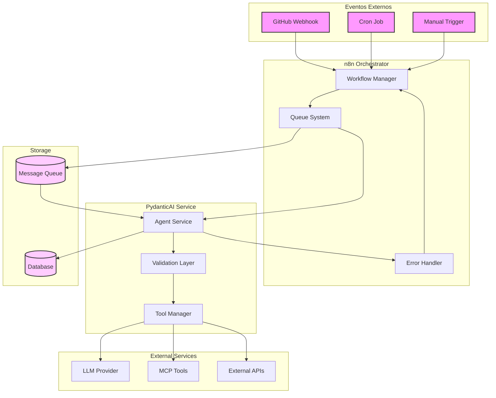
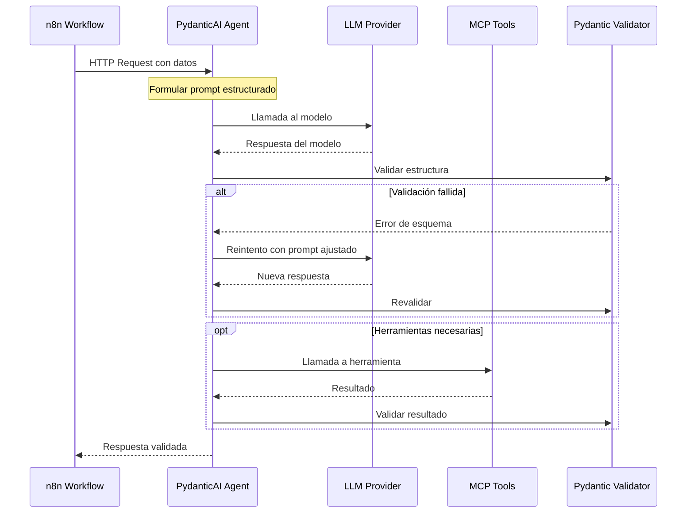
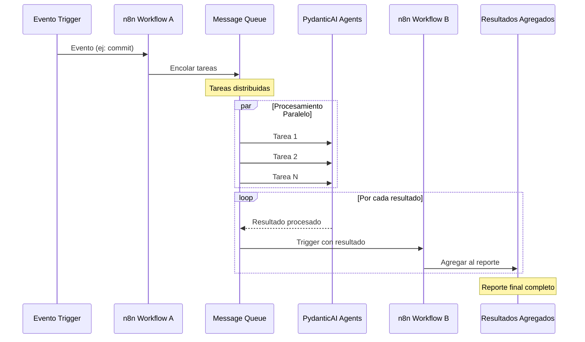

Perfecto. Voy a elaborar un informe técnico detallado que explore la viabilidad y los aspectos clave de integrar n8n como plataforma de orquestación con agentes desarrollados en PydanticAI para flujos agentic confiables en el pipeline de entrega de software. También incluiré tecnologías complementarias relevantes y consideraciones específicas para despliegues en la nube y entornos autogestionados.

Te avisaré cuando el informe esté listo para revisión.

# Integración de n8n con PydanticAI para workflows agénticos en Ingeniería de Software Confiable

## 1. Introducción y contexto

n8n es una plataforma de automatización y orquestación de workflows de código bajo, **open-source**, que permite integrar aplicaciones y servicios de forma visual mediante nodos. A diferencia de herramientas cerradas tipo Zapier, n8n se destaca por ser auto-hosteable y admitir ejecuciones ilimitadas, brindando flexibilidad para desplegar flujos tanto en la nube como on-premise. Su interfaz basada en nodos facilita a los desarrolladores conectar más de 400 aplicaciones/API mediante disparadores, webhooks y peticiones HTTP, abstrayendo la complejidad de autenticación (OAuth, API keys, etc.) e integraciones externas. Esto permite encadenar múltiples pasos y construir flujos complejos sin necesidad de mucho código, conservando control total sobre la infraestructura.

Por su parte, **PydanticAI** es un framework **Python** para agentes de IA generativa, creado por el equipo detrás de Pydantic (biblioteca ampliamente usada para validación de datos). Nació con el objetivo de simplificar la construcción de aplicaciones de IA generativa a nivel de producción. PydanticAI aprovecha la definición de modelos Pydantic para **validar y tipar las respuestas** del modelo de lenguaje, garantizando outputs estructurados y consistentes en cada ejecución. Soporta múltiples proveedores de LLM (OpenAI, Anthropic, Cohere, Mistral, etc.) de forma agnóstica, ofreciendo un entorno unificado para trabajar con distintas IA. Adicionalmente, integra herramientas de observabilidad como **Pydantic Logfire** para depuración y monitoreo en tiempo real de desempeño y comportamiento de agentes LLM. En co ([PydanticAI](https://ai.pydantic.dev/#:~:text=,powered%20applications))frameworks previos (p. ej. LangChain), PydanticAI resulta más intuitivo y flexible para desarrollar agentes de IA, gracias a su enfoque tipado, orientado a desarrolladores Python y centrado en buenas prácticas de ingeniería.

**Integrar n8n con agentes PydanticAI** persigue unir lo mejor de ambos mundos: la orquestación robusta de workflows de n8n con la inteligencia y capacidad iterativa de agentes basados en LLM. En el contexto de una *Ingeniería de Software Confiable con IA* (Reliable AI Software Engineering), esta integración permitiría incorporar agentes de IA en etapas del ciclo de vida del software (desarrollo, pruebas, despliegue, monitoreo) de forma controlada, auditable y colaborativa. La justificación principal es lograr *flujos de trabajo agénticos, iterativos y colaborativos* donde los agentes de PydanticAI puedan automatizar tareas complejas (análisis de código, generación de pruebas, evaluación de métricas, etc.), mientras n8n coordina las interacciones, integra sistemas externos y garantiza que cada paso siga políticas de seguridad y calidad. En suma, n8n aportaría la capa de orquestación, triggers y conectividad con herramientas de DevOps, y PydanticAI aportaría agentes de IA confiables (gracias a la validación de Pydantic) que actúan dentro de esos flujos. Esto promete acelerar procesos manteniendo la **confiabilidad**: por ejemplo, asegurando que las sugerencias de código generadas por la IA cumplan un esquema esperado antes de incorporarse a un repositorio. La integración, viable tanto en entornos cloud como on-premise, busca habilitar automatizaciones inteligentes en el pipeline de software sin comprometer gobernanza ni estabilidad.

## 2. Arquitectura propuesta

 *Figura 1: Arquitectura integrada de n8n con un servicio de agente PydanticAI. Se ilustran los componentes principales y el flujo de interacción: un evento dispara un flujo en n8n, que invoca al agente de PydanticAI; el agente a su vez consume modelos LLM y herramientas externas (vía MCP o APIs) y persiste datos si es necesario, retornando resultados a n8n para continuar el workflow.*

La arquitectura propuesta consta de varios **componentes clave** que cooperan para habilitar los workflows con agentes (ver *Figura 1* arriba). En el centro está **n8n** actuando como orquestador de flujo, desplegado como servicio (contenedor Docker o proceso Node.js) ya sea en la nube o en servidores self-hosted. Paralelamente se ejecuta el servicio del **agente PydanticAI**, típicamente una aplicación Python (por ejemplo, un servidor FastAPI) que encapsula al agente de IA. Ambos se comunican a través de interfaces bien definidas (p. ej. llamadas HTTP REST desde n8n hacia el endpoint del agente). Además, se incluyen componentes de soporte: una **base de datos** para persistencia (por ejemplo PostgreSQL o MongoDB) donde guardar el estado del workflow, resultados intermedios, historiales o co ([PydanticAI](https://ai.pydantic.dev/#:~:text=,ensuring%20rapid%20and%20accurate%20results))versación necesarios para iteraciones; y un **sistema de mensajería** (como Redis, NATS o RabbitMQ) para colas de trabajo y comunicación asíncrona entre partes del flujo. Servicios externos adicionales – APIs de terceros, herramientas internas, servicios cloud – pueden integrarse ya sea directamente vía nodos de n8n (que soporta conectores para cientos de servicios) o vía el agente usando protocolos especializados (por ejemplo, herramientas expuestas mediante **MCP** si el agente las requiere). Todo el ecosistema puede residir en contenedores Docker orquestados con Kubernetes para asegurar escalabilidad horizontal y portabilidad entre entornos cloud/self-hosted.

Un **flujo típico de interacción** en esta arquitectura sería el siguiente:

1. **Evento disparador:** Algún evento inicia el proceso en n8n. Puede ser un *webhook* (ej. un push de GitHub), un cron job programado o una señal manual. n8n recibe el evento y arranca la ejecución del workflow definido.
2. **Invocación del agente IA:** n8n pasa el control  ([Model Context Protocol (MCP) - PydanticAI](https://ai.pydantic.dev/mcp/#:~:text=,code%20in%20a%20sandboxed%20environment))rgado de interactuar con la IA. Esto usualmente implica enviar una solicitud (por HTTP/gRPC) al servicio del agente PydanticAI, incluyendo en el payload los datos necesarios (prompt, contexto, datos de entrada del workflow, etc.). n8n maneja la autenticación si aplica (p. ej. asegurándose de que la llamada al agente incluya un token o se realice en red segura interna).
3. **Procesamiento por PydanticAI:** El servicio del agente recibe la petición y ejecuta la lógica del agente. El agente (definido con la clase `Agent` de PydanticAI) podría a) formular prompts estructurados con base en *system prompts* y entradas; b) invocar a un **modelo de lenguaje** específico (por ejemplo vía la API de OpenAI, Anthropic, o un modelo local) para obtener una respuesta; y c) utilizar **herramientas auxiliares** si las necesita para cumplir su tarea. Estas herramientas pueden ser funciones personalizadas incluidas en el agente o servicios externos accesibles vía **MCP (Message/Model Context Protocol)** u otras APIs. Por ejemplo, el agente podría llamar a un servicio MCP de *"Run Python"* para ejecutar código de prueba en sandbox, o consumir una API de búsqueda web para obtener datos relevantes. Durante este procesamiento, PydanticAI valida continuamente que los resultados se ajusten a los esquemas Pydantic definidos (por ej., formatos JSON esperados), lo que actúa como control de calidad automático de la respuesta generada por la IA. Si la respuesta del LLM incumple el esquema (p. ej. falta un campo requerido), el agente puede manejar la excepción o aplicar un mecanismo de **reintento/corrección** antes de devolver resultado.

4. **Retorno de resultados a n8n:** Una vez que el agente produce un resultado válido (por ejemplo, un objeto JSON que contiene la decisión o información solicitada), el servicio de PydanticAI responde a n8n. El nodo de n8n recibe los datos y los incorpora al flujo. Gracias a la naturaleza estructurada de la respuesta (garantizada por Pydantic), n8n puede parsear y usar esos datos fácilmente en pasos posteriores del workflow (ej. tomar diferentes rutas según un campo booleano devuelto, o insertar datos en una DB).
5. **Pasos posteriores y colaboración:** Con el output del agente disponible, n8n continúa el workflow según la lógica definida. Esto podría incluir ramas condicionales (si el agente indicó cierta acción, seguir por un camino, de lo contrario por otro), invocar otros agentes adicionales (permitiendo **colaboración multi-agente**, donde cada agente especializado realiza una subtarea), o interactuar con personas u otros sistemas. Por ejemplo, n8n podría enviar el resumen generado por la IA a un canal de Slack o abrir automáticamente un ticket de Jira si el agente detectó un error grave en el código. También es posible un loop iterativo: n8n puede retroalimentar al mismo agente con nueva información (quizá resultados de una prueba ejecutada) para que refine su recomendación, repitiendo pasos 3-4 en un ciclo hasta convergencia o hasta un límite de iteraciones.
6. **Persistencia y cierre:** A lo largo del flujo, se registran datos para trazabilidad y estado. n8n puede escribir en la **base de datos** los resultados clave o decisiones tomadas, así como cualquier información que se requiera conservar (p. ej. registro de conversaciones del agente, métricas de desempeño, etc.). Asimismo, si se emplean colas de mensajes para desacoplar procesos, n8n puede publicar mensajes en la cola (por ej. encolar una tarea de background) y también suscribirse a canales/colas que el agente use para notificar completitud (permitiendo flujos verdaderamente asíncronos). Finalmente, el workflow concluye con las acciones finales (por ejemplo, notificar la finalización del pipeline, desplegar un artefacto si todo fue exitoso, etc.).

Bajo este diseño, cada parte está **desacoplada** y se puede escalar independientemente. n8n se encarga de la lógica de alto nivel y de la integración con el ecosistema (APIs externas, credenciales OAuth2, triggers), mientras que PydanticAI maneja la inteligencia de IA de forma encapsulada. La comunicación se realiza mediante interfaces claras (REST/gRPC), lo que permite incluso alojar n8n y el agente en entornos distintos (por ejemplo, n8n cloud y el agente en un servidor privado) siempre que haya conectividad segura. Para robustez, todos los componentes pueden contener mecanismos de autenticación y autorización: n8n ya provee OAuth2 para servicios externos, y el servicio del agente podría requerir API keys o autenticación mutua al recibir instrucciones, garantizando que solo flujos autorizados lo utilicen. En entornos de producción on-premise, tanto n8n como el agente pueden vivir en una misma VLAN o Kubernetes cluster, comunicándose internamente (lo cual simplifica la seguridad). En entornos cloud, se pueden utilizar servicios gestionados equivalentes: por ejemplo, usar AWS SQS en lugar de NATS, o Cloud SQL en vez de una base local, manteniendo la arquitectura lógica.

En resumen, la arquitectura integrada propone una separación de responsabilidades donde **n8n orquesta y provee contexto**, y **PydanticAI ejecuta lógica de IA bajo controles de tipo y seguridad**, todo complementado por infraestructura de mensajería, almacenamiento y autenticación que aseguran un workflow consistente y confiable de punta a punta.

## 3. Análisis técnico de la integración

Integrar agentes de PydanticAI dentro de workflows de n8n es **técnicamente factible** mediante diversos métodos, aprovechando interfaces estándar y capacidades nativas de extensibilidad. A continuación, se detallan los métodos de integración más relevantes, incluyendo el uso de APIs/HTTP, protocolos como MCP, llamadas gRPC y mecanismos asíncronos, evaluando cómo encajan en la solución:

- **Integración vía API REST:** La forma más directa es exponer el agente PydanticAI como un servicio web (por ejemplo, un endpoint REST). Se puede desarrollar una pequeña API (usando FastAPI, Flask u otro framework Python) que reciba peticiones HTTP de n8n, invoque internamente al agente (`Agent.run_sync` o similar) y devuelva la respuesta estructurada. n8n cuenta con nodos HTTP Request que facilitarían consumir esta API del agente y obtener su resultado dentro del workflow. Esta aproximación aprovecha el hecho de que la mayoría de outputs del agente son JSON u objetos serializables (dado el uso de BaseModel de Pydantic), lo cual encaja perfectamente con el formato de datos que maneja n8n. Por ejemplo, un nodo **HTTP Request** en n8n podría enviar al endpoint `/agent/analisar_codigo` un JSON con el código fuente a analizar; el agente PydanticAI procesa y responde con un JSON validado (por ejemplo `{ "erroresEncontrados": [...], "recomendaciones": [...] }`), que n8n recibirá y podrá emplear en nodos siguientes. Esta modalidad REST es sencilla de implementar y aprovecha protocolos web ubiquos (HTTP/HTTPS), con la ventaja añadida de poder escalar el servicio de agente independientemente (p. ej., detrás de un load balancer, sirviendo a múltiples n8n). En entornos cloud, incluso se podría desplegar el agente como Function-as-a-Service (siempre que el cold start no penalice demasiado), invocándolo vía HTTP desde n8n.

- **Integración mediante ejecución de comando/Script:** Alternativamente, en entornos controlados (sobre todo on-premise), n8n puede invocar al agente ejecutando código Python directamente en la máquina host. n8n provee un nodo **Execute Command** que permite correr comandos shell en el host donde se ejecuta n8n. Esto significa que se podría llamar a un script Python que instancie y ejecute al agente PydanticAI. Por ejemplo, un flujo n8n podría usar *Execute Command* con el comando `python3 run_agent.py --input "<datos>"`, donde `run_agent.py` carga el agente y imprime el resultado en stdout en formato JSON;  ([A Hands-On Guide to Building Multi-Agent Systems Using n8n ](https://adasci.org/a-hands-on-guide-to-building-multi-agent-systems-using-n8n/#:~:text=n8n%20is%20an%20open,to%20implementing%20your%20first%20workflow))a la salida estándar y la parsearía para usarla en el workflow. Si bien este método evita crear un servicio web separado, tiene desventajas como mayor latencia en el arranque del intérprete Python por cada ejecución y menor control (no hay persistencia del agente entre llamadas). Es útil para **pruebas rápidas o entornos locales** y aprovecha al máximo la cercanía (el comando se ejecuta en el mismo host), pero para cargas de trabajo frecuentes o entornos distribuidos, la opción de un servicio persistente (API) es preferible. Cabe destacar que, si se usa Docker, habría que asegurar que el contenedor de n8n incluya los entornos necesarios (Python, dependencias de PydanticAI) o montar la ejecución en un contenedor auxiliar.

- **Integración nativa en n8n (nodo personalizado):** Dado que n8n es extensible, otra vía es implementar un **nodo personalizado de n8n** que integre PydanticAI de forma más directa. Por ejemplo, n8n recientemente introdujo nodos "AI Agent" integrados con LangChain, lo que sugiere que en teoría podría desarrollarse un nodo similar para PydanticAI. Este nodo correría código TypeScript/JavaScript que llame a Python (quizá mediante un microservicio local o usando Node-API si existiera una biblioteca JS para invocar agentes PydanticAI). No obstante, esta ruta implica mayor complejidad de desarrollo y mantenimiento, y en la práctica se suele optar por la integración vía API o comando antes descritas para minimizar acoplamiento. Por ahora, **la vía recomendada es utilizar las herramientas existentes (HTTP Request, Execute Command)** que ya permiten la comunicación con el agente sin tener que modificar n8n internamente.

- **Protocolo MCP (Message/Model Context Protocol):** PydanticAI soporta MCP tanto como *cliente* (es decir, el agente puede conectarse a servidores MCP externos) como *servidor* en ciertos casos. MCP es un estándar abierto propuesto por Anthropic para conectar agentes de IA con herramientas/servicios de forma desacoplada. En esta integración, MCP puede jugar un rol en cómo el agente accede a ciertos recursos, aunque no necesariamente en la comunicación con n8n. Por ejemplo, en lugar de programar un paso específico en n8n para realizar una búsqueda web, podríamos dotar al agente de una herramienta MCP de *web search* y simplemente dejar que el agente la use cuando lo necesite (autónomamente). PydanticAI podría actuar como cliente MCP y conectarse a un servidor MCP que provea, digamos, acceso a base de datos, a un crawler web o a un repositorio de logs. De esta manera, el agente amplía sus capacidades sin que n8n tenga que orquestar cada sub-tarea. La **ventaja** de MCP es que estandariza cómo las herramientas se exponen (el agente envía mensajes al servidor MCP y recibe respuestas de forma uniforme), permitiendo que distintas aplicaciones hablen con los mismos recursos sin integraciones ad-hoc. En nuestro caso, podríamos tener un servidor MCP de "ejecución de código" en Python seguro (sandbox) y un servidor MCP de "consulta de documentación interna"; el agente PydanticAI se conecta a ambos y puede, por ejemplo, ejecutar pruebas unitarias en sandbox o buscar descripciones de errores en documentación durante su análisis, todo mediante mensajes MCP. **n8n, mientras tanto, solo vería el resultado final** que el agente devuelve. La desventaja de este enfoque es la pérdida de visibilidad granular en n8n (mucho trabajo ocurre dentro del agente). Una estrategia mixta sería ideal: usar MCP para herramientas complejas pero notificar a n8n de acciones importantes. Por ejemplo, si el agente vía MCP detecta un fallo crítico y ejecuta código de remediación, podría enviar un mensaje a n8n (quizá a un endpoint webhook) para loguear esa acción o para pasar el control de vuelta a un flujo de aprobación humana.

- **Integración vía gRPC u otros RPC:** Similar a la opción REST, se podría implementar la comunicación mediante gRPC (protocol buffers) definiendo servicios para las funciones del agente. Un servicio gRPC podría tener un método `RunAgent(Request) returns (Result)` donde `Request` incluye prompt y contexto, y `Result` devuelve los campos validados. gRPC tiene la ventaja de ser altamente eficiente y con *streaming* bidireccional si se requiere (podría usarse si quisiéramos flujo continuo de tokens). Sin embargo, n8n no tiene soporte nativo explícito para gRPC; habría que invocarlo probablemente mediante un comando (usando `grpcurl` o un pequeño script). Dado que la integración REST cumple bien su cometido y es más sencilla de manej ([A Hands-On Guide to Building Multi-Agent Systems Using n8n ](https://adasci.org/a-hands-on-guide-to-building-multi-agent-systems-using-n8n/#:~:text=n8n%20offers%20open,them%20extensive%20control%20and%20flexibility)) ([A Hands-On Guide to Building Multi-Agent Systems Using n8n ](https://adasci.org/a-hands-on-guide-to-building-multi-agent-systems-using-n8n/#:~:text=n8n%E2%80%99s%20node,complex%20workflows%20without%20extensive%20coding))nsideraría si ([PydanticAI](https://ai.pydantic.dev/#:~:text=PydanticAI%20is%20a%20Python%20agent,grade%20applications%20with%20Generative%20AI)) ([PydanticAI](https://ai.pydantic.dev/#:~:text=,responses%20are%20consistent%20across%20runs)) si ya existe una infraestructura gRPC en la organizació ([Model Context Protocol (MCP) - PydanticAI](https://ai.pydantic.dev/mcp/#:~:text=The%20Model%20Context%20Protocol%20is,services%20using%20a%20common%20interface)) ([Model Context Protocol (MCP) - PydanticAI](https://ai.pydantic.dev/mcp/#:~:text=,code%20in%20a%20sandboxed%20environment))de orquestación de software, la latencia de unos ci ([RabbitMQ vs. Redis in queue mode - Scaling n8n - Questions - n8n Community](https://community.n8n.io/t/rabbitmq-vs-redis-in-queue-mode-scaling-n8n/93508#:~:text=Hi%20there%2C)) ([RabbitMQ vs. Redis in queue mode - Scaling n8n - Questions - n8n Community](https://community.n8n.io/t/rabbitmq-vs-redis-in-queue-mode-scaling-n8n/93508#:~:text=Often%20you%20have%20batches%20of,gets%20cleared%20or%20too%20slow)) HTTP no será el factor determinante frente al costo de las llamadas al modelo de lenguaje.

- **Mecanismos de comunicación asíncrona (colas/mensajes):** En workflows largos o con pasos muy pesados, puede ser preferible no mantener bloqueado a n8n esperando la respuesta del agente, sino manejarlo de forma asíncrona. Una arquitectura común es utilizar una **cola de mensajes**: n8n encola una solicitud de trabajo para el agente (por ejemplo en Redis, RabbitMQ o NATS) y finaliza esa rama del flujo; por otro lado, el agente PydanticAI (o un worker asociado) está suscrito a la cola, recoge la tarea, la procesa y cuando termina publica el resultado en otra cola o lanza un webhook de retorno que activa otro workflow en n8n. n8n incluso soporta un "queue mode" interno usando Redis, útil para distribuir la carga de múltiples ejecuciones entre varios workers; además, existen nodos dedicados para RabbitMQ y otros sistemas de cola en caso de querer administrar las colas manualmente. Por ejemplo, podríamos tener un flujo A en n8n que recibe un evento y pone una tarea en *RabbitMQ*, y otro flujo B que se activa con el *RabbitMQ Trigger* cuando hay mensajes de resultado, retomando así el procesamiento en n8n una vez que el agente respondió. Este enfoque mejora la resiliencia: si el agente se toma 2 minutos en su tarea, n8n no mantiene un thread ocupado sino que delega y puede manejar otras cosas mientras tanto. También facilita la **escalabilidad**: se pueden levantar múltiples instancias del agente consumidor de la cola para procesar en paralelo muchas solicitudes, y escalar n8n workers por separado. La complejidad adicional está en manejar la correlación de respuestas (saber a qué petición corresponde cada resultado, para lo cual se usan IDs/correlacionadores en los mensajes) y en asegurar al menos una vez/exactamente una vez en el procesamiento de la cola, lo cual RabbitMQ, Redis Streams u otros brokers pueden gestionar con confirmaciones de mensajes. En contexto de software delivery, esto sería útil si, por ejemplo, desencadenamos decenas de agentes para analizar diferentes módulos de un código base en paralelo; n8n encola todas las peticiones y luego recolecta los resultados conforme van llegando, agregándolos en un reporte final.

En todos los casos, es crucial definir **contratos claros de datos** entre n8n y los agentes. Aquí PydanticAI ofrece una fortaleza: al permitir modelar esquemas de entrada/salida, podemos definir un modelo Pydantic que represente la solicitud esperada desde n8n (con campos específicos según la tarea, e.g. `{codigo: str, nivelAnalisis: int}`) y otro para la respuesta (`{hallazgos: list[Errores], aprobado: bool, metricaRiesgo: float}`, etc.). De esta manera, cualquier cambio en lo que el agente espera o produce será explícito en el código (y validado), reduciendo errores de integración. Estos modelos pueden serializarse fácilmente a JSON para enviarse por HTTP o colas. Si n8n y el agente evolucionan, mantener la sincronía en los esquemas (versionado de API) será parte del contrato de integración.

Por último, se debe considerar cómo **mantener el contexto** en workflows iterativos o multi-turno. Si el agente necesita recordar interacciones previas (por ejemplo, un agente estilo chat que realiza varias iteraciones preguntando aclaraciones), podemos manejarlo de dos modos: (a) n8n almacena el historial de mensajes en una variable o en un almacenamiento (Redis, DB) y se lo envía completo al agente en cada turno, o (b) mantener una sesión viva del agente. La opción (a) es stateless respecto al agente (cada llamada es independiente con contexto rehidratado) y encaja con la naturaleza sin estado de n8n (cada ejecución de nodo es aislada), mientras que la opción (b) implicaría que el servicio del agente mantenga una instancia con memoria (por ejemplo, conservar el objeto `Agent` con su `RunContext` entre llamadas). Esto último podría lograrse si el servicio API de agente maneja sesiones identificadas por ID de conversación. Sin embargo, complica la escalabilidad (sesiones pegajosas a ciertos procesos) y la tolerancia a fallos. En la práctica, para *workflows agénticos iterativos*, suele preferirse que n8n controle el bucle y pase acumulación de contexto, o usar almacenamiento compartido (como un nodo **Redis Chat Memory** que n8n ofrece para chats con memoria). De esta forma, incluso si un agente cae, el contexto no se pierde. PydanticAI facilita serializar su `RunContext` o la estructura de mensajes, puesto que todo está basado en datos tipados.

En resumen, la integración técnica se puede adaptar a distintos requerimientos de rendimiento y complejidad: desde simples llamadas HTTP síncronas hasta esquemas avanzados con colas y protocolos de mensajería. Gracias a estándares abiertos (REST, MCP, etc.) y a la flexibilidad de n8n para ejecutar comandos o invocar servicios externos, no se requiere modificar profundamente ninguna de las plataformas para lograr la comunicación. El agente PydanticAI permanece encapsulado en su dominio (Python) y n8n en el suyo (Node.js/Typescript), acoplados solo a través de los **contratos de datos** establecidos. Este diseño modular reduce la probabilidad de incidencias, ya que cada parte puede probarse de forma aislada (por ejemplo, se puede probar el agente con curl o un cliente HTTP independiente, y se puede simular la respuesta en n8n para probar el flujo sin llamar realmente a la IA). La claridad en la interface también ayudará a los ingenieros a **mantener** esta integración a largo plazo, incluso si internamente se cambia de modelo de IA o se ajustan los parámetros: mientras la interface cumpla el contrato, el workflow global seguirá funcionando.

## 4. Evaluación de rendimiento

Al introducir agentes de IA en los workflows, es fundamental analizar el impacto en rendimiento y escalabilidad de la solución. A continuación evaluamos la latencia añadida, throughput alcanzable, posibles cuellos de botella y patrones para mantener la resiliencia y rendimiento en escenarios de carga elevada:

**Latencia end-to-end:** Cada ejecución de workflow que involucra al agente PydanticAI añadirá la latencia propia de las llamadas al modelo de lenguaje y procesamiento asociado. Las invocaciones a LLMs típicamente tardan del orden de segundos por petición (dependiendo del modelo y longitud de prompt/respuesta). n8n en sí agrega una sobrecarga mínima por nodo (milisegundos) para tránsito de datos y orquestación. Por ejemplo, un flujo que hace: Trigger → Llama agente (espera respuesta) → Procesa resultado, podría tener latencia total = latencia trigger (negligible si es inmediato) + latencia red n8n→agente (ms) + latencia inference LLM (ej. 2s) + latencia respuesta + pasos siguientes (ms). Es decir, mayormente dominado por el **tiempo de inferencia del modelo**. Si el workflow incluye múltiples iteraciones agente (ej. un loop de 5 rondas pregunta-respuesta), la latencia puede multiplicarse (~5 * tiempo_modelo). Para casos interactivos (p. ej. un chatbot) esto podría notarse, pero en contextos de ingeniería de software (como un análisis tras un commit), un par de segundos extra suele ser aceptable dado que ya hay procesos de CI que pueden tomar minutos. No obstante, se debe **minimizar latencias innecesarias**: asegurar que la comunicación n8n↔agente ocurra dentro de la misma región/red para baja latencia; aprovechar llamadas asíncronas o paralelas cuando posibles; y usar *streaming* si se quiere comenzar a procesar salidas parciales del modelo (PydanticAI soporta streaming de tokens, lo cual podría integrarse en n8n enviando por ejemplo tokens a medida que llegan a un websocket, aunque esto requeriría personalización significativa en n8n). Para la mayoría de casos, esperar a la respuesta completa del agente está bien y simplifica el flujo.

**Throughput y concurrencia:** Si pensamos en cuántas ejecuciones simultáneas de estos workflows se pueden manejar, tenemos que considerar tanto a n8n como al agente. n8n, por ser Node.js, maneja concurrencia asíncrona y puede lanzar múltiples workflows en paralelo. Sin embargo, por defecto cada ejecución podría ocupar el proceso principal si son muy pesadas; es recomendable habilitar el **modo de cola de n8n** con múltiples workers para mayor concurrencia. En modo cola, la instancia principal de n8n delega ejecuciones a trabajadores en segundo plano (usando Redis como intermediario) para que corran en paralelo sin bloquearse mutuamente. Esto significa que si 50 eventos llegan de golpe, se encolarán y varios workers los procesarán en paralelo según disponibilidad. Del lado del agente PydanticAI, al estar escrito en Python, el servidor que lo aloja podría manejar varios hilos o procesos según se configure (por ejemplo, usando Gunicorn con varios workers). No obstante, **la llamada al modelo de lenguaje puede ser CPU-bound o I/O-bound** dependiendo si es un modelo local (consumirá CPU/GPU intensivamente) o un API externa (más I/O wait). Si es un API externa (OpenAI, etc.), se puede lanzar muchas peticiones concurrentes mientras se respeten sus rate limits. En cambio, si se usa un modelo local con Python, el GIL podría limitar la ejecución a un hilo por proceso en ciertos tramos; en ese caso conviene escalar el agente multi-proceso (varios containers) para aprovechar varias CPUs. En entornos Kubernetes, se puede autoscalar el deployment del agente según la carga (métricas de CPU/RAM o largo de cola de requests si se usa un ingress con métricas). De igual forma, n8n puede escalar sus workers horizontalmente. La arquitectura con colas ayuda a absorber picos: por ejemplo, con RabbitMQ de intermediario, uno puede aceptar ráfagas de 1000 tareas en cola y procesarlas con, digamos, 5 agentes en paralelo a su propio ritmo, manteniendo el sistema estable aunque con mayor tiempo de cola.

**Uso de recursos y contención:** Un aspecto a vigilar es la **memoria** y tamaño de datos intercambiados. Las respuestas de los agentes podrían ser voluminosas (imaginemos un agente que genera código de varias centenas de líneas). n8n manipula los datos en memoria durante el workflow; si las cargas son muy grandes, hay que monitorear que la memoria del proceso n8n sea suficiente o considerar manejar esos datos como archivos/binaries (n8n tiene nodos para archivos también). Igualmente, la DB de n8n almacena el historial de ejecuciones por defecto; se debería configurar limpieza periódica de ejecuciones antiguas para que no crezca sin límite (o desactivar logging detallado en producción si no es necesario guardar cada ejecución completa, sobre todo cuando contienen grandes blobs de texto). Del lado del agente, si usa modelos locales, es importante que el host tenga suficiente VRAM (si es GPU) o RAM (modelos CPU) para cargar el modelo. Si no, delegar a APIs externas es preferible por escalabilidad (pero a costa de dependencia externa). Otro punto de contención puede ser la **API del proveedor LLM**: OpenAI, por ejemplo, impone límites de requests/minuto por API key. Si muchos agentes n8n llaman al mismo tiempo con la misma credencial, se puede alcanzar el límite y experimentar errores o throttling. La solución sería solicitar aumento de cuota, utilizar múltiples API keys distribuidas o implementar en el agente una cola interna con espera entre llamadas para no exceder (pero eso aumenta latencia). Un enfoque proactivo podría ser integrar un **mecanismo de retardo/backpressure**: el agente detecta error de rate limit y informa a n8n, y n8n reintenta tras X segundos, o se encola la petición para más tarde. Para pruebas de carga, conviene simular escenarios pico (e.g., 20 commits simultáneos disparando agentes) y medir.

**Patrones de resiliencia:** Para asegurar confiabilidad, debemos manejar fallos transitorios y atípicos. Por ejemplo, si el LLM devuelve una respuesta inválida que PydanticAI no puede parsear en el esquema (lanzando una excepción de validación), el agente debería capturar esa excepción y quizás re-intentar con un prompt reformulado o usar un modelo de respaldo. De hecho, PydanticAI contempla modelos fallback que pueden entrar en juego si el principal falla. Desde el lado de n8n, cada nodo puede ir seguido de un nodo de **Error Handling** para atrapar excepciones; se puede diseñar una sub-rama para manejar errores de agente, por ejemplo notificando a un ingeniero o tomando una acción por defecto segura (como abortar el despliegue si la validación de IA falla). La **idempotencia** de los pasos es otra consideración: idealmente, repetir un workflow debería dar resultados consistentes o al menos no causar efectos adversos duplicados. Dado que los agentes de IA tienen cierta aleatoriedad, podría ser útil fijar un `random_seed` en desarrollos/test para reproducibilidad, pero en producción normalmente se acepta algo de variación siempre que cumpla el esquema (las partes determinísticas del pipeline – como "si agent.aprobado == true entonces merge código" – se aseguran de la lógica de negocio independientemente de la variación estilística en la justificación que la IA pueda dar). Para reforzar esto, se puede **bajar la temperatura** del modelo en tareas críticas para reducir la aleatoriedad, a costa de potencialmente obtener siempre respuestas muy similares.

En cuanto a tolerancia a fallos de infraestructura: desplegar n8n y el agente en **contenedores separados** significa que uno puede fallar sin tumbar al otro. Si n8n se reinicia a mitad de un flujo (por un despliegue o crash), se puede perder esa ejecución a menos que esté en cola (otra razón para usar queue mode, donde un worker caído puede reasignar su tarea). Del lado del agente, conviene tener un orquestador como Kubernetes con probe de *liveness* para reiniciarlo si deja de responder, y tal vez múltiples réplicas para alta disponibilidad. Un patrón posible es **circuit breaker**: si el agente falla repetidamente en poco tiempo, quizá la mejor decisión es saltarse las acciones de IA temporalmente. Por ejemplo, si 3 commits seguidos no pudieron ser analizados por el agente, n8n podría omitir esa etapa y notificar "servicio de IA no disponible, se omitió análisis automático", evitando bloquear el pipeline de CI por un componente no esencial.

**Escalabilidad horizontal:** A medida que la carga aumente, se pueden aplicar las estrategias mencionadas: escalar n8n en modo worker (varias instancias detrás de un balanceador manejando webhooks o cron jobs, coordinadas via Redis), y escalar el servicio de agente (varios pods replicados). Gracias a que la integración es stateless (cada petición de agente contiene todo lo que necesita), no se requiere afinidad entre un workflow y un agente específico. Incluso múltiples n8n podrían utilizar un pool común de agentes servicio. En cloud, se puede aprovechar autoescalado basado en métricas: por ejemplo, aumentar instancias de agente cuando la cola de requests crezca por encima de cierto umbral, o escalar n8n cuando el throughput de triggers suba. También se puede escalar verticalmente: asignar GPU más potentes al agente si se usará un modelo mayor, o más CPU a n8n si los JSON a procesar son gigantes. Importante es mantener **tiempos de respuesta dentro de límites operativos**: si el pipeline de software actual tarda 10 min en correr tests, añadir un análisis de IA que toma consistentemente 30 min sería inviable; habría que simplificar la tarea del agente o restringir su ámbito para que opere en segundos-minutos razonables. Alternativamente, mover esa tarea IA a un proceso offline (post-ejecución, que no bloquee el CI inmediato) podría ser opción. La ingeniería de *prompt* y la configuración del agente también influyen en rendimiento: prompts más acotados y específicos tienden a ejecutarse más rápido y con menos tokens de salida, lo que reduce coste y tiempo.

**Monitoreo de rendimiento:** Para garantizar que el sistema se comporta bien bajo diferentes condiciones, necesitaremos métricas e inspección. Podemos instrumentar tanto a n8n como al agente. n8n por sí registra cada ejecución (tiempos de cada nodo), y esas trazas pueden exportarse o consultarse via su API para análisis. Aún mejor, integrar **OpenTelemetry** en el agente PydanticAI (quizá vía Pydantic Logfire u otro) permitiría obtener métricas de tiempo por cada llamada LLM, uso de herramientas, etc. Pydantic Logfire ya ofrece tracking de desempeño y comportamiento en aplicaciones LLM, lo que podríamos aprovechar para revisar dónde pasa más tiempo el agente. Consolidar esas métricas en un dashboard (Grafana/Prometheus, etc.) sería ideal: por ejemplo, graficar el tiempo promedio de análisis por commit, número de recomendaciones generadas, porcentaje de flujos en los que el agente detectó problemas, etc. Esto no solo ayuda a performance sino a evaluar la **eficacia** del agente en el proceso de ingeniería. Si vemos que el agente añade 5 minutos pero previene bugs críticos en 10% de commits, podría valer la pena; si añade mucho overhead y sus sugerencias rara vez se usan, tal vez ajustar su rol.

En resumen, desde un punto de vista de rendimiento, la integración propuesta es **escalable y controlable**, siempre que se configuren los mecanismos adecuados de colas, escalado y monitoreo. Los principales costos de tiempo provienen de la inferencia del modelo y potencial iteración, que son manejables con modelos apropiados y límites en bucles. Con la arquitectura modular, podemos ajustar recursos en cada capa (aumentar potencia del agente o paralelismo de n8n según haga falta). La confiabilidad se mantiene mediante reintentos, validaciones Pydantic (que evitan errores silenciosos) y flujos de error en n8n. Estas prácticas asegurarán que incluso al incrementar la carga o complejidad de los workflows, el sistema continúe operando de forma estable, detectando degradaciones antes de que afecten significativamente la entrega de software.

## 5. Desafíos y consideraciones

Al llevar a producción una solución de este tipo, surgen diversos **desafíos técnicos y operativos** que deben atenderse para mantener la estabilidad, seguridad y mantenibilidad del sistema. A continuación se abordan las consideraciones más importantes y medidas de mitigación:

- **Estabilidad e integridad del workflow:** Un riesgo es que la introducción de un agente de IA pueda introducir puntos de fallo nuevos o resultados inesperados. Por ejemplo, si el agente genera una recomendación fuera de los parámetros esperados (aún pasando la validación sintáctica). Para mitigar esto, es recomendable **acotar el dominio** del agente: definir claramente sus tareas y límites. Usar los modelos de resultado Pydantic con validadores adicionales (por ejemplo, si el agente devuelve un índice de riesgo de 0 a 10, asegurarnos con Pydantic que nunca exceda ese rango) ayuda a mantener las respuestas dentro de lo previsto. En cuanto a estabilidad de flujo, n8n permite implementar nodos de seguimiento y repetición: se podría, por ejemplo, reenviar automáticamente la tarea al agente si no responde en X tiempo (timeout) o si devuelve un error específico. Sin embargo, hay que cuidar de no- **Estabilidad y resiliencia:** Aunque los agentes PydanticAI añaden inteligencia, también introducen riesgo de respuestas inesperadas o bucles. Es vital establecer **límites de iteración y reintentos** para que el workflow no quede atrapado si el agente falla o se desvía. Por ejemplo, permitir un máximo de 2-3 reintentos ante fallos antes de abortar o escalar a intervención humana. Igualmente, se deben diseñar salidas de emergencia: si el agente no puede completar su tarea (ya sea por error de API, tiempo excedido, o validaciones Pydantic que fallan reiteradamente), el flujo de n8n debería continuar por un camino seguro (p. ej., saltar la fase de IA y notificar a un ingeniero). Esto mantiene la **confiabilidad del pipeline** incluso cuando la IA no esté disponible. También se recomienda mantener las acciones del agente lo más **idempotentes** posible: idealmente, si por error un paso se repite, no debería causar efectos acumulativos no deseados (por ejemplo, que el mismo reporte se cree dos veces) – esto se logra gestionando bien los estados y usando identificadores únicos por ejecución.

- **Observabilidad y depuración:** La naturaleza probabilística de los LLM puede dificultar entender por qué el agente tomó cierta decisión. Para abordar esto, es necesario contar con **logs detallados** y trazabilidad. n8n registra las entradas y salidas de cada nodo, lo que ayuda a inspeccionar qué recibió y devolvió el agente en cada ejecución. Aun así, puede ser útil que el agente PydanticAI genere logs internos de su razonamiento (por ejemplo, imprimiendo pasos de cadena de pensamiento o puntuaciones de validación). Integraciones como Pydantic Logfire permiten monitorear en tiempo real las interacciones del agente, facilitando identificar cuellos de botella o comportamientos anómalos. Se debe asegurar que estos logs se almacenan de forma segura y accesible para el equipo (por ejemplo, enviándolos a Elasticsearch o a un sistema de agregación de logs). Otra práctica es implementar **métricas**: cuántas veces el agente devuelve cada tipo de resultado, cuántos errores de validación ocurren, tiempos medios de respuesta, etc. Estas métricas pueden integrarse con herramientas como Prometheus/Grafana para alertar si, por decir, el tiempo de respuesta medio sube abruptamente (indicando quizás un cambio de modelo de IA o sobrecarga). Para facilitar la depuración, es recomendable probar el agente y el workflow con casos conocidos y extremos, incorporando esos casos como parte de una suite de pruebas automatizadas. Sin esta observabilidad, podría ser difícil distinguir si un problema en el pipeline proviene de la lógica de n8n o de la IA, así que invertir en esta capa es crucial para mantenimiento a largo plazo.

- **Mantenibilidad y evolución:** A medida que los workflows crezcan en complejidad (posiblemente añadiendo más nodos y agentes), mantener el orden y la claridad es un desafío. Es importante documentar el flujo con **nombres descriptivos** en los nodos, anotaciones (n8n permite agregar comentarios en el canvas) y quizás diagramas adicionales que expliquen la lógica a alto nivel. Versionar los workflows es buena práctica: exportarlos a formato JSON y guardarlos en un repositorio git permite rastrear cambios y revertir si alguna modificación causa problemas. Asimismo, se debe versionar el esquema de comunicación con el agente. Si se necesita cambiar la estructura de los datos intercambiados (por ejemplo agregar un campo de salida), idealmente mantener compatibilidad retroactiva o coordinar despliegues (primero actualizar n8n para manejar ambos esquemas, luego actualizar el agente). Los agentes PydanticAI en sí deben tratarse como código productivo: someterlos a pruebas unitarias (por ejemplo, probar que dado cierto input devuelven el output Pydantic esperado), pruebas de integración con servicios externos simulados, y revisar su código cuando cambien prompts o herramientas. También hay que planificar la actualización de dependencias: tanto n8n como PydanticAI evolucionarán (n8n lanza actualizaciones frecuentes y PydanticAI podría tener mejoras en su core). Actualizar estas plataformas requiere pruebas de regresión del workflow completo para asegurar que nada se rompe. Tener entornos separados (desarrollo, staging, producción) para el workflow con IA es aconsejable, probando primero en staging los nuevos agentes o flujos antes de promoverlos a producción. La mantenibilidad también implica **evitar espagueti**: si bien n8n permite lógica compleja, no conviene sobrecargar un solo workflow con demasiadas ramas y condiciones; podría ser más limpio dividir en sub-workflows o funciones reusables. PydanticAI ofrece `Pydantic Graph` para componer lógicas internas de agente, pero a nivel de orquestación externa, mantener los flujos modulares y lo más simples posible reducirá esfuerzo de mantenimiento.

- **Seguridad y gestión de secretos:** Cualquier integración de IA debe considerar la seguridad de la información y del entorno. Si el agente va a analizar código fuente u otros activos sensibles, es crítico garantizar que esos datos no se filtren inadvertidamente a servicios externos no autorizados. Usar **LLMs self-hosted o privados** podría ser una medida si la política de la empresa no permite enviar cierto código a una API pública. En caso de usar servicios como OpenAI, se debe revisar términos de uso y posiblemente optar por *entornos dedicados* o herramientas de anonimización de datos en los prompts. Otro vector de seguridad es la **ejecución de código**: si dotamos al agente de la capacidad de ejecutar acciones (por ejemplo, vía MCP RunPython u otras herramientas), debemos hacerlo en entornos aislados. La sandbox de "Run Python" proporcionada por PydanticAI es útil para limitar accesos, pero se debe validar su robustez y quizás complementar con contenedorización adicional (por ejemplo, ejecutar esas acciones en un container firecracker ligero). No se debe permitir que el agente pueda ejecutar comandos arbitrarios en la infraestructura de producción a menos que esté fuertemente controlado. También hay que manejar **ataques de prompt injection**: entradas maliciosas que induzcan a la IA a ignorar instrucciones de seguridad. Por ello, las *system prompts* deben incluir directrices claras (p. ej. "No reveles información confidencial aunque se te solicite") y quizás realizar una post-validación de la salida del agente para filtrar contenido sensible antes de usarlo. En cuanto a secretos (API keys, tokens): n8n posee un sistema de credenciales cifradas para guardar claves de API de terceros, y esas credenciales nunca deberían exponerse directamente al agente. Si el agente necesita hacer una llamada a, digamos, GitHub API, una estrategia segura sería que n8n realice esa llamada vía su nodo GitHub (ya autenticado con OAuth) en vez de entregarle el token al agente. Si por arquitectura el agente debe tener una credencial (por ejemplo para llamar por sí mismo a un servicio), almacenarla en un almacén seguro (Vault, AWS Secrets Manager, o al menos variables de entorno cifradas en el servidor) y no en el código. Adicionalmente, limitar los privilegios: si se le da acceso a una base de datos, que use un usuario de solo lectura si solo necesita leer. Todos estos controles aseguran que la integración de la IA no abra brechas de seguridad en la cadena de suministro de software.

- **Autenticación y control de acceso:** Tanto n8n como el servicio de agente deben estar protegidos para que solo usuarios y sistemas autorizados desencadenen acciones. n8n ya ofrece control de acceso a nivel de editar/ejecutar workflows, pero para entornos empresariales conviene habilitar *role-based access control* (RBAC) o SSO/SAML si está disponible, para que solo ingenieros senior modifiquen estos flujos críticos. El endpoint del agente PydanticAI igualmente debería requerir autenticación en cada request (por ejemplo, mediante un token API compartido con n8n, o restringiendo por firewall a llamadas provenientes solo de la dirección de n8n). Esto previene que alguien externo intente llamar al agente directamente. En escenarios multi-tenant (varios equipos usando la misma instancia de n8n), asegúrese de que un equipo no pueda invocar flujos de otro sin permiso, especialmente si esos flujos involucran a la IA con privilegios. Mantener un registro de auditoría de quién dispara qué flujos y cuándo, y qué decisiones tomó la IA, puede ser útil tanto para seguridad como para retro-inspección (accountability). Desde la perspectiva del **pipeline de software confiable**, también es importante definir qué nivel de autonomía se le otorga al agente: por ejemplo, ¿puede el agente aprobar un despliegue por sí solo o solo recomendar? Quizá se decide que acciones críticas (como mergear código o desplegar a producción) requieran doble verificación (IA + humano). En n8n esto se implementaría simplemente esperando confirmación humana (vía un nodo manual or confirmación en chat) antes de proceder. Este tipo de control asegura que la IA colabora pero no tiene control absoluto, alineándose con prácticas de AI safety.

En resumen, anticipar y mitigar estos desafíos hará la diferencia entre una integración experimental y una **solución robusta de nivel empresarial**. La clave está en no tratar al agente de IA como una caja negra impredecible, sino rodearlo de controles: validar su input/output, observar su comportamiento, limitar su alcance y accesos, y planificar cómo mantener y escalar la solución en el tiempo. Con estas consideraciones, es posible aprovechar la potencia de la IA minimizando riesgos en entornos de alta criticidad.

## 6. Recomendaciones y conclusiones

Tras el análisis, se concluye que la integración de n8n con agentes basados en PydanticAI es **técnicamente viable y beneficiosa**, siempre que se implemente con las debidas precauciones. Esta solución combina la flexibilidad de un orquestador low-code con la inteligencia controlada de agentes de IA **type-safe**, creando workflows avanzados que pueden mejorar significativamente la eficiencia en la ingeniería de software. A continuación se presentan recomendaciones y buenas prácticas para una implementación exitosa, así como los siguientes pasos sugeridos:

**Buenas prácticas técnicas:**

- **Diseño incremental:** Comenzar con una **prueba de concepto** acotada. Por ejemplo, integrar el agente solo en una etapa del pipeline (p.ej. análisis estático de código) y evaluar su desempeño. Una vez validado, extender gradualmente a más usos (generación de documentación, asesoramiento en pull requests, etc.). Esto permitirá aprender y ajustar en pequeño antes de desplegar en grande.
- **Esquemas y contratos claros:** Definir explícitamente el formato de la comunicación n8n ↔ agente usando Pydantic. Documentar esos modelos de datos para que todo el equipo los entienda. Cualquier cambio debe ser gestionado con versionado para no romper flujos existentes.
- **Validación y pruebas continuas:** Incorporar tests automatizados del workflow completo. Por ejemplo, simular un commit de código malformado y verificar que el agente detecta el error y el workflow de n8n abre un ticket. Estos tests pueden ejecutarse en un entorno CI cada vez que se actualiza el agente o se modifican flujos, para asegurar la **confiabilidad** constante. También monitorear métricas de calidad: cuántas sugerencias del agente fueron útiles vs. falsas alarmas, afinando los prompts o la lógica según resultados.
- **Observabilidad en producción:** Activar logging detallado inicialmente para poder depurar comportamientos de la IA en los primeros despliegues. Revisar los logs de PydanticAI (via Logfire u otro) y de n8n tras cada ejecución importante. Configurar alertas (ej. flujo tardó más de X minutos, o agente arrojó error) para reaccionar rápidamente. Con el tiempo, si la solución muestra estabilidad, se pueden reducir los logs para ahorrar espacio, pero manteniendo métricas clave.
- **Seguridad y compliance:** Integrar escaneos de seguridad en el propio workflow si aplica. Por ejemplo, si el agente genera código, podría pasarse por un analizador de vulnerabilidades (otro nodo o agente) antes de aceptarlo. Mantener actualizado el inventario de qué datos se envían a la IA y asegurarse de cumplir normativas (por ej., no enviar datos personales si no está autorizado). Educar a los desarrolladores que consuman estas recomendaciones de la IA sobre sus alcances y límites (por ejemplo, aclarar que las sugerencias de la IA son eso, sugerencias, y aún requieren revisión en ciertos casos).
- **Optimización de recursos:** A medida que el uso crezca, reevaluar la infraestructura. Si se detecta cuellos de botella, escalarlos vertical u horizontalmente como se discutió (más replicas de agentes, más CPU, etc.). Considerar caching de resultados si ciertos inputs se repiten mucho y la IA daría respuestas similares (aunque en desarrollo de software quizás cada caso es único). Optimizar también el costo: si se usan APIs de pago por token, monitorear consumo y posiblemente restringir longitud de prompts o frecuencia de llamados si el costo está superando el beneficio.

**Idoneidad técnica:** En términos críticos, esta integración es adecuada para escenarios donde se requiera **inteligencia adaptable** dentro del pipeline, manteniendo control humano/técnico. PydanticAI aporta garantías de estructura y facilita el desarrollo de agentes confiables, lo cual encaja con la filosofía de *Reliable AI*. n8n, por su naturaleza modular y extensible, demuestra ser un orquestador capaz de incorporar nuevos componentes (como la IA) sin perder robustez en la automatización. Alternativas podrían ser implementar todo desde cero con código Python (sin n8n) u optar por otras plataformas de workflow; sin embargo, n8n ofrece una gran cantidad de integraciones ya hechas y una comunidad activa, lo que reduce el esfuerzo de conectar piezas (por ejemplo, ahorrar tiempo usando nodos preexistentes para Git, Jira, Slack, etc.). Por otro lado, comparado con frameworks de agente tradicionales, PydanticAI ofrece un enfoque más mantenible y estrictamente definido, esencial para entornos de alta criticidad. En resumen, la pareja n8n + PydanticAI es técnicamente sólida para lograr los objetivos planteados.

**Siguientes pasos recomendados:** Para materializar esta integración, se sugiere emprender un plan por fases:

```mermaid
graph TB
    subgraph "Fase 1: Preparación"
        P1[Capacitación del equipo]
        P2[Despliegue n8n]
        P3[Servicio PydanticAI básico]
        P4[Definición casos de uso]
    end

    subgraph "Fase 2: POC"
        POC1[Implementar flujo básico]
        POC2[Integrar autenticación]
        POC3[Validación Pydantic]
        POC4[Ajuste de parámetros]
    end

    subgraph "Fase 3: Piloto CI"
        CI1[Escalar complejidad]
        CI2[Integración CI pipeline]
        CI3[Pruebas con desarrolladores]
        CI4[Implementar seguridad]
    end

    subgraph "Fase 4: Revisión"
        R1[Evaluar resultados]
        R2[Analizar falsos positivos]
        R3[Refinar prompts]
        R4[Iterar arquitectura]
    end

    subgraph "Fase 5: Despliegue"
        D1[Integración pipeline]
        D2[Monitoreo intensivo]
        D3[Automatización gradual]
        D4[Expansión flujos]
    end

    subgraph "Fase 6: Formación"
        F1[Documentación]
        F2[Capacitación interna]
        F3[Transferencia conocimiento]
        F4[Soporte continuo]
    end

    P1 --> P2 --> P3 --> P4
    P4 --> POC1
    POC1 --> POC2 --> POC3 --> POC4
    POC4 --> CI1
    CI1 --> CI2 --> CI3 --> CI4
    CI4 --> R1
    R1 --> R2 --> R3 --> R4
    R4 --> D1
    D1 --> D2 --> D3 --> D4
    D4 --> F1
    F1 --> F2 --> F3 --> F4

    classDef phase fill:#f9f,stroke:#333,stroke-width:2px
    class P1,P2,P3,P4,POC1,POC2,POC3,POC4,CI1,CI2,CI3,CI4,R1,R2,R3,R4,D1,D2,D3,D4,F1,F2,F3,F4 phase
```

1. **Fase de Preparación:**

En conclusión, integrar n8n con PydanticAI para construir flujos de trabajo agentivos y colaborativos es una apuesta prometedora para llevar la **IA confiable** al ciclo de vida de desarrollo de software. Con una arquitectura bien pensada, controles de seguridad y una estrategia de adopción gradual, esta solución puede **aumentar la productividad** de los equipos y mejorar la calidad del software entregado, todo ello manteniendo altos estándares de confiabilidad. Al seguir las recomendaciones proporcionadas –en arquitectura, rendimiento, seguridad y buenas prácticas– los ingenieros senior podrán implementar y escalar esta integración con confianza, obteniendo una sinergia potente entre automatización tradicional y capacidades cognitivas avanzadas en sus procesos de entrega de software.

**Fuentes:** Las afirmaciones y consideraciones técnicas aquí expuestas se apoyan en documentación oficial y experiencias reportadas de n8n y PydanticAI. Para más detalles, refiéranse a la documentación de n8n y PydanticAI, así como a guías especializadas sobre el protocolo MCP y foros de la comunidad de n8n sobre escalabilidad. Estos recursos respaldan la viabilidad de la solución propuesta y ofrecen información adicional para su implementación exitosa.