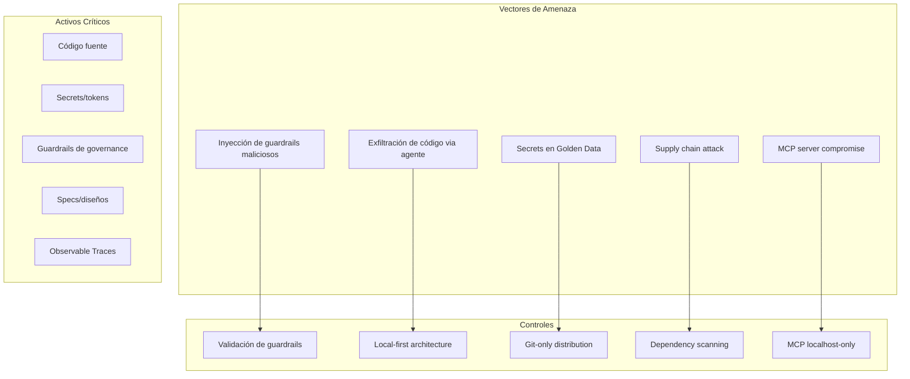
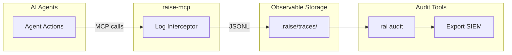
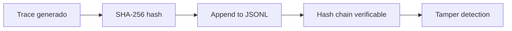
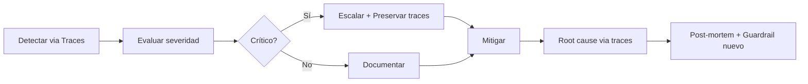

# RaiSE Security & Compliance
## Postura de Seguridad y Compliance

**Versión:** 2.0.0  
**Fecha:** 28 de Diciembre, 2025  
**Propósito:** Documentar políticas de seguridad, Observable Workflow y roadmap de compliance.

---

## Modelo de Amenazas



---

## Activos Críticos

| Activo | Clasificación | Controles |
|--------|---------------|-----------|
| Código fuente | Confidencial | Local-first, no cloud |
| API keys/secrets | Crítico | Nunca en Golden Data |
| Guardrails (.mdc) | Interno | Versionado, code review |
| Specs/diseños | Interno | Acceso por proyecto |
| Constitution | Público | Versionado immutable |
| Observable Traces | Interno | Retención configurable |

---

## Vectores de Ataque y Mitigación

### 1. Inyección de Guardrails Maliciosos

**Amenaza:** Atacante modifica guardrails en raise-config para alterar comportamiento de agentes.

**Mitigación:**
- Code review obligatorio para cambios en guardrails
- Branch protection en repos de config
- Firma de commits (GPG)
- Observable Workflow detecta cambios anómalos
- Guardrail `guard-security-review` bloquea merges sin review

### 2. Exfiltración via Agente

**Amenaza:** Agente AI envía código/secrets a servidor externo.

**Mitigación:**
- Arquitectura local-first (raise-mcp server local)
- No hay telemetría hacia cloud RaiSE
- Guardrails de seguridad restringen acceso a red
- Observable Traces auditan todas las acciones del agente
- Escalation Gate para operaciones de red

### 3. Secrets en Golden Data

**Amenaza:** Usuario guarda secrets en archivos `.raise/`.

**Mitigación:**
- `.gitignore` por default incluye patrones de secrets
- Guardrail `guard-no-secrets` detecta patterns
- Validación CLI en `rai check --security`
- Pre-commit hooks opcionales
- Observable Workflow alerta si secret detectado

### 4. Supply Chain Attack

**Amenaza:** Dependencia maliciosa en raise-kit.

**Mitigación:**
- Dependency scanning (Safety, Snyk)
- Lock files (uv.lock)
- Minimal dependencies policy
- Security advisories monitoring
- SBOM generado automáticamente

### 5. MCP Server Compromise [NUEVO v2.1]

**Amenaza:** Atacante gana acceso al raise-mcp server.

**Mitigación:**
- MCP server solo escucha en localhost
- Sin autenticación porque es local-only
- Observable Traces detectan accesos anómalos
- Proceso sandboxed (sin privilegios elevados)

---

## Observable Workflow para Compliance [NUEVO v2.1]

### Arquitectura de Auditoría



### Qué se Registra (MELT Framework)

| Pilar | Datos Capturados | Retención |
|-------|------------------|-----------|
| **Metrics** | Token usage, duration, gate pass rate | 30 días |
| **Events** | Tool calls, resource reads, escalations | 90 días |
| **Logs** | Inputs/outputs de cada interacción | 30 días |
| **Traces** | Flujo completo request → response | 90 días |

### Formato de Trace

```jsonl
{
  "trace_id": "uuid",
  "session_id": "uuid",
  "timestamp": "2025-12-28T10:00:00Z",
  "action": "tool_call",
  "tool": "validate_gate",
  "input": {"gate": "gate-code", "artifact": "main.py"},
  "output": {"status": "passed", "criteria_met": 5, "criteria_total": 5},
  "duration_ms": 120,
  "actor": "agent",
  "agent_id": "cursor-ai"
}
```

### Comandos de Auditoría

```bash
# Ver traces de hoy
rai audit --date today

# Exportar para compliance
rai audit --from 2025-01-01 --to 2025-03-31 --format csv

# Buscar escalaciones
rai audit --filter "action=escalate"

# Métricas de gates
rai audit --metrics gates
```

---

## Políticas de Datos

### Data Residency
- **Principio:** Datos nunca salen del ambiente local
- **Implementación:** No hay cloud backend, todo es Git-native
- **Observable Traces:** Locales en `.raise/traces/`
- **Excepción:** Si usuario configura export explícitamente

### Encryption

| Contexto | Método |
|----------|--------|
| At rest | Responsabilidad del sistema host |
| In transit (Git) | SSH/HTTPS estándar |
| MCP (local) | No aplica (localhost) |
| Traces | Opcional: encryption at rest |

### Retention

| Dato | Retención Default | Configurable |
|------|-------------------|--------------|
| Observable Traces | 90 días | Sí |
| Metrics agregados | 1 año | Sí |
| Session logs | 30 días | Sí |
| Artifacts (Git) | Indefinida | Git policy |

**Configuración de retención:**
```yaml
# raise.yaml
observability:
  traces:
    retention_days: 90
    compression: gzip
  metrics:
    retention_days: 365
```

---

## Compliance Roadmap

| Framework | Estado | Target Date | Observable Workflow Support |
|-----------|--------|-------------|----------------------------|
| EU AI Act | 🟡 En desarrollo | Q2 2025 | ✅ Trazabilidad completa |
| SOC2 Type I | 📋 Planificado | Q3 2026 | ✅ Audit trail |
| ISO 27001 | 📋 Futuro | 2027 | ✅ Controles documentados |
| GDPR | ✅ By design | — | ✅ No PII procesado |

### EU AI Act Alignment [DETALLADO v2.1]

RaiSE facilita cumplimiento del EU AI Act (vigente 2025):

| Requisito EU AI Act | Implementación RaiSE |
|---------------------|---------------------|
| **Art. 9: Risk Management** | Guardrails con severity levels |
| **Art. 11: Technical Documentation** | Specs + Constitution versionados |
| **Art. 12: Record-keeping** | Observable Workflow traces |
| **Art. 13: Transparency** | Escalation Gates (HITL) |
| **Art. 14: Human Oversight** | Principio de Heutagogía |
| **Art. 15: Accuracy & Robustness** | Validation Gates por fase |

**Reporte de compliance:**
```bash
raise compliance --framework eu-ai-act --output report.pdf
```

---

## Audit Trail Detallado

### Eventos Auditados

| Evento | Datos | Ubicación | Inmutabilidad |
|--------|-------|-----------|---------------|
| `rai init` | Timestamp, options, user | Observable Trace | ✅ |
| `rai pull` | Guardrails actualizados | Observable Trace | ✅ |
| `rai check` | Results, violations | Observable Trace | ✅ |
| MCP resource_read | URI, content_hash | Observable Trace | ✅ |
| MCP tool_call | Tool, input, output | Observable Trace | ✅ |
| Escalation | Reason, resolution | Observable Trace | ✅ |
| Validation Gate | Gate, status, criteria | Observable Trace | ✅ |
| Cambios en guardrails | Git diff | raise-config repo | ✅ (Git) |
| Cambios en specs | Git diff | Project repo | ✅ (Git) |

### Inmutabilidad de Traces



**Verificación de integridad:**
```bash
rai audit --verify-integrity --from 2025-01-01
```

---

## Incident Response

### Proceso con Observable Workflow



### Clasificación

| Severidad | Criterio | Response Time | Acción Observable |
|-----------|----------|---------------|-------------------|
| Crítico | Compromiso de secrets, RCE | 4 horas | Freeze traces, notify |
| Alto | Vulnerabilidad explotable | 24 horas | Export traces afectados |
| Medio | Vulnerabilidad potencial | 7 días | Análisis de traces |
| Bajo | Mejora de seguridad | Siguiente release | Nuevo guardrail |

### Forensics via Observable Workflow

```bash
# Reconstruir sesión de incidente
rai audit --session-id <uuid> --full

# Timeline de acciones
rai audit --from "2025-01-15 14:00" --to "2025-01-15 15:00" --timeline

# Detectar anomalías
rai audit --anomaly-detection --threshold 0.95
```

---

## Secure Development

### Requisitos para Contributors

1. **Commits firmados** (GPG) para merges
2. **2FA** en cuentas de GitHub/GitLab
3. **Branch protection** habilitado
4. **Code review** obligatorio
5. **Guardrail review** para cambios en `/guardrails/`

### CI/CD Security

```yaml
# Checks obligatorios
- name: Security Scan
  run: |
    safety check
    bandit -r src/
    
- name: Dependency Audit
  run: pip-audit
  
- name: Guardrail Validation
  run: rai check --security --strict
  
- name: SBOM Generation
  run: raise sbom --output sbom.json
```

---

## Hardening Guide

### Para Organizaciones

1. **raise-config privado:** No usar repo público para guardrails internos
2. **Branch protection:** Requerir PRs y reviews
3. **Minimal permissions:** Tokens con scope mínimo
4. **Observable Workflow activado:** `raise.yaml` con `observability.enabled: true`
5. **Rotación:** Rotar tokens periódicamente
6. **SIEM integration:** Exportar traces a sistema centralizado

### Para Orquestadores

1. **No secrets en .raise/:** Usar variables de entorno
2. **Revisar guardrails:** Entender qué guardrails se aplican
3. **Actualizar:** Mantener raise-kit actualizado
4. **Revisar escalations:** No ignorar Escalation Gates
5. **Auditar regularmente:** `rai audit --summary weekly`

### Configuración de Seguridad Recomendada

```yaml
# raise.yaml - Hardened config
security:
  secrets_detection: true
  guardrail_enforcement: strict  # block, not warn
  mcp:
    localhost_only: true
    max_token_output: 10000
    
observability:
  enabled: true
  traces:
    retention_days: 180
    include_content: false  # Solo hashes, no contenido
  anomaly_detection: true
  
escalation:
  require_for_gates: [gate-deploy, gate-security]
  timeout_minutes: 60
```

---

## Changelog

### v2.1.0 (2025-12-28)
- Terminología: rules → guardrails
- NUEVO: Sección completa Observable Workflow para Compliance
- NUEVO: Vector de amenaza MCP server compromise
- NUEVO: EU AI Act alignment detallado por artículo
- NUEVO: Inmutabilidad de traces con hash chain
- NUEVO: Comandos de forensics
- NUEVO: Hardened config ejemplo
- Activos críticos: añadido Observable Traces
- Audit trail expandido con eventos MCP

---

*Este documento se revisa trimestralmente o con cada incident. Referencias: [10-system-architecture.md](./10-system-architecture.md), [12-integration-patterns.md](./12-integration-patterns.md).*
