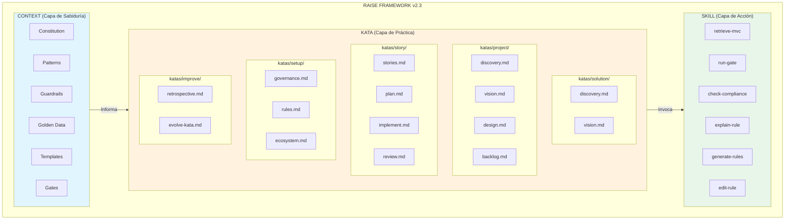
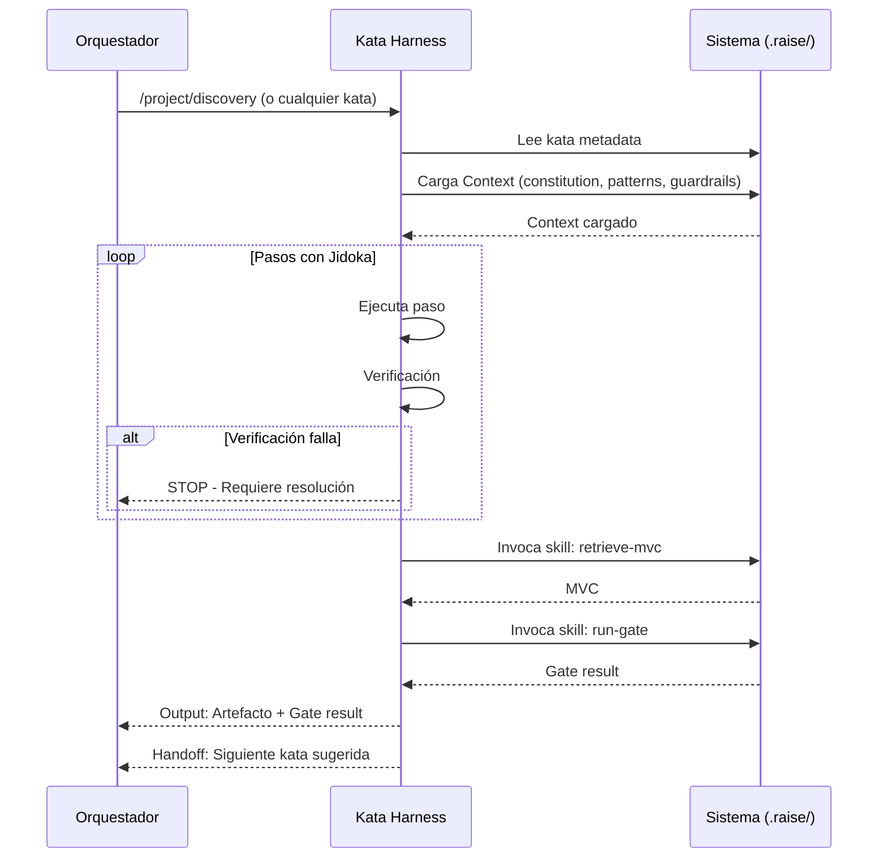
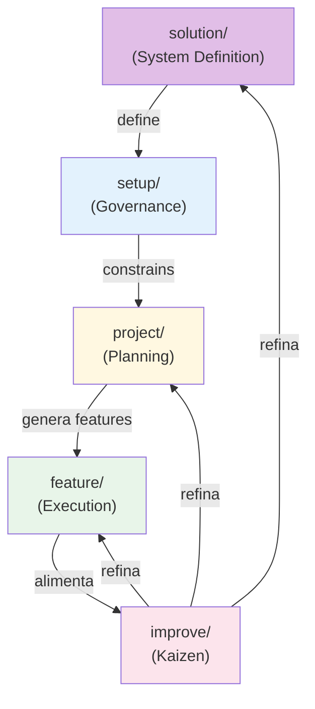
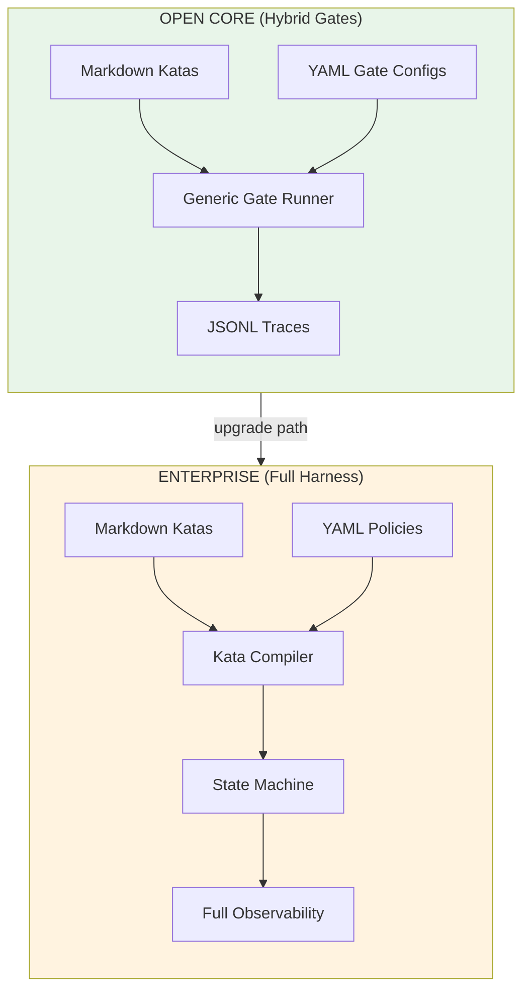
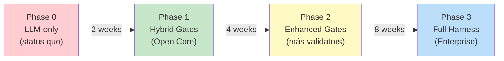
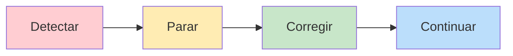

# RaiSE Framework v2.5 - Solution Vision

## Resumen Ejecutivo

**RaiSE v2.5** (Reliable AI Software Engineering) es un framework de gobernanza para desarrollo AI-assisted. Transforma conocimiento tribal implícito en **gobernanza explícita, versionada, y ejecutable**.

### Evolución desde v2.3

| Aspecto | v2.3 | v2.4 |
|---------|------|------|
| **Jerarquía** | Plana (project → feature) | **3 Niveles** (Solution → Project → Codebase) |
| **Work Cycles** | 4 ciclos | **5 ciclos** (+solution/) |
| **Governance** | Standalone | **Derivada de Solution Vision** |
| **Artefactos** | Solution Vision (proyecto) | **Project Vision** (proyecto) + **Solution Vision** (sistema) |
| **Business Case** | No existía | **Nuevo artefacto** nivel solución |

### Evolución desde v2.2 a v2.3

| Aspecto | v2.2 | v2.3 |
|---------|------|------|
| **Ontología** | 7 command categories + SAR/CTX components | **Context/Kata/Skill** (3 capas) |
| **Organización** | Commands by function | **Work Cycles** (project/feature/setup/improve) |
| **Ejecución** | spec-kit harness | **Kata Harness** (Open Core + Enterprise tiers) |
| **Carga cognitiva** | 10+ concepts | **3 concepts** (Context, Kata, Skill) |
| **Terminología** | SAR, CTX, Regla, Command | setup/, context/, Guardrail, Kata/Skill |

### La Metáfora del Niwashi (庭師)

Un Niwashi (jardinero japonés tradicional) posee:

- **Sabiduría** (cuándo podar, por qué ciertas formas): Esto es **Context**
- **Práctica** (ciclo de cuidado estacional, flujo de trabajo): Esto es **Kata**
- **Técnica** (cortes específicos, manejo de herramientas): Esto es **Skill**

El Niwashi transmite sabiduría cultural adaptable a cada jardín. Las Katas son el vehículo de esa transmisión, adaptables por cada Dojo (equipo).

---

## 1. Arquitectura: Modelo de 3 Capas



### Descripción de Capas

| Capa | Propósito | Contenido | Ubicación |
|------|-----------|-----------|-----------|
| **CONTEXT** | Sabiduría que INFORMA pero no se EJECUTA | Constitution, Patterns, Guardrails, Golden Data, Templates, Gates | `framework/reference/`, `.raise/templates/`, `.raise/gates/` |
| **KATA** | Procesos que los equipos PRACTICAN y ADAPTAN | Katas organizadas por Work Cycle (project/feature/setup/improve) | `.raise/katas/{work_cycle}/` |
| **SKILL** | Operaciones ATÓMICAS con inputs/outputs claros | retrieve-mvc, run-gate, check-compliance, explain-rule, generate-rules, edit-rule | `.raise/skills/` |

**Notas:**
- **Katas** son adaptables por cada Dojo (equipo)
- **Kata Harness** ejecuta TODAS las katas (de cualquier Work Cycle)
- **Skills** son planos porque son atómicos - el nombre lleva todo el significado semántico
- Invocación: `/project/discovery`, `/feature/implement`, `/setup/analyze`, etc.

### Interacción entre Capas



**Nota**: El Kata Harness ejecuta katas de **cualquier Work Cycle** (project/, feature/, setup/, improve/), no solo feature/.

---

## 2. Problema y Solución

### Declaración del Problema

Los equipos de desarrollo tienen **conocimiento tribal implícito** sobre convenciones y patrones que no está documentado de forma consumible por agentes LLM.

| Aspecto | Descripción |
|---------|-------------|
| **Quién** | Orquestadores y agentes LLM trabajando en codebases brownfield |
| **Impacto** | Agentes sin contexto generan código inconsistente con la arquitectura existente |
| **Cuándo** | Cada vez que un agente trabaja sin conocer las "reglas no escritas" |
| **Por qué importa** | Sin gobernanza explícita, la calidad del código AI-generated es impredecible |

### Visión de la Solución

RaiSE transforma conocimiento tribal implícito en **gobernanza explícita, versionada, y ejecutable**:

1. **Context** almacena la sabiduría (constitution, guardrails, patterns, golden data)
2. **Katas** guían procesos SDLC (discovery → vision → design → implementation)
3. **Skills** ejecutan operaciones atómicas (retrieve-mvc, run-gate, check-compliance)
4. **Kata Harness** orquesta la ejecución con Jidoka (stop-and-fix)

**Resultado**: Código AI-generated que pasa code review en el primer intento.

---

## 3. Work Cycles (Ciclos de Trabajo)

Los Work Cycles organizan las katas por **contexto operacional** y **nivel de jerarquía**:

### Jerarquía de Tres Niveles (ADR-010)

```
SOLUTION LEVEL (Sistema - perdura)
├── solution/discovery    → Business Case
├── solution/vision       → Solution Vision
└── setup/governance      → Governance (guardrails)
        │
        │ constrains all projects
        ▼
PROJECT LEVEL (Iniciativa - time-bound)
├── project/discovery     → PRD
├── project/vision        → Project Vision
├── project/design        → Tech Design
└── project/backlog       → Backlog
        │
        │ implements via features
        ▼
CODEBASE LEVEL (Implementación)
├── feature/plan          → Implementation plan
├── feature/implement     → Working code
└── feature/review        → Retrospective
```

### Los Cinco Ciclos

| Ciclo | Frecuencia | Pregunta que Responde | Katas |
|-------|------------|----------------------|-------|
| **solution/** | 1x por sistema | "¿Por qué existe este sistema?" | discovery, vision |
| **project/** | 1x por épica | "¿Qué hago al iniciar un proyecto?" | discovery, vision, design, backlog |
| **feature/** | Nx por feature | "¿Qué hago para implementar un feature?" | stories, plan, implement, review |
| **setup/** | 1x por sistema | "¿Cómo gobierno este sistema?" | governance, rules, ecosystem |
| **improve/** | Continuo | "¿Qué hago para mejorar?" | retrospective, evolve-kata |

### Flujo entre Ciclos



**Notas:**
- **solution/** es el punto de partida para sistemas greenfield
- Los ciclos son **ortogonales**: un Orquestador puede estar en cualquiera según el momento
- El Ciclo de Mejora **retroalimenta** todos los demás ciclos
- Proyectos brownfield pueden empezar en setup/ y luego project/
- **Kata Harness ejecuta katas de TODOS los ciclos**, no solo de uno específico

---

## 4. Kata Harness (Platform Capability)

El **Kata Harness** es la capability de plataforma que generaliza el control de flujo LLM, basado en la innovación de spec-kit.

**Alcance**: El Kata Harness ejecuta **TODAS las katas** de cualquier Work Cycle:
- `/solution/discovery`, `/solution/vision`
- `/project/discovery`, `/project/vision`, `/project/design`, `/project/backlog`
- `/feature/stories`, `/feature/plan`, `/feature/implement`, `/feature/review`
- `/setup/governance`, `/setup/rules`, `/setup/ecosystem`
- `/improve/retrospective`, `/improve/evolve-kata`

### Terminología de Industria

| Término | Contexto | RaiSE |
|---------|----------|-------|
| **Agent Harness** | Ejecución: infraestructura que envuelve un LLM para gestionar tareas | **Kata Harness usa este significado** |
| **Evaluation Harness** | Testing: framework de benchmarking (e.g., EleutherAI) | No aplica |

### 4.1 Modelo Tiered: Open Core vs Enterprise

RaiSE ofrece **dos niveles de Kata Harness** según las necesidades de governance:



| Aspecto | Open Core (Hybrid Gates) | Enterprise (Full Harness) |
|---------|--------------------------|---------------------------|
| **Enforcement** | Gates en boundaries (pre/post kata) | 100% determinista por step |
| **Authoring** | Markdown + YAML configs | Markdown + YAML policies |
| **Execution** | LLM interpreta steps | State machine controla flow |
| **Observability** | JSONL traces | OpenTelemetry + full audit |
| **Resumability** | Manual (re-run) | Automática (checkpoints) |
| **Compliance** | Básico | SOC2, ISO 27001, EU AI Act |
| **Implementación** | 2 semanas | 16 semanas |
| **Target** | Startups, OSS, indie devs | Enterprise, regulated industries |

### 4.2 Open Core: Hybrid Gates

El modelo **Hybrid Gates** provee enforcement determinista en los boundaries de cada kata, manteniendo la simplicidad de authoring:

```
┌─────────────────────────────────────────────────────────────┐
│  HYBRID GATES EXECUTION FLOW                                 │
├─────────────────────────────────────────────────────────────┤
│                                                              │
│  1. User invokes: /project/discovery                         │
│                    │                                         │
│  2. PRE-GATE ─────►│ .raise/gates/discovery.yaml             │
│     (deterministic)│   - file_exists: README.md             │
│                    │   - directory_writable: specs/main/     │
│                    │                                         │
│                    │ EXIT 0 → Continue                       │
│                    │ EXIT 1 → JIDOKA (block + recovery)      │
│                    ▼                                         │
│  3. LLM EXECUTION  │ Kata steps (markdown)                   │
│     (as today)     │   - Paso 1, Paso 2, ...                │
│                    │   - Inline Jidoka checks               │
│                    ▼                                         │
│  4. POST-GATE ────►│ .raise/gates/discovery.yaml             │
│     (deterministic)│   - file_exists: project_requirements  │
│                    │   - count_pattern: FR-* >= 5           │
│                    │   - section_present: Success Criteria  │
│                    │                                         │
│                    │ EXIT 0 → Handoff to next kata           │
│                    │ EXIT 1 → JIDOKA (block + fix)          │
│                    ▼                                         │
│  5. TRACE ────────►│ .raise/traces/kata-execution.jsonl     │
│                                                              │
└─────────────────────────────────────────────────────────────┘
```

**Gate Configuration (YAML):**

```yaml
# .raise/gates/discovery.yaml
kata_id: discovery
version: 1.0.0
output_file: specs/main/project_requirements.md

pre:
  - id: context_docs
    check: any_file_exists
    paths: [README.md, docs/context.md]
    severity: warning

  - id: output_writable
    check: directory_writable
    path: specs/main/
    severity: error

post:
  - id: prd_exists
    check: file_exists
    path: "{{output_file}}"
    severity: error

  - id: min_requirements
    check: count_pattern
    path: "{{output_file}}"
    pattern: "^### FR-[0-9]+"
    min: 5
    severity: error
```

**Built-in Validators:** `file_exists`, `directory_writable`, `any_file_exists`, `frontmatter_field`, `section_present`, `count_pattern`, `pattern_present`, `gate_passed`

### 4.3 Enterprise: Full Compiled Harness

El modelo **Full Harness** compila katas a un execution graph determinista, ejecutado por un state machine:

```
┌─────────────────────────────────────────────────────────────┐
│  FULL HARNESS EXECUTION FLOW                                 │
├─────────────────────────────────────────────────────────────┤
│                                                              │
│  LAYER 1: AUTHORING                                          │
│  ┌─────────────┐  ┌─────────────┐                           │
│  │ kata.md     │  │ policy.yaml │                           │
│  │ (markdown)  │  │ (rules)     │                           │
│  └──────┬──────┘  └──────┬──────┘                           │
│         └────────┬───────┘                                   │
│                  ▼                                           │
│  LAYER 2: COMPILATION                                        │
│  ┌─────────────────────────────────┐                        │
│  │        Kata Compiler            │                        │
│  │  (Markdown → JSON Exec Graph)   │                        │
│  └──────────────┬──────────────────┘                        │
│                 ▼                                            │
│  ┌─────────────────────────────────┐                        │
│  │   execution-graph.json          │                        │
│  │   - nodes: [step1, step2, ...]  │                        │
│  │   - edges: [transitions]        │                        │
│  │   - gates: [pre, inline, post]  │                        │
│  └──────────────┬──────────────────┘                        │
│                 ▼                                            │
│  LAYER 3: EXECUTION                                          │
│  ┌─────────────────────────────────┐                        │
│  │      State Machine (XState)     │                        │
│  │  - Deterministic transitions    │                        │
│  │  - Checkpointing (auto-resume)  │                        │
│  │  - Gate enforcement (blocking)  │                        │
│  │  - Step-level observability     │                        │
│  └──────────────┬──────────────────┘                        │
│                 ▼                                            │
│  ┌─────────────────────────────────┐                        │
│  │     Full Observability Stack    │                        │
│  │  - OpenTelemetry traces         │                        │
│  │  - Compliance audit logs        │                        │
│  │  - Governance dashboard         │                        │
│  └─────────────────────────────────┘                        │
│                                                              │
└─────────────────────────────────────────────────────────────┘
```

**Garantías del Full Harness:**

| Garantía | Descripción |
|----------|-------------|
| **100% Determinismo de flujo** | State machine controla transiciones, no el LLM |
| **Gate enforcement real** | Código bloquea ejecución, no sugerencias |
| **Resumability automática** | Checkpoints permiten continuar después de fallas |
| **Audit trail completo** | Cada decisión trazable para compliance |
| **Step-level observability** | Métricas por paso, no solo por kata |

### 4.4 Upgrade Path

El diseño permite **migración incremental** de Open Core a Enterprise:



**No hay throw-away work**: Los YAML gate configs de Open Core se convierten en policy files del Full Harness.

### 4.5 Jidoka (Stop and Fix)

Cada paso en las katas implementa el patrón Jidoka:

```markdown
### Paso N: [Verbo en infinitivo]

[Descripción de qué hacer]

**Verificación:** [Criterio observable de éxito]

> **Si no puedes continuar:** [Causa] → [Resolución]
```

**Principio**: Parar en defectos inmediatamente, no propagar errores. El Orquestador decide cómo resolver antes de continuar.

**Implementación por tier:**

| Tier | Cómo se implementa Jidoka |
|------|---------------------------|
| **Open Core** | Gate runner detecta `severity: error` → bloquea + muestra recovery |
| **Enterprise** | State machine transiciona a estado `jidoka` → pausa ejecución |

---

## 5. Data Store (.raise/)

### Estructura de Directorios

```
.raise/
├── context/                        # Sabiduría (reference material)
│   ├── constitution.md             # Principios fundamentales
│   ├── glossary.md                 # Terminología canónica (v2.3)
│   ├── philosophy.md               # Filosofía de aprendizaje
│   ├── work-cycles.md              # Definición de ciclos de trabajo
│   ├── compliance.md               # Seguridad y compliance
│   └── patterns/                   # Patrones de referencia
│
├── katas/                          # Procesos SDLC por Work Cycle
│   ├── solution/                   # Work Cycle: Sistema (NEW v2.4)
│   │   ├── discovery.md            # → Business Case
│   │   └── vision.md               # → Solution Vision
│   │
│   ├── project/                    # Work Cycle: Proyecto
│   │   ├── discovery.md            # → PRD
│   │   ├── vision.md               # → Project Vision (renamed v2.4)
│   │   ├── design.md               # → Tech Design
│   │   └── backlog.md              # → Backlog
│   │
│   ├── feature/                    # Work Cycle: Feature
│   │   ├── stories.md
│   │   ├── plan.md
│   │   ├── implement.md
│   │   └── review.md
│   │
│   ├── setup/                      # Work Cycle: Governance
│   │   ├── governance.md           # → Guardrails (NEW v2.4)
│   │   ├── rules.md                # → Codebase rules
│   │   └── ecosystem.md            # → Ecosystem map
│   │
│   └── improve/                    # Work Cycle: Mejora Continua
│       ├── retrospective.md
│       └── evolve-kata.md
│
├── skills/                         # Operaciones atómicas (plano)
│   ├── retrieve-mvc.yaml
│   ├── run-gate.yaml
│   ├── check-compliance.yaml
│   ├── explain-rule.yaml
│   ├── generate-rules.yaml
│   └── edit-rule.yaml
│
├── gates/                          # Criterios de validación
│   ├── gate-discovery.md
│   ├── gate-vision.md
│   ├── gate-design.md
│   ├── gate-plan.md
│   └── gate-code.md
│
├── templates/                      # Scaffolds para artefactos
│   ├── solution/                   # Solution-level templates (NEW v2.4)
│   │   ├── business_case.md
│   │   └── solution_vision.md
│   ├── project/                    # Project-level templates
│   │   └── project_vision.md       # (renamed from solution_vision v2.4)
│   ├── tech/
│   │   └── tech_design.md
│   ├── governance/                 # Governance templates (NEW v2.4)
│   │   ├── guardrail.mdc
│   │   └── governance-policy.md
│   └── ...
│
├── harness/                        # Configuración del Kata Harness
│   ├── config.yaml                 # Comportamiento del harness
│   └── dojo-overrides/             # Personalizaciones por equipo
│
└── rules/                          # Guardrails extraídos del código
    ├── naming/
    │   └── ts-service-suffix.yaml
    ├── architecture/
    │   └── ts-no-direct-db.yaml
    └── graph.yaml                  # Grafo de relaciones
```

### Principios de Diseño del Data Store

| Principio | Implementación |
|-----------|----------------|
| **Portable** | YAML + Markdown, sin dependencias |
| **Git-friendly** | Diffable, mergeable, versionable |
| **Human-editable** | Formato legible, comentarios permitidos |
| **Machine-parseable** | JSON Schema para validación |
| **Governance as Code** | Todo versionado en Git |

---

## 6. Principios Core

### 6.1 Heutagogía (Aprendizaje Auto-Dirigido)

El Orquestador **dirige su propio proceso** de aprendizaje. El framework facilita proporcionando:
- **Contexto** (constitution, patterns, guardrails)
- **El "por qué"** (intent en cada guardrail, propósito en cada kata)
- **Recursos** (templates, examples, references)

El framework **no enseña ni dicta** el camino.

### 6.2 Jidoka (Parar en Defectos)

Si se detecta incoherencia o violación de principios: **STOP**.



No continuar acumulando errores. Cada paso tiene verificación explícita.

### 6.3 Facts Not Gaps

Los guardrails describen **"lo que ES"**, no evalúan contra estándares externos.

| ✅ Lo que RaiSE hace | ❌ Lo que RaiSE NO hace |
|---------------------|------------------------|
| "95% usa camelCase" | "Viola principio SOLID" |
| Mide consistencia interna | Impone Clean Architecture |
| Identifica inconsistencias | Prescribe refactorizaciones |

### 6.4 Governance as Code

Todo lo que no está en Git, no existe oficialmente.
- Guardrails son archivos YAML versionados
- Decisiones arquitectónicas son ADRs
- Katas son documentos Markdown
- La Constitution es un documento versionado

### 6.5 Lean: Simplicidad sobre Completitud

- Preferir documentación concisa que cubra 80% de casos
- Evitar abstracciones prematuras
- YAGNI aplicado a la ontología misma
- 3 conceptos (Context/Kata/Skill) vs 10+ anteriores

---

## 7. Minimum Viable Context (MVC)

El **MVC** es el output del skill `retrieve-mvc`: exactamente las reglas necesarias para una tarea — ni más, ni menos.

### Estructura del MVC

```yaml
version: "1.0"
deterministic: true  # mismo input siempre produce este output

query:
  task: "implement user authentication service"
  scope: "src/services/"
  min_confidence: 0.80

primary_rules:        # Directly applicable (full content)
  - id: ts-service-suffix
    confidence: 0.92
    enforcement: strong
    title: "Service classes must end with 'Service' suffix"
    description: |
      All classes in src/services/ must follow naming pattern: {Name}Service.
    examples:
      positive:
        - code: "export class AuthService { ... }"
      negative:
        - code: "export class AuthHandler { ... }"
          fix: "Rename to AuthService"

context_rules:        # Related rules (summaries only)
  - id: ts-repository-suffix
    confidence: 0.95
    relation: "ts-service-suffix typically uses repositories"
    summary: "Repository classes end with 'Repository' suffix"

warnings:             # Conflicts, deprecations, low-confidence
  - type: low_confidence
    rule_id: ts-jwt-pattern
    confidence: 0.72
    message: "JWT pattern has 72% adoption. Consider but don't enforce."

metadata:
  total_rules_evaluated: 47
  estimated_tokens: 1847
```

### Principios del MVC

| Principio | Implementación |
|-----------|----------------|
| **Determinista** | Mismo input = mismo output (100%) |
| **Token-efficient** | <4K tokens por default |
| **Relevante** | Solo reglas que aplican al scope |
| **Explicable** | Cada regla incluida tiene razón explícita |

---

## 8. Validación: Gates

Los **Gates** son criterios de validación consumidos por el skill `run-gate`.

### Gate por Work Cycle

| Work Cycle | Gate | Propósito |
|------------|------|-----------|
| solution/ | gate-business-case | Validar Business Case completeness |
| solution/ | gate-solution-vision | Validar Solution Vision |
| project/ | gate-discovery | Validar PRD completeness |
| project/ | gate-vision | Validar Project Vision (renamed v2.4) |
| project/ | gate-design | Validar Technical Design |
| feature/ | gate-plan | Validar Implementation Plan |
| feature/ | gate-code | Validar código vs guardrails |

### Estructura de un Gate

```markdown
---
id: gate-vision
work_cycle: project
titulo: "Gate-Vision: Validación de Project Vision"
blocking: true
version: 2.1.0
---

# Gate-Vision

## Propósito
[Por qué existe este gate]

## Criterios Obligatorios (Must Pass)
| # | Criterio | Verificación |
|---|----------|--------------|
| 1 | ... | ... |

## Criterios Recomendados (Should Pass)
| # | Criterio | Verificación |
|---|----------|--------------|
| 8 | ... | ... |

## Proceso de Validación
[Pasos para ejecutar el gate]

## Escalation Triggers
[Cuándo escalar]
```

---

## 9. Terminología Canónica (v2.4)

| Término | Definición |
|---------|------------|
| **Solution Level** | Nivel de artefactos del sistema que perdura entre proyectos: Business Case, Solution Vision, Governance. |
| **Project Level** | Nivel de artefactos de proyecto (time-bound): PRD, Project Vision, Tech Design, Backlog. |
| **Business Case** | Artefacto de nivel solución que justifica por qué debe existir el sistema. |
| **Solution Vision** | Artefacto de nivel solución que define QUÉ ES el sistema. Deriva governance. |
| **Project Vision** | Artefacto de nivel proyecto que traduce PRD en visión técnica. (Antes: Solution Vision a nivel proyecto) |
| **Context** | Sabiduría que informa pero no se ejecuta: constitution, patterns, guardrails, golden data. |
| **Kata** | Proceso SDLC que los equipos practican y adaptan. Organizadas por Work Cycle. |
| **Work Cycle** | Contexto operacional que agrupa katas: `solution`, `project`, `feature`, `setup`, `improve`. |
| **Skill** | Operación atómica con inputs/outputs definidos. Invocable por katas o directamente. |
| **Guardrail** | Convención o restricción derivada de Solution Vision o extraída del código. |
| **Dojo** | Equipo que adapta las katas base a su contexto específico. |
| **Kata Harness** | Capability de plataforma: motor de ejecución que interpreta katas e invoca skills. |
| **Gate** | Criterios de validación (data) consumidos por el skill `run-gate`. |
| **MVC** | Minimum Viable Context: conjunto mínimo de guardrails para una tarea. |
| **Orquestador** | Humano que dirige al agente LLM usando katas y skills. |

### Terminología Deprecated (v2.3 y anteriores)

| Evitar | Usar en su lugar | Razón |
|--------|------------------|-------|
| Solution Vision (nivel proyecto) | **Project Vision** | Renombrado en v2.4 (ADR-010) |
| SAR | setup/ katas | Componente eliminado |
| CTX | context/ skills | Componente eliminado |
| Regla | Guardrail | Claridad semántica |
| Command | Kata o Skill | Separación de concerns |
| L0/L1/L2/L3 | Work Cycles | Niveles de abstracción eliminados |
| principios/flujo/patrón/técnica | Context/Kata/Skill | Simplificación ontológica |
| spec-kit harness | Kata Harness | Platform capability naming |

---

## 10. Referencias

### ADRs

| ADR | Decisión |
|-----|----------|
| [ADR-010](./adrs/adr-010-three-level-artifact-hierarchy.md) | **Three-Level Artifact Hierarchy (Solution/Project/Codebase)** |
| [ADR-009](./adrs/adr-009-continuous-governance-model.md) | **Continuous Governance Model** |
| [ADR-008](./adrs/adr-008-kata-skill-context-simplification.md) | Context/Kata/Skill ontology |
| [ADR-007](./adrs/adr-007-terminology-simplification.md) | Simplificación terminológica (SAR/CTX → setup/context) |
| [ADR-006](./adrs/adr-006-mvc-summaries.md) | MVC con summaries |
| [ADR-005](./adrs/adr-005-confidence-adoption-rate.md) | Confidence por adoption rate |
| [ADR-004](./adrs/adr-004-separate-graph.md) | Grafo separado de guardrails |
| [ADR-003](./adrs/adr-003-yaml-rule-format.md) | YAML para guardrails |
| [ADR-002](./adrs/adr-002-deterministic-context-delivery.md) | MVC siempre determinista |
| [ADR-001](./adrs/adr-001-sar-pipeline-phases.md) | Pipeline de 4 fases (histórico) |

### Context Documents

- [Constitution](framework/reference/constitution.md)
- [Glossary v2.4](framework/reference/glossary.md)
- [Work Cycles](framework/reference/work-cycles.md)
- [Philosophy](framework/reference/philosophy.md)
- [Compliance](framework/reference/compliance.md)

### Research

- [Command/Kata/Skill Ontology Research](../main/research/outputs/command-kata-skill-ontology-report.md)
- [Kata-Command Discrepancy Analysis](../main/research/outputs/kata-command-discrepancy-analysis.md)
- [Corpus Audit v2.3](../main/research/outputs/corpus-audit-v2.3.md)

---

## Changelog

| Version | Fecha | Cambios |
|---------|-------|---------|
| 2.0.0 | 2026-01-28 | Framework completo con 3 capas, SAR/CTX components |
| 2.2.0 | 2026-01-29 | 7 command categories, Lean Spec, MVC |
| 2.3.0 | 2026-01-29 | Context/Kata/Skill ontology, Work Cycles, Kata Harness |
| **2.4.0** | **2026-01-30** | **Three-Level Hierarchy (ADR-010), solution/ Work Cycle, governance kata, Project Vision rename** |

---

*RaiSE Framework v2.4: Gobernanza explícita para desarrollo AI-assisted.*
*Solution define. Project planea. Feature implementa.*
*Context informa. Kata guía. Skill ejecuta.*
