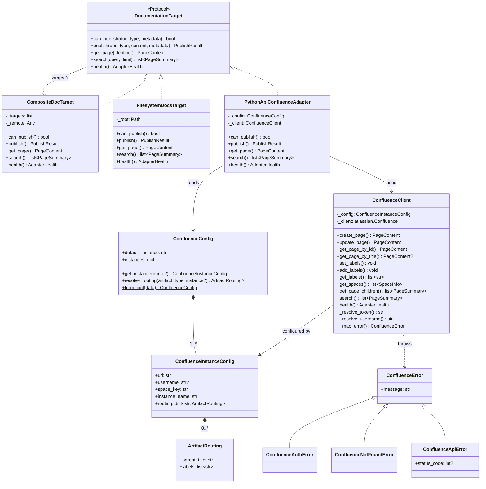
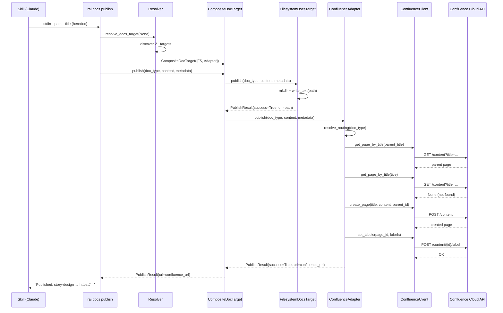
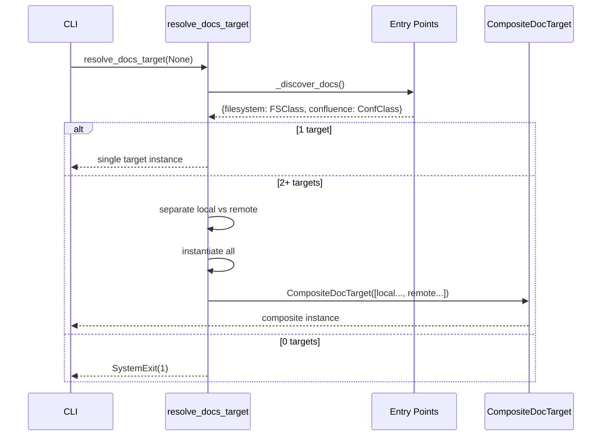

# Module: confluence-adapter

Pure Python Confluence integration replacing the previous MCP/Node dependency. Implements `DocumentationTarget` protocol for publishing, retrieving, and searching Confluence pages. Includes a composite target that writes to both filesystem and Confluence in a single call.

## Why This Exists

Before this module, publishing to Confluence required MCP (Model Context Protocol) over stdio, which spawned a Node.js subprocess for each operation. This added a Node dependency to a Python project, limited us to 5 of 11 needed functions, and made debugging opaque — errors in the MCP pipe were indistinguishable from errors in Confluence.

The adapter replaces all of that with a direct Python integration using `atlassian-python-api`. The client wraps the library with auth resolution (multi-instance, env vars), error normalization (3-class hierarchy mapped via `isinstance`), and built-in rate limiting (the library's own exponential backoff). The adapter layer adds routing — given an artifact type like "story-design", it knows which parent page to publish under and which labels to apply. The composite target layer adds dual-write: one call from a skill writes both to the local filesystem (for git, offline, Claude context) and to Confluence (for team visibility).

The result: every skill in the RaiSE framework — from `/rai-story-start` to `/rai-architecture-review` — publishes its artifacts to Confluence automatically, with zero manual steps.

## Architecture

### Class Diagram



### Publish Sequence



### Resolver Composition Sequence



### Component Map

| File | Class | Responsibility |
|------|-------|----------------|
| `confluence_client.py` | `ConfluenceClient` | 11 methods wrapping `atlassian.Confluence`. Auth resolution, error normalization, rate limiting via library's built-in backoff |
| `confluence_config.py` | `ConfluenceInstanceConfig`, `ConfluenceConfig`, `ArtifactRouting` | Pydantic models for `.raise/confluence.yaml`. Multi-instance, artifact-type routing, flat config normalization |
| `confluence_config.py` | `load_confluence_config()` | YAML loader with flat → multi-instance auto-normalization |
| `confluence_exceptions.py` | `ConfluenceError` hierarchy | 3-class hierarchy: `AuthError`, `NotFoundError`, `ApiError`. Mapped from `atlassian.errors` via `isinstance` |
| `confluence_adapter.py` | `PythonApiConfluenceAdapter` | `DocumentationTarget` implementation. Strict publish: requires routing config + parent page exists |
| `filesystem_docs.py` | `FilesystemDocsTarget` | `DocumentationTarget` for local file writes. Uses `metadata["path"]` for file location |
| `composite_docs.py` | `CompositeDocTarget` | Wraps N targets. Publish to all, read from remote (last). Filesystem first for durability |

### Resolver Behavior

| Targets found | Behavior |
|---------------|----------|
| 0 | Error: no docs target installed |
| 1 | Auto-select (standard) |
| 2+ | Auto-compose into `CompositeDocTarget` (filesystem first, remote last) |
| `--target X` | Select single target by name, skip composition |

## Configuration

### `.raise/confluence.yaml`

```yaml
default_instance: humansys
instances:
  humansys:
    url: "https://humansys.atlassian.net/wiki"
    space_key: "RaiSE1"
    instance_name: "humansys"
    routing:
      story-design:
        parent_title: "Epics"
        labels: ["story", "design"]
      adr:
        parent_title: "Architecture"
        labels: ["adr", "architecture"]
```

**Identity** — resolved from environment variables, never in config:

| Variable | Scope |
|----------|-------|
| `CONFLUENCE_USERNAME_{INSTANCE}` | Instance-specific (e.g. `_HUMANSYS`) |
| `CONFLUENCE_USERNAME` | Generic fallback |
| `CONFLUENCE_API_TOKEN_{INSTANCE}` | Instance-specific |
| `CONFLUENCE_API_TOKEN` | Generic fallback |

**Flat config** — auto-normalized to multi-instance:

```yaml
# This minimal format:
url: "https://x.atlassian.net/wiki"
space_key: "TEST"

# Becomes internally:
# default_instance: "default"
# instances: { default: { url: ..., space_key: ... } }
```

## Key Design Decisions

| ID | Decision | Rationale |
|----|----------|-----------|
| D1 | `backoff_and_retry=True` | Library handles 429/503 with exponential backoff + jitter. No custom rate limiter (DRY) |
| D2 | 3-class exception hierarchy | `isinstance` mapping from `atlassian.errors`. Dropped `RateLimitError` — library retries automatically (YAGNI) |
| D3 | Strict publish | Requires routing config AND parent page exists. Reliability over convenience |
| D4 | Import guard in `__init__` | `atlassian-python-api` is optional. Clear error message if not installed |
| D5 | Filesystem first in composite | Local copy always saved (durability guarantee). Remote URL returned when available |
| D6 | Sync pending on remote failure | `success=True` with warning if filesystem wrote but Confluence failed. Local file is the guarantee |
| D7 | `--stdin` + `--path` on CLI | Skills pass content via heredoc. One call → adapter writes both filesystem and Confluence |

## Publish Flow

```
1. metadata["title"] required (else fail)
2. resolve_routing(doc_type) required (else fail — strict)
3. Resolve parent page by title → parent_id (else fail — strict)
4. get_page_by_title(title) — check if page exists
5. If exists: update_page(page_id, title, content)
6. If not: create_page(title, content, parent_id)
7. set_labels(page_id, routing.labels)
8. Return PublishResult(success=True, url=page.url)
```

## Reliability Model

```
                    ┌─────────────┐
                    │  Skill calls │
                    │  rai docs    │
                    │  publish     │
                    └──────┬──────┘
                           │
                    ┌──────▼──────┐
                    │  Composite   │
                    │  DocTarget   │
                    └──────┬──────┘
                           │
              ┌────────────┼────────────┐
              ▼                         ▼
     ┌────────────────┐       ┌─────────────────┐
     │ Filesystem     │       │ Confluence       │
     │ (always works) │       │ (may fail)       │
     └───────┬────────┘       └────────┬─────────┘
             │                         │
        success=True              success/failure
             │                         │
             └────────────┬────────────┘
                          ▼
                  ┌───────────────┐
                  │ Both OK →     │ Return Confluence URL
                  │ FS OK, CF fail│ Return success + "sync pending" warning
                  │ Both fail →   │ Return failure
                  └───────────────┘
```

## Testing

- **Unit tests**: 89 tests across 4 test files (client, config, adapter, composite, filesystem)
- **E2E tests**: Verified against live Confluence (11/11 client methods, adapter publish/update/labels)
- **Dogfood**: 32 epic artifacts published to Confluence via the adapter itself

## CLI Reference

```bash
# Publish from file
rai docs publish story-design --file work/epics/.../design.md --title "S1.1 Design"

# Publish from stdin (used by skills)
rai docs publish story-design --stdin --path work/epics/.../design.md --title "S1.1 Design" <<'EOF'
# Design content
EOF

# Publish governance artifact (original behavior)
rai docs publish roadmap

# Single target override
rai docs publish adr --file dev/decisions/adr-015.md --target confluence
```

## Setup for New Projects

1. Install: `pip install raise-cli[confluence]` (or `pipx install raise-cli[confluence]` for global)
2. Create `.raise/confluence.yaml` with instances + routing
3. Set env vars: `CONFLUENCE_USERNAME` + `CONFLUENCE_API_TOKEN`
4. Create parent pages on Confluence (referenced in routing)
5. Test: `rai docs publish story-design --stdin --path /tmp/test.md --title "Test" <<< "# Test"`

## Dependencies

| Package | Version | Purpose |
|---------|---------|---------|
| `atlassian-python-api` | >=3.41 | Confluence Cloud REST API client |
| `pydantic` | >=2.0 | Config validation + boundary models |
| `pyyaml` | * | YAML config loading |
| `typer` | * | CLI framework (--file, --stdin, --path flags) |

## References

- Epic: E1051 — Confluence Adapter v2
- ADR-014: Atlassian Transport Backend
- Protocol: `raise_cli.adapters.protocols.DocumentationTarget`
- Adapter Vision: `governance/product/adapter-vision.md`
