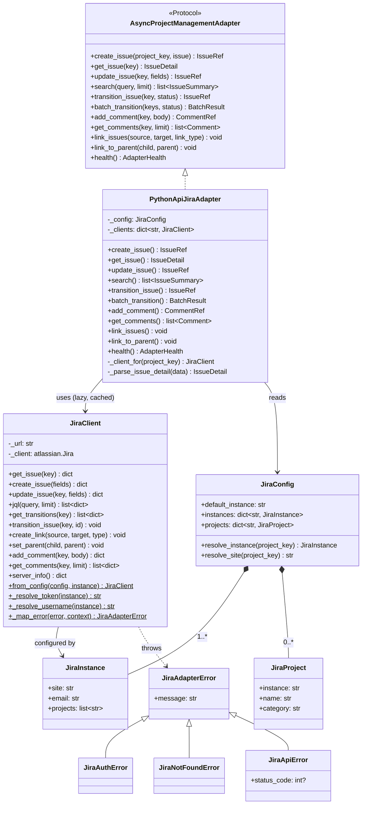
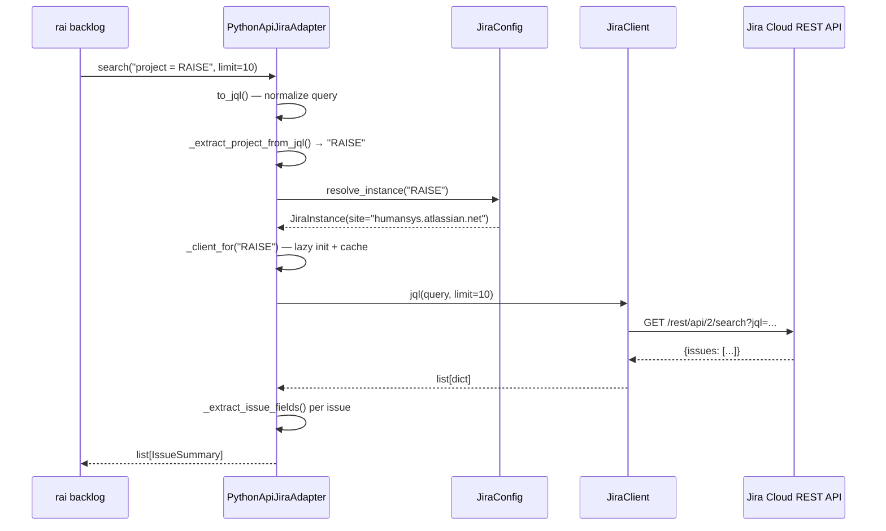

# Module: jira-adapter

Pure Python Jira integration replacing the previous ACLI (Atlassian CLI) subprocess dependency. Implements `AsyncProjectManagementAdapter` protocol for issue CRUD, search, transitions, comments, links, and health checks. Multi-instance support via `.raise/jira.yaml` configuration.

## Why This Exists

Before this module, Jira operations required ACLI — a Java-based Atlassian CLI tool invoked via subprocess. This added a JVM dependency to a Python project, required license management, made error handling opaque (parsing stdout/stderr strings), and limited CI portability. Every `rai backlog` command spawned a Java process.

The adapter replaces all of that with a direct Python integration using `atlassian-python-api`. The client wraps the library with auth resolution (multi-instance, env vars), error normalization (3-class hierarchy mapped via `isinstance`), and built-in rate limiting (the library's own exponential backoff). The adapter layer adds JQL normalization, status convention mapping, ADF-to-text conversion, and Pydantic boundary models. The config layer supports multi-instance routing — different projects can live on different Jira sites.

The result: every `rai backlog` command — create, search, get, transition, comment, link — runs as a direct Python call with typed responses and structured errors.

## Architecture

### Class Diagram



### Request Flow



### Component Map

| File | Class/Function | Responsibility |
|------|----------------|----------------|
| `jira_client.py` | `JiraClient` | 11 methods wrapping `atlassian.Jira`. Auth resolution from env vars, error normalization via `isinstance`, rate limiting via library's built-in backoff |
| `jira_config.py` | `JiraConfig`, `JiraInstance`, `JiraProject` | Pydantic models for `.raise/jira.yaml`. Multi-instance routing with project→instance mapping |
| `jira_config.py` | `load_jira_config()` | YAML loader with validation |
| `jira_adapter.py` | `PythonApiJiraAdapter` | `AsyncProjectManagementAdapter` implementation. JQL normalization, status convention mapping, ADF→text, lazy client caching |
| `jira_adapter.py` | `to_jql()`, `normalize_status()` | Query normalization (issue key, JQL pass-through, text search) and status slug→display name |
| `jira_adapter.py` | `_adf_to_text()` | Atlassian Document Format → plain text converter |
| `jira_exceptions.py` | `JiraAdapterError` hierarchy | 3-class hierarchy: `AuthError`, `NotFoundError`, `ApiError`. Mapped from `atlassian.errors` via `isinstance` |

## Configuration

### `.raise/jira.yaml`

```yaml
default_instance: humansys
instances:
  humansys:
    site: humansys.atlassian.net
    projects: [RAISE]

projects:
  RAISE:
    instance: humansys
    name: "RaiSE Framework"
    category: Development
```

**Identity** — resolved from environment variables, never in config:

| Variable | Scope |
|----------|-------|
| `JIRA_API_TOKEN_{INSTANCE}` | Instance-specific (e.g. `_HUMANSYS`) |
| `JIRA_API_TOKEN` | Generic fallback |
| `JIRA_USERNAME_{INSTANCE}` | Instance-specific |
| `JIRA_USERNAME` | Generic fallback |

### Client Caching

Clients are lazily created per-instance and cached by site URL. A project key lookup goes through:
1. `JiraConfig.resolve_instance(project_key)` → `JiraInstance`
2. Cache lookup by `instance.site`
3. On miss: `JiraClient.from_config()` with env-resolved credentials

## Key Design Decisions

| ID | Decision | Rationale |
|----|----------|-----------|
| D1 | `backoff_and_retry=True` | Library handles 429/503 with exponential backoff + jitter. No custom rate limiter (DRY) |
| D2 | 3-class exception hierarchy | `isinstance` mapping from `atlassian.errors`. Consistent with Confluence adapter pattern |
| D3 | Convention-based status normalization | `normalize_status("in-progress")` → `"In Progress"`. Simple, no config needed |
| D4 | Live transition lookup | Query available transitions, match by normalized name. Handles workflow variations |
| D5 | Import guard in `JiraClient.__init__` | `atlassian-python-api` is optional. Clear error message if not installed |
| D6 | Async protocol, sync transport | Methods are `async def` for protocol compliance; `atlassian-python-api` is sync underneath |
| D7 | Lazy client caching by site | Multi-instance support without eager connection. One client per Jira site |
| D8 | JQL normalization (RAISE-552) | Issue keys → `issue = KEY`, operators → pass-through with project quoting, text → `text ~ "query"` |

## Testing

- **Unit tests**: PythonApiJiraAdapter fully tested via mocked JiraClient (S1052.3)
- **Client integration tests**: 3 tests against live Jira — server_info, get_issue, jql_search (S1052.1)
- **Adapter integration tests**: 6 tests against live Jira — search, get_issue, health, create+get+transition, comments, links (S1052.6)
- **Config unit tests**: JiraConfig validation, instance resolution, loader (S1052.2)
- All integration tests skip gracefully when `JIRA_API_TOKEN` is not set

## Dependencies

| Package | Version | Purpose |
|---------|---------|---------|
| `atlassian-python-api` | >=3.41 | Jira Cloud REST API client (optional) |
| `pydantic` | >=2.0 | Config validation + boundary models |
| `pyyaml` | * | YAML config loading |

## References

- Epic: E1052 — Jira Adapter v2 (Pure Python Transport)
- ADR-014: Atlassian Transport Backend
- Protocol: `raise_cli.adapters.protocols.AsyncProjectManagementAdapter`
- Sister module: [confluence-adapter](confluence-adapter.md) — same architectural pattern
