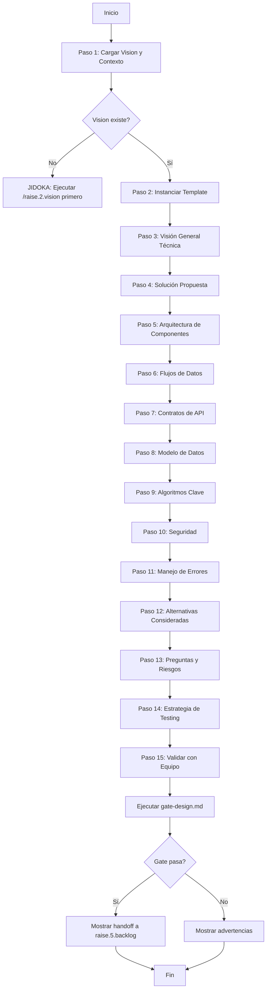

# Implementation Plan: Tech Design Command Generation

**Branch**: `001-tech-design-command` | **Date**: 2026-01-20 | **Spec**: [spec.md](./spec.md)
**Input**: Feature specification from `/specs/001-tech-design-command/spec.md`

## Summary

Crear el comando `/raise.4.tech-design` que genera documentos de diseño técnico desde Solution Vision, completando el paso 4 del flujo de estimación del kata L1-04. El comando se ubicará en `.raise-kit/commands/02-projects/raise.4.tech-design.md`, seguirá los 15 pasos del kata `flujo-03-tech-design`, y usará el template `tech_design.md` para generar `specs/main/tech_design.md` en proyectos target.

**Approach técnico**: Copiar el template desde `src/templates/tech/` a `.raise-kit/templates/raise/tech/`, crear el comando siguiendo el patrón de `raise.1.discovery` y `raise.2.vision`, y asegurar que todas las referencias usen rutas `.specify/` para portabilidad cuando se inyecte en proyectos target vía `transform-commands.sh`.

## Technical Context

**Language/Version**: Markdown (comandos para agentes AI)  
**Primary Dependencies**: 
- Bash scripts (`.specify/scripts/bash/check-prerequisites.sh`, `update-agent-context.sh`)
- Templates (`src/templates/tech/tech_design.md`)
- Gates (`src/gates/gate-design.md`)
- Kata (`src/katas-v2.1/flujo/03-tech-design.md`)

**Storage**: Archivos markdown en `.raise-kit/` (desarrollo) y `.specify/` (ejecución en proyectos target)  
**Testing**: Manual - ejecutar comando en proyecto test y verificar output  
**Target Platform**: Repositorios Git con estructura raise-commons o proyectos con raise-kit inyectado  
**Project Type**: Documentation/Tooling (comandos para agentes, no código de producción)  
**Performance Goals**: Generación de Tech Design completo en < 5 minutos  
**Constraints**: 
- Debe seguir patrón de comandos existentes (`raise.1.discovery`, `raise.2.vision`)
- Referencias deben usar `.specify/` (no `.raise-kit/`)
- No modificar `transform-commands.sh`

**Scale/Scope**: 1 comando, 1 template copiado, 15 pasos del kata implementados

## Constitution Check

*GATE: Must pass before Phase 0 research. Re-check after Phase 1 design.*

### §1. Humanos Definen, Máquinas Ejecutan
✅ **PASS** - El comando es una especificación en Markdown que el agente ejecuta. El Orquestador define el "qué" (generar Tech Design), el agente ejecuta el "cómo".

### §2. Governance as Code
✅ **PASS** - El comando, template, y gate están versionados en Git dentro de `.raise-kit/`. Todo está en el repositorio.

### §3. Platform Agnosticism
✅ **PASS** - El comando funciona donde funciona Git. No hay dependencia de plataformas específicas.

### §4. Validation Gates en Cada Fase
✅ **PASS** - El comando ejecuta `gate-design.md` al finalizar la generación (FR-015). Implementa Gate-Design del flujo estándar.

### §5. Heutagogía sobre Dependencia
⚠️ **PARTIAL** - El comando guía al usuario a través de los 15 pasos (US2), pero no incluye preguntas heutagógicas al final. **Decisión**: Aceptable para MVP - las preguntas heutagógicas pueden agregarse en iteración futura.

### §6. Mejora Continua (Kaizen)
✅ **PASS** - El comando es un artefacto versionado que puede refinarse basado en feedback de uso.

### §7. Lean Software Development
✅ **PASS** - Implementa Jidoka (parar si falta Solution Vision), elimina desperdicio (reutiliza template existente), entrega rápido (genera en < 5 min).

### §8. Observable Workflow
✅ **PASS** - El comando genera artefactos trazables (Tech Design con frontmatter YAML que incluye related_docs, handoffs). Cada decisión es auditable en el documento generado.

**Constitution Check Result**: ✅ PASS (1 PARTIAL aceptable para MVP)

## Project Structure

### Documentation (this feature)

```text
specs/001-tech-design-command/
├── spec.md              # Feature specification
├── plan.md              # This file (/speckit.plan command output)
├── research.md          # Phase 0 output (research on command patterns)
├── checklists/
│   └── requirements.md  # Spec quality checklist (already created)
└── tasks.md             # Phase 2 output (/speckit.tasks command - NOT created by /speckit.plan)
```

### Source Code (repository root)

Este feature NO genera código de producción. Genera artefactos de documentación/tooling:

```text
.raise-kit/
├── commands/
│   └── 02-projects/
│       └── raise.4.tech-design.md  # NUEVO - Comando a crear
├── templates/
│   └── raise/
│       └── tech/                    # NUEVO - Directorio a crear
│           └── tech_design.md       # NUEVO - Template copiado desde src/
└── gates/
    └── gate-design.md               # YA EXISTE - Verificar

src/
├── templates/
│   └── tech/
│       └── tech_design.md           # FUENTE - Template original
├── gates/
│   └── gate-design.md               # FUENTE - Gate original
└── katas-v2.1/
    └── flujo/
        └── 03-tech-design.md        # REFERENCIA - Kata con 15 pasos
```

**Structure Decision**: Este es un proyecto de tooling/documentation. La "implementación" consiste en crear archivos markdown (comandos y templates) en `.raise-kit/`, no código ejecutable. El comando resultante será ejecutado por agentes AI en proyectos target.

## Complexity Tracking

> **No violations detected** - Constitution Check passed with 1 PARTIAL (Heutagogía) que es aceptable para MVP.

## Phase 0: Research & Analysis

### Research Tasks

1. **Analizar patrón de comandos existentes**
   - Estudiar estructura de `raise.1.discovery.md` y `raise.2.vision.md`
   - Identificar secciones comunes: frontmatter YAML, User Input, Outline, pasos numerados, Jidoka blocks, Finalize & Validate
   - Documentar convenciones: uso de `.specify/` en referencias, estructura de handoffs, formato de mensajes Jidoka

2. **Mapear los 15 pasos del kata a estructura de comando**
   - Extraer cada paso de `flujo-03-tech-design.md`
   - Convertir cada paso en instrucción ejecutable para el agente
   - Identificar puntos de Jidoka (paradas por falta de información)
   - Mapear verificaciones del kata a validaciones en el comando

3. **Analizar template tech_design.md**
   - Identificar las 14 secciones del template
   - Determinar qué información de la Solution Vision mapea a cada sección
   - Definir estrategia de llenado (extracción directa vs inferencia vs clarificación)

4. **Verificar gate-design.md**
   - Confirmar que existe en `.raise-kit/gates/`
   - Revisar criterios de validación
   - Asegurar que el comando puede ejecutar el gate al finalizar

**Output**: `research.md` con decisiones documentadas

### Key Decisions to Document

| Decision | Options Considered | Chosen Approach | Rationale |
|----------|-------------------|-----------------|-----------|
| Estructura del comando | (A) Workflow lineal, (B) Workflow con branches condicionales | A - Workflow lineal con Jidoka blocks | Más simple, consistente con comandos existentes |
| Manejo de información faltante | (A) Parar siempre, (B) Continuar con placeholders, (C) Jidoka selectivo | C - Jidoka selectivo (parar solo si crítico) | Balance entre robustez y usabilidad |
| Nivel de detalle en pasos | (A) 15 pasos explícitos, (B) Pasos agrupados, (C) Pasos implícitos | A - 15 pasos explícitos | Máxima trazabilidad y alineación con kata |
| Formato de handoff | (A) YAML frontmatter, (B) Mensaje al final, (C) Ambos | A - YAML frontmatter | Consistente con comandos existentes |

## Phase 1: Design & Contracts

**Prerequisites:** `research.md` complete

### Data Model

**Entidades principales** (archivos markdown, no base de datos):

#### 1. Comando Raise (`raise.4.tech-design.md`)

**Ubicación**: `.raise-kit/commands/02-projects/raise.4.tech-design.md`

**Estructura**:
```yaml
---
description: [Descripción corta del comando]
handoffs:
  - label: [Etiqueta del siguiente paso]
    agent: raise.5.backlog
    prompt: [Prompt para el siguiente comando]
    send: true
---

## User Input
$ARGUMENTS

## Outline
[Instrucciones paso a paso para el agente]

## Notas
[Contexto adicional]

## High-Signaling Guidelines
[Principios de ejecución]

## AI Guidance
[Guía específica para el agente]
```

**Secciones clave**:
- **Frontmatter YAML**: description, handoffs
- **User Input**: Captura de argumentos del usuario
- **Outline**: 15 pasos del kata como instrucciones ejecutables
- **Jidoka Blocks**: Puntos de parada con mensajes de error
- **Finalize & Validate**: Ejecución del gate

#### 2. Template Tech Design (`tech_design.md`)

**Ubicación**: `.raise-kit/templates/raise/tech/tech_design.md`

**Fuente**: Copiado desde `src/templates/tech/tech_design.md`

**Secciones** (14 total):
1. Visión General y Objetivo
2. Solución Propuesta
3. Arquitectura y Desglose de Componentes
4. Flujo de Datos
5. Contrato(s) de API
6. Cambios en el Modelo de Datos
7. Algoritmos / Lógica Clave
8. Consideraciones de Seguridad
9. Estrategia de Manejo de Errores
10. Alternativas Consideradas
11. Preguntas Abiertas y Riesgos
12. Consideraciones para Estimación
13. Estrategia de Pruebas
14. Frontmatter YAML (document_id, title, project_name, etc.)

#### 3. Tech Design Document (output)

**Ubicación**: `specs/main/tech_design.md` (en proyecto target)

**Generado por**: El comando ejecutado por el agente

**Contenido**: Template completado con información extraída/inferida de Solution Vision

### Contracts

**No aplica** - Este feature no expone APIs REST/GraphQL. Los "contratos" son:

1. **Contrato de Input**: El comando espera que exista `specs/main/solution_vision.md` en el proyecto target
2. **Contrato de Output**: El comando genera `specs/main/tech_design.md` con estructura del template
3. **Contrato de Handoff**: El frontmatter YAML incluye `handoffs` apuntando a `raise.5.backlog`

### Command Workflow Design

**Flujo de ejecución del comando** (basado en los 15 pasos del kata):



### Quickstart

**Para desarrolladores que quieran usar este comando:**

1. **Prerequisitos**:
   - Proyecto con raise-kit inyectado (`.specify/` poblado)
   - Solution Vision generada (`specs/main/solution_vision.md`)
   - Estar en el directorio raíz del proyecto

2. **Ejecución**:
   ```bash
   # Ejecutar el comando
   /raise.4.tech-design
   ```

3. **Output esperado**:
   - Archivo generado: `specs/main/tech_design.md`
   - Validación ejecutada: gate-design.md
   - Mensaje de handoff: "→ Siguiente paso: `/raise.5.backlog`"

4. **Troubleshooting**:
   - Si error "Solution Vision no encontrado": Ejecutar `/raise.2.vision` primero
   - Si secciones vacías: Revisar que Solution Vision esté completa
   - Si gate falla: Revisar advertencias y completar secciones faltantes manualmente

**Para desarrolladores que quieran modificar este comando:**

1. **Ubicación del código fuente**: `.raise-kit/commands/02-projects/raise.4.tech-design.md`
2. **Comandos de referencia**: `raise.1.discovery.md`, `raise.2.vision.md`
3. **Kata de referencia**: `src/katas-v2.1/flujo/03-tech-design.md`
4. **Testing**: Crear proyecto test, inyectar raise-kit, ejecutar comando, verificar output

### Agent Context Update

Al finalizar Phase 1, ejecutar:

```bash
.specify/scripts/bash/update-agent-context.sh
```

Este script:
- Detecta qué agente AI está en uso (Claude, Gemini, Copilot, etc.)
- Actualiza el archivo de contexto específico del agente
- Agrega información sobre el nuevo comando `/raise.4.tech-design`
- Preserva adiciones manuales entre markers

**Información a agregar al contexto del agente**:
- Comando disponible: `/raise.4.tech-design`
- Propósito: Generar Tech Design desde Solution Vision
- Input requerido: `specs/main/solution_vision.md`
- Output: `specs/main/tech_design.md`
- Siguiente paso: `/raise.5.backlog`

## Phase 2: Implementation Tasks

**Note**: Phase 2 (task generation) is handled by `/speckit.tasks` command, not by this plan.

The implementation will consist of:

1. **Setup tasks** (crear estructura en `.raise-kit`)
2. **Command creation tasks** (escribir `raise.4.tech-design.md`)
3. **Testing tasks** (verificar comando en proyecto test)
4. **Documentation tasks** (actualizar README si necesario)

These will be detailed in `tasks.md` generated by `/speckit.4.tasks`.

## Success Criteria Validation

Mapeo de Success Criteria del spec a validaciones en el plan:

| Success Criterion | Validation Method | Phase |
|-------------------|-------------------|-------|
| SC-001: Generación en < 5 min | Ejecutar comando y medir tiempo | Testing |
| SC-002: 100% secciones completadas | Inspeccionar output, verificar no hay placeholders | Testing |
| SC-003: Auto-contenido | Revisión manual por desarrollador senior | Testing |
| SC-004: Jidoka implementado | Ejecutar sin Solution Vision, verificar error | Testing |
| SC-005: Handoff correcto | Inspeccionar frontmatter YAML del output | Testing |
| SC-006: Patrón consistente | Comparar estructura con raise.1.discovery | Phase 1 |
| SC-007: Setup completo | Verificar archivos en .raise-kit | Phase 1 |

## Risks & Mitigations

| Risk | Impact | Probability | Mitigation |
|------|--------|-------------|------------|
| Template incompleto o desactualizado | Alto | Bajo | Verificar template antes de copiar, comparar con comandos existentes |
| Kata con pasos ambiguos | Medio | Medio | Estudiar kata en detalle en Phase 0, clarificar con ejemplos |
| Comando no sigue patrón | Medio | Bajo | Usar raise.1.discovery como referencia estricta |
| Gate falla en casos válidos | Alto | Bajo | Revisar criterios del gate, ajustar si necesario |
| transform-commands.sh no copia correctamente | Alto | Muy Bajo | Ya verificado que funciona recursivamente |

## Next Steps

1. ✅ **Phase 0 Complete**: Generate `research.md` with command pattern analysis
2. **Phase 1 Pending**: This plan document serves as Phase 1 design
3. **Phase 2 Pending**: Run `/speckit.4.tasks` to generate implementation tasks
4. **Implementation**: Execute tasks from `tasks.md`
5. **Testing**: Verify command in test project
6. **Deployment**: Merge to main, comando disponible en `.raise-kit`

---

**Plan Status**: ✅ Complete - Ready for task generation (`/speckit.4.tasks`)
