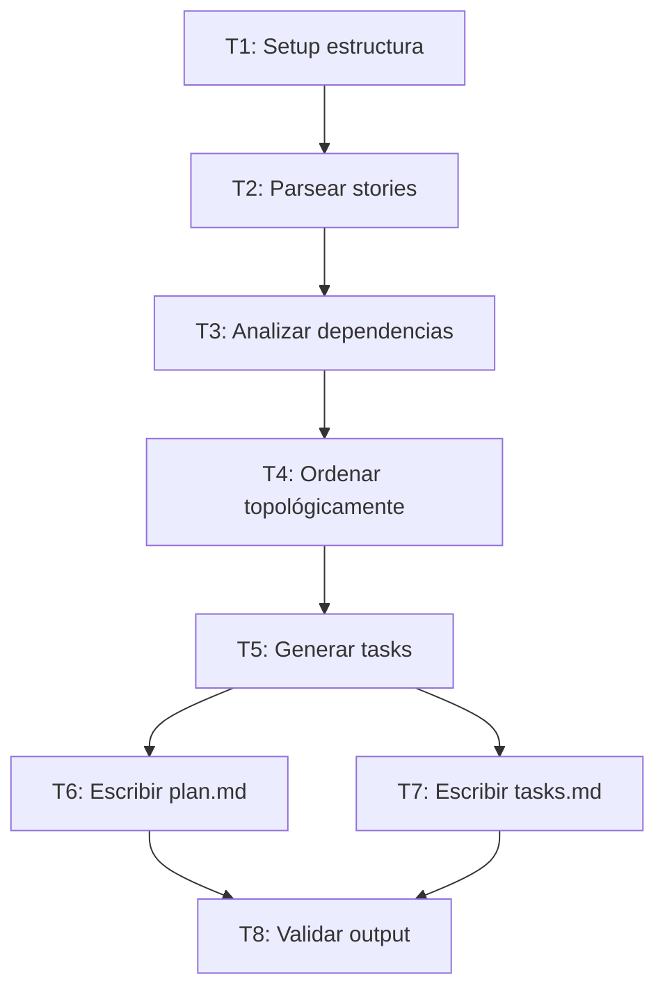

# Tech Design: raise.feature.plan Command

> **Feature**: F1.3 - Comando para crear Plan de Implementación desde User Stories
> **Epic**: E1 - Feature-Level Commands para RaiSE v2

## 1. Approach

**Qué hace este feature**:
Genera un Plan de Implementación estructurado a partir de User Stories, ordenando las tareas por dependencias, asignando secuencia de ejecución, y produciendo una lista de tasks atómicas que un agente puede ejecutar determinísticamente.

**Cómo lo implementamos**:
Comando Markdown (`.raise/commands/03-feature/raise.feature.plan.md`) que lee las stories de un feature, analiza dependencias entre ellas, genera tasks ordenadas topológicamente, y produce un plan con checkpoints de verificación (Jidoka).

**Componentes afectados**:
- `.raise/commands/03-feature/raise.feature.plan.md`: Nuevo comando
- `.claude/commands/03-feature/raise.feature.plan.md`: Copia para Claude Code
- `specs/features/{feature-id}/plan.md`: Documento de salida (plan de implementación)
- `specs/features/{feature-id}/tasks.md`: Lista de tasks atómicas

---

## 2. Interfaz / Contrato

```yaml
# Comando: /raise.feature.plan
input:
  - feature_id: string           # ID del feature
  - stories_path: string         # Path a stories/ (auto-detectado)
  - tech_design_path: string     # Path a tech-design.md (para contexto)

output:
  - plan_file: "specs/features/{feature-id}/plan.md"
  - tasks_file: "specs/features/{feature-id}/tasks.md"

handoffs:
  - next: "/raise.feature.implement"
    prompt: "Implement this feature following the plan"
```

**Ejemplo de uso**:
```bash
# Desde feature con stories generadas
/raise.feature.plan raise-feature-plan

# Con path explícito
/raise.feature.plan --stories specs/features/raise-feature-plan/stories/
```

**Output esperado** (plan.md):
```markdown
---
id: PLAN-F1.3
feature_ref: F1.3
created: 2026-01-28
status: ready
total_tasks: 8
estimated_effort: M (8-16 horas)
---

# Implementation Plan: raise.feature.plan

## Execution Order



## Tasks

| # | Task | Story | Est. | Checkpoint |
|---|------|-------|------|------------|
| T1 | Crear estructura de archivos | US-001 | S | Archivos existen |
| T2 | Implementar parser de stories | US-001 | M | Stories parseadas |
| T3 | Implementar análisis de dependencias | US-002 | M | Grafo generado |
| ... | ... | ... | ... | ... |

## Checkpoints (Jidoka)

After each task, verify:
- [ ] T1: `specs/features/{id}/plan.md` exists
- [ ] T2: Stories array has >= 1 item
- [ ] T3: Dependency graph is acyclic
- ...
```

**Output esperado** (tasks.md):
```markdown
# Tasks: raise.feature.plan

## T1: Crear estructura de archivos
**Story**: US-001
**Estimate**: S
**Dependencies**: ninguna

### Instructions
1. Crear `specs/features/{feature-id}/plan.md` con frontmatter
2. Crear `specs/features/{feature-id}/tasks.md` con header

### Verification
- [ ] Ambos archivos existen
- [ ] Frontmatter tiene campos requeridos

### If blocked
- Directorio no existe → crear con mkdir -p
---

## T2: Implementar parser de stories
...
```

---

## 3. Consideraciones

| Aspecto | Decisión | Rationale |
|---------|----------|-----------|
| Ordenamiento | Topológico basado en dependencias de stories | Garantiza que bloqueantes se ejecutan primero |
| Granularidad de tasks | 1 task = 1-4 horas de trabajo | Balance entre atomicidad y overhead |
| Checkpoints | 1 checkpoint verificable por task | Jidoka: detectar desvíos temprano |
| Formato de tasks | Markdown estructurado con Instructions + Verification | Ejecutable por agente o humano |
| Ciclos en dependencias | Detectar y reportar error | No se puede planificar con ciclos |

**Riesgos identificados**:
- [ ] Stories sin dependencias explícitas → Mitigación: Inferir de prioridades (P1 antes de P2)
- [ ] Over-decomposition en muchas tasks → Mitigación: Agrupar tasks < 30 min
- [ ] Plan desactualizado vs stories → Mitigación: Timestamp y warning si stories más recientes

---

<details>
<summary><h2>Algoritmo / Lógica</h2></summary>

```
1. LOAD stories from specs/features/{feature-id}/stories/
2. LOAD tech-design for context

3. BUILD dependency graph:
   FOR each story:
     - Parse "blocks" or "depends_on" if present
     - Infer from priority (P1 → P2 → P3)
     - Add edges to graph

4. DETECT cycles in graph:
   IF cycle found:
     - JIDOKA: Report cycle and stop
     - Suggest resolution

5. TOPOLOGICAL SORT stories:
   - Order by dependencies (blockers first)
   - Within same level, order by priority

6. GENERATE tasks from stories:
   FOR each story in order:
     - IF story.estimate == S: 1 task
     - IF story.estimate == M: 2-3 tasks
     - IF story.estimate == L: 3-5 tasks
     - Each task has:
       - Instructions (atomic steps)
       - Verification (checkbox criteria)
       - If-blocked (Jidoka recovery)

7. WRITE plan.md:
   - Mermaid diagram of execution order
   - Summary table of tasks
   - Checkpoints section

8. WRITE tasks.md:
   - Full task details
   - Ready for sequential execution

9. VALIDATE:
   - All stories have >= 1 task
   - All tasks have verification criteria
   - No orphan tasks (not linked to story)
```

</details>

<details>
<summary><h2>Testing Approach</h2></summary>

| Tipo | Qué cubre |
|------|-----------|
| Manual | Ejecutar con stories de raise-feature-stories y verificar plan |
| Edge case | Stories sin dependencias → debe inferir orden |
| Edge case | Dependencia circular → debe detectar y reportar |

**Casos de prueba**:
1. 3 stories lineales (US-001 → US-002 → US-003) → Plan con 3+ tasks en orden
2. Stories paralelas (US-001 y US-002 independientes) → Plan permite ejecución paralela
3. Ciclo (US-001 → US-002 → US-001) → Error con mensaje claro

</details>
