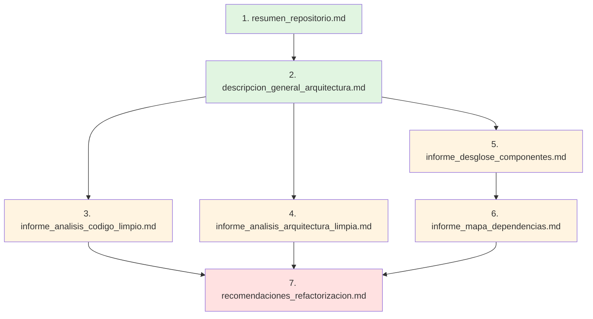

# Análisis Arquitectónico: raise.1.analyze.code

**Fecha**: 2026-01-23
**Propósito**: Análisis profundo del comando de análisis brownfield para estandarización RaiSE
**Autor**: RaiSE Ontology Architect

---

## 1. Resumen Ejecutivo

El comando `raise.1.analyze.code` es un workflow de **Arqueología de Software** diseñado para reconstruir y documentar la arquitectura de repositorios brownfield (existentes) mediante la generación sistemática de 7 informes SAR (System Analysis Reports). Opera bajo el principio de "**Evidence-Based Architecture Discovery**" - toda afirmación debe estar respaldada por evidencia concreta del código fuente.

**Patrón arquitectónico clave**: Multi-Report Generator con taxonomía fija de Clean Code y Clean Architecture como framework evaluativo.

**Innovación principal**: Sistema de 7 informes interconectados que construyen progresivamente una base de conocimiento arquitectónico completa, desde lo estructural (stack, proyectos) hasta lo cualitativo (deuda técnica, recomendaciones).

**Diferenciador crítico vs spec-kit**: Mientras spec-kit GENERA artefactos nuevos (greenfield), raise.1.analyze.code RECONSTRUYE conocimiento de código existente (brownfield forensics).

---

## 2. Estructura del Comando

### 2.1 Frontmatter Analysis

```yaml
description: Perform an integral brownfield codebase analysis using Raise SAR templates.
```

**Patrón**: No hay handoffs definidos.

**Observación crítica**: Este comando es un "terminal node" en el flujo - genera documentación pero no ofrece siguiente paso automático. Esto sugiere que es un comando de **preparación inicial** cuyo output alimenta decisiones posteriores (discovery, vision, tech-design).

**Missing**: No hay handoff explícito a `raise.1.discovery` o `raise.2.vision`, aunque lógicamente debería conectar. Esto es una **oportunidad de mejora**.

### 2.2 Input Processing

**Patrón**: Single-input optional
- `$ARGUMENTS`: Usado potencialmente para especificar paths o ámbito de análisis

**Estrategia**: El comando está diseñado para ser ejecutado sin argumentos (análisis completo del repo), pero puede aceptar contexto adicional del usuario (ej., "enfócate en el módulo de pagos").

### 2.3 Outline Structure

**Flujo principal**: 6 pasos con patrón **Initialize → Discover → Analyze → Generate → Validate → Finalize**

1. **Initialize Environment** (prerequisite check + template loading)
2. **Evidence Discovery Flow** (mapping, entry points, dependencies)
3. **Pattern Analysis** (Clean Code + Clean Architecture detection)
4. **Generate SAR Reports** (7 interconectados)
5. **Quality Validation** (checklist generation)
6. **Finalize** (update agent context, confirm completion)

**Punto crítico**: El paso 4 (Generate SAR Reports) es el núcleo - no es un solo artefacto, sino un SISTEMA de 7 documentos interdependientes.

---

## 3. Patrones de Diseño Identificados

| Patrón | Manifestación | Propósito |
|--------|---------------|-----------|
| **Multi-Report System** | 7 SAR reports generados en secuencia lógica | Separación de incumbencias en la documentación arquitectónica |
| **Evidence-Based Claims** | Toda afirmación debe citar file path o código | Prevenir hallazgos especulativos o "hallucinations" |
| **Template-Driven Output** | Cada report sigue template con estructura estándar | Consistencia y completitud de la documentación |
| **Taxonomía Evaluativa Dual** | Clean Code + Clean Architecture como lentes de análisis | Framework sistemático para evaluar calidad |
| **Progressive Knowledge Building** | Reports construyen sobre hallazgos de reports previos | De estructural (qué es) a cualitativo (qué tan bueno es) |
| **Business Impact Translation** | Deuda técnica categorizada por impacto en negocio | Priorización orientada a valor, no solo por complejidad técnica |
| **Pragmatic vs Academic** | "Analyze 'what is' before suggesting 'what should be'" | Respeto por realidad del brownfield, no imposición doctrinaria |
| **Layer-by-Layer Analysis** | README sugiere analizar por capa arquitectónica (Domain → App → Infra → Presentation) | Análisis sistemático que respeta flujo de dependencias |

---

## 4. Template Integration

### 4.1 System de Templates SAR

| Template | Propósito | Dependencias | Output Primario |
|----------|-----------|--------------|-----------------|
| **resumen_repositorio.md** | Punto de entrada, overview ejecutivo | Ninguna (genera primero) | Stack, proyectos, hallazgos clave |
| **descripcion_general_arquitectura.md** | Visión de alto nivel, estilo arquitectónico | Resumen repositorio | Capas, componentes, diagrama Mermaid |
| **informe_analisis_codigo_limpio.md** | Evaluación Clean Code | Descripción arquitectura | Nombres, funciones, comentarios, clases, smells |
| **informe_analisis_arquitectura_limpia.md** | Evaluación Clean Architecture | Descripción arquitectura + Desglose componentes | Regla de Dependencia, independencia frameworks, límites |
| **informe_desglose_componentes.md** | Deep dive por componente/proyecto | Descripción arquitectura | API pública, namespaces, dependencias por componente |
| **informe_mapa_dependencias.md** | Grafo de dependencias visualizado | Desglose componentes | Dependencias entre proyectos, capas, servicios externos, BBDD |
| **recomendaciones_refactorizacion.md** | Consolidación de issues → acciones | TODOS los reports anteriores | Lista priorizada de refactors con business impact |

**Patrón de Generación**: Los primeros 6 reports son ANALÍTICOS (qué existe, cómo está estructurado, qué tan bueno es). El último (recomendaciones) es PRESCRIPTIVO (qué hacer al respecto).

### 4.2 Estructura de Templates

**Elementos comunes** a todos los templates SAR:

1. **Frontmatter estructurado**:
   ```yaml
   ID Documento: [SAR-CODIGO]-[PROYECTO]-[SEQ]
   Documento Padre: [resumen_repositorio.md#ID]
   Versión: 1.0
   Fecha: [AAAA-MM-DD]
   ```

2. **Secciones numeradas** (facilita referencias cruzadas)

3. **Historial del Documento** (trazabilidad de cambios)

4. **Placeholders explícitos** con formato `[Descripción del contenido esperado]`

5. **Ejemplos inline** de código y estructuras esperadas

**Diferencia clave vs spec-kit templates**: Los templates SAR son MUCHO más prescriptivos - no solo definen secciones, sino que proveen guías detalladas de QUÉ escribir en cada sección, incluyendo tablas con columnas específicas y formatos de ejemplo.

### 4.3 README.md como Meta-Workflow

El `README.md` en `.specify/templates/raise/sar/` no es un template, sino una **guía de proceso** que define un workflow de 3 fases:

```
Fase 0: Preparación (definir alcance, plan maestro)
Fase 1: Documentación Fundamental (resumen + arquitectura borrador)
Fase 2: Katas por Capa (Dominio → Aplicación → Infraestructura → Presentación)
Fase 3: Consolidación (recomendaciones + revisión integral)
```

**Observación crítica**: El comando `raise.1.analyze.code.md` NO sigue explícitamente este proceso de 3 fases. El outline del comando es más lineal (discover → analyze → generate), mientras el README sugiere un proceso ITERATIVO con análisis por capa.

**Gap identificado**: Posible desalineación entre el comando actual y el proceso recomendado en README. ¿Se espera que el agente ejecute el análisis por capa internamente, o es responsabilidad del usuario invocar el comando múltiples veces?

---

## 5. Validation Strategy

### Nivel 1: Evidence Requirement (Inline en "AI Guidance")

```markdown
No Hallucinations: Every finding must be backed by a file path or code snippet.
```

**Enforcement**: No automatizado - depende de que el agente siga la instrucción.

**Trade-off**: Alta confianza en hallazgos, pero puede ralentizar análisis si el agente busca evidencia para cada afirmación.

### Nivel 2: Quality Checklist (Paso 5)

```markdown
specs/main/analysis/checklists/analysis_quality.md:
- [ ] All 7 SAR reports have been generated.
- [ ] Code examples are provided for every violation.
- [ ] Architecture diagram (Mermaid) is present.
- [ ] Technical debt is categorized by impact on business.
```

**Patrón**: Checklist de COMPLETITUD (¿están todos los reports?), no de CALIDAD del contenido.

**Limitación**: No valida si los hallazgos son CORRECTOS, solo si existen secciones requeridas y tienen evidencia.

### Nivel 3: Agent Context Update (Paso 6)

```markdown
Run .specify/scripts/bash/update-agent-context.sh gemini
```

**Propósito**: Actualizar `CLAUDE.md` o archivo equivalente del agente con hallazgos del análisis.

**Implicación**: Los hallazgos del SAR se convierten en contexto persistente para futuras sesiones - el agente "aprende" la arquitectura del repo.

---

## 6. Error Handling Patterns

### Pattern 1: Unknown Structure (Jidoka Inline)

```markdown
**Verificación**: Existe contexto visual de la estructura del repositorio.
> **Si no puedes continuar**: Estructura desconocida → Solicitar al usuario que especifique
  los paths de código fuente (src/, app/, etc.).
```

**Filosofía**: No adivinar - pedir información al usuario antes de proceder con análisis potencialmente incorrecto.

### Pattern 2: No Clear Patterns (Accept Reality)

```markdown
**Verificación**: Los patrones detectados están respaldados por evidencia en el código.
> **Si no puedes continuar**: Código sin patrones claros → Documentar como "Sin patrón
  dominante" y describir la realidad actual sin forzar categorías.
```

**Principio**: Pragmatismo sobre purismo - si el código no sigue patrones conocidos, documentar ESO, no inventar categorías forzadas.

**Diferenciador vs spec-kit**: Spec-kit puede IMPONER estructura (genera specs según template). Análisis brownfield debe RESPETAR lo que encuentra.

### Pattern 3: Missing Prerequisites (Script Failure)

```markdown
Run .specify/scripts/bash/check-prerequisites.sh --json --paths-only
```

**Manejo**: Si falla, el comando debe abortar - no puede analizar sin contexto básico de repo.

---

## 7. State Management

### In-Memory State

**Durante ejecución**:
- **Directory tree**: Mapping de estructura de carpetas
- **Dependency graph**: Relaciones entre proyectos/módulos
- **Pattern catalog**: Clean Code y Clean Architecture violations detectadas
- **Evidence buffer**: File paths y code snippets recopilados

**Punto crítico**: A diferencia de spec-kit (que puede guardar progreso incremental), el análisis brownfield es principalmente READ-ONLY hasta el paso 4 (generación de reports).

### Persistent State

**7 SAR Reports** en `specs/main/analysis/`:
- Cada report es independientemente útil
- Los reports posteriores REFERENCIAN a los anteriores (enlaces markdown)
- El sistema completo forma una "base de conocimiento arquitectónica"

**Checklist** en `specs/main/analysis/checklists/analysis_quality.md`:
- Validación post-generación

**Agent Context** (actualizado en finalización):
- `CLAUDE.md` o archivo equivalente con resumen de arquitectura

### State Transitions

```
Initialize →
  Load repo structure →
    Discover entry points + dependencies →
      Analyze patterns (Clean Code + Architecture) →
        Generate Report 1 (resumen) →
          Generate Report 2 (arquitectura) →
            Generate Report 3-6 (análisis detallados) →
              Generate Report 7 (recomendaciones) →
                Validate completeness →
                  Update agent context →
                    Complete
```

**Patrón**: Cascada con dependencias - cada report depende del anterior.

**Trade-off**: Si un report intermedio falla, los subsiguientes pueden ser inconsistentes. No hay "incremental persistence" como en clarify.

---

## 8. Key Design Decisions

| Decision | Rationale | Trade-offs |
|----------|-----------|------------|
| **7 reports separados vs 1 monolítico** | Separación de incumbencias, consumibilidad por partes | Más archivos para mantener, posibles inconsistencias entre reports |
| **Clean Code + Clean Architecture como lentes** | Framework de evaluación consistente, bien documentado, ampliamente aceptado | Sesgo hacia arquitectura limpia - puede no valorar otros estilos válidos |
| **Evidence-based claims obligatorios** | Prevenir hallazgos especulativos | Más lento, requiere más lectura de código |
| **Business impact en recomendaciones** | Priorización orientada a valor | Requiere contexto de negocio que puede no estar en el código |
| **Templates extremadamente prescriptivos** | Garantiza completitud y consistencia | Rigidez - difícil adaptar a repos con estructuras inusuales |
| **No handoffs definidos** | Análisis es punto de entrada, siguiente paso depende de hallazgos | Usuario debe decidir manualmente qué hacer después |
| **Generate all 7 reports en un solo comando** | Completitud garantizada, visión holística | Larga ejecución (potencialmente >30 min), no divisible |
| **README sugiere proceso iterativo por capa** | Análisis profundo sistemático | Desconexión con comando que sugiere ejecución lineal |
| **Content en ESPAÑOL** | Alineado con audiencia target | Límita adopción internacional (aunque instructions en inglés) |
| **No versionado de hallazgos** | Simplifica templates | Dificulta tracking de evolución de deuda técnica en el tiempo |

---

## 9. Comparison with Other Commands

### vs. speckit.1.specify

| Aspecto | raise.1.analyze.code | speckit.1.specify |
|---------|---------------------|-------------------|
| **Dirección** | Brownfield → Reconstruir conocimiento existente | Greenfield → Crear spec nueva |
| **Input** | Repositorio de código existente | Descripción natural del usuario |
| **Modo** | Read-only (mayormente) | Generativo |
| **Output** | 7 SAR reports (análisis) | 1 spec.md (requisitos) |
| **Validación** | Evidence-based (¿hay file paths?) | Testable requirements (¿es verificable?) |
| **Interactividad** | Baja (puede pedir paths si no encuentra) | Alta (clarification loop) |

### vs. speckit.5.analyze

| Aspecto | raise.1.analyze.code | speckit.5.analyze |
|---------|---------------------|-------------------|
| **Alcance** | Codebase completo | Artifacts específicos (spec, plan, tasks) |
| **Framework evaluativo** | Clean Code + Clean Architecture | Consistencia cross-artifact + Constitution |
| **Output** | 7 reports prescriptivos + recomendaciones | 1 report de análisis read-only |
| **Propósito** | Onboarding / Tech debt assessment | Quality gate post-task generation |
| **Timing** | Inicio de proyecto RaiSE en brownfield | Después de speckit.4.tasks |

**Similitud clave**: Ambos son ANALYZERS (read-only, no modifican), pero raise.1 analiza código, speckit.5 analiza artifacts RaiSE.

### vs. raise.1.discovery (PRD generation)

**Gap arquitectónico**: `raise.1.analyze.code` debería **alimentar naturalmente** a `raise.1.discovery`, pero no hay handoff explícito.

**Flujo lógico esperado**:
```
raise.1.analyze.code (entender qué existe) →
  raise.1.discovery (definir qué agregar/mejorar) →
    raise.2.vision (cómo lograrlo)
```

**Oportunidad**: Definir handoff explícito desde análisis brownfield a discovery/vision.

---

## 10. Learnings for Standardization

### Patrón 1: Multi-Report System for Complex Analysis

**Adoptar**: Cuando un análisis es demasiado amplio para un solo documento, estructurar como sistema de reports interconectados.

**Aplicar a**: Comandos que generan documentación arquitectónica, análisis de dominio complejo.

**Componentes**:
1. **Entry point report** (resumen ejecutivo con enlaces)
2. **Structural reports** (qué existe, cómo está organizado)
3. **Qualitative reports** (evaluación contra principios)
4. **Actionable report** (recomendaciones priorizadas)

**Beneficios**: Separación de incumbencias, consumibilidad por partes, referencias cruzadas.

**Ejemplo de aplicación**: Un comando `raise.1.domain-analysis` podría generar:
- `domain_overview.md` (entidades, value objects, agregados)
- `ubiquitous_language.md` (glosario del dominio)
- `domain_patterns.md` (DDD patterns identificados)
- `domain_recommendations.md` (oportunidades de mejora)

---

### Patrón 2: Evidence-Based Claims

**Adoptar**: Para comandos de análisis/auditoría, requerir que cada afirmación cite evidencia concreta.

**Aplicar a**: Cualquier comando que evalúa calidad, detecta issues, o hace recomendaciones.

**Enforcement**:
```markdown
## AI Guidance

When executing this workflow:
...
3. **No Hallucinations**: Every finding MUST be backed by:
   - File path (e.g., `src/components/Foo.tsx:42`)
   - Code snippet (3-10 lines showing the issue)
   - Explicit reference to violated principle/pattern
```

**Validación**: El checklist debe incluir:
```markdown
- [ ] Every issue has a file path or code example
- [ ] No vague claims ("The code is messy") - all are specific
```

**Beneficios**: Confianza en hallazgos, facilita posterior verificación, previene alucinaciones.

---

### Patrón 3: Dual Taxonomy (Technical + Business Impact)

**Adoptar**: Al reportar issues técnicos, siempre traducir a impacto en negocio.

**Estructura en recomendaciones**:
```markdown
### REFAC-XXX

**Problema/Observación**: [Descripción técnica]
**Principio(s) Violado(s)**: [SRP, DIP, etc.]
**Ubicación(es)**: [File paths]
**Impacto Actual**: [Técnico: dificulta mantenimiento]
**Impacto en Negocio**: [Aumenta tiempo de implementación de features,
                          incrementa riesgo de bugs en producción]
**Sugerencia**: [Acción específica]
**Prioridad**: [Alta/Media/Baja basada en impacto negocio]
**Complejidad**: [Alta/Media/Baja]
```

**Beneficio**: Facilita priorización por stakeholders no técnicos, justifica inversión en deuda técnica.

---

### Patrón 4: Pragmatic Analysis (Accept Reality)

**Adoptar**: En análisis brownfield, documentar "lo que es" antes de prescribir "lo que debería ser".

**Principio**: No forzar categorización si el código no sigue patrones conocidos.

**Ejemplo**:
```markdown
❌ BAD: "Este código sigue una arquitectura hexagonal mal implementada."
✅ GOOD: "El código no sigue un estilo arquitectónico reconocible.
          La lógica de negocio está mezclada con acceso a datos en
          las clases de servicio. Recomendación: Refactorizar hacia
          separación de capas clara."
```

**Aplicar a**: Comandos de análisis, auditoría, documentación de legacy systems.

**Beneficio**: Respeto por decisiones históricas, evita juicios de valor prematuros, facilita aceptación del análisis.

---

### Patrón 5: Template Prescriptiveness Spectrum

**Concepto**: Los templates tienen un espectro de prescriptividad:

| Tipo | Prescriptividad | Uso ideal |
|------|----------------|-----------|
| **Estructural** | Baja (solo secciones) | Generación creativa (specs, PRDs) |
| **Guiado** | Media (secciones + ejemplos) | Documentación técnica (plan, tasks) |
| **Prescriptivo** | Alta (secciones + formato + contenido esperado) | Análisis sistemático (SAR reports) |

**Templates SAR son ALTAMENTE prescriptivos**: Definen no solo QUÉ secciones, sino QUÉ escribir en cada una (tablas con columnas específicas, formatos de ejemplo, etc.).

**Trade-off**:
- **Pro**: Garantiza completitud y consistencia
- **Con**: Rigidez - dificulta adaptación a contextos inusuales

**Aprendizaje**: Usar alta prescriptividad cuando se requiere:
- Output comparable entre ejecuciones
- Documentación que alimenta procesos downstream
- Análisis sistemático contra framework establecido (Clean Architecture)

**Ejemplo**: El template `informe_analisis_codigo_limpio.md` no solo dice "analiza Clean Code", sino que prescribe:
```markdown
### 2.1. Nombres Significativos
*   **Evaluación:** [ej., Generalmente buenos, ...]
*   **Ejemplos Positivos:**
    *   [Clase/Método/Variable: ... - Ubicación: ...]
*   **Ejemplos a Mejorar:**
    *   [Nombre: ... - Ubicación: ... - Problema: ...]
```

---

### Patrón 6: Layer-by-Layer Analysis (Ordered Discovery)

**Concepto**: En análisis arquitectónico, seguir el flujo de dependencias: Core → Application → Infrastructure → Presentation.

**Razón**: Entender el dominio primero facilita entender cómo se usa en capas superiores.

**Workflow**:
```markdown
1. Analizar Capa de Dominio:
   - Identificar entidades, value objects, servicios de dominio
   - Verificar independencia de frameworks
   - Evaluar adherencia a principios DDD

2. Analizar Capa de Aplicación:
   - Identificar casos de uso
   - Verificar que solo orquesta, no contiene lógica de negocio
   - Evaluar interfaces para infraestructura

3. Analizar Capa de Infraestructura:
   - Verificar implementaciones de interfaces
   - Evaluar acoplamiento a tecnologías específicas
   - Identificar servicios externos

4. Analizar Capa de Presentación:
   - Verificar que no contiene lógica de negocio
   - Evaluar mapeo de DTOs
   - Identificar puntos de entrada
```

**Aplicar a**: Comandos de análisis arquitectónico, documentación de sistemas complejos.

**Implementación en comando**: El outline actual de `raise.1.analyze.code` no hace explícito este orden. El README lo sugiere, pero el comando no lo fuerza.

**Oportunidad de mejora**: Refactorizar step 3 (Pattern Analysis) para ser explícito sobre análisis por capa.

---

### Patrón 7: Progressive Knowledge Building

**Concepto**: Los reports se construyen en cascada - cada uno depende de hallazgos de los anteriores.

**Orden de generación**:
```
1. resumen_repositorio.md → Entrada, contexto general
   ↓
2. descripcion_general_arquitectura.md → Estructura de alto nivel
   ↓
3. informe_analisis_codigo_limpio.md → Calidad a nivel de código
   ↓
4. informe_analisis_arquitectura_limpia.md → Calidad a nivel arquitectónico
   ↓
5. informe_desglose_componentes.md → Detalle por componente
   ↓
6. informe_mapa_dependencias.md → Relaciones y dependencias
   ↓
7. recomendaciones_refactorizacion.md → Consolidación + acciones
```

**Beneficio**: Cada report tiene contexto completo de los anteriores, permitiendo afirmaciones más específicas.

**Implementación**:
- Reports incluyen `**Documento Padre:** [resumen_repositorio.md#ID]`
- Reports posteriores referencian hallazgos de anteriores: "Como se identificó en `descripcion_general_arquitectura.md`, la capa de dominio..."

**Aplicar a**: Cualquier comando que genere documentación arquitectónica multi-parte.

---

### Anti-Patrón 1: Missing Handoffs in Terminal Nodes

**Problema**: El comando no define handoffs, dejando al usuario sin guía sobre "qué hacer después".

**Ejemplo**:
```yaml
description: Perform an integral brownfield codebase analysis using Raise SAR templates.
# ❌ No hay handoffs definidos
```

**Impacto**: Después de invertir 30-60 minutos en análisis, el usuario debe adivinar el siguiente paso.

**Solución**:
```yaml
description: Perform an integral brownfield codebase analysis using Raise SAR templates.
handoffs:
  - label: Create PRD from Analysis
    agent: raise.1.discovery
    prompt: Based on the SAR analysis, create a PRD for improvements
    send: true
  - label: Generate Solution Vision
    agent: raise.2.vision
    prompt: Create solution vision considering the current architecture
    send: false
```

**Aplicar a**: Todos los comandos deben tener al menos un handoff sugerido.

---

### Anti-Patrón 2: Command-Workflow Misalignment

**Problema**: El comando (`raise.1.analyze.code.md`) sugiere ejecución lineal, pero el README (`sar/README.md`) prescribe proceso iterativo de 3 fases con análisis por capa.

**Gap**:
- **README dice**: "Fase 2: Ejecutar Katas por Capa (Dominio → Aplicación → Infraestructura → Presentación)"
- **Comando dice**: "3. Pattern Analysis: Identify Clean Code and Architecture patterns"

**Pregunta sin responder**: ¿El agente debe ejecutar internamente el análisis por capa, o el usuario invoca el comando 4 veces (una por capa)?

**Solución**: Alinear el outline del comando con el proceso del README, o actualizar el README para reflejar la ejecución real.

**Aplicar a**: Cualquier comando con documentación de proceso asociada - debe haber coherencia entre command outline y process docs.

---

### Anti-Patrón 3: Lack of Incremental Persistence

**Problema**: Si la generación de reports es interrumpida (timeout, context limit, error), se pierde todo el progreso.

**Diferencia con clarify**: `speckit.2.clarify` guarda después de CADA pregunta respondida. `raise.1.analyze.code` genera 7 reports en memoria y los escribe al final.

**Solución**: Modificar step 4 para escribir CADA report después de generarlo:
```markdown
4. **Generate SAR Reports**:
   a. Generate resumen_repositorio.md → WRITE FILE
   b. Generate descripcion_general_arquitectura.md → WRITE FILE
   c. Generate informe_analisis_codigo_limpio.md → WRITE FILE
   ...
```

**Beneficio**: Permite reanudar si hay interrupción, reduce riesgo de pérdida de trabajo.

**Aplicar a**: Cualquier comando que genere múltiples artefactos o tenga ejecución larga (>10 min).

---

### Anti-Patrón 4: Monolithic Generation (No Partial Execution)

**Problema**: El comando genera 7 reports en una sola ejecución - no permite ejecutar parcialmente (ej., "solo genera los primeros 3 reports").

**Limitación**: Si el usuario solo necesita un overview rápido, debe esperar a que se generen los 7 reports.

**Solución alternativa**: Ofrecer "modos" de ejecución:
```markdown
$ARGUMENTS options:
- "quick": Generate only reports 1-2 (resumen + arquitectura)
- "standard": Generate reports 1-6 (all analysis)
- "full": Generate all 7 reports including recommendations
```

**Trade-off**: Más complejidad en el comando vs. flexibilidad para el usuario.

---

## 11. Arquitectura del Sistema SAR

### 11.1 Modelo de Dependencias entre Reports



**Leyenda**:
- Verde: Entry + Structural
- Amarillo: Qualitative Analysis
- Rojo: Actionable Recommendations

### 11.2 Flujo de Información

```
Código Fuente (Repo Brownfield)
    ↓
Initialize (check-prerequisites.sh)
    ↓
Evidence Discovery (fd/ls, find entry points, extract dependencies)
    ↓
Pattern Analysis (Clean Code + Architecture lens)
    ↓
┌─────────────────────────────────────────────────┐
│ REPORT GENERATION CASCADE                       │
│                                                 │
│ 1. resumen_repositorio.md                      │
│    - Stack tecnológico                         │
│    - Lista de proyectos                        │
│    - Hallazgos ejecutivos                      │
│    ↓                                           │
│ 2. descripcion_general_arquitectura.md        │
│    - Estilo arquitectónico                    │
│    - Capas identificadas                      │
│    - Componentes principales                  │
│    - Diagrama Mermaid                         │
│    ↓                                           │
│ 3-6. Análisis Detallados                      │
│    - Clean Code                               │
│    - Clean Architecture                       │
│    - Desglose componentes                     │
│    - Mapa dependencias                        │
│    ↓                                           │
│ 7. recomendaciones_refactorizacion.md        │
│    - Consolidación de issues                  │
│    - Priorización por business impact         │
│    - Estimaciones de complejidad              │
└─────────────────────────────────────────────────┘
    ↓
Validation (checklist generation)
    ↓
Finalize (update-agent-context.sh)
    ↓
Output: 7 SAR reports + 1 checklist + Updated agent context
```

---

## 12. Technical Debt Assessment Framework

El sistema SAR incluye un framework implícito para evaluar deuda técnica:

### 12.1 Dimensiones de Evaluación

| Dimensión | Report que la evalúa | Criterios |
|-----------|---------------------|-----------|
| **Code Quality** | informe_analisis_codigo_limpio.md | Nombres, funciones, comentarios, diseño de clases, smells |
| **Architecture Quality** | informe_analisis_arquitectura_limpia.md | Regla de Dependencia, independencia de frameworks, límites arquitectónicos |
| **Modularity** | informe_desglose_componentes.md | Cohesión de componentes, claridad de responsabilidades |
| **Coupling** | informe_mapa_dependencias.md | Dependencias entre proyectos, acoplamiento a servicios externos |
| **Maintainability** | Consolidado en recomendaciones_refactorizacion.md | Todas las dimensiones anteriores |

### 12.2 Sistema de Priorización

**Template `recomendaciones_refactorizacion.md`** prescribe:

```markdown
**Prioridad Sugerida:** [Alta, Media, Baja] (Basada en impacto y criticidad)
**Complejidad Estimada:** [Baja, Media, Alta] (Esfuerzo relativo)
```

**Matriz de Priorización Implícita**:

```
            │ Complejidad Baja │ Complejidad Media │ Complejidad Alta │
────────────┼──────────────────┼───────────────────┼──────────────────┤
Impacto Alto│     P1           │        P1         │       P2         │
────────────┼──────────────────┼───────────────────┼──────────────────┤
Impacto Medio│    P2           │        P2         │       P3         │
────────────┼──────────────────┼───────────────────┼──────────────────┤
Impacto Bajo│     P3          │        P3         │       P4         │
```

**Benefit**: Quick wins (alto impacto, baja complejidad) se identifican claramente.

---

## 13. Comparison: Comando Actual vs README Workflow

### Diferencias Clave

| Aspecto | Comando (.md) | README (proceso recomendado) |
|---------|--------------|------------------------------|
| **Fases** | Lineal (6 pasos) | 3 fases explícitas (Preparación, Fundamental, Katas por Capa, Consolidación) |
| **Análisis por capa** | No mencionado | Core del proceso (Fase 2) |
| **Plan maestro** | No contemplado | Recomendado crear `PLAN_ANALISIS_ARQUITECTONICO.md` |
| **Iteratividad** | Implícita | Explícita ("hallazgos en una capa pueden requerir revisar capas previas") |
| **Katas SAR** | No referenciados | Componente central del proceso |
| **Duración esperada** | No especificada | Proceso multi-sesión (varias horas a días) |

### Recomendación de Alineación

**Opción A: Actualizar comando para reflejar README**

Modificar outline de `raise.1.analyze.code.md` para incluir:
```markdown
2. **Phase 0: Preparation**:
   - Create PLAN_ANALISIS_ARQUITECTONICO.md
   - Define scope (full repo or specific modules)

3. **Phase 1: Foundational Documentation**:
   - Generate resumen_repositorio.md
   - Generate initial draft of descripcion_general_arquitectura.md

4. **Phase 2: Layer-by-Layer Analysis**:
   a. Domain Layer Analysis (raise-kata-sar-capa-dominio.md)
      - Update all SAR reports with domain findings
   b. Application Layer Analysis (raise-kata-sar-capa-aplicacion.md)
      - Update all SAR reports with application findings
   c. Infrastructure Layer Analysis (raise-kata-sar-capa-infraestructura.md)
      - Update all SAR reports with infrastructure findings
   d. Presentation Layer Analysis (raise-kata-sar-capa-presentacion.md)
      - Update all SAR reports with presentation findings

5. **Phase 3: Consolidation**:
   - Generate recomendaciones_refactorizacion.md
   - Perform integral review of all SAR reports
```

**Opción B: Actualizar README para reflejar comando**

Simplificar el README para describir el proceso lineal actual del comando.

**Recomendación**: Opción A - el proceso del README es más robusto y sistemático.

---

## 14. Missing Katas

El README referencia 4 Katas SAR por capa que **NO existen en el repositorio**:

```markdown
*   `raise-kata-sar-capa-dominio.md`
*   `raise-kata-sar-capa-aplicacion.md`
*   `raise-kata-sar-capa-infraestructura.md`
*   `raise-kata-sar-capa-presentacion.md`
```

**Ubicación esperada**: `raise-ai/.raise/katas/` (pero este path tampoco existe en raise-commons)

**Impacto**: El proceso prescrito en el README no puede ejecutarse completamente sin estos Katas.

**Oportunidad**: Crear estos Katas siguiendo el patrón de los Katas existentes en `docs/framework/v2.1/katas/`.

---

## 15. Recomendaciones para Estandarización

### 1. Alinear Comando con Proceso del README

**Acción**: Refactorizar `raise.1.analyze.code.md` para incluir análisis por capa explícito.

**Beneficio**: Proceso sistemático que garantiza cobertura completa.

### 2. Agregar Handoffs Explícitos

**Acción**: Definir handoffs a `raise.1.discovery` y `raise.2.vision`.

**Rationale**: El análisis brownfield es punto de entrada lógico para proyectos de migración/mejora.

### 3. Implementar Incremental Persistence

**Acción**: Modificar step 4 para escribir cada report después de generarlo.

**Beneficio**: Robustez ante interrupciones, permite reanudar.

### 4. Crear Katas SAR Faltantes

**Acción**: Generar los 4 Katas por capa referenciados en el README.

**Contenido esperado**: Similar a otros Katas RaiSE:
- Frontmatter YAML (id, nivel, titulo, etc.)
- Propósito
- Contexto
- Pasos (con verificación + Jidoka inline)
- Output
- Validation Gate
- Referencias

### 5. Generalizar Templates SAR para Múltiples Stacks

**Observación**: Los templates actuales tienen fuerte sesgo hacia .NET C# (referencias a `.csproj`, `EF Core`, `ASP.NET Core`, etc.).

**Acción**: Crear versión genérica de templates que puedan aplicarse a:
- Node.js/TypeScript
- Python/Django
- Ruby/Rails
- Java/Spring
- Go
- Rust

**Estrategia**: Usar placeholders genéricos:
- `[PROJECT_FILE]` en lugar de `.csproj`
- `[ORM]` en lugar de `EF Core`
- `[WEB_FRAMEWORK]` en lugar de `ASP.NET Core`

**Beneficio**: Amplía aplicabilidad del comando a múltiples ecosistemas.

### 6. Agregar Modo "Quick Analysis"

**Acción**: Soportar `$ARGUMENTS` para especificar alcance:
```bash
/raise.1.analyze.code quick      # Solo reports 1-2
/raise.1.analyze.code standard   # Reports 1-6
/raise.1.analyze.code full       # Todos los 7 reports
```

**Beneficio**: Flexibilidad para análisis exploratorio rápido vs. análisis exhaustivo.

### 7. Incluir Validation Gate

**Acción**: Crear `.specify/gates/raise/gate-analysis.md` que valide:
- Todos los reports tienen evidencia (file paths)
- Diagrama Mermaid está presente y es válido
- Recomendaciones priorizadas por business impact
- No hay contradicciones entre reports

**Beneficio**: Garantiza calidad del análisis antes de basar decisiones en él.

---

## 16. Conclusión

El comando `raise.1.analyze.code` implementa un patrón maduro de **Archaeological Software Analysis** mediante un sistema de 7 informes SAR interconectados. Los elementos clave son:

1. **Multi-Report System**: Separación de incumbencias en documentación arquitectónica
2. **Evidence-Based Claims**: Toda afirmación respaldada por código o file paths
3. **Dual Taxonomy**: Clean Code + Clean Architecture como lenses evaluativos
4. **Business Impact Translation**: Deuda técnica priorizada por valor de negocio
5. **Template Prescriptiveness**: Alta especificidad para garantizar completitud
6. **Progressive Knowledge Building**: Reports construyen sobre hallazgos previos

**Gaps identificados**:
- Desalineación entre comando (lineal) y README (iterativo por capa)
- Falta de handoffs explícitos al siguiente paso
- Ausencia de incremental persistence
- Katas SAR referenciados pero no existentes
- Sesgo hacia .NET C# en templates

**Oportunidades**:
- Alinear comando con proceso del README
- Crear Katas SAR faltantes
- Generalizar templates para múltiples stacks
- Agregar handoffs a discovery/vision
- Implementar persistence incremental

La adopción de los patrones de este comando (multi-report, evidence-based, business impact) puede fortalecer significativamente otros comandos RaiSE, especialmente aquellos que generan documentación arquitectónica o evalúan calidad.

---

## Referencias

- **Comando fuente**: `.agent/workflows/01-onboarding/raise.1.analyze.code.md`
- **Templates SAR**: `.specify/templates/raise/sar/*.md`
- **README proceso**: `.specify/templates/raise/sar/README.md`
- **Clean Architecture**: Robert C. Martin, "Clean Architecture: A Craftsman's Guide to Software Structure and Design"
- **Clean Code**: Robert C. Martin, "Clean Code: A Handbook of Agile Software Craftsmanship"
