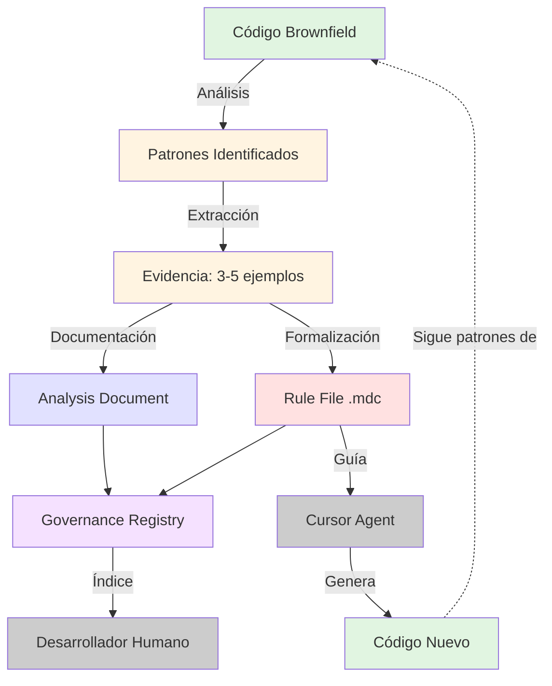

# Análisis Arquitectónico: raise.rules.generate

**Fecha**: 2026-01-23
**Propósito**: Análisis profundo del comando de generación automática de reglas para estandarización RaiSE
**Autor**: RaiSE Ontology Architect

---

## 1. Resumen Ejecutivo

El comando `raise.rules.generate` es un workflow de **Pattern Mining & Rule Formalization** diseñado para identificar patrones recurrentes en código brownfield y formalizarlos como reglas Cursor (.mdc) que guían al asistente AI. Opera bajo el principio de "**Evidence-Based Rule Extraction**" - cada regla debe estar respaldada por 3-5 ejemplos reales del código y documentada con su razonamiento.

**Patrón arquitectónico clave**: Exploratory Analysis → Iterative Pattern Extraction → Rule Generation → Governance Registry Update. Es un ciclo cerrado que conecta código (observaciones) con reglas (prescripciones) y gobernanza (trazabilidad).

**Innovación principal**: Sistema de doble trazabilidad donde cada regla tiene:
1. **Análisis document** (`specs/main/analysis/rules/analysis-for-[rule-name].md`) - el "Por qué"
2. **Rule file** (`.cursor/rules/[ID]-[name].mdc`) - el "Qué hacer"
3. **Registry entry** (`specs/main/ai-rules-reasoning.md`) - el índice maestro

**Diferenciador crítico**: Mientras otros comandos GENERAN artefactos de especificación o documentación, `raise.rules.generate` EXTRAE conocimiento implícito del código y lo FORMALIZA como reglas ejecutables para el agente.

---

## 2. Estructura del Comando

### 2.1 Frontmatter Analysis

```yaml
description: Automated rule generation engine based on patterns detected in the code.
             Implements Katas L2-01 and L2-03.
handoffs:
  - label: Edit Generated Rule
    agent: speckit.raise.rules-edit
    prompt: I want to refine the rule you just generated
```

**Patrón**: Single handoff al comando de edición de reglas.

**Observación crítica**: Este es un comando de ONBOARDING (`.agent/workflows/01-onboarding/`) pero tiene handoff a un comando de spec-kit (`speckit.raise.rules-edit`). Esto sugiere que `rules-edit` es un comando de refinamiento/QA, no un comando de flujo principal.

**Missing**: No hay handoff claro al "siguiente paso después de generar reglas". Posibles candidatos:
- `raise.1.discovery` (ahora que entendemos los patrones del código, definir qué mejorar)
- `raise.2.vision` (crear visión de solución basada en patrones identificados)
- Algún comando de refactoring guiado por reglas

### 2.2 Input Processing

**Patrón**: Single-input optional
- `$ARGUMENTS`: Usado para especificar directorio o componente a analizar (ej., `src/components`)
- Si vacío, analiza el contexto actual

**Estrategia**: Permite análisis focalizado (solo un módulo) o completo (todo el repo). Esto es útil para:
- Proyectos grandes donde analizar todo sería lento
- Iteraciones incrementales (generar reglas por módulo)
- Análisis exploratorio (probar en área pequeña primero)

### 2.3 Outline Structure

**Flujo principal**: 5 pasos con patrón **Initialize → Explore → Extract → Formalize → Register**

1. **Initialize Environment** (prerequisite check + governance registry verification)
2. **Exploratory Analysis (Kata L2-01)** (pattern detection via grep/list_dir)
3. **Iterative Extraction & Generation (Kata L2-03)** (loop de evidence → analysis → rule design → file writing)
4. **Update Governance Registry** (add entry to ai-rules-reasoning.md)
5. **Finalize** (update agent context, confirm files)

**Punto crítico**: El paso 3 es un LOOP - no genera una sola regla, sino que itera sobre 1-3 patrones candidatos identificados en el paso 2. Esto es diferente de comandos que generan un solo artefacto.

### 2.4 Referencia a Katas

**Katas mencionados**:
- **Kata L2-01**: Exploratory Analysis (paso 2)
- **Kata L2-03**: Iterative Extraction & Generation (paso 3)

**Observación crítica**: Estos Katas NO existen en el repositorio actual. Las rutas esperadas serían:
- `docs/framework/v2.1/katas/L2-01-*.md`
- `docs/framework/v2.1/katas/L2-03-*.md`

**Gap**: Los Katas referenciados son "fantasmas" - el comando los menciona pero no están implementados. Esto hace que el proceso sea menos guiado de lo esperado.

**Implicación**: El agente debe inferir qué significa "Exploratory Analysis" y "Iterative Extraction" sin guía explícita, lo cual puede llevar a inconsistencias entre ejecuciones.

---

## 3. Patrones de Diseño Identificados

| Patrón | Manifestación | Propósito |
|--------|---------------|-----------|
| **Evidence-Based Rule Creation** | Requerir 3-5 ejemplos reales + 2 anti-ejemplos | Prevenir reglas especulativas o basadas en opinión |
| **Dual Traceability (Rule + Analysis)** | Cada regla tiene análisis document + registry entry | Documentar el "por qué" de cada regla, no solo el "qué" |
| **Iterative Pattern Mining** | Loop sobre patrones candidatos (1-3) | Extraer múltiples reglas en una sola ejecución, no una sola regla |
| **Governance Registry** | Archivo maestro `ai-rules-reasoning.md` | Índice centralizado de todas las reglas generadas |
| **Glob Precision** | Reglas deben tener globs restrictivos (ej., `src/components/**/*.tsx`) | Evitar falsos positivos, aplicar reglas solo donde corresponde |
| **Analysis Document in Spanish** | Análisis en español, instructions en inglés | Alineado con audiencia RaiSE (español) pero proceso ejecutado en inglés |
| **Rule ID Naming Convention** | `[ID]-[name].mdc` formato | Ordenamiento alfabético determina prioridad de carga |
| **YAML Frontmatter Structured** | Reglas .mdc tienen frontmatter extenso | Machine-readable metadata para Cursor |

---

## 4. Rule (.mdc) Structure Analysis

### 4.1 Anatomía de un Archivo .mdc

Basado en el ejemplo de `910-rule-management.mdc`:

```markdown
---
name: [Nombre conciso]
description: [Propósito de la regla]
globs: ["pattern1", "pattern2", "!exclusion"]
alwaysApply: true|false
tags: ["tag1", "tag2"]
priority: [número que coincide con prefijo del archivo]
category: [categoría según índice de reglas]
related: [".cursor/rules/other-rule.mdc"]
references: ["URL a docs externos"]
---

# [Nombre de la Regla]

[Contenido en Markdown]

## 1. [Sección]
...

## 2. [Otra Sección]
...
```

**Elementos clave**:

1. **Globs**: Patrones que determinan cuándo se aplica la regla
   - `src/components/**/*.tsx` - solo archivos TypeScript en components
   - `!**/test/*` - excluir directorios de test
   - **Crítico**: Si globs son demasiado amplios (`**/*.ts`), la regla se dispara innecesariamente

2. **Priority**: Número que determina orden de carga
   - 000-099: Config global
   - 100-199: Metodología RaiSE
   - 200-299: Estándares técnicos
   - 900-999: Meta-reglas

3. **Category**: Agrupación semántica
   - `raise-methodology`
   - `tech-standards-csharp`
   - `repo-architecture-clean`
   - `meta-rules`

4. **Content Structure**: Markdown con secciones organizadas
   - Propósito
   - Principios Fundamentales
   - Guías Específicas
   - Ejemplos (Correcto / Incorrecto)
   - Reglas Relacionadas

### 4.2 Trade-off: Especificidad vs Generalidad

**Problema de diseño**: ¿Cuán específica debe ser una regla?

| Enfoque | Pros | Contras |
|---------|------|---------|
| **Muy específico** (ej., `src/api/controllers/**/*.cs`) | Precisión alta, pocos falsos positivos | Muchas reglas pequeñas, mantenimiento complejo |
| **Muy general** (ej., `**/*.cs`) | Pocas reglas, cobertura amplia | Muchos falsos positivos, regla se dispara innecesariamente |
| **Balanceado** (ej., `src/{api,services}/**/*.cs`) | Cobertura adecuada con especificidad razonable | Requiere entender estructura del proyecto |

**Recomendación del comando**: "Globs must be restrictive" - preferir especificidad.

**Rationale**: Cursor carga TODAS las reglas que hacen match con el archivo actual. Globs amplios aumentan tokens consumidos innecesariamente.

---

## 5. Analysis Document Structure

Basado en `analysis-for-raise-kit-command-creation.md`:

### 5.1 Secciones Estándar

```markdown
# Análisis: [Nombre del Patrón/Regla]

**Fecha**: YYYY-MM-DD
**Autor**: [Nombre]
**Feature de Referencia**: [specs/NNN-nombre]
**Objetivo**: [Por qué se genera esta regla]

## Contexto
[Situación que motivó la regla]

## Evidencia Recopilada

### 1. [Tipo de Evidencia]
[Ejemplos del código]

### 2. Estructura Común Identificada
[Qué tienen en común los ejemplos]

## Patrón Identificado

### Pattern Name: **[Nombre del Patrón]**

### Alcance
[Dónde aplica]

### Estructura del [Artefacto]
[Cómo se estructura]

### Convenciones Críticas
[Reglas específicas]

## Ejemplos

### Ejemplo 1: [Caso Simple]
[Código de ejemplo]

### Ejemplo 2: [Caso Complejo]
[Código de ejemplo]

### Anti-Ejemplos
[Qué NO hacer]

## Justificación del Patrón

### Principios RaiSE Aplicados
[Qué principios de la Constitution se aplican]

### Beneficios
[Por qué es útil]

### Trade-offs
[Qué se sacrifica]

## Decisiones Arquitectónicas

### Decisión 1: [Tema]
**Opciones**: A, B, C
**Elegida**: C
**Razón**: [Por qué]

## Checklist de [Aplicación del Patrón]
[Lista verificable]

## Métricas de Calidad
[Qué medir]

## Referencias
[Links a docs relacionados]
```

### 5.2 Propósito del Analysis Document

**NO es**:
- Una regla ejecutable (esa es el .mdc)
- Documentación de usuario
- Un tutorial

**SÍ es**:
- El RATIONALE detrás de la regla
- La EVIDENCIA que justifica su existencia
- El PROCESO de extracción del patrón
- El CONTEXTO histórico (por qué se creó)

**Analogía**: Si la regla .mdc es una ley, el analysis document es el debate legislativo que explica por qué se promulgó esa ley.

---

## 6. Governance Registry (ai-rules-reasoning.md)

### 6.1 Estructura del Registry

```markdown
# Razonamiento y Gobernanza de Reglas AI

## Registro de Reglas

| ID | Regla | Fecha | Objetivo | Análisis |
|----|-------|-------|----------|----------|
| 100 | Kata Structure v2.1 | 2026-01-20 | Estandarizar estructura Katas | [Ver Análisis](./analysis/rules/analysis-for-kata-structure-v2.1.md) |
| 110 | RaiSE Kit Command Creation | 2026-01-20 | Documentar patrón de creación de comandos | [Ver Análisis](./analysis/rules/analysis-for-raise-kit-command-creation.md) |
```

### 6.2 Propósito del Registry

**Funciones**:
1. **Índice maestro** de todas las reglas
2. **Trazabilidad temporal** (cuándo se creó cada regla)
3. **Navegación rápida** (links a analysis documents)
4. **Visión panorámica** (ver todas las reglas de un vistazo)

**Beneficios**:
- Evita duplicación de reglas (puedes ver qué ya existe)
- Facilita auditoría (¿qué reglas tenemos y por qué?)
- Permite rastrear evolución (qué reglas son viejas vs nuevas)

**Limitación actual**: No hay campo de "estado" (activa, deprecated, en revisión). Todas las reglas listadas se asumen activas.

---

## 7. Validation Strategy

### Nivel 1: Evidence Requirement (Inline en AI Guidance)

```markdown
## AI Guidance
2. **Real over Theoretical**: Prioritize actual observed patterns in the repo
                             over general best practices.
```

**Enforcement**: No automatizado - el agente debe seguir la instrucción de encontrar 3-5 ejemplos reales + 2 anti-ejemplos.

**Gap**: No hay validación que verifique que efectivamente se recopilaron los ejemplos. El agent podría generar una regla sin evidencia y el sistema no lo detectaría.

### Nivel 2: Glob Precision (AI Guidance)

```markdown
1. **Be Precise**: Globs must be restrictive enough to target only the
                    intended files.
3. **Specificity**: Precision in Globs is critical to avoid false positives.
```

**Enforcement**: Manual - el agente debe juzgar si un glob es "suficientemente restrictivo".

**Trade-off**: No hay validación automática de que globs no sean demasiado amplios (ej., `**/*.ts`).

### Nivel 3: Governance Registry Update (Paso 4)

```markdown
4. **Update Governance Registry**:
   - Update `specs/main/ai-rules-reasoning.md` in **Spanish**.
   - Add entry: ID, Rule Name, Date, Goal, and link to the analysis document
```

**Enforcement**: Paso explícito en el outline.

**Validación**: El paso 5 (Finalize) verifica que el archivo de regla existe con `check_file`, pero NO verifica que el registry fue actualizado.

**Gap**: El agent podría omitir actualizar el registry y el comando no fallaría.

### Nivel 4: Agent Context Update (Paso 5)

```markdown
5. **Finalize**:
   - Run `.specify/scripts/bash/update-agent-context.sh gemini`.
```

**Propósito**: Actualizar CLAUDE.md u otro archivo de contexto del agente con las nuevas reglas generadas.

**Observación**: El script se llama con argumento `gemini`, lo que sugiere que está diseñado para diferentes agentes (claude, gemini, etc.). Sin embargo, el nombre del script no es genérico (`update-agent-context.sh` no indica que sea multi-agente).

---

## 8. Error Handling Patterns

### Pattern 1: Missing Governance Registry (Jidoka Implicit)

```markdown
1. **Initialize Environment**:
   - Verify existence of `specs/main/ai-rules-reasoning.md` (create if missing).
```

**Filosofía**: Si el registry no existe, créalo (no falles). Esto es diferente de otros comandos que fallan si falta un prerequisito.

**Rationale**: El registry es mantenido por el sistema, no por el usuario. Si no existe, es responsabilidad del comando crearlo.

### Pattern 2: No Clear Patterns Found (Not Handled)

**Escenario**: El comando ejecuta análisis exploratorio pero no encuentra patrones recurrentes (código es inconsistente, cada archivo es diferente).

**Manejo actual**: No especificado en el outline.

**Gap**: El agente podría:
- Generar reglas especulativas (violando "Real over Theoretical")
- Reportar "no se encontraron patrones" y salir
- Pedir al usuario que especifique qué buscar

**Falta guidance** explícita para este escenario.

### Pattern 3: Duplicate Patterns (Not Handled)

**Escenario**: El análisis encuentra un patrón que ya tiene una regla existente en el registry.

**Manejo actual**: No especificado.

**Debería**: Verificar registry antes de generar nuevas reglas para evitar duplicación.

---

## 9. State Management

### In-Memory State

**Durante exploración (paso 2)**:
- **Pattern candidates**: Lista de 1-3 patrones identificados
- **Code examples**: Buffer de ejemplos recopilados por patrón
- **Anti-examples**: Buffer de contra-ejemplos

**Durante iteración (paso 3)**:
- **Current pattern**: El patrón siendo procesado en esta iteración del loop
- **Analysis document draft**: Contenido del analysis siendo construido
- **Rule definition**: YAML frontmatter + contenido markdown de la regla

### Persistent State

**Múltiples artefactos generados por patrón**:

1. **Analysis document** → `specs/main/analysis/rules/analysis-for-[rule-name].md`
2. **Rule file** → `.cursor/rules/[ID]-[name].mdc`
3. **Registry update** → Nueva fila en `specs/main/ai-rules-reasoning.md`
4. **Agent context** → Actualizado vía script

### State Transitions

```
Initialize →
  Load/Create Registry →
    Exploratory Analysis →
      Identify 1-3 Patterns →
        FOR EACH pattern:
          Collect Evidence (3-5 examples + 2 anti-examples) →
            Write Analysis Document →
              Design Rule (YAML + content) →
                Write Rule File (.mdc) →
        END FOR →
      Update Registry (add rows for all generated rules) →
        Update Agent Context →
          Complete
```

**Patrón crítico**: El loop de generación (paso 3) escribe archivos INMEDIATAMENTE después de cada regla, no batch al final. Esto es incremental persistence similar a `speckit.2.clarify`.

**Beneficio**: Si el comando se interrumpe después de generar 2 de 3 reglas, las 2 primeras persisten.

---

## 10. Key Design Decisions

| Decision | Rationale | Trade-offs |
|----------|-----------|------------|
| **Dual traceability (rule + analysis)** | Documentar "por qué" además de "qué" | Más archivos para mantener, posible inconsistencia |
| **Iterative generation (1-3 patterns)** | Maximizar valor por ejecución | Más complejo que generar 1 regla, ejecución más larga |
| **Evidence-based (3-5 examples required)** | Prevenir reglas especulativas | Más lento, requiere análisis más profundo del código |
| **Globs restrictivos obligatorios** | Evitar falsos positivos en Cursor | Requiere conocimiento de estructura del proyecto |
| **Analysis en español, instructions en inglés** | Alineado con audiencia RaiSE | Mezcla de idiomas puede confundir |
| **Governance registry centralizado** | Índice maestro de todas las reglas | Single point of failure, puede volverse grande |
| **Rule ID numeric prefix** | Control de ordenamiento alfabético | Requiere coordinación para evitar colisiones de IDs |
| **No validation gates** | Confiar en evidence-based approach | Sin verificación automática de calidad |
| **Kata references (L2-01, L2-03) sin implementar** | Aspiracional - Katas futuros guiarán proceso | Actualmente no hay guía explícita, inconsistencia posible |
| **Handoff a rules-edit, no a siguiente comando de flujo** | Permite refinamiento iterativo | No hay guía clara sobre "qué hacer después de generar reglas" |

---

## 11. Comparison with Other Commands

### vs. raise.1.analyze.code

| Aspecto | raise.rules.generate | raise.1.analyze.code |
|---------|---------------------|---------------------|
| **Input** | Código brownfield (enfocado en patrones) | Código brownfield (enfocado en arquitectura) |
| **Modo** | Pattern Mining → Rule Formalization | Architecture Discovery → Documentation |
| **Output** | Reglas ejecutables (.mdc) + Analysis docs | 7 SAR reports (documentación) |
| **Propósito** | Guiar agente AI con patrones del proyecto | Documentar arquitectura para humanos + AI |
| **Iteraciones** | Loop sobre 1-3 patrones | Lineal (genera 7 reports secuencialmente) |
| **Evidence** | 3-5 ejemplos + 2 anti-ejemplos | File paths + code snippets en reports |
| **Governance** | Registry centralizado (ai-rules-reasoning.md) | Sin registry (los 7 reports son standalone) |

**Similitud**: Ambos son comandos de ONBOARDING para brownfield, pero con enfoques complementarios.

**Sinergia potencial**: Ejecutar `analyze.code` primero (entender arquitectura), luego `rules.generate` (formalizar patrones como reglas).

### vs. speckit.5.analyze

| Aspecto | raise.rules.generate | speckit.5.analyze |
|---------|---------------------|-------------------|
| **Input** | Código brownfield | Artifacts RaiSE (spec, plan, tasks) |
| **Análisis de** | Patrones de código | Consistencia cross-artifact |
| **Output** | Reglas prescriptivas (.mdc) | Report read-only de issues |
| **Propósito** | Guiar futuro desarrollo | Quality gate post-task generation |
| **Modificaciones** | Genera nuevos archivos (reglas) | Read-only (no modifica nada) |

**Diferencia clave**: `rules.generate` es GENERADOR (crea artefactos), `speckit.5.analyze` es ANALYZER (solo lee y reporta).

### vs. raise.rules.edit

**Relación**: Generate → Edit

```
raise.rules.generate (crear reglas) →
  raise.rules.edit (refinar reglas creadas)
```

**Asunción**: `rules.edit` es un comando iterativo para mejorar reglas existentes (no analizadas aún en este documento).

---

## 12. Learnings for Standardization

### Patrón 1: Dual Traceability (Artifact + Rationale Document)

**Concepto**: Cada artefacto ejecutable debe tener un documento de rationale que explica su "por qué".

**Componentes**:
1. **Executable artifact** (la regla .mdc)
2. **Rationale document** (el analysis document)
3. **Master registry** (el índice)

**Aplicar a**: Comandos que generan artifacts de gobernanza, guardrails, patrones, decisiones arquitectónicas.

**Beneficios**:
- Auditoría: "¿Por qué existe esta regla?" → leer analysis document
- Mantenimiento: Si el contexto cambia, saber si la regla sigue siendo válida
- Onboarding: Nuevos miembros entienden decisiones históricas

**Ejemplo de aplicación**: Un comando `raise.constraints.generate` que extrae restricciones arquitectónicas del código podría generar:
- `.specify/constraints/[ID]-[name].yaml` (constraint definition)
- `specs/main/analysis/constraints/analysis-for-[name].md` (rationale)
- `specs/main/ai-constraints-reasoning.md` (registry)

---

### Patrón 2: Evidence-Based Artifact Generation

**Concepto**: Antes de generar un artefacto prescriptivo (regla, patrón, decisión), recopilar evidencia empírica del código.

**Enforcement**:
```markdown
## AI Guidance
- **Evidence Required**:
  - 3-5 positive examples from actual code
  - 2 counter-examples (anti-patterns)
  - File paths for all examples
- **No Speculation**: Do not generate rules based on "best practices"
                       if not observed in the codebase
```

**Validation** (checklist post-generación):
```markdown
- [ ] All claims backed by file paths
- [ ] Minimum 3 positive examples provided
- [ ] At least 2 anti-examples documented
- [ ] Examples are from current codebase, not external sources
```

**Aplicar a**: Cualquier comando que extrae patrones o genera guardrails.

---

### Patrón 3: Iterative Multi-Artifact Generation

**Concepto**: En lugar de generar un solo artefacto, generar 1-N relacionados en un loop.

**Estructura**:
```markdown
2. **Identify Candidates**:
   - Analyze [source] to find 1-N candidate [artifacts]
   - List candidates with brief description

3. **Iterative Generation**:
   FOR EACH candidate:
     a. Gather specific data
     b. Generate artifact
     c. WRITE TO DISK (incremental persistence)
     d. Move to next
```

**Beneficios**:
- Maximiza ROI por ejecución (múltiples artefactos en un run)
- Incremental persistence (si interrumpe, no se pierde todo)
- Coherencia (todos los artefactos del mismo análisis)

**Trade-off**: Ejecución más larga, más complejo de implementar.

**Aplicar a**: Comandos de minería de patrones, generación de documentación multi-parte.

---

### Patrón 4: Governance Registry Pattern

**Concepto**: Mantener un índice maestro de todos los artefactos generados por un tipo de comando.

**Estructura del registry**:
```markdown
# [Tipo de Artefacto] Registry

## [Sección Principal]

| ID | Nombre | Fecha | Propósito | Link a Análisis |
|----|--------|-------|-----------|-----------------|
| 001 | [nombre] | YYYY-MM-DD | [objetivo] | [./analysis/[tipo]/[nombre].md] |
```

**Funciones del registry**:
- Índice navegable
- Prevención de duplicados
- Auditoría temporal
- Visión panorámica

**Aplicar a**:
- Reglas (ya implementado)
- Constraints
- Guardrails
- ADRs (si se generan automáticamente)
- Patrones detectados

**Ejemplo**: Un comando `raise.patterns.extract` podría mantener:
```markdown
# specs/main/ai-patterns-reasoning.md

| ID | Patrón | Fecha | Contexto | Análisis |
|----|--------|-------|----------|----------|
| P01 | Repository Pattern | 2026-01-20 | Acceso a datos | [Ver](./analysis/patterns/repository-pattern.md) |
| P02 | Command Query Separation | 2026-01-21 | API design | [Ver](./analysis/patterns/cqs.md) |
```

---

### Patrón 5: Glob Precision Guidelines

**Concepto**: Para comandos que generan reglas con patrones de archivo (globs), establecer guidelines explícitas de especificidad.

**Guidelines a incluir**:

```markdown
## Glob Precision Guidelines

**Restrictiveness Levels**:

1. **Too Broad** (avoid):
   - `**/*.ts` - matches ALL TypeScript files
   - `src/**/*` - matches everything in src

2. **Appropriately Specific** (prefer):
   - `src/api/controllers/**/*.ts` - only controllers
   - `src/{api,services}/**/*.ts` - API and services only
   - `*.config.ts` - only config files in root

3. **Too Narrow** (rare cases):
   - `src/api/controllers/UserController.ts` - single file (use only if truly unique)

**Decision Framework**:
- If pattern applies to <5 files → too narrow, reconsider if rule is needed
- If pattern applies to >50% of codebase → too broad, split into multiple rules
- If pattern applies to 10-40% of codebase → probably right scope
```

**Validation** (checklist):
```markdown
- [ ] Glob tested against actual codebase (count matches)
- [ ] Glob excludes test directories (`!**/test/**`)
- [ ] Glob excludes generated code (`!**/generated/**`)
- [ ] Glob doesn't overlap significantly with other rules
```

**Aplicar a**: Comandos que generan reglas, constraints, linters configs.

---

### Patrón 6: Kata-Driven Command Execution

**Concepto**: Referenciar Katas explícitos que guían cada fase del comando.

**Current state in raise.rules.generate**:
```markdown
2. **Exploratory Analysis (Kata L2-01)**:
   [steps...]

3. **Iterative Extraction & Generation (Kata L2-03)**:
   [steps...]
```

**Gap**: Katas L2-01 y L2-03 NO existen.

**Solución**:

1. **Crear los Katas referenciados**:
   ```markdown
   docs/framework/v2.1/katas/L2-01-exploratory-pattern-analysis.md
   docs/framework/v2.1/katas/L2-03-iterative-rule-extraction.md
   ```

2. **Estructura de Kata**:
   ```markdown
   ---
   id: L2-01-exploratory-pattern-analysis
   nivel: tecnica
   titulo: Análisis Exploratorio de Patrones en Código
   ---

   ## Propósito
   Identificar patrones recurrentes en código brownfield.

   ## Pasos

   ### 1. Mapeo de Estructura
   [...]
   **Verificación**: [...]
   > **Si no puedes continuar**: [...]

   ### 2. Detección de Patrones
   [...]
   ```

3. **Referencia en comando**:
   ```markdown
   2. **Exploratory Analysis**:
      - Follow Kata L2-01 (specs/main/katas/L2-01-exploratory-pattern-analysis.md)
      - [specific steps for this command]
   ```

**Beneficios**: Consistencia, reutilización, guía explícita para el agente.

---

### Anti-Patrón 1: Referencias a Katas Inexistentes

**Problema**: El comando referencia Katas L2-01 y L2-03 que no existen.

**Impacto**:
- El agente no tiene guía explícita de cómo ejecutar esas fases
- Inconsistencia entre ejecuciones (cada agente interpreta diferente)
- Onboarding confuso (usuarios buscan Katas pero no los encuentran)

**Solución**:
- Crear los Katas o eliminar las referencias
- Si los Katas son aspiracionales, marcarlos como `[TODO]` en el comando

**Aplicar a**: Cualquier comando que referencie documentación externa - verificar que existe.

---

### Anti-Patrón 2: No Validar Registry Update

**Problema**: El paso 4 dice "Update Governance Registry", pero el paso 5 (Finalize) solo valida que el .mdc file existe, NO que el registry fue actualizado.

**Impacto**: El agente podría omitir actualizar el registry y el comando no fallaría. Esto rompe la trazabilidad.

**Solución**:
```markdown
5. **Finalize**:
   - Confirm rule file: check_file ".cursor/rules/[ID]-[name].mdc"
   - Confirm registry updated:
     * Read specs/main/ai-rules-reasoning.md
     * Verify entry exists for [ID]
     * If missing → ERROR and halt
   - Run update-agent-context.sh
```

**Aplicar a**: Comandos que mantienen registries - siempre validar que el registry fue actualizado.

---

### Anti-Patrón 3: Missing Duplicate Detection

**Problema**: El comando no verifica si un patrón similar ya tiene una regla existente.

**Impacto**: Generación de reglas duplicadas o redundantes.

**Solución**:
```markdown
2. **Exploratory Analysis**:
   - Identify 1-3 candidate patterns
   - FOR EACH candidate:
     * Read ai-rules-reasoning.md
     * Check if similar pattern already has a rule
     * If duplicate → skip and log reason
     * If novel → add to generation queue
```

**Aplicar a**: Comandos que generan artefactos potencialmente duplicables.

---

### Anti-Patrón 4: No Clear Exit Strategy When No Patterns Found

**Problema**: ¿Qué hace el comando si el análisis exploratorio no encuentra patrones?

**Current state**: No especificado.

**Solución**:
```markdown
2. **Exploratory Analysis**:
   [...]
   - **Verificación**: At least 1 pattern candidate identified
   - > **Si no puedes continuar**: No recurring patterns found →
       **JIDOKA**: Report "Code appears inconsistent or lacks clear patterns.
                   Consider manual rule definition or narrower analysis scope."
       Then EXIT gracefully (do not generate rules based on speculation).
```

**Aplicar a**: Comandos de minería/extracción - siempre manejar "no se encontró nada".

---

## 13. Missing Katas Analysis

El comando referencia dos Katas que NO existen:

### Kata L2-01: Exploratory Pattern Analysis

**Propósito inferido**: Analizar código brownfield para identificar patrones recurrentes.

**Pasos esperados**:
1. Mapeo de estructura de directorios
2. Identificación de entry points
3. Análisis de convenciones de naming
4. Detección de patrones arquitectónicos
5. Detección de patrones de diseño
6. Catalogación de bibliotecas/frameworks usados
7. Generación de lista de patrones candidatos

**Output esperado**: Lista de 1-3 patrones recurrentes con descripción breve.

### Kata L2-03: Iterative Rule Extraction & Generation

**Propósito inferido**: Extraer un patrón identificado y formalizarlo como regla ejecutable.

**Pasos esperados**:
1. Evidence Collection (3-5 ejemplos + 2 anti-ejemplos)
2. Analysis Document Creation (documentar rationale)
3. Rule Design (YAML frontmatter + contenido)
4. Rule File Writing (.mdc)
5. Validation (glob precision, completeness)

**Output esperado**:
- 1 analysis document
- 1 rule file (.mdc)

### Recomendación

Crear estos Katas con estructura estándar:

```markdown
---
id: L2-01-exploratory-pattern-analysis
nivel: tecnica
titulo: Análisis Exploratorio de Patrones en Código Brownfield
audience: intermediate
template_asociado: null
validation_gate: null
prerequisites: ["Conocimiento de grep/find", "Familiaridad con patrones de diseño"]
tags: ["brownfield", "patterns", "exploration"]
version: 1.0.0
---

## Propósito
[...]

## Contexto
[...]

## Pasos

### Paso 1: Mapeo de Estructura
[...]
**Verificación**: [...]
> **Si no puedes continuar**: [...]

[...]

## Output
[...]

## Validation Gate
None (exploratory)

## Referencias
[...]
```

---

## 14. Integration with Cursor Agent

### 14.1 How Cursor Uses .mdc Rules

**Loading mechanism**:
1. Cursor scans `.cursor/rules/*.mdc` on workspace open
2. For each file being edited, Cursor matches globs
3. Matching rules are loaded into context
4. Rule content is prepended to prompts

**Example**:
- User opens `src/api/controllers/UserController.ts`
- Cursor matches glob `src/api/controllers/**/*.ts` from rule `200-api-controller-standards.mdc`
- Rule content is loaded: "When writing API controllers, always use async/await, validate inputs with class-validator, return DTOs not entities, etc."
- User's prompt is augmented with this context

**Implication**: Rules directly influence Cursor's code generation behavior.

### 14.2 Token Budget Considerations

**Problem**: Loading too many rules consumes token budget.

**Cursor's behavior** (inferred):
- Priority-based loading (higher priority rules loaded first)
- Token limit per file (if rules exceed budget, lower priority rules are truncated)

**Design implication for raise.rules.generate**:
- **Glob precision** is critical - broad globs cause unnecessary rule loading
- **Rule conciseness** matters - long rules consume more tokens
- **Priority assignment** must be thoughtful - critical rules should be high priority

### 14.3 Rule Precedence

From `920-rule-precedence.mdc` (observed in .private/tools/cursor-rules/):

**Precedence order**:
1. **Explicit instructions** in user prompt (highest)
2. **File-specific rules** (most specific globs)
3. **Category rules** (broader globs)
4. **Global rules** (alwaysApply: true)

**Conflict resolution**: Later rules can override earlier ones if they conflict.

---

## 15. Recomendaciones para Estandarización

### 1. Crear los Katas Faltantes (L2-01, L2-03)

**Acción**: Implementar los dos Katas referenciados en el comando.

**Beneficio**: Guía explícita y consistente para el proceso de generación de reglas.

**Prioridad**: Alta - sin estos Katas, el comando depende de interpretación del agente.

### 2. Agregar Validación de Registry Update

**Acción**: Modificar paso 5 para verificar que el registry fue actualizado.

**Beneficio**: Garantiza trazabilidad completa.

### 3. Implementar Duplicate Detection

**Acción**: Agregar step en análisis exploratorio que verifica el registry antes de generar reglas.

**Beneficio**: Previene duplicados, reduce noise en .cursor/rules/.

### 4. Agregar Exit Strategy para "No Patterns Found"

**Acción**: Especificar qué hacer si el análisis no encuentra patrones.

**Beneficio**: Evita generación de reglas especulativas.

### 5. Crear Validation Gate para Reglas

**Acción**: Crear `.specify/gates/raise/gate-rule-quality.md` que valida:
- Frontmatter completo
- Globs son restrictivos (no demasiado amplios)
- Content incluye ejemplos
- Analysis document existe
- Registry actualizado

**Beneficio**: Quality assurance automatizada.

### 6. Handoff a Siguiente Comando de Flujo

**Acción**: Agregar handoff a `raise.1.discovery` o `raise.2.vision` (además del actual a `rules.edit`).

**Rationale**: Después de generar reglas que capturan patrones existentes, el siguiente paso lógico es definir qué mejorar (discovery) o cómo (vision).

### 7. Generalizar para Múltiples Tipos de Reglas

**Observación**: El comando está enfocado en reglas Cursor (.mdc).

**Oportunidad**: Generalizar para generar otros tipos de guardrails:
- ESLint rules (.eslintrc)
- Prettier configs (.prettierrc)
- StyleLint rules
- Custom linters

**Approach**: Agregar parámetro `--rule-type` que determina qué formato generar.

---

## 16. Arquitectura de Dual Traceability



**Flujo de conocimiento**:
1. **Código existente** → Fuente de verdad
2. **Patrones** → Extraídos del código
3. **Evidencia** → Ejemplos concretos
4. **Analysis Document** → Rationale para humanos
5. **Rule File** → Instrucciones para agente
6. **Registry** → Índice de gobernanza
7. **Código nuevo** → Guiado por reglas, sigue patrones

**Cierre del loop**: El código nuevo generado por el agente sigue los mismos patrones del código existente, manteniendo consistencia.

---

## 17. Conclusión

El comando `raise.rules.generate` implementa un patrón sofisticado de **Evidence-Based Rule Formalization** con dual traceability y governance registry. Los elementos clave son:

1. **Iterative Multi-Pattern Extraction**: Genera 1-3 reglas por ejecución, no una sola
2. **Evidence Requirement**: 3-5 ejemplos reales + 2 anti-ejemplos obligatorios
3. **Dual Traceability**: Cada regla tiene analysis document (rationale) + rule file (executable)
4. **Governance Registry**: Índice maestro de todas las reglas generadas
5. **Glob Precision**: Énfasis en especificidad para evitar falsos positivos
6. **Incremental Persistence**: Escribe archivos después de cada regla, no batch al final

**Gaps identificados**:
- Katas referenciados (L2-01, L2-03) no existen
- No valida que registry fue actualizado
- No detecta duplicados
- No maneja "no se encontraron patrones"
- Handoff solo a `rules.edit`, no a siguiente comando de flujo

**Oportunidades**:
- Crear Katas faltantes
- Agregar validation gate para reglas
- Implementar duplicate detection
- Generalizar para otros tipos de guardrails (ESLint, Prettier, etc.)
- Conectar con `raise.1.discovery` vía handoff

La adopción de los patrones de este comando (dual traceability, evidence-based, governance registry, iterative generation) puede fortalecer otros comandos RaiSE, especialmente aquellos que generan artefactos de gobernanza o extraen conocimiento de código existente.

---

## Referencias

- **Comando fuente**: `.agent/workflows/01-onboarding/raise.rules.generate.md`
- **Governance Registry**: `specs/main/ai-rules-reasoning.md`
- **Example Analysis**: `specs/main/analysis/rules/analysis-for-raise-kit-command-creation.md`
- **Example Rule**: `.private/tools/cursor-rules/910-rule-management.mdc`
- **Rule 100**: `.claude/rules/100-kata-structure-v2.1.md`
- **Rule 110**: `.claude/rules/110-raise-kit-command-creation.md`
