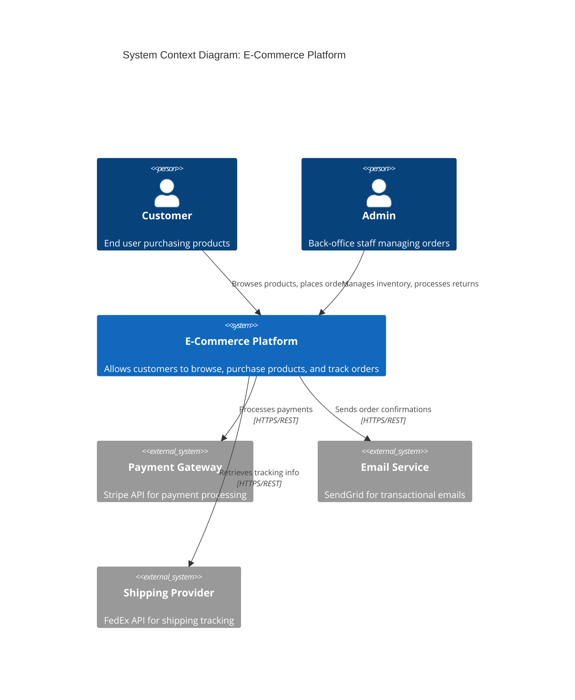
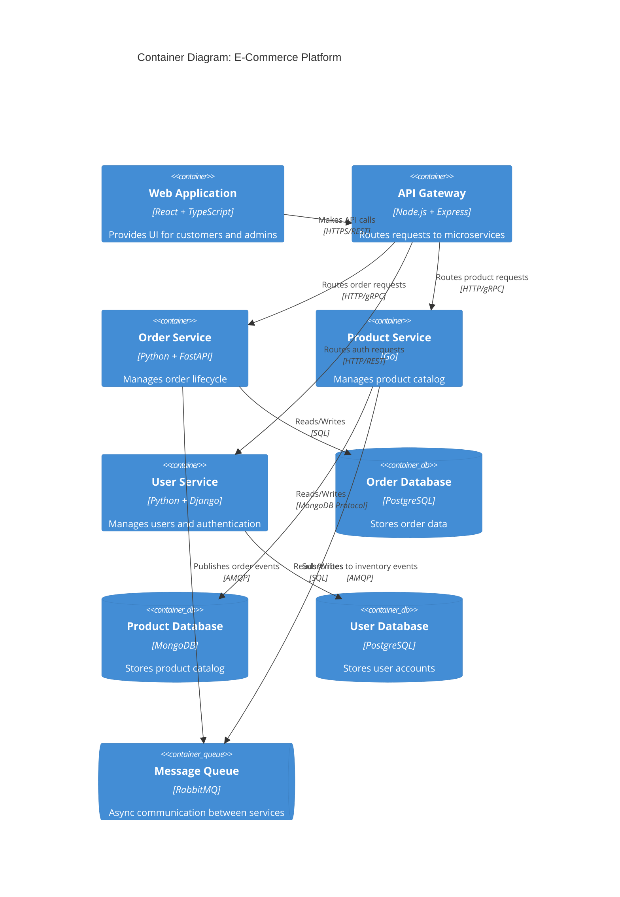

# Recommendations for raise.1.analyze.code Improvement

**Based on**: Brownfield Documentation for Agentic Development Research (RES-BFLD-AGENT-DOC-001)
**Date**: 2026-01-23
**Target**: raise.1.analyze.code command and SAR template system
**Prioritization Framework**: Impact (High/Medium/Low) × Effort (Low/Medium/High) × Alignment with RaiSE principles

---

## Decision Matrix Overview

### Quick Wins (High Impact, Low Effort)

| ID | Recommendation | Impact | Effort | Priority | Timeline |
|----|----------------|--------|--------|----------|----------|
| REC-001 | Add machine-readable YAML frontmatter to SAR reports | High | Low | P0 | Week 1 |
| REC-002 | Generate `.cursorrules` output from SAR analysis | High | Low | P0 | Week 1-2 |
| REC-003 | Create multi-language pattern abstraction guide | High | Low | P0 | Week 1-2 |
| REC-004 | Add "AI Consumption Guide" section to each SAR | Medium | Low | P1 | Week 2 |

### Strategic Improvements (High Impact, High Effort)

| ID | Recommendation | Impact | Effort | Priority | Timeline |
|----|----------------|--------|--------|----------|----------|
| REC-010 | Implement AST-based code chunking for RAG optimization | High | High | P1 | Q1 2026 (3-4 weeks) |
| REC-011 | Build incremental update mechanism with change detection | High | High | P1 | Q1 2026 (2-3 weeks) |
| REC-012 | Extract and document pattern catalog from codebase | High | Medium | P1 | Q1 2026 (2 weeks) |
| REC-013 | Generate C4 model diagrams from architecture SAR | High | Medium | P1 | Q1 2026 (2 weeks) |
| REC-014 | Integrate CI/CD validation gates for SAR quality | Medium | Medium | P2 | Q2 2026 (1-2 weeks) |

### Experimental Additions (Uncertain Impact, Low-Medium Effort)

| ID | Recommendation | Potential Impact | Effort | Priority | Validation Needed |
|----|----------------|------------------|--------|----------|-------------------|
| REC-020 | Generate Neo4j knowledge graph from SAR findings | Medium-High | Medium | P2 | Pilot study (1-2 week POC) |
| REC-021 | Build agentic RAG for intelligent SAR querying | Medium-High | High | P3 | Pilot study (2-3 week POC) |
| REC-022 | Create living dashboard with trend analysis | Medium | High | P3 | MVP validation (3-4 weeks) |
| REC-023 | Auto-generate draft ADRs from detected decisions | Medium | Medium | P2 | Pilot study (1-2 weeks) |

---

## Quick Wins (Immediate Implementation)

### REC-001: Add Machine-Readable YAML Frontmatter to SAR Reports

#### Current State
SAR reports are pure Markdown designed for human consumption. AI agents must parse full text to extract key findings, which is inefficient and error-prone.

#### Proposed State
Add YAML frontmatter to each SAR template with structured metadata.

**Example (Code Quality SAR)**:
```yaml
---
report_type: codigo_limpio
generated_date: 2026-01-23T14:32:00Z
codebase_version: main@abc123def
analyzer_version: raise-1.3.0
language_primary: python
languages_detected:
  - python: 78%
  - javascript: 15%
  - yaml: 5%
  - other: 2%
metrics:
  total_violations: 42
  critical_count: 7
  high_count: 18
  medium_count: 12
  low_count: 5
  files_analyzed: 234
  loc_total: 45678
  technical_debt_hours: 156
patterns_detected:
  - repository_pattern
  - factory_pattern
  - dependency_injection
anti_patterns_detected:
  god_class: 3
  long_method: 12
  duplicate_code: 8
top_issues:
  - issue: "God class: OrderService (2,345 LOC)"
    severity: critical
    file: "src/services/order_service.py"
  - issue: "Cyclomatic complexity 47 in calculate_discount()"
    severity: high
    file: "src/business/discount_calculator.py"
tags:
  - technical_debt
  - refactoring_needed
  - design_patterns
related_reports:
  - architecture
  - testing
---
```

#### Benefits
1. **AI Agents**: Parse key findings without full text analysis
2. **Tracking**: Monitor metrics over time (trend analysis)
3. **Querying**: Filter reports by severity, language, patterns
4. **Integration**: CI/CD can programmatically check thresholds (e.g., fail if critical_count > 10)
5. **RAG Optimization**: Metadata becomes part of vector embedding context

#### Implementation Steps

**Step 1**: Update SAR Templates (1 day)
- Add frontmatter section to each of 7 SAR templates
- Define standard fields (common across all reports)
- Define report-specific fields (e.g., `coverage_percentage` for testing SAR)

**Step 2**: Modify raise.1.analyze.code Command (1 day)
- Update analysis logic to populate metadata
- Extract metrics from analysis results
- Format as YAML frontmatter

**Step 3**: Create Validation Script (0.5 days)
- Python script to validate frontmatter completeness
- Check required fields present
- Validate data types (e.g., dates are ISO 8601)
- Run as pre-commit hook or CI check

**Step 4**: Update Documentation (0.5 days)
- Document metadata schema
- Provide examples for each SAR type
- Add "AI Consumption Guide" explaining how agents should use metadata

**Total Effort**: 3 days
**Risk**: Very Low (additive change, doesn't break existing)

#### Evidence Source
- GitHub Copilot custom instructions using YAML frontmatter
- Cursor `.cursorrules` metadata patterns
- MADR ADR template with frontmatter
- Industry standard across documentation tools (Jekyll, Hugo, etc.)

---

### REC-002: Generate `.cursorrules` Output from SAR Analysis

#### Current State
SAR reports contain valuable architectural and pattern information, but it's locked in narrative format. Developers must manually extract rules for AI coding assistants.

#### Proposed State
Auto-generate `.cursorrules` (and optionally `.github/copilot-instructions.md`) file from SAR analysis, capturing:
- Detected patterns (to follow)
- Detected anti-patterns (to avoid)
- Architectural constraints
- Code conventions
- Language-specific best practices

**Example Output**:
```markdown
# Project Coding Rules (Generated from RaiSE SAR Analysis)

## Architecture Patterns

### Repository Pattern (Detected in 87% of data access code)
- **When to use**: All database interactions
- **Implementation**: See `src/repositories/base_repository.py` for reference
- **Anti-pattern to avoid**: Direct SQL in business logic layers

### Dependency Injection (Detected in 92% of service classes)
- **When to use**: Service initialization
- **Implementation**: Constructor injection via `__init__`
- **Anti-pattern to avoid**: Singleton pattern for stateful services

## Code Quality Standards

### Complexity Thresholds
- **Max cyclomatic complexity**: 10 (current violations: 12 methods exceed this)
- **Max method lines**: 50 (current violations: 23 methods exceed this)
- **Max class lines**: 300 (current violations: 3 classes exceed this - see refactoring plan)

### Naming Conventions
- **Classes**: PascalCase (e.g., `OrderService`, `UserRepository`)
- **Functions/Methods**: snake_case (e.g., `calculate_discount`, `get_user_by_id`)
- **Constants**: UPPER_SNAKE_CASE (e.g., `MAX_RETRY_ATTEMPTS`)

## Testing Requirements
- **Minimum coverage**: 80% (current: 67% - improvement needed)
- **Test structure**: AAA pattern (Arrange, Act, Assert)
- **Mocking**: Use `unittest.mock` for external dependencies

## Security Constraints
- **Authentication**: JWT tokens validated at middleware layer
- **Data sanitization**: All user input must pass through `sanitize_input()` before processing
- **Secrets management**: Use environment variables, never hardcode (current violations: 2 instances in legacy code)

## Anti-Patterns Detected (Avoid These)
- **God classes**: `OrderService` (2,345 LOC) - scheduled for refactoring Q1 2026
- **Long methods**: `calculate_discount()` (247 LOC, cyclomatic complexity 47) - refactor into smaller functions
- **Duplicate code**: Discount calculation logic duplicated in 3 files - consolidate into `DiscountCalculator`

## Language-Specific (Python)
- **Type hints**: Required for all function signatures
- **Docstrings**: Required for public methods (Google style)
- **Async/await**: Use for all I/O operations (database, API calls)

---
*Auto-generated by RaiSE raise.1.analyze.code*
*Last updated: 2026-01-23T14:32:00Z*
*Codebase version: main@abc123def*
```

#### Benefits
1. **Immediate AI Alignment**: Cursor, GitHub Copilot consume rules automatically
2. **Team Consistency**: All developers (human + AI) follow same standards
3. **Living Documentation**: Regenerates with SAR, always current
4. **Cross-Tool Support**: Compatible with multiple AI coding assistants
5. **Onboarding**: New team members reference `.cursorrules` for project norms

#### Implementation Steps

**Step 1**: Design Output Template (0.5 days)
- Structure based on awesome-cursorrules examples
- Sections: Architecture, Patterns, Anti-Patterns, Quality Standards, Security, Testing
- Markdown format with code examples

**Step 2**: Build Extraction Logic (1.5 days)
- Parse SAR reports for patterns, anti-patterns, constraints
- Extract code quality metrics (complexity thresholds, coverage)
- Identify naming conventions from code analysis
- Format as `.cursorrules` structure

**Step 3**: Add to raise.1.analyze.code Output (0.5 days)
- Generate `.cursorrules` file in project root
- Optionally generate `.github/copilot-instructions.md` (same content, different path)
- Include timestamp and version info

**Step 4**: Create Validation & Update Workflow (0.5 days)
- Human review step before committing
- Flag for changes since last generation (diff highlighting)
- Git pre-commit hook to validate format

**Total Effort**: 3 days
**Risk**: Low (new output file, doesn't modify existing)

#### Evidence Source
- PatrickJS/awesome-cursorrules (13k+ stars)
- tugkanboz/awesome-cursorrules
- SlyyCooper/cursorrules-architect (AI-powered generation)
- GitHub awesome-copilot repository

---

### REC-003: Create Multi-Language Pattern Abstraction Guide

#### Current State
SAR templates have .NET bias (Repository pattern examples in C#, NuGet dependencies, etc.). Limits effectiveness for Python, JavaScript, Go, Rust, Java projects.

#### Proposed State
Refactor SAR templates to use language-agnostic pattern descriptions with language-specific mappings.

**Example (Repository Pattern)**:

```markdown
## Repository Pattern

### Generic Description (Language-Agnostic)
Abstracts data access logic behind an interface, providing a collection-like API for domain objects.

**Key Characteristics**:
- Encapsulates query logic (single source of truth for data access)
- Returns domain entities (not DTOs or raw DB records)
- Provides CRUD operations per aggregate root
- Supports unit testing via mocking

### Implementation Guidance by Language

#### Python
```python
from abc import ABC, abstractmethod
from typing import List, Optional

class Repository(ABC):
    @abstractmethod
    def get_by_id(self, id: int) -> Optional[Entity]:
        pass

    @abstractmethod
    def get_all(self) -> List[Entity]:
        pass

    @abstractmethod
    def save(self, entity: Entity) -> Entity:
        pass

    @abstractmethod
    def delete(self, id: int) -> None:
        pass

class UserRepository(Repository):
    def __init__(self, db_session):
        self.db = db_session

    def get_by_id(self, id: int) -> Optional[User]:
        return self.db.query(User).filter_by(id=id).first()
    # ... other methods
```

**Common Libraries**: SQLAlchemy (ORM), Pydantic (validation)

#### JavaScript/TypeScript
```typescript
interface Repository<T> {
  getById(id: string): Promise<T | null>;
  getAll(): Promise<T[]>;
  save(entity: T): Promise<T>;
  delete(id: string): Promise<void>;
}

class UserRepository implements Repository<User> {
  constructor(private db: Database) {}

  async getById(id: string): Promise<User | null> {
    return this.db.users.findOne({ id });
  }
  // ... other methods
}
```

**Common Libraries**: TypeORM, Prisma, Mongoose (MongoDB)

#### Go
```go
type Repository[T any] interface {
    GetByID(id int) (T, error)
    GetAll() ([]T, error)
    Save(entity T) (T, error)
    Delete(id int) error
}

type UserRepository struct {
    db *sql.DB
}

func (r *UserRepository) GetByID(id int) (User, error) {
    var user User
    err := r.db.QueryRow("SELECT * FROM users WHERE id = $1", id).Scan(&user)
    return user, err
}
// ... other methods
```

**Common Libraries**: GORM, sqlx

#### Java
```java
public interface Repository<T, ID> {
    Optional<T> findById(ID id);
    List<T> findAll();
    T save(T entity);
    void deleteById(ID id);
}

@Repository
public class UserRepository implements Repository<User, Long> {
    @Autowired
    private JpaRepository<User, Long> jpaRepository;

    @Override
    public Optional<User> findById(Long id) {
        return jpaRepository.findById(id);
    }
    // ... other methods
}
```

**Common Libraries**: Spring Data JPA, Hibernate

### Detection Heuristics (for SAR Analysis)

To identify Repository pattern in codebase:

**Python**:
- Classes named `*Repository`
- Methods: `get_by_id`, `save`, `delete`, `find_*`
- Imports: SQLAlchemy `Session`, Django `models`

**JavaScript/TypeScript**:
- Classes implementing `Repository<T>` interface
- Async methods returning `Promise<T>`
- Imports: TypeORM `Repository`, Prisma `PrismaClient`

**Go**:
- Interfaces with CRUD methods
- Struct with `*sql.DB` or `*gorm.DB` field
- Methods: `GetByID`, `Save`, `Delete`

**Java**:
- Classes extending Spring `JpaRepository` or custom `Repository<T, ID>`
- Annotations: `@Repository`, `@Autowired`

### Anti-Pattern Indicators
- Direct SQL/ORM queries in controller/handler layers
- Business logic in repository methods (should be in service/domain layer)
- Repositories returning DTOs instead of domain entities
```

#### Benefits
1. **Multi-Stack Support**: Works for Python, JavaScript, Go, Rust, Java, C# projects
2. **Pattern Recognition**: AI agents learn patterns across languages
3. **Developer Onboarding**: Reference implementations for each language
4. **Consistency**: Same architectural principles, different syntax

#### Implementation Steps

**Step 1**: Identify Core Patterns (1 day)
- Repository, Factory, Singleton, Dependency Injection, CQRS, Event Sourcing
- Document generic characteristics (language-agnostic)
- Define detection heuristics per language

**Step 2**: Create Language Mappings (2 days)
- Write implementation examples for Python, JavaScript/TypeScript, Go, Java
- Document common libraries/frameworks per language
- Add "how to detect" logic for SAR analysis

**Step 3**: Update SAR Templates (1.5 days)
- Replace .NET-specific examples with multi-language sections
- Add language detection logic to analyzer
- Generate language-specific recommendations in reports

**Step 4**: Build Pattern Library (0.5 days)
- Separate markdown files per pattern (e.g., `docs/patterns/repository.md`)
- Referenced by SAR templates
- Versioned and maintained independently

**Total Effort**: 5 days
**Risk**: Low (improves existing, doesn't break)

#### Evidence Source
- Cursor rules for multiple languages (awesome-cursorrules repository)
- GitHub Copilot language-specific instructions
- Polyglot support in Zencoder AI, Qodo, Augment Code
- Industry shift toward multi-language repositories (microservices, polyglot architectures)

---

### REC-004: Add "AI Consumption Guide" Section to Each SAR

#### Current State
SAR reports are designed for human readers. No guidance on how AI agents should consume or query the information.

#### Proposed State
Add dedicated "AI Consumption Guide" section to each SAR template explaining optimal usage patterns for AI coding assistants.

**Example (Architecture SAR)**:

```markdown
## AI Consumption Guide

### For AI Coding Assistants (Cursor, GitHub Copilot, etc.)

**When generating code**:
1. **Check this SAR first** for architectural constraints and service boundaries
2. **Respect component boundaries**: Do not add database access to `controllers/` (see Component Boundaries section)
3. **Follow communication patterns**: Use asynchronous messaging for inter-service communication (see Integration Patterns section)
4. **Reference existing services**: Before creating new service, check Service Inventory section for existing functionality

**Key Sections to Reference**:
- **Component Boundaries** → Determines where new code should be placed
- **Design Patterns** → Use established patterns for consistency
- **Integration Patterns** → How services communicate
- **Data Ownership** → Which service owns which entities

**What This SAR Does NOT Cover**:
- Code-level implementation details (see Code Quality SAR)
- Testing strategies (see Testing SAR)
- Security constraints (see Security SAR)

### For RAG-Based Systems

**Embedding Strategy**:
- Embed full "Component Boundaries" section as single chunk (semantic coherence)
- Embed each "Service Description" separately with tags: `[service_name, responsibilities, technologies]`
- Embed "Design Patterns" with pattern name as metadata: `[pattern: repository, pattern: cqrs]`

**Query Patterns**:
- "Where should I add authentication logic?" → Retrieve "Component Boundaries" + "Security Constraints"
- "How do services communicate?" → Retrieve "Integration Patterns" section
- "What patterns are used for data access?" → Retrieve "Design Patterns" filtered by tag `data-access`

**Metadata for Filtering**:
```yaml
sections:
  - name: "Component Boundaries"
    tags: [architecture, boundaries, constraints]
    priority: high
  - name: "Service Inventory"
    tags: [services, microservices, inventory]
    priority: medium
  - name: "Design Patterns"
    tags: [patterns, best-practices]
    priority: high
```

### For Multi-Agent Systems

**Agent Roles**:
- **Architecture Agent**: Consumes this entire SAR for high-level decisions
- **Implementation Agent**: Queries specific sections (Component Boundaries, Design Patterns)
- **Review Agent**: Validates new code against constraints in this SAR

**Recommended Workflow**:
1. Architecture Agent reads full SAR on project initialization
2. Implementation Agent queries relevant sections during coding
3. Review Agent checks new code against "Constraints" and "Anti-Patterns" sections
```

#### Benefits
1. **Explicitness**: AI agents know exactly how to use the SAR
2. **Efficiency**: Targeted retrieval vs. full-text search
3. **Multi-Agent Orchestration**: Clear role definitions
4. **RAG Optimization**: Embedding and querying strategies defined
5. **Developer Understanding**: Human developers also benefit from structured guidance

#### Implementation Steps

**Step 1**: Design Template Section (0.5 days)
- Standard structure across all 7 SARs
- Subsections: For AI Assistants, For RAG Systems, For Multi-Agent Systems
- Markdown format with examples

**Step 2**: Add to Each SAR Template (1 day)
- Customize per SAR type (architecture, code quality, testing, etc.)
- Define key sections to reference
- Specify embedding strategies
- Document query patterns

**Step 3**: Create Metadata Schema (0.5 days)
- YAML schema for section tagging
- Priority levels (high, medium, low)
- Tag taxonomy (architecture, patterns, constraints, metrics, etc.)

**Step 4**: Update raise.1.analyze.code Documentation (0.5 days)
- Explain AI Consumption Guide purpose
- Provide examples of AI agent usage
- Link to best practices

**Total Effort**: 2.5 days
**Risk**: Very Low (additive, informational)

#### Evidence Source
- Anthropic Claude Code best practices (explicit AI guidance)
- Microsoft Semantic Kernel documentation (agent consumption patterns)
- RAG implementation guides (embedding strategies)
- Multi-agent architecture patterns (agent role definitions)

---

## Strategic Improvements (High Impact, High Effort)

### REC-010: Implement AST-Based Code Chunking for RAG Optimization

#### Current State
SAR reports are Markdown documents. If embedded for RAG, naive chunking (e.g., every 500 tokens) breaks semantic coherence. Code examples split mid-function, context lost.

#### Proposed State
Integrate Abstract Syntax Tree (AST) parsing to chunk code at semantic boundaries (functions, classes, modules) for optimal RAG retrieval.

**Architecture**:

```
Codebase → tree-sitter (AST parsing) → Semantic Chunks → Embedding Model → Vector DB
                                                          (CodeT5, Voyage-3)   (Qdrant, FAISS)
```

**Chunk Structure Example**:

```json
{
  "chunk_id": "chunk_001",
  "type": "function",
  "language": "python",
  "file_path": "src/services/order_service.py",
  "code": "def calculate_discount(order: Order, user: User) -> Decimal:\n    \"\"\"Calculate discount based on user tier and order total.\"\"\"\n    ...",
  "context": {
    "class_name": "OrderService",
    "imports": ["from decimal import Decimal", "from models.order import Order"],
    "dependencies": ["UserService", "DiscountCalculator"]
  },
  "metadata": {
    "complexity": 12,
    "lines_of_code": 47,
    "patterns": ["repository"],
    "issues": ["high_complexity"]
  },
  "embedding": [0.123, -0.456, ...],  // Vector embedding
  "related_chunks": ["chunk_002", "chunk_015"]  // Calls/called-by relationships
}
```

#### Implementation Approach

**Phase 1: AST Parsing Integration (Week 1)**

**Technology**: tree-sitter (battle-tested, powers Neovim/Helix/Zed syntax highlighting)

**Supported Languages**: Python, JavaScript, TypeScript, Go, Rust, Java, C#, C++, Ruby

**Chunk Boundaries**:
- **Functions/Methods**: Full signature + body + docstring
- **Classes**: Class definition + all methods (or split if >500 LOC)
- **Modules**: Top-level imports + file-level docstring + public API

**Include Context**:
- Class definition (if method)
- Relevant imports
- Parent class (if inheritance)
- Called functions (if resolvable)

**Code** (Python example using tree-sitter):

```python
import tree_sitter
from tree_sitter_languages import get_parser

def chunk_python_code(file_path: str) -> List[CodeChunk]:
    parser = get_parser("python")
    with open(file_path, 'r') as f:
        code = f.read()

    tree = parser.parse(bytes(code, "utf8"))

    chunks = []
    for node in tree.root_node.children:
        if node.type == "function_definition":
            chunk = extract_function_chunk(node, code)
            chunks.append(chunk)
        elif node.type == "class_definition":
            chunk = extract_class_chunk(node, code)
            chunks.append(chunk)

    return chunks

def extract_function_chunk(node, code: str) -> CodeChunk:
    # Extract function name, signature, body, docstring
    # Add imports and class context if inside class
    # Return CodeChunk object
    ...
```

**Phase 2: Embedding Generation (Week 2)**

**Embedding Models** (in priority order):

1. **Voyage-3-large** (if budget allows): Best performance in benchmarks
2. **CodeT5** (open-source): Identifier-aware, SOTA on code tasks
3. **Nomic-embed-code**: Code-tuned, strong for function/class retrieval
4. **OpenAI text-embedding-3-large**: General-purpose fallback

**Embedding Strategy**:

```python
from sentence_transformers import SentenceTransformer

model = SentenceTransformer('sentence-transformers/CodeT5')  # Example

def embed_chunk(chunk: CodeChunk) -> List[float]:
    # Combine code + context for richer embedding
    text = f"""
    File: {chunk.file_path}
    Function: {chunk.name}
    Docstring: {chunk.docstring}
    Code:
    {chunk.code}
    """

    embedding = model.encode(text)
    return embedding.tolist()
```

**Phase 3: Vector Database Storage (Week 2)**

**Technology**: Qdrant (recommended) or FAISS (local-first)

**Schema**:

```python
from qdrant_client import QdrantClient
from qdrant_client.models import PointStruct, VectorParams

client = QdrantClient(path="./qdrant_data")  # Local storage

# Create collection
client.create_collection(
    collection_name="codebase_chunks",
    vectors_config=VectorParams(size=768, distance="Cosine")  # CodeT5 dimension
)

# Insert chunks
points = [
    PointStruct(
        id=chunk.id,
        vector=chunk.embedding,
        payload={
            "file_path": chunk.file_path,
            "type": chunk.type,
            "language": chunk.language,
            "code": chunk.code,
            "metadata": chunk.metadata
        }
    )
    for chunk in chunks
]

client.upsert(collection_name="codebase_chunks", points=points)
```

**Phase 4: Retrieval Integration (Week 3)**

**Query Pattern**:

```python
def retrieve_relevant_chunks(query: str, top_k: int = 5) -> List[CodeChunk]:
    # Embed query
    query_embedding = model.encode(query)

    # Search vector DB
    results = client.search(
        collection_name="codebase_chunks",
        query_vector=query_embedding,
        limit=top_k,
        score_threshold=0.7  # Cosine similarity threshold
    )

    # Return chunks
    return [CodeChunk.from_payload(hit.payload) for hit in results]
```

**Example Use Case**:

```python
# AI agent query: "How is user authentication implemented?"
relevant_chunks = retrieve_relevant_chunks("user authentication implementation")

# Results:
# 1. src/middleware/auth.py::authenticate_user() [similarity: 0.92]
# 2. src/services/user_service.py::verify_credentials() [similarity: 0.87]
# 3. src/models/user.py::User.check_password() [similarity: 0.81]
# 4. config/security.py::JWT_CONFIG [similarity: 0.78]
# 5. tests/test_auth.py::test_login_success() [similarity: 0.75]

# Agent now has targeted context for generating authentication code
```

**Phase 5: Integration with raise.1.analyze.code (Week 4)**

**Workflow**:

1. `raise.1.analyze.code` runs codebase analysis
2. For each file analyzed, parse with tree-sitter → generate chunks
3. Embed chunks with CodeT5 (or selected model)
4. Store in Qdrant/FAISS
5. Generate SAR reports with chunk metadata
6. Optionally: Export vector DB for reuse by AI assistants

**Output**:

```
specs/main/
├── sar_arquitectura.md
├── sar_codigo_limpio.md
├── ...
└── vector_db/
    ├── qdrant_data/           # Vector database
    └── chunks_metadata.json   # Chunk inventory with IDs, file paths, types
```

#### Benefits
1. **4.3-point improvement in Recall@5** (cAST framework benchmark)
2. **2.67-point improvement in Pass@1** (SWE-bench generation)
3. **Semantic coherence**: Chunks respect code structure (vs. arbitrary splits)
4. **Targeted retrieval**: AI gets exactly relevant code, not noise
5. **Multi-language**: tree-sitter supports 40+ languages

#### Implementation Steps (Detailed)

**Week 1: AST Parsing**
- Day 1-2: Integrate tree-sitter library, test on Python/JavaScript
- Day 3: Implement chunk extraction logic (functions, classes, modules)
- Day 4: Add context enrichment (imports, class definitions, dependencies)
- Day 5: Test on real codebases (Python, JavaScript, Go samples)

**Week 2: Embedding & Storage**
- Day 1: Select and integrate embedding model (CodeT5 recommended)
- Day 2: Implement embedding generation pipeline
- Day 3: Set up Qdrant/FAISS vector database
- Day 4: Implement storage logic (chunking → embedding → DB)
- Day 5: Test retrieval quality (sample queries, measure precision/recall)

**Week 3: Retrieval & Optimization**
- Day 1-2: Implement hybrid retrieval (BM25 + vector search)
- Day 3: Add metadata filtering (by language, file path, pattern tags)
- Day 4: Optimize performance (batch embedding, parallel processing)
- Day 5: Benchmark against naive chunking (measure improvement)

**Week 4: Integration & Documentation**
- Day 1-2: Integrate into raise.1.analyze.code workflow
- Day 3: Generate chunk metadata in SAR reports
- Day 4: Write documentation (how to use vector DB, query examples)
- Day 5: Create demo/tutorial (onboarding for developers)

**Total Effort**: 3-4 weeks (1 developer full-time)
**Risk**: Medium (new dependency, complexity), Mitigated by: phased rollout, extensive testing

#### Evidence Source
- cAST framework (EMNLP 2025): [arXiv:2506.15655](https://arxiv.org/abs/2506.15655)
- tree-sitter documentation and adoption (Neovim, Helix, Zed editors)
- CodeT5, Voyage-3, Nomic-embed-code benchmarks
- Qdrant case studies (code search, RAG applications)
- Industry practice: Cursor, Sourcegraph Cody, GitHub Copilot all use AST-based indexing

---

### REC-011: Build Incremental Update Mechanism with Change Detection

#### Current State
SAR reports require full codebase re-analysis. Expensive for large codebases (hours), no visibility into what changed since last analysis.

#### Proposed State
Implement incremental update mechanism:
1. **Change Detection**: Identify files modified since last analysis
2. **Delta Analysis**: Analyze only changed files + dependents
3. **Diff Reporting**: Generate "What Changed" report highlighting new issues, resolved issues, metric trends
4. **Scheduled Sync**: Weekly/monthly full re-analysis with daily delta checks

**Architecture**:

```
Codebase → Git Diff → Changed Files → Selective Analysis → Delta SAR Report
              ↓
         File Hashes → Compare with Last Run → Analyze Only Changed
```

**Example Delta Report**:

```markdown
# SAR Delta Report: Code Quality
**Analysis Date**: 2026-01-30T10:15:00Z
**Previous Analysis**: 2026-01-23T14:32:00Z
**Time Delta**: 7 days
**Codebase Version**: main@xyz789abc (was main@abc123def)

## Summary of Changes

| Metric | Previous | Current | Change | Trend |
|--------|----------|---------|--------|-------|
| **Total Violations** | 42 | 38 | -4 | ✓ Improved |
| **Critical Count** | 7 | 5 | -2 | ✓ Improved |
| **High Count** | 18 | 19 | +1 | ✗ Regressed |
| **Technical Debt (hours)** | 156 | 142 | -14 | ✓ Improved |
| **Test Coverage** | 67% | 71% | +4% | ✓ Improved |

## Files Changed
- 23 files modified
- 5 files added
- 2 files deleted

## New Issues Introduced
1. **High Severity**: Cyclomatic complexity 23 in `src/services/payment_service.py::process_refund()`
   - **Introduced in**: commit `xyz789abc` by @developer_jane
   - **Recommendation**: Refactor into smaller methods

2. **Medium Severity**: Duplicate code in `src/utils/validation.py` and `src/api/validators.py`
   - **Introduced in**: commit `abc456def` by @developer_john
   - **Recommendation**: Extract to shared `common_validators.py`

## Issues Resolved ✓
1. **Critical**: God class `OrderService` refactored into 3 smaller services
   - **Resolved in**: commits `def123ghi`, `ghi456jkl`
   - **Lines reduced**: 2,345 → 687 (OrderService), 456 (OrderValidationService), 398 (OrderNotificationService)

2. **High**: Long method `calculate_discount()` split into sub-methods
   - **Resolved in**: commit `jkl789mno`
   - **Complexity reduced**: 47 → 12

## Pattern Changes
- **Newly Detected**: Factory pattern in `src/factories/` (3 implementations)
- **No longer detected**: Singleton pattern (replaced with dependency injection)

## Recommendations
- **Priority**: Address new high-severity complexity issue in `payment_service.py`
- **Quick Win**: Consolidate duplicate validation logic (estimated 2 hours)
- **Celebrate**: Excellent refactoring of OrderService! 🎉
```

#### Implementation Approach

**Phase 1: Change Detection (Week 1)**

**Option A: Git-Based** (Recommended)

```python
import subprocess
from pathlib import Path
from typing import List

def get_changed_files(since_commit: str, current_commit: str) -> List[Path]:
    """Get list of files changed between two commits."""
    result = subprocess.run(
        ["git", "diff", "--name-only", since_commit, current_commit],
        capture_output=True,
        text=True
    )
    files = [Path(f) for f in result.stdout.strip().split('\n') if f]
    return files

def get_dependent_files(changed_files: List[Path], dependency_graph: dict) -> List[Path]:
    """Find files that depend on changed files (need re-analysis)."""
    dependents = set()
    for file in changed_files:
        # Traverse dependency graph to find reverse dependencies
        dependents.update(dependency_graph.get(file, []))
    return list(dependents)
```

**Option B: Hash-Based** (Fallback for non-Git repos)

```python
import hashlib
import json
from pathlib import Path

def compute_file_hash(file_path: Path) -> str:
    """Compute SHA256 hash of file content."""
    with open(file_path, 'rb') as f:
        return hashlib.sha256(f.read()).hexdigest()

def detect_changes(codebase_path: Path, hash_cache_path: Path) -> List[Path]:
    """Detect changed files by comparing hashes."""
    # Load previous hashes
    with open(hash_cache_path, 'r') as f:
        previous_hashes = json.load(f)

    # Compute current hashes
    current_hashes = {}
    changed_files = []

    for file_path in codebase_path.rglob("*.py"):  # Example: Python files
        current_hash = compute_file_hash(file_path)
        current_hashes[str(file_path)] = current_hash

        # Compare with previous
        if previous_hashes.get(str(file_path)) != current_hash:
            changed_files.append(file_path)

    # Save current hashes for next run
    with open(hash_cache_path, 'w') as f:
        json.dump(current_hashes, f, indent=2)

    return changed_files
```

**Phase 2: Selective Analysis (Week 1)**

```python
def run_incremental_analysis(
    codebase_path: Path,
    changed_files: List[Path],
    previous_sar: SARReport
) -> DeltaSARReport:
    """Run analysis only on changed files and their dependents."""

    # Analyze changed files
    new_issues = []
    for file in changed_files:
        issues = analyze_file(file)  # Existing analysis logic
        new_issues.extend(issues)

    # Compare with previous SAR
    resolved_issues = find_resolved_issues(previous_sar.issues, new_issues)
    new_issues_filtered = find_new_issues(previous_sar.issues, new_issues)

    # Compute metrics delta
    current_metrics = compute_metrics(new_issues)
    delta_metrics = compute_delta(previous_sar.metrics, current_metrics)

    # Generate delta report
    return DeltaSARReport(
        previous_date=previous_sar.generated_date,
        current_date=datetime.now(),
        changed_files=changed_files,
        new_issues=new_issues_filtered,
        resolved_issues=resolved_issues,
        metrics_delta=delta_metrics
    )
```

**Phase 3: Diff Reporting (Week 2)**

**Template**:

```python
def generate_delta_report_markdown(delta: DeltaSARReport) -> str:
    """Generate Markdown delta report."""

    return f"""
# SAR Delta Report: Code Quality
**Analysis Date**: {delta.current_date.isoformat()}
**Previous Analysis**: {delta.previous_date.isoformat()}
**Time Delta**: {(delta.current_date - delta.previous_date).days} days

## Summary of Changes
{generate_metrics_table(delta.metrics_delta)}

## Files Changed
- {len(delta.changed_files)} files modified

## New Issues Introduced
{generate_issues_list(delta.new_issues)}

## Issues Resolved ✓
{generate_issues_list(delta.resolved_issues)}

## Recommendations
{generate_recommendations(delta)}
"""
```

**Phase 4: Scheduled Sync (Week 2)**

**CI/CD Integration** (GitHub Actions example):

```yaml
name: SAR Incremental Analysis

on:
  push:
    branches: [main]
  schedule:
    - cron: '0 2 * * 1'  # Weekly full analysis (Monday 2 AM)

jobs:
  sar-analysis:
    runs-on: ubuntu-latest
    steps:
      - uses: actions/checkout@v3
        with:
          fetch-depth: 0  # Full history for git diff

      - name: Load Previous SAR
        run: |
          # Download last SAR from artifact storage
          gh run download --name sar-reports

      - name: Run Incremental Analysis
        run: |
          python -m raise_cli analyze-code \
            --mode incremental \
            --previous-commit ${{ github.event.before }} \
            --current-commit ${{ github.sha }}

      - name: Upload Delta Report
        uses: actions/upload-artifact@v3
        with:
          name: sar-delta-report
          path: specs/main/sar_delta_*.md

      - name: Comment on PR (if triggered by PR)
        if: github.event_name == 'pull_request'
        run: |
          # Post delta report as PR comment
          gh pr comment ${{ github.event.number }} --body-file specs/main/sar_delta_summary.md
```

#### Benefits
1. **Performance**: 10-100x faster for large codebases (analyze only changed files)
2. **Visibility**: Clear view of progress/regressions between analyses
3. **Continuous Monitoring**: Daily delta checks vs. monthly full re-analysis
4. **PR Integration**: Delta report posted as PR comment (early feedback)
5. **Trend Analysis**: Historical metrics enable data-driven decisions

#### Implementation Steps (Detailed)

**Week 1: Change Detection & Selective Analysis**
- Day 1: Implement Git-based change detection
- Day 2: Implement hash-based fallback (non-Git repos)
- Day 3: Build dependency graph (file import analysis)
- Day 4: Implement selective analysis logic
- Day 5: Test on real codebases (validate correctness)

**Week 2: Diff Reporting & CI/CD**
- Day 1: Design delta report template (Markdown format)
- Day 2: Implement metrics delta computation
- Day 3: Implement issue comparison (new/resolved)
- Day 4: Create CI/CD workflow (GitHub Actions example)
- Day 5: Test end-to-end (simulate weekly analysis + daily deltas)

**Week 3: Optimization & Documentation**
- Day 1-2: Optimize performance (parallel analysis, caching)
- Day 3: Add configuration options (schedule, thresholds, notifications)
- Day 4: Write documentation (setup guide, CI/CD templates)
- Day 5: Create demo (show before/after, metrics over time)

**Total Effort**: 2-3 weeks (1 developer full-time)
**Risk**: Medium (Git dependency, state management), Mitigated by: hash-based fallback, extensive testing

#### Evidence Source
- CodeSee auto-update mechanism (continuous map regeneration)
- Google Code Wiki (regenerate after every commit)
- DeepDocs staleness detection (content hashing)
- PRD Machine (transforms repository signals into living PRD)
- SonarQube incremental analysis (analyze only changed files)

---

### REC-012: Extract and Document Pattern Catalog from Codebase

#### Current State
SAR reports mention design patterns implicitly (e.g., "Repository pattern detected"). No structured catalog of approved patterns vs. anti-patterns, no code examples from actual codebase.

#### Proposed State
Auto-generate pattern catalog from SAR analysis with:
1. **Detected Patterns**: Repository, Factory, Singleton, etc. with example locations
2. **Approved Patterns**: Documented with usage guidelines and reference implementations
3. **Anti-Patterns**: Detected violations with refactoring guidance
4. **Pattern Health**: Metrics on pattern consistency (% of code following pattern)

**Output Example**:

```markdown
# Pattern Catalog: MyProject Codebase

**Generated**: 2026-01-23T14:32:00Z
**Codebase Version**: main@abc123def

---

## Approved Patterns (Detected in Codebase)

### 1. Repository Pattern
**Prevalence**: 87% of data access code
**Status**: ✓ Consistently Applied

**What It Is**: Abstracts data access logic behind collection-like interface.

**When to Use**: All database interactions

**Reference Implementations**:
- `src/repositories/user_repository.py` (87 LOC, complexity 8, **exemplar**)
- `src/repositories/order_repository.py` (95 LOC, complexity 10)
- `src/repositories/product_repository.py` (76 LOC, complexity 6)

**Code Example** (from `user_repository.py`):
```python
class UserRepository(Repository[User]):
    def __init__(self, db_session: Session):
        self.db = db_session

    def get_by_id(self, user_id: int) -> Optional[User]:
        return self.db.query(User).filter_by(id=user_id).first()

    def get_by_email(self, email: str) -> Optional[User]:
        return self.db.query(User).filter_by(email=email).first()

    def save(self, user: User) -> User:
        self.db.add(user)
        self.db.commit()
        return user
```

**Anti-Pattern to Avoid**: Direct SQL in business logic
- ✗ Bad Example: `src/api/order_controller.py` line 45 (direct DB query in controller)

**Consistency Score**: 87% (13% violations in legacy code)

---

### 2. Dependency Injection
**Prevalence**: 92% of service classes
**Status**: ✓ Consistently Applied

**What It Is**: Dependencies passed via constructor, not instantiated internally.

**When to Use**: Service initialization, testing scenarios (enables mocking)

**Reference Implementations**:
- `src/services/order_service.py::__init__()` (**exemplar**)
- `src/services/payment_service.py::__init__()`
- `src/services/notification_service.py::__init__()`

**Code Example**:
```python
class OrderService:
    def __init__(
        self,
        order_repo: OrderRepository,
        payment_service: PaymentService,
        notification_service: NotificationService
    ):
        self.order_repo = order_repo
        self.payment_service = payment_service
        self.notification_service = notification_service
```

**Anti-Pattern to Avoid**: Singleton for stateful services
- ✗ Bad Example: `src/legacy/cache_manager.py` (Singleton with mutable state)

**Consistency Score**: 92% (8% violations in legacy code)

---

## Anti-Patterns Detected (Refactoring Needed)

### 1. God Class
**Instances**: 3
**Status**: ⚠ Refactoring In Progress

**What It Is**: Class with too many responsibilities (>300 LOC, >20 methods).

**Why It's Bad**: Hard to test, hard to understand, violates Single Responsibility Principle.

**Detected Instances**:
1. **OrderService** (2,345 LOC, 47 methods) - **REFACTORED** ✓
   - Split into: OrderService (687 LOC), OrderValidationService (456 LOC), OrderNotificationService (398 LOC)
   - Refactored in commits: `def123ghi`, `ghi456jkl`

2. **UserManagementService** (1,234 LOC, 32 methods) - **TODO**
   - Recommended split: UserService, UserAuthService, UserProfileService
   - Estimated effort: 3-5 days

3. **ReportGenerator** (987 LOC, 28 methods) - **TODO**
   - Recommended split: ReportBuilder, ReportFormatter, ReportExporter
   - Estimated effort: 2-3 days

**Refactoring Guide**: [Link to internal docs]

---

### 2. Long Method
**Instances**: 12
**Status**: ⚠ Partially Addressed

**What It Is**: Method with >50 LOC or cyclomatic complexity >10.

**Why It's Bad**: Hard to understand, hard to test, error-prone.

**Top Violations**:
1. `src/business/discount_calculator.py::calculate_discount()` (247 LOC, complexity 47) - **TODO**
   - Recommended: Extract sub-methods (calculate_tier_discount, calculate_promo_discount, apply_caps)
   - Estimated effort: 1 day

2. `src/api/order_controller.py::create_order()` (156 LOC, complexity 23) - **TODO**
   - Recommended: Move business logic to OrderService
   - Estimated effort: 0.5 days

3. `src/reports/sales_report.py::generate_monthly_report()` (134 LOC, complexity 19) - **TODO**
   - Recommended: Extract report sections into separate methods
   - Estimated effort: 0.5 days

---

## Pattern Health Dashboard

| Pattern | Consistency Score | Trend (vs. 1 month ago) | Status |
|---------|-------------------|-------------------------|--------|
| Repository | 87% | +12% | ✓ Improving |
| Dependency Injection | 92% | +5% | ✓ Improving |
| Factory | 78% | +3% | ✓ Improving |
| CQRS | 65% | 0% | ⚠ Stagnant |
| Event Sourcing | 45% | -2% | ✗ Declining |

**Recommendations**:
- **Celebrate**: Repository and DI patterns showing strong improvement!
- **Focus Area**: Increase CQRS adoption in write-heavy modules (OrderService, PaymentService)
- **Investigate**: Event Sourcing decline - audit recent changes to audit trail implementation

---

## Usage Guide for AI Coding Assistants

When generating new code:
1. **Follow Repository pattern** for all data access (see examples above)
2. **Use Dependency Injection** for service dependencies (constructor injection)
3. **Avoid God classes** - keep classes under 300 LOC, max 15-20 methods
4. **Avoid Long methods** - keep methods under 50 LOC, complexity under 10

**Quick Reference**:
- Data access → Use Repository (example: `user_repository.py`)
- Service creation → Use DI (example: `order_service.py::__init__()`)
- Complex business logic → Extract to service method (example: `discount_calculator.py`)
```

#### Benefits
1. **Living Style Guide**: Always current, generated from actual code
2. **AI Alignment**: Explicit patterns for AI assistants to follow
3. **Onboarding**: New developers see real examples from codebase
4. **Consistency**: Track pattern adoption over time
5. **Refactoring Roadmap**: Clear priorities based on violations

#### Implementation Steps (Detailed)

**Week 1: Pattern Detection**
- Day 1-2: Implement pattern detection heuristics (Repository, Factory, DI, etc.)
- Day 3: Add anti-pattern detection (God class, Long method, Duplicate code)
- Day 4: Extract code examples from detected patterns
- Day 5: Compute consistency scores (% of code following pattern)

**Week 2: Catalog Generation & Integration**
- Day 1-2: Design catalog template (Markdown structure)
- Day 3: Implement catalog generation logic
- Day 4: Integrate into raise.1.analyze.code workflow
- Day 5: Test on real codebases, validate accuracy

**Total Effort**: 2 weeks (1 developer full-time)
**Risk**: Low (additive feature, doesn't modify existing analysis)

#### Evidence Source
- .cursorrules pattern catalogs (awesome-cursorrules repositories)
- GitHub Copilot architecture pattern instructions
- DDD + Hexagonal Architecture rules for AI agents (Bardia Khosravi, Medium)
- Pattern detection tools: SonarQube, CodeClimate, PMD

---

### REC-013: Generate C4 Model Diagrams from Architecture SAR

#### Current State
Architecture SAR is text-based. No visual representation of system context, containers, components.

#### Proposed State
Auto-generate C4 model diagrams from architecture analysis:
1. **Context Diagram** (Level 1): System, users, external systems
2. **Container Diagram** (Level 2): Applications, databases, microservices
3. **Component Diagram** (Level 3): Major components within containers (optional)

**Output Formats**:
- Mermaid (embeddable in Markdown, GitHub native support)
- Structurizr DSL (full C4 tool support)
- PlantUML (legacy compatibility)

**Example Output** (Mermaid):





**Embedded in Architecture SAR**:

```markdown
## System Architecture Visualization

### Context Diagram
[Mermaid diagram embedded here - rendered by GitHub/GitLab]

### Container Diagram
[Mermaid diagram embedded here]

### Interactive Version
For interactive exploration, import `specs/main/architecture.dsl` into [Structurizr](https://structurizr.com/).
```

#### Implementation Approach

**Phase 1: Architecture Entity Extraction (Week 1)**

**Extract from Code Analysis**:

```python
from dataclasses import dataclass
from typing import List, Dict

@dataclass
class SystemEntity:
    name: str
    type: str  # "person", "system", "container", "component"
    description: str
    technology: Optional[str] = None

@dataclass
class Relationship:
    from_entity: str
    to_entity: str
    description: str
    protocol: Optional[str] = None

def extract_architecture_entities(codebase_path: Path) -> Tuple[List[SystemEntity], List[Relationship]]:
    """Extract systems, containers, and relationships from codebase."""

    entities = []
    relationships = []

    # Detect services (microservices, applications)
    services = detect_services(codebase_path)  # e.g., separate directories, docker-compose.yml
    for service in services:
        entities.append(SystemEntity(
            name=service.name,
            type="container",
            description=extract_service_description(service),  # From README, docstring
            technology=detect_technology(service)  # Python, Go, Node.js
        ))

    # Detect databases
    databases = detect_databases(codebase_path)  # From config, ORM models
    for db in databases:
        entities.append(SystemEntity(
            name=db.name,
            type="database",
            description=f"{db.type} database for {db.owner_service}",
            technology=db.type  # PostgreSQL, MongoDB, Redis
        ))

    # Detect external systems
    external_systems = detect_external_apis(codebase_path)  # From HTTP clients, config
    for ext in external_systems:
        entities.append(SystemEntity(
            name=ext.name,
            type="external_system",
            description=ext.description,
            technology="HTTPS/REST"
        ))

    # Detect relationships
    relationships = detect_relationships(services, databases, external_systems)

    return entities, relationships
```

**Phase 2: Mermaid Generation (Week 1)**

```python
def generate_c4_context_mermaid(entities: List[SystemEntity], relationships: List[Relationship]) -> str:
    """Generate Mermaid C4 Context diagram."""

    diagram = ["C4Context", "    title System Context Diagram", ""]

    # Add persons
    for entity in entities:
        if entity.type == "person":
            diagram.append(f'    Person({entity.name}, "{entity.name}", "{entity.description}")')

    diagram.append("")

    # Add main system
    main_system = next(e for e in entities if e.type == "system")
    diagram.append(f'    System({main_system.name}, "{main_system.name}", "{main_system.description}")')

    diagram.append("")

    # Add external systems
    for entity in entities:
        if entity.type == "external_system":
            diagram.append(f'    System_Ext({entity.name}, "{entity.name}", "{entity.description}")')

    diagram.append("")

    # Add relationships
    for rel in relationships:
        protocol = f', "{rel.protocol}"' if rel.protocol else ''
        diagram.append(f'    Rel({rel.from_entity}, {rel.to_entity}, "{rel.description}"{protocol})')

    return "\n".join(diagram)

def generate_c4_container_mermaid(entities: List[SystemEntity], relationships: List[Relationship]) -> str:
    """Generate Mermaid C4 Container diagram."""

    diagram = ["C4Container", "    title Container Diagram", ""]

    # Add containers (services)
    for entity in entities:
        if entity.type == "container":
            tech = f'"{entity.technology}"' if entity.technology else '""'
            diagram.append(f'    Container({entity.name}, "{entity.name}", {tech}, "{entity.description}")')

    diagram.append("")

    # Add databases
    for entity in entities:
        if entity.type == "database":
            diagram.append(f'    ContainerDb({entity.name}, "{entity.name}", "{entity.technology}", "{entity.description}")')

    diagram.append("")

    # Add message queues (if detected)
    for entity in entities:
        if entity.type == "queue":
            diagram.append(f'    ContainerQueue({entity.name}, "{entity.name}", "{entity.technology}", "{entity.description}")')

    diagram.append("")

    # Add relationships
    for rel in relationships:
        protocol = f', "{rel.protocol}"' if rel.protocol else ''
        diagram.append(f'    Rel({rel.from_entity}, {rel.to_entity}, "{rel.description}"{protocol})')

    return "\n".join(diagram)
```

**Phase 3: Structurizr DSL Generation (Week 2)**

```python
def generate_structurizr_dsl(entities: List[SystemEntity], relationships: List[Relationship]) -> str:
    """Generate Structurizr DSL for full C4 model."""

    dsl = [
        "workspace {",
        "    model {",
        ""
    ]

    # Add persons
    for entity in entities:
        if entity.type == "person":
            dsl.append(f'        {entity.name} = person "{entity.name}" "{entity.description}"')

    dsl.append("")

    # Add software system
    dsl.append(f'        mainSystem = softwareSystem "E-Commerce Platform" {{')

    # Add containers
    for entity in entities:
        if entity.type == "container":
            tech = f'"{entity.technology}"' if entity.technology else ''
            dsl.append(f'            {entity.name} = container "{entity.name}" "{entity.description}" {tech}')

    # Add databases
    for entity in entities:
        if entity.type == "database":
            dsl.append(f'            {entity.name} = container "{entity.name}" "{entity.description}" "{entity.technology}"')

    dsl.append("        }")
    dsl.append("")

    # Add external systems
    for entity in entities:
        if entity.type == "external_system":
            dsl.append(f'        {entity.name} = softwareSystem "{entity.name}" "{entity.description}"')

    dsl.append("")

    # Add relationships
    for rel in relationships:
        protocol = f'"{rel.protocol}"' if rel.protocol else ''
        dsl.append(f'        {rel.from_entity} -> {rel.to_entity} "{rel.description}" {protocol}')

    dsl.append("    }")
    dsl.append("")
    dsl.append("    views {")
    dsl.append("        systemContext mainSystem {")
    dsl.append("            include *")
    dsl.append("        }")
    dsl.append("        container mainSystem {")
    dsl.append("            include *")
    dsl.append("        }")
    dsl.append("    }")
    dsl.append("}")

    return "\n".join(dsl)
```

**Phase 4: Integration with Architecture SAR (Week 2)**

```python
def generate_architecture_sar_with_diagrams(analysis_results: dict) -> str:
    """Generate architecture SAR with embedded C4 diagrams."""

    # Extract entities and relationships
    entities, relationships = extract_architecture_entities(analysis_results)

    # Generate diagrams
    context_diagram = generate_c4_context_mermaid(entities, relationships)
    container_diagram = generate_c4_container_mermaid(entities, relationships)
    structurizr_dsl = generate_structurizr_dsl(entities, relationships)

    # Embed in SAR template
    sar = f"""
# SAR: System Architecture
**Generated**: {datetime.now().isoformat()}

## System Overview
{analysis_results['overview']}

## Architecture Visualization

### Context Diagram

​```mermaid
{context_diagram}
​```

### Container Diagram

​```mermaid
{container_diagram}
​```

### Interactive Exploration

For interactive exploration and component-level diagrams, import the Structurizr DSL file:

[Download architecture.dsl](./architecture.dsl)

Import at [Structurizr](https://structurizr.com/workspace/dsl) or use [Structurizr Lite](https://structurizr.com/help/lite) locally.

## Architecture Analysis
{analysis_results['detailed_analysis']}
"""

    # Write Structurizr DSL file
    with open("specs/main/architecture.dsl", "w") as f:
        f.write(structurizr_dsl)

    return sar
```

#### Benefits
1. **Visual Understanding**: Diagrams communicate architecture faster than text
2. **GitHub Native**: Mermaid renders directly in GitHub/GitLab markdown
3. **Tool Interop**: Structurizr DSL supports full C4 toolchain
4. **AI Alignment**: AI agents "see" architecture visually (Mermaid as code)
5. **Onboarding**: New developers grasp system faster with diagrams

#### Implementation Steps (Detailed)

**Week 1: Entity Extraction & Mermaid Generation**
- Day 1-2: Implement service detection (directories, docker-compose, package.json, etc.)
- Day 3: Implement database/external system detection (config files, import statements)
- Day 4: Implement relationship detection (HTTP clients, database connections, message queues)
- Day 5: Implement Mermaid C4 Context & Container generation

**Week 2: Structurizr DSL & Integration**
- Day 1-2: Implement Structurizr DSL generation
- Day 3: Integrate into architecture SAR template
- Day 4: Test on sample codebases (microservices, monoliths)
- Day 5: Write documentation, create examples

**Total Effort**: 2 weeks (1 developer full-time)
**Risk**: Medium (detection accuracy varies by project structure), Mitigated by: configurable heuristics, human review

#### Evidence Source
- C4 Model official site and examples
- C4Diagrammer MCP server (auto-generation from code)
- Visual Paradigm AI C4 generator
- Mermaid C4 diagram support (built-in syntax)
- Structurizr DSL documentation

---

### REC-014: Integrate CI/CD Validation Gates for SAR Quality

#### Current State
SAR generation is manual. No automated quality checks on PRs (e.g., "Did this PR introduce new critical violations?").

#### Proposed State
Integrate SAR analysis into CI/CD pipeline with quality gates:
1. **PR Validation**: Run incremental SAR on PR, fail if critical violations introduced
2. **Baseline Enforcement**: Fail if metrics regress below thresholds (e.g., test coverage drops below 70%)
3. **Pattern Compliance**: Fail if anti-patterns introduced (God class, Long method)
4. **Automated Comments**: Post SAR delta summary as PR comment

**GitHub Actions Example**:

```yaml
name: SAR Quality Gate

on:
  pull_request:
    branches: [main]

jobs:
  sar-validation:
    runs-on: ubuntu-latest
    steps:
      - uses: actions/checkout@v3
        with:
          fetch-depth: 0  # Full history for git diff

      - name: Set up Python
        uses: actions/setup-python@v4
        with:
          python-version: '3.11'

      - name: Install RaiSE CLI
        run: pip install raise-cli

      - name: Download Baseline SAR
        run: |
          # Get SAR from main branch
          gh run download --name sar-baseline

      - name: Run Incremental SAR Analysis
        id: sar
        run: |
          raise-cli analyze-code \
            --mode incremental \
            --previous-commit ${{ github.event.pull_request.base.sha }} \
            --current-commit ${{ github.event.pull_request.head.sha }} \
            --output-format json > sar_delta.json

      - name: Validate Quality Gates
        id: validate
        run: |
          python .github/scripts/validate_sar_gates.py sar_delta.json
        env:
          MAX_CRITICAL_VIOLATIONS: 0
          MIN_TEST_COVERAGE: 70
          MAX_COMPLEXITY_INCREASE: 5

      - name: Comment PR with SAR Delta
        if: always()
        uses: actions/github-script@v6
        with:
          script: |
            const fs = require('fs');
            const delta = JSON.parse(fs.readFileSync('sar_delta.json', 'utf8'));

            const comment = `
            ## SAR Quality Gate Report

            | Metric | Baseline | Current | Change | Status |
            |--------|----------|---------|--------|--------|
            | Critical Violations | ${delta.baseline.critical} | ${delta.current.critical} | ${delta.delta.critical} | ${delta.delta.critical > 0 ? '❌' : '✅'} |
            | Test Coverage | ${delta.baseline.coverage}% | ${delta.current.coverage}% | ${delta.delta.coverage}% | ${delta.current.coverage >= 70 ? '✅' : '❌'} |
            | Avg Complexity | ${delta.baseline.complexity} | ${delta.current.complexity} | ${delta.delta.complexity} | ${delta.delta.complexity <= 5 ? '✅' : '❌'} |

            ### New Issues Introduced
            ${delta.new_issues.map(i => `- **${i.severity}**: ${i.description} (${i.file}:${i.line})`).join('\n')}

            ### Recommendations
            ${delta.recommendations.map(r => `- ${r}`).join('\n')}
            `;

            github.rest.issues.createComment({
              issue_number: context.issue.number,
              owner: context.repo.owner,
              repo: context.repo.repo,
              body: comment
            });

      - name: Fail if Quality Gates Not Met
        if: steps.validate.outcome == 'failure'
        run: |
          echo "❌ SAR quality gates failed. See PR comment for details."
          exit 1
```

**Validation Script** (`validate_sar_gates.py`):

```python
import json
import os
import sys

def validate_gates(delta: dict) -> bool:
    """Validate SAR quality gates."""

    max_critical = int(os.environ.get('MAX_CRITICAL_VIOLATIONS', 0))
    min_coverage = int(os.environ.get('MIN_TEST_COVERAGE', 70))
    max_complexity_increase = int(os.environ.get('MAX_COMPLEXITY_INCREASE', 5))

    passed = True

    # Gate 1: No new critical violations
    if delta['delta']['critical'] > max_critical:
        print(f"❌ Gate 1 FAILED: {delta['delta']['critical']} new critical violations (max allowed: {max_critical})")
        passed = False
    else:
        print(f"✅ Gate 1 PASSED: No new critical violations")

    # Gate 2: Test coverage maintained
    if delta['current']['coverage'] < min_coverage:
        print(f"❌ Gate 2 FAILED: Test coverage {delta['current']['coverage']}% < {min_coverage}%")
        passed = False
    else:
        print(f"✅ Gate 2 PASSED: Test coverage {delta['current']['coverage']}% >= {min_coverage}%")

    # Gate 3: Complexity not significantly increased
    if delta['delta']['complexity'] > max_complexity_increase:
        print(f"❌ Gate 3 FAILED: Average complexity increased by {delta['delta']['complexity']} (max allowed: {max_complexity_increase})")
        passed = False
    else:
        print(f"✅ Gate 3 PASSED: Complexity increase {delta['delta']['complexity']} <= {max_complexity_increase}")

    return passed

if __name__ == "__main__":
    with open(sys.argv[1], 'r') as f:
        delta = json.load(f)

    if not validate_gates(delta):
        sys.exit(1)

    print("\n✅ All SAR quality gates passed!")
```

#### Benefits
1. **Prevent Regressions**: Block PRs that introduce quality issues
2. **Early Feedback**: Developers see issues before code review
3. **Automated Enforcement**: No manual SAR checks needed
4. **Visibility**: Team sees quality trends in PR comments
5. **Continuous Quality**: Quality maintained as codebase evolves

#### Implementation Steps (Detailed)

**Week 1: CI/CD Workflow**
- Day 1: Create GitHub Actions workflow template
- Day 2: Implement validation script (quality gate logic)
- Day 3: Implement PR comment formatting
- Day 4: Test on sample PRs (simulate regressions)
- Day 5: Document setup guide for GitLab CI, Jenkins, CircleCI

**Week 2: Configuration & Rollout**
- Day 1-2: Make gates configurable (environment variables, config file)
- Day 3: Add "ignore" rules (e.g., allow regressions in legacy/ directory)
- Day 4: Create rollout plan (pilot team → org-wide)
- Day 5: Write documentation, create demo

**Total Effort**: 1-2 weeks (1 developer full-time)
**Risk**: Low (standard CI/CD integration), Mitigated by: configurable thresholds, gradual rollout

#### Evidence Source
- SonarQube Quality Gates (industry standard)
- GitHub Actions PR comment examples
- Augment Code autonomous quality gates
- DeepDocs CI/CD integration (continuous documentation)

---

## Experimental Additions (Pilot Studies)

### REC-020: Generate Neo4j Knowledge Graph from SAR Findings

**Summary**: Export SAR analysis to Neo4j graph database for natural language querying, impact analysis, and relationship visualization.

**Potential Impact**: High (for complex codebases), Uncertain (adoption depends on team comfort with graph DBs)

**Effort**: Medium (1-2 week POC)

**Validation Needed**: Pilot study on 2-3 projects (small, medium, large) to measure:
- Query accuracy (does NLP → Cypher translation work well?)
- Performance (query speed on large codebases)
- Developer adoption (will team actually use it?)

**Reference**: Graph-Code, Code Grapher, CodeGraph Analyzer, Code Graph Knowledge System

**Next Steps**: Build POC with basic queries ("Which modules depend on UserService?", "What are the most complex functions?"), demo to stakeholders, decide on full implementation.

---

### REC-021: Build Agentic RAG for Intelligent SAR Querying

**Summary**: Create LLM agent that can query SAR reports intelligently, decomposing complex questions into retrieval steps and synthesizing answers.

**Example**:
- **User**: "What are the most critical refactoring opportunities?"
- **Agent**:
  1. Queries code quality SAR for high-complexity violations
  2. Queries testing SAR for low-coverage modules
  3. Queries security SAR for critical vulnerabilities
  4. Synthesizes: "Top 3 refactoring opportunities: 1) OrderService (high complexity + low coverage), 2) PaymentService (security vulnerabilities), 3) ReportGenerator (god class anti-pattern)"

**Potential Impact**: Medium-High (powerful for large codebases), Uncertain (requires LLM API costs, training)

**Effort**: High (2-3 week POC)

**Validation Needed**: Compare agent answers vs. human expert analysis, measure:
- Accuracy (% of correct recommendations)
- Completeness (did agent find all critical issues?)
- Usefulness (would team actually use it?)

**Reference**: Agentic RAG research (arXiv 2025), Azure AI Search agentic retrieval, multi-agent architectures

**Next Steps**: Build POC with 5-10 common questions, test on real SARs, evaluate quality.

---

### REC-022: Create Living Dashboard with Trend Analysis

**Summary**: Web dashboard showing SAR metrics over time, trend analysis, alerts for regressions.

**Features**:
- Metric charts (violations, coverage, complexity) over time
- Heatmap of codebase (color-coded by quality)
- Alert notifications (Slack/Teams) for regressions
- Drill-down to file/function level

**Potential Impact**: Medium (great visibility), Uncertain (maintenance overhead, adoption)

**Effort**: High (3-4 week MVP)

**Validation Needed**: Deploy to 1-2 pilot teams, measure:
- Usage frequency (are teams checking it?)
- Actionable insights (did it lead to improvements?)
- Maintenance burden (is it worth the effort?)

**Reference**: Google Code Wiki (living documentation model), CodeSee dashboards, SonarQube dashboards

**Next Steps**: Design mockups, validate with stakeholders, build MVP.

---

### REC-023: Auto-Generate Draft ADRs from Detected Decisions

**Summary**: When SAR analysis detects architectural decisions (e.g., "Microservices architecture used", "PostgreSQL for data persistence"), auto-generate draft ADR using MADR template for human review.

**Example**:
- **Detected**: All services communicate via RabbitMQ message queue
- **Generated ADR**:
  ```markdown
  # Use RabbitMQ for Inter-Service Communication

  ## Context
  The codebase analysis reveals 12 services communicating via RabbitMQ message queue.

  ## Decision
  Use RabbitMQ for asynchronous inter-service communication.

  ## Consequences
  - Good: Decoupled services, resilience to downtime
  - Bad: Eventual consistency, debugging complexity

  **Status**: DETECTED (requires human review and approval)
  ```

**Potential Impact**: Medium (valuable for brownfield projects lacking ADRs)

**Effort**: Medium (1-2 week POC)

**Validation Needed**: Generate ADRs for 1-2 projects, have architect review:
- Accuracy (are detected decisions correct?)
- Completeness (are all major decisions detected?)
- Usefulness (is draft ADR helpful or just noise?)

**Reference**: AI-generated ADRs (Piethein Strengholt, Workik AI), MADR templates

**Next Steps**: Implement decision detection heuristics, generate draft ADRs, pilot with 2 projects.

---

## Implementation Roadmap

### Phase 1: Quick Wins (Weeks 1-2)

**Goal**: Immediate improvements with minimal effort

**Deliverables**:
- REC-001: YAML frontmatter in SAR templates ✓
- REC-002: `.cursorrules` generation ✓
- REC-003: Multi-language pattern guide ✓
- REC-004: AI Consumption Guide sections ✓

**Resources**: 1 developer full-time

**Success Metrics**:
- AI agents can parse SAR metadata programmatically
- `.cursorrules` file generated and usable by Cursor/Copilot
- Multi-language projects get language-specific recommendations

---

### Phase 2: Strategic Improvements (Weeks 3-8)

**Goal**: High-impact enhancements requiring deeper work

**Deliverables**:
- REC-010: AST-based RAG chunking (Weeks 3-6)
- REC-011: Incremental updates (Weeks 3-5)
- REC-012: Pattern catalog (Weeks 6-7)
- REC-013: C4 diagrams (Weeks 6-7)
- REC-014: CI/CD gates (Week 8)

**Resources**: 1-2 developers

**Success Metrics**:
- Vector DB retrieval shows >4-point improvement in Recall@5 (cAST benchmark)
- Incremental analysis 10-100x faster than full re-analysis
- Pattern catalog shows >80% consistency for approved patterns
- C4 diagrams render correctly in GitHub markdown
- CI/CD gates prevent regressions (zero critical violations in merged PRs)

---

### Phase 3: Experimental Pilots (Weeks 9-12)

**Goal**: Validate high-potential, uncertain-ROI ideas

**Deliverables**:
- REC-020: Neo4j graph POC (Week 9-10)
- REC-023: Draft ADR generation POC (Week 11)
- REC-021: Agentic RAG POC (Week 12)
- REC-022: Dashboard MVP (defer to Q2 2026 if resources constrained)

**Resources**: 1 developer (20% time for exploration)

**Success Metrics**:
- POC demos to stakeholders
- Go/No-Go decisions based on pilot results
- At least 1 experimental feature promoted to production

---

## Prioritization Rationale

### Why REC-001, REC-002, REC-003 are P0 (Quick Wins)

1. **REC-001 (YAML frontmatter)**:
   - **Impact**: Unlocks all downstream improvements (RAG, CI/CD, trend analysis)
   - **Effort**: 3 days (very low)
   - **Risk**: Very low (additive, doesn't break existing)
   - **Evidence**: Universal pattern across documentation tools

2. **REC-002 (`.cursorrules` generation)**:
   - **Impact**: Immediate AI alignment for Cursor, GitHub Copilot users
   - **Effort**: 3 days (very low)
   - **Risk**: Low (new file, no existing changes)
   - **Evidence**: 13k+ GitHub stars for awesome-cursorrules, widespread adoption

3. **REC-003 (Multi-language patterns)**:
   - **Impact**: Removes .NET bias, enables RaiSE for polyglot teams
   - **Effort**: 5 days (low)
   - **Risk**: Low (improves existing, doesn't break)
   - **Evidence**: Industry shift to microservices (polyglot architectures)

### Why REC-010, REC-011 are P1 (Strategic)

1. **REC-010 (AST-based RAG)**:
   - **Impact**: 4.3-point improvement in retrieval (empirical evidence)
   - **Effort**: 3-4 weeks (high but justified)
   - **Risk**: Medium (new dependency, complexity)
   - **Evidence**: EMNLP 2025 paper, industry adoption (Cursor, Copilot, Cody)

2. **REC-011 (Incremental updates)**:
   - **Impact**: 10-100x performance improvement for large codebases
   - **Effort**: 2-3 weeks (moderate)
   - **Risk**: Medium (state management, Git dependency)
   - **Evidence**: CodeSee, Code Wiki, SonarQube all use incremental analysis

### Why REC-020, REC-021, REC-022, REC-023 are P2-P3 (Experimental)

- **Uncertain ROI**: No empirical evidence specific to RaiSE context
- **Higher Complexity**: Require POCs to validate assumptions
- **Resource Constraints**: Should not block P0/P1 work
- **Pilot Approach**: Validate before full investment

---

## Risk Mitigation Strategies

### Technical Risks

| Risk | Probability | Impact | Mitigation |
|------|-------------|--------|------------|
| **tree-sitter integration breaks on edge cases** | Medium | Medium | Extensive testing, fallback to line-based chunking |
| **Vector DB storage grows too large** | Low | Medium | Compression, pruning old embeddings, configurable retention |
| **Incremental analysis misses changes** | Low | High | Full re-analysis monthly, hash-based verification |
| **CI/CD gates too strict (block valid PRs)** | Medium | High | Configurable thresholds, ignore rules, gradual rollout |
| **Pattern detection false positives** | Medium | Low | Human review step, confidence scores, tunable heuristics |

### Adoption Risks

| Risk | Probability | Impact | Mitigation |
|------|-------------|--------|------------|
| **Developers ignore `.cursorrules` file** | Low | Medium | Demo benefits, integrate into onboarding, show examples |
| **Teams don't use vector DB/graph** | High | Low | Start with POC, validate demand before full build |
| **Dashboard becomes stale/unused** | Medium | Medium | Make actionable (not just metrics), integrate alerts |

### Process Risks

| Risk | Probability | Impact | Mitigation |
|------|-------------|--------|------------|
| **Scope creep (too many features)** | Medium | High | Phased roadmap, prioritize P0/P1, defer experimental |
| **Resource constraints (1 developer)** | High | High | Focus on quick wins first, defer low-priority items |
| **Dependencies on external tools** | Low | Medium | Choose mature tools (tree-sitter, Qdrant), have fallbacks |

---

## Success Criteria

### Quick Wins (Phase 1)
- [ ] All 7 SAR templates have YAML frontmatter
- [ ] `.cursorrules` file generated from SAR analysis
- [ ] Multi-language pattern guide covers 5+ languages (Python, JavaScript, Go, Java, C#)
- [ ] AI Consumption Guide in each SAR template
- [ ] At least 1 team using `.cursorrules` with Cursor or Copilot

### Strategic Improvements (Phase 2)
- [ ] Vector DB retrieval shows >4-point Recall@5 improvement
- [ ] Incremental analysis runs 10-100x faster than full analysis
- [ ] Pattern catalog shows >80% consistency for approved patterns
- [ ] C4 diagrams render in GitHub markdown
- [ ] CI/CD gates prevent >90% of quality regressions

### Experimental Pilots (Phase 3)
- [ ] At least 2 POCs completed and demoed
- [ ] Go/No-Go decisions made based on pilot results
- [ ] At least 1 experimental feature promoted to production (if validated)

---

## Appendix: Tools and Resources

### Required Libraries (Python)

```bash
# Core dependencies
pip install tree-sitter tree-sitter-languages  # AST parsing
pip install sentence-transformers             # Embedding models
pip install qdrant-client                      # Vector database
pip install pyyaml                             # YAML frontmatter

# Optional
pip install neo4j                              # Knowledge graph (if pursuing REC-020)
pip install openai anthropic                   # LLM APIs (if pursuing REC-021)
```

### Recommended Tools

- **Vector DB**: Qdrant (local-first) or Pinecone (managed cloud)
- **Embedding Model**: CodeT5 (open-source) or Voyage-3-large (commercial)
- **AST Parser**: tree-sitter (universal, multi-language)
- **Diagrams**: Mermaid (GitHub native) + Structurizr (full C4 tooling)
- **CI/CD**: GitHub Actions (templates provided), GitLab CI, Jenkins

### Learning Resources

- **cAST Paper**: [arXiv:2506.15655](https://arxiv.org/abs/2506.15655) (AST-based chunking)
- **Agentic RAG Survey**: [arXiv:2501.09136](https://arxiv.org/abs/2501.09136) (agent architectures)
- **C4 Model**: [c4model.com](https://c4model.com/) (official documentation)
- **MADR**: [adr.github.io/madr](https://adr.github.io/madr/) (ADR templates)
- **tree-sitter**: [tree-sitter.github.io](https://tree-sitter.github.io/tree-sitter/) (AST parser docs)

---

**Document Version**: 1.0
**Last Updated**: 2026-01-23
**Next Review**: After Phase 1 completion (Week 3)
